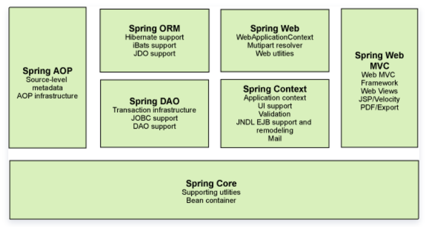
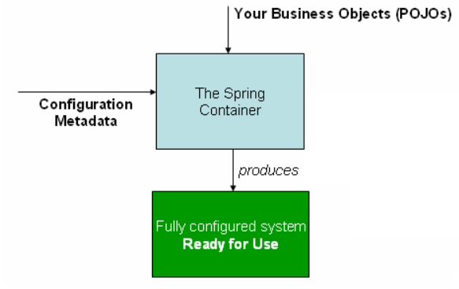
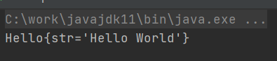
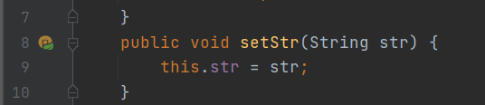
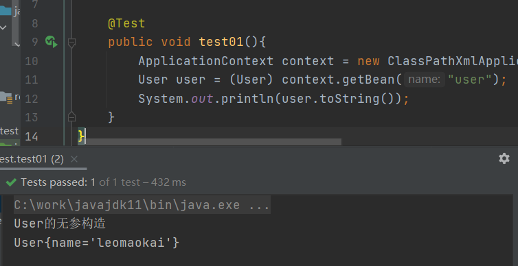
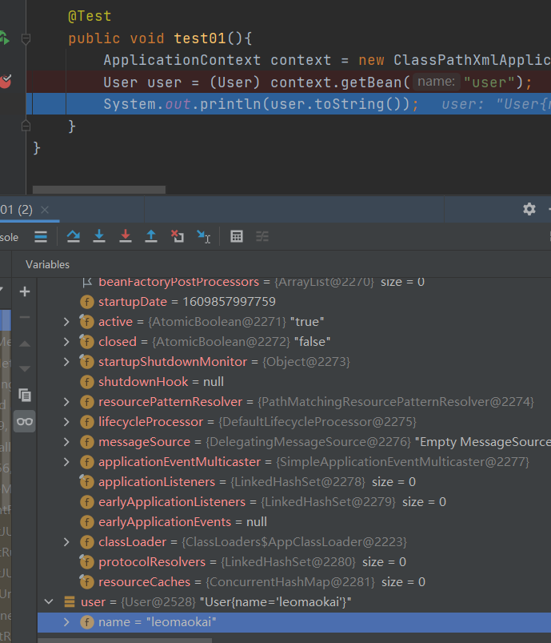
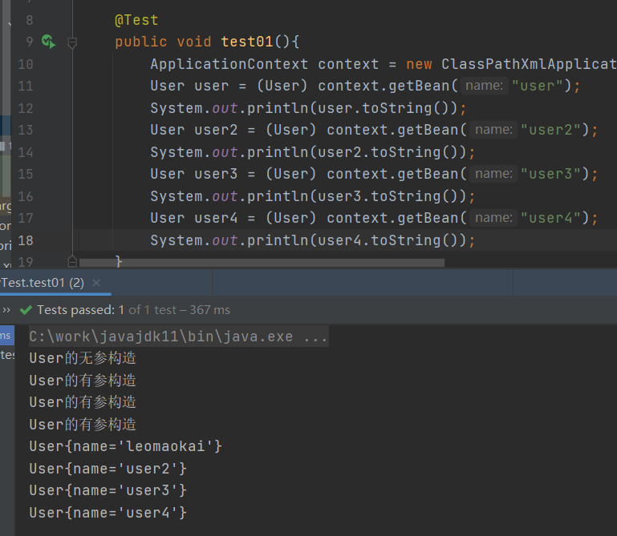
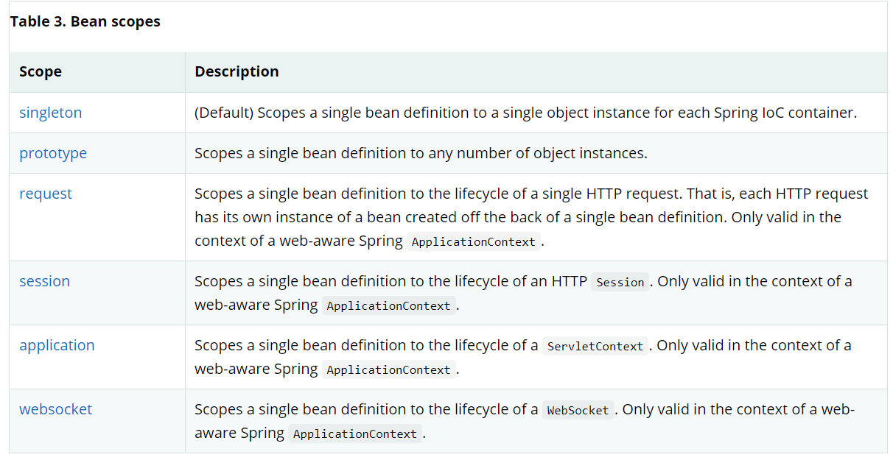
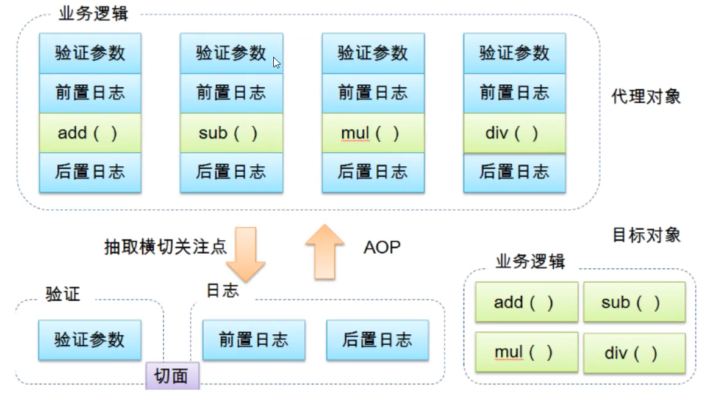

# Spring

## 简介

[Spring官方文档](https://docs.spring.io/spring-framework/docs/current/reference/html/)

[官方下载地址](http://repo.spring.io/release/org/springframework/spring)

[GitHub地址](https://github.com/spring-projects/spring-framework)

Spring是一个轻量级的控制反转(IOC)和面向切面编程(AOP)的容器框架

理念:使现有的技术更加容易使用,本身是一个大杂烩,整合了现有的技术框架

```xml
<dependency>
    <groupId>org.springframework</groupId>
    <artifactId>spring-webmvc</artifactId>
    <version>5.2.9.RELEASE</version>
</dependency>

<dependency>
    <groupId>org.springframework</groupId>
    <artifactId>spring-jdbc	</artifactId>
    <version>5.2.9.RELEASE</version>
</dependency>
```

优点:

* Spring是开源的免费的框架(容器)
* Spring是轻量级的非入侵式的框架
* 控制反转（IOC）、面向切面编程（AOP）
* 支持事务的处理、对框架整合的支持

## 组成



**Spring Core**:核心容器，主要组件BeanFactory，使用依赖注入(DI)的方式来管理Bean。BeanFactory是工厂模式的实现，使用控制反转(Ioc)将应用配置和依赖说明从代码中分离出来。 

**Spring Context**:应用上下文，为Spring框架提供上下文信息。 

**Spring AOP**：面向切面编程 

**Spring ORM**：为目前集中流程ORM提供集成方案 

**Spring DAO**：Spring对JDBC大量重复代码：取得连接、创建语句、处理结果集，关闭连接做了提取；支持事务管理。 

**Spring Web**：web上下文建立在context上下文之上，为web应用提供上下文。提供了其他web框架的集成 

**Spring Web MVC**:Spring为web提供了功能全面的MVC框架，使逻辑和业务对象完全分离。

## 扩展

Spring Boot

* 一个快速开发的脚手架
* 基于Boot可以快速开发单个微服务
* 约定大于配置

Spring Cloud

* 基于Spring Boot实现的

学习Spring Boot的前提，需要学习Spring及SpringMVC

# 配置文件

## beans.xml

```xml
<?xml version="1.0" encoding="UTF-8"?>
<beans xmlns="http://www.springframework.org/schema/beans"
       xmlns:xsi="http://www.w3.org/2001/XMLSchema-instance"
       xsi:schemaLocation="http://www.springframework.org/schema/beans
        https://www.springframework.org/schema/beans/spring-beans.xsd">

<!--    无参构造-->
    <bean id="user" class="com.kai.pojo.User">
        <property name="name" value="leomaokai"/>
    </bean>
<!--    有参构造,第一种,下标赋值-->
    <bean id="user2" class="com.kai.pojo.User">
        <constructor-arg index="0" value="user2"/>
    </bean>
<!--    第二种,通过类型创建,不建议使用-->
    <bean id="user3" class="com.kai.pojo.User">
        <constructor-arg type="java.lang.String" value="user3"/>
    </bean>
<!--    第三种,直接通过参数名设置-->
    <bean id="user4" class="com.kai.pojo.User">
        <constructor-arg name="name" value="user4"/>
    </bean>

</beans>
```


# IOC理论推导

在之前的业务中，用户的需求可能会影响我们原来的代码，我们需要根据用户的需求去修改源代码，如果程序代码量十分大，修改代价十分昂贵

```java
private UserDao userDao = new UserDaoImpl();
```

## 控制反转

* 之前，程序是主动创建对象，控制权在程序员手上

* 通过set注入，程序不再具有主动性，而是被动的接受对象，控制权在用户手上

```java
private UserDao userDao;
//利用set进行动态实现
public void setUserDao(UserDao userDao){
    this.userDao=userDao;
}
```

控制反转IOC(Inversion of Control)是一种设计思想，DI(依赖注入)是实现IOC的一种方法，没有IOC的程序中，我们使用面向对象编程，对象的创建与对象间的依赖关系完全硬编码在程序中，对象的创建由程序自己控制，控制反转后将对象的创建转移给第三方，所谓的控制反转就是：获得依赖对象的方式反转了

IOC是Spring框架的核心内容，通过多种方式完美实现了IOC，可以使用XML配置，也可以使用注解，新版本的Spring也可以零配置实现IOC

Spring容器在初始化时先读取配置文件，根据配置文件或元数据创建与组织对象存入容器中，程序使用时再从IOC容器中取出需要的对象



控制反转是一种通过描述(XML或注解)并通过第三方去生产或获取特定对象的方式。在Spring中实现控制反转的是IoC容器，其实现方法是依赖注入(Dependency Injection,DI)

# Hello

## hellospring

```java
public class Hello {
    private String str;
    public String getStr() {
        return str;
    }
    public void setStr(String str) {
        this.str = str;
    }
    @Override
    public String toString() {
        return "Hello{" +
            "str='" + str + '\'' +
            '}';
    }
}
```

```xml
<?xml version="1.0" encoding="UTF-8"?>
<beans xmlns="http://www.springframework.org/schema/beans"
       xmlns:xsi="http://www.w3.org/2001/XMLSchema-instance"
       xsi:schemaLocation="http://www.springframework.org/schema/beans
        https://www.springframework.org/schema/beans/spring-beans.xsd">

    <!--
    使用Spring创建对象,在Spring中,这些都是Bean
    Hello hello = new Hello();
    bean = 对象  new Hello()
    id = 变量名
    class = new 的对象
    property相当于给对象中的属性设置一个值
    -->
    <bean id="hello" class="com.kai.pojo.Hello">
        <property name="str" value="Hello World"/>
    </bean>

</beans>
```

```java
@Test
public void test01(){

    //获取Spring的上下文对象
    ApplicationContext context = new ClassPathXmlApplicationContext("beans.xml");
    //我们的对象都在Spring中管理了,我们要使用,直接在里面取出来就可以了
    Hello hello = (Hello)context.getBean("hello");
    System.out.println(hello.toString());
}
```



Hello对象是由Spring创建的,Hello对象的属性是由Spring容器设置的

控制:谁来控制对象的创建,传统应用程序的对象是由程序本身控制创建的,使用Spring后,对象由Spring来创建

反转:程序本身不创建对象,而变成被动的接收对象

依赖注入:就是利用set方法来进行注入的

IOC是一种编程思想,由主动地编程变成被动地接收

所谓IOC,就是:对象由Spring来创建,管理,装配



xml配置后,代码中会出现叶子

## 练习

```xml
<bean id="userDaoimpl" class="com.kai.dao.UserDaoImpl"/>
<bean id="userDaoimpl2" class="com.kai.dao.UserDaoImpl2"/>
<bean id="userServiceimpl" class="com.kai.service.UserServiceImpl">
    <!--
    ref 引用Spring容器中已经创建好的对象
    value 具体的值,基本数据类型
    -->
    <property name="userDao" ref="userDaoimpl2"/>
</bean>
```

```java
@Test
public void test02(){
    ApplicationContext context = new ClassPathXmlApplicationContext("beans.xml");
    UserServiceImpl userServiceimpl =(UserServiceImpl) context.getBean("userServiceimpl");
    userServiceimpl.getUser();
}
```

更改 **xml** 配置文件中的 **ref** 的值即改变对象

# 创建对象

## 无参构造





**默认使用无参构造创建对象**

## 有参构造

若使用有参对象创建对象

```xml
<!--    无参构造-->
<bean id="user" class="com.kai.pojo.User">
    <property name="name" value="leomaokai"/>
</bean>
<!--    有参构造,第一种,下标赋值-->
<bean id="user2" class="com.kai.pojo.User">
    <constructor-arg index="0" value="user2"/>
</bean>
<!--    第二种,通过类型创建,不建议使用-->
<bean id="user3" class="com.kai.pojo.User">
    <constructor-arg type="java.lang.String" value="user3"/>
</bean>
<!--    第三种,直接通过参数名设置-->
<bean id="user4" class="com.kai.pojo.User">
    <constructor-arg name="name" value="user4"/>
</bean>
```



根据 **bean** 的顺序创建对象,然后用 **context.getbean()** 获取对象

只要在 **xml** 文件中注册的对象,在配置文件加载时,容器中管理的对象就已经初始化了

# Spring配置

## alias

```xml
<alias name="user" alias="user5"/>
```

```java
//User user = (User) context.getBean("user");
User user = (User) context.getBean("user5");
```

如果添加了别名,我们也可以用别名获取对象

## bean

```xml
<!--
id: bean 的唯一标识符,对象名
class: bean 对象所对应的全限定名:包名+类名
name: 也是别名,可以同时取多个别名
-->
<bean id="user6" class="com.kai.pojo.User" name="user7,user8">
    <property name="name" value="I am user6"/>
</bean>
```

```java
User user8 = (User) context.getBean("user8");
System.out.println(user8.toString());
```

## import

一般用于团队开发使用,可以将多个配置文件导入合并为一个 **xml** , 最后直接使用总的配置`applicationContext.xml`

```xml
<!--applicationContext.xml-->
<import resource="beans.xml"/>
<import resource="beans2.xml"/>
<import resource="beans3.xml"/>
```

```java
ApplicationContext context = new ClassPathXmlApplicationContext("applicationContext.xml");
```

# DI依赖注入

## 构造器注入

前面的测试都是构造器注入

## Set方式注入

* 依赖输入:Set注入
  * 依赖:bean对象的创建依赖于容器
  * 注入:bean对象的所有属性由容器注入

环境搭建:

复杂类型

```java
@Data
public class Address {
    private String address;
}
```

真实测试对象

```java
@Data
public class Student {

    private String name;
    private Address address;
    private String[] books;
    private List<String> hobbys;
    private Map<String,String> card;
    private Set<String> games;
    private Properties info;
    private String wife;

}
```

beans.xml

```xml
<?xml version="1.0" encoding="UTF-8"?>
<beans xmlns="http://www.springframework.org/schema/beans"
       xmlns:xsi="http://www.w3.org/2001/XMLSchema-instance"
       xsi:schemaLocation="http://www.springframework.org/schema/beans
        https://www.springframework.org/schema/beans/spring-beans.xsd">


    <bean id="add" class="com.kai.pojo.Address">
        <property name="address" value="xuzhou"/>
    </bean>
    <bean id="student" class="com.kai.pojo.Student">
<!--        第一种,普通值注入,直接使用value-->
        <property name="name" value="kai"/>
<!--        第二种,bean注入,使用ref-->
        <property name="address" ref="add"/>
<!--        第三种,数组注入-->
        <property name="books">
            <array>
                <value>红楼梦</value>
                <value>西游记</value>
                <value>三国演义</value>
            </array>
        </property>
<!--        第四种,LIST注入-->
        <property name="hobbys">
            <list>
                <value>code</value>
                <value>play</value>
                <value>sleep</value>
            </list>
        </property>
<!--        第五种,Map注入-->
        <property name="card">
            <map>
                <entry key="01" value="school card"/>
                <entry key="02" value="bank card"/>
            </map>
        </property>
<!--        第六种,Set注入-->
        <property name="games">
            <set>
                <value>lol</value>
                <value>dnf</value>
            </set>
        </property>
<!--        第七种,null值注入-->
        <property name="wife">
            <null/>
        </property>
<!--        第八种,properties注入-->
        <property name="info">
            <props>
                <prop key="id">11111</prop>
                <prop key="age">20</prop>
                <prop key="sex">man</prop>
            </props>
        </property>
    </bean>

</beans>
```

test

```java
@Test
public void test01(){
    ApplicationContext context = new ClassPathXmlApplicationContext("beans.xml");
    Student student = (Student) context.getBean("student");
    System.out.println(student.toString());
    //Student(name=kai, address=Address(address=xuzhou),
    //              books=[红楼梦, 西游记, 三国演义],
    //              hobbys=[code, play, sleep],
    //              card={01=school card, 02=bank card},
    //              games=[lol, dnf],
    //              info={sex=man, id=11111, age=20},
    //              wife=null)
}
```

## 扩展注入

p命名空间和c命名空间进行注入

```xml
<!--xml约束-->
xmlns:p="http://www.springframework.org/schema/p"
xmlns:c="http://www.springframework.org/schema/c"
```

```xml
<?xml version="1.0" encoding="UTF-8"?>
<beans xmlns="http://www.springframework.org/schema/beans"
       xmlns:xsi="http://www.w3.org/2001/XMLSchema-instance"
       xsi:schemaLocation="http://www.springframework.org/schema/beans
        https://www.springframework.org/schema/beans/spring-beans.xsd"
        xmlns:p="http://www.springframework.org/schema/p"
        xmlns:c="http://www.springframework.org/schema/c">


<!--    p命名空间注入,可以直接注入属性的值:property-->
    <bean id="user" class="com.kai.pojo.User" p:name="kai" p:age="20"/>

<!--    c命名空间,使用构造器注入:construct-arg-->
    <bean id="user2" class="com.kai.pojo.User" c:name="kk" c:age="21"/>

</beans>
```

```java
@Data
public class User {

    public User() {
    }

    public User(String name, int age) {
        this.name = name;
        this.age = age;
    }

    private String name;
    private int age;
}
```

```java
@Test
public void test02(){
    ApplicationContext context = new ClassPathXmlApplicationContext("userbeans.xml");
    User user = context.getBean("user", User.class);
    System.out.println(user.toString());
    User user2 = context.getBean("user2", User.class);
    System.out.println(user2);
}
```

注意:p命名和c命名空间不能直接使用,需要导入xml约束

## Bean的作用域



单例模式

默认单例模式

singleton

```xml
<bean id="user" class="com.kai.pojo.User" p:name="kai" p:age="20" scope="singleton"/>
```

每次从容器中get都是同一个对象

原型模式

prototype

```xml
<bean id="user" class="com.kai.pojo.User" p:name="kai" p:age="20" scope="prototype"/>
```

每次从容器中get都会产生新对象

其它 request  session  application这些只能在web开发中使用

# Bean的自动装配

自动装配式Spring满足bean依赖的一种方式

Spring会在上下文中自动寻找,并自动给bean装配属性

在Spring中有三种装配方式

* 在xml中显示配置
* 在java中显示配置
* **隐式的自动装配**

## 显示配置

```java
public class Cat {
    public void shout(){
        System.out.println("miao");
    }
}
```

```java
public class Dog {
    public void shout(){
        System.out.println("wang");
    }
}
```

```java
@Data
public class Person {

    private Cat cat;
    private Dog dog;
    private String name;

    public Person() {
    }

    public Person(Cat cat, Dog dog, String name) {
        this.cat = cat;
        this.dog = dog;
        this.name = name;
    }
}
```

```xml
<bean id="cat" class="com.kai.pojo.Cat"/>
<bean id="dog" class="com.kai.pojo.Dog"/>

<bean id="person" class="com.kai.pojo.Person">
    <property name="name" value="kai"/>
    <property name="cat" ref="cat"/>
    <property name="dog" ref="dog"/>
</bean>
```

## byName

会自动在容器上下文中查找和自己对象set方法后面的值对应的bean的id

```xml
<bean id="cat" class="com.kai.pojo.Cat"/>
<bean id="dog" class="com.kai.pojo.Dog"/>

<bean id="person" class="com.kai.pojo.Person" autowire="byName">
    <property name="name" value="kai"/>
</bean>
```

## byType

与byName类似,会自动在容器上下文中查找和自己对象set方法的值的类型相同的bean的类型,但必须类型全局唯一,bean的id可以省略

```xml
<bean id="cat" class="com.kai.pojo.Cat"/>
<bean id="dog" class="com.kai.pojo.Dog"/>

<bean id="person" class="com.kai.pojo.Person" autowire="byName">
    <property name="name" value="kai"/>
</bean>
<bean id="person2" class="com.kai.pojo.Person" autowire="byType">
    <property name="name" value="maokai"/>
</bean>
```

小结

* byName时,需要保证所有bean的id唯一,且与set属性的值相同
* byType,需要保证所有bean的class唯一,且与set属性的类型相同

## 注解自动装配

* 导入约束
* 配置注解的支持

```xml
<?xml version="1.0" encoding="UTF-8"?>
<beans xmlns="http://www.springframework.org/schema/beans"
    xmlns:xsi="http://www.w3.org/2001/XMLSchema-instance"
    xmlns:context="http://www.springframework.org/schema/context"
    xsi:schemaLocation="http://www.springframework.org/schema/beans
        https://www.springframework.org/schema/beans/spring-beans.xsd
        http://www.springframework.org/schema/context
        https://www.springframework.org/schema/context/spring-context.xsd">

    <context:annotation-config/>

</beans>
```

## @Autowired

```xml
<?xml version="1.0" encoding="UTF-8"?>
<beans xmlns="http://www.springframework.org/schema/beans"
       xmlns:xsi="http://www.w3.org/2001/XMLSchema-instance"
       xmlns:context="http://www.springframework.org/schema/context"
       xsi:schemaLocation="http://www.springframework.org/schema/beans
        https://www.springframework.org/schema/beans/spring-beans.xsd
        http://www.springframework.org/schema/context
        https://www.springframework.org/schema/context/spring-context.xsd">


    <bean id="cat" class="com.kai.pojo.Cat"/>
    <bean id="dog" class="com.kai.pojo.Dog"/>

    
    <context:annotation-config/>
    <bean id="person3" class="com.kai.pojo.Person"/>

</beans>
```

```java
@Data
public class Person {

    @Autowired
    private Cat cat;
    @Autowired
    private Dog dog;

    private String name;

    public Person() {
    }

    public Person(Cat cat, Dog dog, String name) {
        this.cat = cat;
        this.dog = dog;
        this.name = name;
    }
}
```

@Autowired

* 可以直接在属性上使用,也可以在set方法上使用
* 在属性上使用可以不用编写set方法
* 先根据byType自动装配,无法识别后使用byName装配
* Autowired无法识别可以使用Qualifier指定值

```java
@Autowired(required = false)
@Qualifier(value = "xxx")
//required为false说明这个属性可以为空
```

@Resource注解类似,先使用byname

# Spring注解开发

## 常用注解

在使用注解开发需要导入aop的包

**xml配置导入context约束,增加注解支持**

```xml
<?xml version="1.0" encoding="UTF-8"?>
<beans xmlns="http://www.springframework.org/schema/beans"
       xmlns:xsi="http://www.w3.org/2001/XMLSchema-instance"
       xmlns:context="http://www.springframework.org/schema/context"
       xsi:schemaLocation="http://www.springframework.org/schema/beans
        https://www.springframework.org/schema/beans/spring-beans.xsd
        http://www.springframework.org/schema/context
        https://www.springframework.org/schema/context/spring-context.xsd">
    <context:annotation-config/>
<!--    指定要扫描的包,这个包下的注解就会生效-->
    <context:component-scan base-package="com.kai"/>

</beans>
```

```java
//bean注入和属性注入

//等价于 <bean id="user" class="com.kai.pojo.User"/>
//组件
@Component
public class User {
    public String name="kai";

    //相当于 <property name="name" value="maokai"/>
    @Value("maokai")
    public String name2;
}
```

@Component有几个衍生注解,我们在web开发中,会按照mvc三层架构分层

* dao	@Repository
* service    @Service
* controller    @Controller
* 这4个注解的功能都是一样的,标注在一个类上,将某个没注册到Spring容器中装配

自动装配的注解,标注在类的成员变量上

* @Autowired	自动装配通过类型名字
* @Nullable    字段标记了这个注解,说明这个字段可以为null
* @Resource    自动装配通过名字类型

作用域注解,标注在类上

* @Scope("singleton"),单例模式

小结:

* xml更加万能,适用于任何场景,维护简单
* 注解维护相对复杂

## 使用Java方式配置Spring

完全不使用xml配置,全权交给Java

JavaConfig是Spring的一个子项目,Spring4之后的核心功能

```java
@Data
@Component
public class User {
    @Value("kaikai")
    private String name;
}
```

```java
@Configuration
public class MyConfig {
    //方法名相当于bean标签中的id属性
    //方法的返回值相当于bean标签的class属性
    @Bean
    public User testconfig(){
        return new User();
    }
}
```

```java
@Test
public void test01(){
    //如果完全使用了配置类方式去做,可以通过AnnotationConfig来获取容器
    ApplicationContext context= new AnnotationConfigApplicationContext(MyConfig.class);
    User getUser = context.getBean("testconfig", User.class);
    System.out.println(getUser);
}
```

这种纯Java的配置方式,在SpringBoot中随处可见!!!!!

# 代理模式

SpringAOP的底层

代理模式的分类:

* 静态代理
* 动态代理

## 静态代理

* 抽象角色:一般会使用接口或抽象类来解决
* 真实角色:被代理的角色 
* 代理角色:代理真实角色,代理真实角色后,我们一般会做一些附属操作
* 客户:访问代理对象的人

静态代理的好处:

* 可以使真实角色操作更加纯粹,不用关注一些公共的业务
* 公告业务交给代理角色,实现业务的分工
* 公共业务发生扩展时,方便集中管理

缺点:

* 一个真实角色就会产生一个代理角色,代码量翻倍,开发效率低

## 动态代理

* 动态代理和静态代理角色一样
* 动态代理的代理类是动态生成的,不是我们直接写好的
* 动态代理分为两大类:基于接口的动态代理,基于类的动态代理
  * 基于接口:JDK动态代理
  * 基于类:cglib
  * Java字节码实现:JAVAssist

需要了解两个类: Proxy 代理, InvocationHandler 调用处理程序

```java
//租房
public interface Rent {
    public void rent();
}
```

```java
//房东
public class Host implements Rent {
    @Override
    public void rent() {
        System.out.println("房东要出租房子");
    }
}
```

```java
//动态生产代理类
public class ProxyInvocationHandler implements InvocationHandler {
    //被代理的接口
    private Rent rent;
    public void setRent(Rent rent) {
        this.rent = rent;
    }
    //生成代理对象
    public Object getProxy(){
        return Proxy.newProxyInstance(this.getClass().getClassLoader(),
                            rent.getClass().getInterfaces(),this);
    }
    //处理代理实例,并返回结果
    @Override
    public Object invoke(Object proxy, Method method, Object[] args) throws Throwable {
        //动态代理的本质就是使用反射机制
        seeHouse();
        Object result = method.invoke(rent, args);
        return result;
    }
    public void seeHouse(){
        System.out.println("中介带看房子");
    }
}
```

```java
public class Client {
    public static void main(String[] args) {
        //真实角色
        Host host = new Host();
        //代理角色:现在没有
        ProxyInvocationHandler pih = new ProxyInvocationHandler();
        //通过调用程序处理角色来处理我们要调用的接口对象
        pih.setRent(host);
        Rent proxy = (Rent) pih.getProxy();
        proxy.rent();
    }
}
```

通用的动态代理类

```java
//动态生产代理类
public class ProxyInvocationHandler implements InvocationHandler {
    //被代理的接口
    private Object target;

    public void setTarget(Object target) {
        this.target = target;
    }
    //生成代理对象
    public Object getProxy(){
        return Proxy.newProxyInstance(this.getClass().getClassLoader(),
                target.getClass().getInterfaces(),this);
    }
    //处理代理实例,并返回结果
    @Override
    public Object invoke(Object proxy, Method method, Object[] args) throws Throwable {
        //动态代理的本质就是使用反射机制
        Object result = method.invoke(target, args);
        return result;
    }
}
```

# AOP

AOP(Aspect Oriented Programming)意为:面向切面编程,通过预编译方式和运行期动态代理实现程序功能的统一维护的一种技术,AOP是OOP的延续,是软件开发中的一个热点,也是Spring框架中的一个重要内容,是函数式编程的一种衍生泛型,利用AOP可以对业务逻辑的各个部分进行隔离,从而使得业务逻辑各部分之间的耦合度降低,提高程序的可重用性,同时提高了开发的效率.



## 实现AOP

使用AOP需要导入的依赖包

```xml
<dependency>
    <groupId>org.aspectj</groupId>
    <artifactId>aspectjweaver</artifactId>
    <version>1.9.6</version>
</dependency>
```

### 方式一:使用Spring的API接口

```java
public interface UserServiceInterface {

    void add();
    void delete();
    void update();
    void select();
}
```

```java
public class UserServiceImpl implements UserServiceInterface {
    @Override
    public void add() {
        System.out.println("add");
    }

    @Override
    public void delete() {
        System.out.println("delete");
    }

    @Override
    public void update() {
        System.out.println("update");
    }

    @Override
    public void select() {
        System.out.println("select");
    }
}
```

```java
public class BeforeLog implements MethodBeforeAdvice {

    //method 要执行目标对象的方法
    //args  参数
    //target 目标对象
    @Override
    public void before(Method method, Object[] args, Object target) throws Throwable {
        System.out.println(target.getClass().getName()+"的"+method.getName()+"被执行了");
    }
}
```

```java
public class AfterLog implements AfterReturningAdvice {

    //returnValue 返回值
    @Override
    public void afterReturning(Object returnValue, Method method, Object[] args, Object target) throws Throwable {
        System.out.println("执行了"+method.getName()+"方法,返回结果"+returnValue);
    }
}
```

```xml
<?xml version="1.0" encoding="UTF-8"?>
<beans xmlns="http://www.springframework.org/schema/beans"
       xmlns:xsi="http://www.w3.org/2001/XMLSchema-instance"
       xmlns:aop="http://www.springframework.org/schema/aop"
       xsi:schemaLocation="http://www.springframework.org/schema/beans
        https://www.springframework.org/schema/beans/spring-beans.xsd
        http://www.springframework.org/schema/aop
        https://www.springframework.org/schema/aop/spring-aop.xsd">

    <!--注册bean-->
    <bean id="userService" class="com.kai.service.UserServiceImpl"/>
    <bean id="beforeLog" class="com.kai.log.BeforeLog"/>
    <bean id="afterLog" class="com.kai.log.AfterLog"/>

    <!--方式一:使用原生Spring的API接口-->
    <!--配置aop,需要导入aop约束-->
    <aop:config>
        <!--切入点:  expression:表达式  execution(要执行的位置)-->
        <aop:pointcut id="pointcut" expression="execution(* com.kai.service.UserServiceImpl.*(..))"/>
        <!--执行环绕增强-->
        <aop:advisor advice-ref="beforeLog" pointcut-ref="pointcut"/>
        <aop:advisor advice-ref="afterLog" pointcut-ref="pointcut"/>
    </aop:config>
</beans>
```

### 第二种:自定义切面类

```java
public class DiyPointCut {

    public void before(){
        System.out.println("方法执行前");
    }
    public void after(){
        System.out.println("方法执行后");
    }
}
```

```xml
<!--方式二:自定义类-->
<bean id="diy" class="com.kai.diy.DiyPointCut"/>
<aop:config>
    <!--自定义切面,ref要引入的类-->
    <aop:aspect ref="diy">
        <!--切入点-->
        <aop:pointcut id="pointcut" expression="execution(* com.kai.service.UserServiceImpl.*(..))"/>
        <!--通知-->
        <aop:before method="before" pointcut-ref="pointcut"/>
        <aop:after method="after" pointcut-ref="pointcut"/>
    </aop:aspect>
</aop:config>
```

### 第三种:使用注解实现

```java
//标注这个类是一个切面
@Aspect
public class AnnotationPointCut {

    @Before("execution(* com.kai.service.UserServiceImpl.*(..))")
    public void before(){
        System.out.println("注解方式,方法执行前");
    }

    @After("execution(* com.kai.service.UserServiceImpl.*(..))")
    public void after(){
        System.out.println("注解方式,方法执行后");
    }

    //再环绕增强中,我们可以给定一个参数,代表我们要获取切入的店
    @Around("execution(* com.kai.service.UserServiceImpl.*(..))")
    public void around(ProceedingJoinPoint jp) throws Throwable {
        System.out.println("环绕前");

        Signature signature = jp.getSignature();
        System.out.println("signature"+signature);

        Object proceed = jp.proceed();
        System.out.println("环绕后");

        System.out.println(proceed);
    }
}
```

```xml
<!--方式三:使用注解-->
<bean id="annotationPointCut" class="com.kai.diy.AnnotationPointCut"/>
<!--开启注解支持-->
<aop:aspectj-autoproxy/>
```

# 整合Mybatis

[Mybatis笔记](../基础工具/Mybatis.md)

导入相关jar包

* junit
* mybatis
* MySQL
* spring相关
* aop织入
* mybatis-spring

```xml
<dependencies>
    <dependency>
        <groupId>mysql</groupId>
        <artifactId>mysql-connector-java</artifactId>
        <version>8.0.16</version>
    </dependency>
    <dependency>
        <groupId>org.mybatis</groupId>
        <artifactId>mybatis</artifactId>
        <version>3.5.2</version>
    </dependency>
    <dependency>
        <groupId>org.aspectj</groupId>
        <artifactId>aspectjweaver</artifactId>
        <version>1.9.6</version>
    </dependency>
    <dependency>
        <groupId>org.springframework</groupId>
        <artifactId>spring-jdbc</artifactId>
        <version>5.2.9.RELEASE</version>
    </dependency>
    <dependency>
        <groupId>org.mybatis</groupId>
        <artifactId>mybatis-spring</artifactId>
        <version>2.0.3</version>
    </dependency>
</dependencies>
```

## Mybatis-spring

* 编写数据源
* sqlSessionFactory
* sqlSessionTemplate
  * `SqlSessionTemplate` 是 MyBatis-Spring 的核心。作为 `SqlSession` 的一个实现，这意味着可以使用它无缝代替你代码中已经在使用的 `SqlSession`。 `SqlSessionTemplate` 是线程安全的，可以被多个 DAO 或映射器所共享使用。
* 需要给接口写一个实体类(因为spring要代理,mybatis的代码)
* 将实体类注入到spring中
* 测试

**spring-mapper.xml**

```xml
<?xml version="1.0" encoding="UTF-8"?>
<beans xmlns="http://www.springframework.org/schema/beans"
       xmlns:xsi="http://www.w3.org/2001/XMLSchema-instance"
       xsi:schemaLocation="http://www.springframework.org/schema/beans
                           https://www.springframework.org/schema/beans/spring-beans.xsd">

    <!--DataSource:使用spring的数据源替换Mybatis的配置-->
    <!--使用spring提供的JDBC org.springframework.jdbc.datasource.DriverManagerDataSource-->
    <bean id="datasource" class="org.springframework.jdbc.datasource.DriverManagerDataSource">
        <property name="driverClassName" value="com.mysql.cj.jdbc.Driver"/>
        <property name="url" value="jdbc:mysql://localhost:3306/mybatis?useUnicode=true&amp;characterEncoding=utf8&amp;serverTimezone=UTC"/>
        <property name="username" value="root"/>
        <property name="password" value="123456"/>
    </bean>
    <!--sqlSessionFactory-->
    <bean id="sqlSessionFactory" class="org.mybatis.spring.SqlSessionFactoryBean">
        <property name="dataSource" ref="datasource"/>
        <!--绑定Mybatis配置文件-->
        <property name="configLocation" value="classpath:mybatis-config-spring.xml"/>
        <property name="mapperLocations" value="classpath:UserMapper.xml"/>
    </bean>

    <!--SqlSessionTemplate就是我们使用的sqlSession-->
    <bean id="sqlSession" class="org.mybatis.spring.SqlSessionTemplate">
        <!--只能使用构造器注入,因为没有set方法-->
        <constructor-arg index="0" ref="sqlSessionFactory"/>
    </bean>

    <bean id="userMapper" class="com.kai.mapper.UserMapperImpl">
        <property name="sqlSession" ref="sqlSession"/>
    </bean>
</beans>
```

**UserMapperImpl.java**

```java
public class UserMapperImpl implements UserMapper{
    private SqlSessionTemplate sqlSession;
    public void setSqlSession(SqlSessionTemplate sqlSession) {
        this.sqlSession = sqlSession;
    }
    @Override
    public List<User> listUser() {
        UserMapper mapper = sqlSession.getMapper(UserMapper.class);
        return mapper.listUser();
    }
}
```

```java
@Test
public void test02(){
    ApplicationContext context = new ClassPathXmlApplicationContext("spring-mapper.xml");
    UserMapper userMapper = context.getBean("userMapper", UserMapper.class);
    for (User user : userMapper.listUser()) {
        System.out.println(user);
    }
}
```

# 事务管理

## 声明式事务

spring中事务的传播属性

```
REQUIRED：支持当前事务，如果当前没有事务，就新建一个事务。这是最常见的选择,是spring的默认选择
SUPPORTS：支持当前事务，如果当前没有事务，就以非事务方式执行。  
MANDATORY：支持当前事务，如果当前没有事务，就抛出异常。  
REQUIRES_NEW：新建事务，如果当前存在事务，把当前事务挂起。  
NOT_SUPPORTED：以非事务方式执行操作，如果当前存在事务，就把当前事务挂起。  
NEVER：以非事务方式执行，如果当前存在事务，则抛出异常。  
NESTED：支持当前事务，如果当前事务存在，则执行一个嵌套事务，如果当前没有事务，就新建一个事务。
```

```xml
<!--配置声明式事务-->
<bean id="transactionManager" class="org.springframework.jdbc.datasource.DataSourceTransactionManager">
    <constructor-arg ref="dataSource" />
</bean>
<!--结合AOP实现事务织入-->
<!--配置事务通知-->
<tx:advice id="txAdvice" transaction-manager="transactionManager">
    <!--给哪些方法配置事务-->
    <!--配置事务的传播特性-->
    <tx:attributes>
        <tx:method name="add" propagation="REQUIRED"/>
        <tx:method name="delete" propagation="REQUIRED"/>
        <tx:method name="update" propagation="REQUIRED"/>
        <tx:method name="query" read-only="true"/>
        <tx:method name="*" propagation="REQUIRED"/>
    </tx:attributes>
</tx:advice>
<!--配置事务切入-->
<aop:config>
    <aop:pointcut id="txPointCut" expression="execution(* com.kai.mapper.*.*(..))"/>
    <aop:advisor advice-ref="txAdvice" pointcut-ref="txPointCut"/>
</aop:config>
```

## 编程式事务

