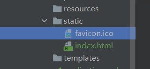

# SpringBoot

SpringBoot 就是一个 JavaWeb 的开发框架

优点：

* 为所有Spring开发者更快的入门
* 开箱即用，提供各种默认配置来简化项目配置
* 内嵌容器简化Web项目
* 没有冗余代码生成和XML配置的要求

## 微服务

微服务是一种架构风格，他要求我们在开发一个应用时，这个应用必须构建成一系列小服务的组合，可以通过http的方式进行互通

单体应用架构

* 所谓单体应用架构是指，我们将一个应用中的所有应用服务都封装在一个应用中，无论是ERP、CRM或是其他什么系统，都把数据库访问、web访问等等功能放到一个war包内
* 这样做易于开发和测试，部署方便
* 但不利于维护

微服务架构

* 单体应用 all in one 的架构方式，把所有的功能单元放在一个应用里面，然后把整个应用部署到服务器上，如果负载能力不行，将整个应用进行水平复制，进行扩展，再负载均衡
* 所谓微服务架构，就是打破 all in one 架构的方式，吧每个功能元素独立出来，把独立出来的功能元素动态组合，需要的功能元数才去拿来组合，需要多一些时可以整合多个功能元素，所以微服务架构是对功能元素进行复制，而没有对整个应用进行复制
* 优点：节省调用资源，每个功能元素的服务都是一个可替换的、可独立升级的软件代码

## 构建微服务

* 构建一个个功能独立的微服务应用单元，可以使用spring boot帮我们快速构建一个应用
* 大型分布式网络服务的调用，这部分由spring cloud来完成，实现分布式
* 在分布式中，进行流式数据计算、批处理，我们有spring cloud data flow
* spring 为我们想清楚了从开始构建应用到大型分布式应用全流程方案

# HelloWorld

官方提供了一个快速生成的网站

https://start.spring.io/

也可以直接使用IDEA创建springboot项目(IDEA集成了官网创建)

核心依赖

```xml
<dependencies>
   <!--web依赖:tomcat dispatcherServlet  xml-->
   <dependency>
      <groupId>org.springframework.boot</groupId>
      <artifactId>spring-boot-starter-web</artifactId>
   </dependency>
   <!--spring-boot-starter  springboot所有依赖都是使用这个开头的-->
   <!--单元测试-->
   <dependency>
      <groupId>org.springframework.boot</groupId>
      <artifactId>spring-boot-starter-test</artifactId>
      <scope>test</scope>
   </dependency>
</dependencies>

<build>
   <!--打包插件-->
   <plugins>
      <plugin>
         <groupId>org.springframework.boot</groupId>
         <artifactId>spring-boot-maven-plugin</artifactId>
      </plugin>
   </plugins>
</build>
```

> 自定义端口号

在application.properties中添加

```properties
#更改项目端口号
server.port=8081
```

> 自定义banner

https://www.bootschool.net/ascii

创建一个banner.txt文件,将自定义banner放入即可

# 原理

## 自动配置

pom.xml

* spring-boot-dependencies	:核心依赖在父工程中
* 我们在写或者引入springboot依赖时,不需要指定版本,因为有版本仓库

启动器

* spring-boot-starter	:Springboot的启动场景
* 比如 spring-boot-starter-web ,会帮我们自动导入web环境所有的依赖
* springboot 会将所有的功能场景,都变成一个个的启动器
* 如果我们要使用什么功能,只需要找到对应的启动器

主程序

```java
//@SpringBootApplication 标注这个类是一个springboot的应用
@SpringBootApplication
public class Springboot01HelloworldApplication {

    public static void main(String[] args) {
        //将springboot应用启动
        SpringApplication.run(Springboot01HelloworldApplication.class, args);
    }
}
```

* 注解

  * ```
    @SpringBootConfiguration  springboot的配置
    	@Configuration	spring配置类
    		@Component	spinrg其本质是一个spring的组件
    @EnableAutoConfiguration	 自动配置
    	@AutoConfigurationPackage	自动配置包
    		@Import(AutoConfigurationPackages.Registrar.class) 自动注册包
    	@Import(AutoConfigurationImportSelector.class)	自动配置导入选择
    		
    ```

  * ```java
    List<String> configurations = getCandidateConfigurations(annotationMetadata, attributes);
    
    protected List<String> getCandidateConfigurations(AnnotationMetadata metadata, AnnotationAttributes attributes) {
    List<String> configurations = SpringFactoriesLoader.loadFactoryNames(getSpringFactoriesLoaderFactoryClass(),
    		getBeanClassLoader());
    Assert.notEmpty(configurations, "No auto configuration classes found in META-INF/spring.factories. If you "
    		+ "are using a custom packaging, make sure that file is correct.");
    return configurations;
    }
    
    protected Class<?> getSpringFactoriesLoaderFactoryClass() {
    		return EnableAutoConfiguration.class;
    	}
    
        public static List<String> loadFactoryNames(Class<?> factoryType, @Nullable ClassLoader classLoader) {
            ClassLoader classLoaderToUse = classLoader;
            if (classLoader == null) {
                classLoaderToUse = SpringFactoriesLoader.class.getClassLoader();
            }
            String factoryTypeName = factoryType.getName();
            return (List)loadSpringFactories(classLoaderToUse).getOrDefault(factoryTypeName, Collections.emptyList());
        }
    
    loadSpringFactories-->Enumeration urls = classLoader.getResources("META-INF/spring.factories");
    ```

  

SpringBoot所有自动配置都是在启动时扫描并加载,但不一定生效,只有导入了对应的start,自动装配才能生效

* springboot在启动时从类路径`META-INF/spring.factories`获取指定的值
* 将这些自动配置的类导入容器,自动配置就会生效,帮我们进行自动配置
* 以取我们需要手动配置的东西,现在springboot帮我们做了

## SpringApplication类

* 推断应用的类型是普通的项目还是Web项目
* 查找并加载所有可用初始化器,设置到`initializers`属性中
* 找出所有的应用程序监听器,设置到`listeners`属性中
* 推断并设置`main`方法的定义类,找到运行的主类

# 配置文件

## yml

springboot官方推荐使用yaml格式

yml可以直接对实体类赋值

对空格的要求十分高

```yml
# k: v
# 可以注入到配置类中
#普通的key-value
server:
  port: 8081

#对象
student:
  name: kai
  age: 10

#行内写法
teacher: {name: kai,age: 10}

#数组
pets:
  - cat
  - dog
  - pig
```

> 通过yml给对象赋值

```java
@NoArgsConstructor
@AllArgsConstructor
@Data
@Component
@ConfigurationProperties(prefix = "person")
public class Person {
    private String name;
    private int age;
    private Boolean happy;
    private Date birth;
    private Map<String,Object> maps;
    private List<Object> lists;
    private Dog dog;
}
```

```yml
person:
  name: kai
  age: 3
  happy: false
  birth: 2020/11/11
  maps: {k1: v1,k2: v2}
  lists:
    - code
    - music
    - girl
  dog:
    name: xiao
    age: 10
```

## 多环境配置

> 优先级顺序


> 多环境切换

profile是Spring对不同环境提供不同配置功能的支持,可以通过激活不同的环境版本,实现快速切换环境

```yml
#springboot都多环境配置,可以选择激活一个配置文件
server:
  port: 8081
spring:
  profiles:
    active: test
---
server:
  port: 8082
spring:
  profiles: dev
---
server:
  port: 8083
spring:
  profiles: test
```

也可以多文件写`application-dev.yml`与`application-test.yml`

在`application.yml`中配置

## 配置文件

在配置文件中配置的东西,都存在一个固有的规律 

xxxAutoConfiguration:默认值	xxxProperties:配置文件绑定

可以通过`debug: true`查看哪些配置生效

# Web开发

## 静态资源

静态资源可以放在以下目录


```java
private static final String[] CLASSPATH_RESOURCE_LOCATIONS = { "classpath:/META-INF/resources/",
      "classpath:/resources/", "classpath:/static/", "classpath:/public/" };
```


以及:

```java
addResourceHandler(registry, "/webjars/**", "classpath:/META-INF/resources/webjars/");
```

优先级:	resources > static(默认使用) > public

## 定制首页

源码内首页名

```java
private Resource getIndexHtml(Resource location) {
   try {
      Resource resource = location.createRelative("index.html");
      if (resource.exists() && (resource.getURL() != null)) {
         return resource;
      }
   }
   catch (Exception ex) {
   }
   return null;
}
```


在静态资源目录下放一张图片,命名为`favicon.ico`

在html中引入,可作为网站图标



```html
<!DOCTYPE html>
<html lang="en">
<head>
    <meta charset="UTF-8">
    <title>Title</title>
</head>
<body>
<link rel="icon" href="favicon.ico" />
<h1>首页</h1>
</body>
</html>
```


## 模板引擎

**Thymeleaf**是⾯向Web和独⽴环境的现代服务器端Java模板引擎，能够处理HTML，XML，JavaScript，CSS甚⾄纯⽂本。

```xml
<!--thymeleaf-->
<dependency>
    <groupId>org.thymeleaf</groupId>
    <artifactId>thymeleaf-spring5</artifactId>
</dependency>
<dependency>
    <groupId>org.thymeleaf.extras</groupId>
    <artifactId>thymeleaf-extras-java8time</artifactId>
</dependency>
```


thymeleaf页面写在templates目录下,且后缀为html

```
<html lang="en" xmlns:th="http://www.thymeleaf.org">
```

```html
<!DOCTYPE html>
<html lang="en" xmlns:th="http://www.thymeleaf.org">
<head>
    <meta charset="UTF-8">
    <title>Title</title>
</head>
<body>
<h1>test</h1>
<!--所有的html元素都可以被thymeleaf替换接管 th:元素名-->
<div th:text="${msg}"></div>
</body>
</html>
```

```java
@RequestMapping("/test")
public String test(Model model){
    model.addAttribute("msg","hello,Spring");
    return "test";
}
```

## MVC配置

[官方文档](https://docs.spring.io/spring-boot/docs/2.1.6.RELEASE/reference/html/boot-features-developing-web-applications.html#boot-features-spring-mvc-auto-configuration)

```java
//全面扩展MVC
@Configuration
public class MyMvcConfig implements WebMvcConfigurer {

    //ViewResolver 实现了视图解析器接口的类,我们就可以把他看作视图解析器
    @Bean
    public ViewResolver myViewResolver(){
        return new MyViewResolver();
    }

    //自定义了一个自己的视图解析器
    public static class MyViewResolver implements ViewResolver{

        @Override
        public View resolveViewName(String s, Locale locale) throws Exception {
            return null;
        }
    }
}
```

# 整合JDBC

创建项目时选择 SQL下的 JDBC API 和 MySQL Driver

```yml
spring:
  datasource:
    username: root
    password: "123456"
    url: jdbc:mysql://localhost:3306/mybatis?useUnicode=true&characterEncoding=utf8&serverTimezone=Asia/Shanghai
    driver-class-name: com.mysql.cj.jdbc.Driver
```

```java
@Autowired
DataSource dataSource;
@Test
void contextLoads() throws SQLException {
    //查看默认数据源
    System.out.println(dataSource.getClass());

    //获得数据库连接
    Connection connection = dataSource.getConnection();
    System.out.println(connection);

    //xxx Template : SpringBoot 已经配置好的模板bean,拿来即用
    // jdbc
    // redis
    
    //关闭
    connection.close();
}
```

```java
@RestController
public class JDBCController {

    @Autowired
    JdbcTemplate jdbcTemplate;

    //查询数据库的所有信息
    @GetMapping("/userlist")
    public List<Map<String,Object>> userList(){
        String sql="select * from myuser";
        List<Map<String, Object>> mapList = jdbcTemplate.queryForList(sql);
        return mapList;
    }
    @GetMapping("/adduser")
    public String addUser(){
        String sql="insert into myuser(id,name,pwd) values (16,'hahaha','111')";
        jdbcTemplate.update(sql);
        return "addOk";
    }
    @GetMapping("/updateuser/{id}")
    public String updateUser(@PathVariable("id") int id){
        String sql="update myuser set name=?,pwd=? where id="+id;

        Object[] objects = new Object[2];
        objects[0]="xiaoming";
        objects[1]="5555555";
        jdbcTemplate.update(sql,objects);
        return "updateOk";
    }
    @GetMapping("/deleteuser/{id}")
    public String deleteUser(@PathVariable("id") int id){
        String sql="delete from myuser where id=?";
        jdbcTemplate.update(sql,id);
        return "deleteOK";
    }
}
```

# 整合Druid

```xml
<!-- https://mvnrepository.com/artifact/com.alibaba/druid -->
<dependency>
    <groupId>com.alibaba</groupId>
    <artifactId>druid</artifactId>
    <version>1.2.4</version>
</dependency>

<dependency>
    <groupId>com.github.AnonymousMister</groupId>
    <artifactId>druid-spring-boot-starter</artifactId>
    <version>1.1.18_dynamic</version>
</dependency>
```

修改配置,添加type

```yml
spring:
  datasource:
    username: root
    password: "123456"
    url: jdbc:mysql://localhost:3306/mybatis?useUnicode=true&characterEncoding=utf8&serverTimezone=Asia/Shanghai
    driver-class-name: com.mysql.cj.jdbc.Driver
    type: com.alibaba.druid.pool.DruidDataSource
```

druid 数据源专有配置

```yml
spring:
  datasource:
    username: root
    password: "123456"
    url: jdbc:mysql://localhost:3306/mybatis?useUnicode=true&characterEncoding=utf8&serverTimezone=Asia/Shanghai
    driver-class-name: com.mysql.cj.jdbc.Driver
    type: com.alibaba.druid.pool.DruidDataSource

    # druid数据源专有配置
    initial-size: 5
    min-idle: 5
    max-active: 20
    max-wait: 60000
    time-between-eviction-runs-millis: 60000
    min-evictable-idle-time-millis: 300000
    validation-query: SELECT 1 FROM DUAL
    test-while-idle: true
    test-on-borrow: false
    test-on-return: false
    pool-prepared-statements: true
    filters: stat,wall,log4j
    max-pool-prepared-statement-per-connection-size: 20
    use-global-data-source-stat: true
    connect-properties: druid.stat.mergeSql=true;druid.stat.slowSqlMillis=500

    # 配置监控拦截器filters,stat:监控统计,log4j:日志记录,wall:防御sql注入
    # 如果允许时报错 java.lang.ClassNotFoundException: org.apache.log4j.Priority
    # 则导入log4j 依赖即可
```

druid配置类

```java
@Configuration
public class DruidConfig {

    //将配置类和yml绑定
    @Bean
    @ConfigurationProperties(prefix = "spring.datasource")
    public DataSource druidDataSource() {
        return new DruidDataSource();
    }

    //后台监控
    //因为springboot内置了 servlet容器,所以没有web.xml,替代方法如下
    @Bean
    public ServletRegistrationBean statViewServlet() {
        ServletRegistrationBean<StatViewServlet> bean = new ServletRegistrationBean<>(new StatViewServlet(), "/druid/*");

        //后台需要有人登录,账号密码配置
        HashMap<String, String> initParameters = new HashMap<>();
        //增加配置,key是固定的
        initParameters.put("loginUsername", "admin");
        initParameters.put("loginPassword", "111111");
        //允许谁能访问
        initParameters.put("allow", "");//参数为空,所有人可以访问
        //禁止谁能访问
        //initParameters.put("kai","192.168.123.12");
        bean.setInitParameters(initParameters);//初始化操作
        return bean;
    }

    //filter
    @Bean
    public FilterRegistrationBean webStatFilter(){
        FilterRegistrationBean bean = new FilterRegistrationBean();
        bean.setFilter(new WebStatFilter());
        //可以过滤哪些请求
        HashMap<String, String> initParameters = new HashMap<>();
        //这些东西不进行统计
        initParameters.put("exclusions","*.js,*.css,/druid/*");
        bean.setInitParameters(initParameters);
        return bean;
    }
}
```

# 整合Mybatis

整合包

mybatis-spring-boot-starter

```xml
<!-- https://mvnrepository.com/artifact/org.mybatis.spring.boot/mybatis-spring-boot-starter -->
<dependency>
    <groupId>org.mybatis.spring.boot</groupId>
    <artifactId>mybatis-spring-boot-starter</artifactId>
    <version>2.1.4</version>
</dependency>
```

创建新项目


application.yml配置

```yml
spring:
  datasource:
    username: root
    password: "123456"
    url: jdbc:mysql://localhost:3306/mybatis?useUnicode=true&characterEncoding=utf8&serverTimezone=Asia/Shanghai
    driver-class-name: com.mysql.cj.jdbc.Driver

#整合mybatis
mybatis:
  type-aliases-package: com.kai.demo.pojo  #别名
  mapper-locations: mybatis/mapper/*.xml   #注册mapper.xml
```

建立实体类和mapper

```java
@Data
@AllArgsConstructor
@NoArgsConstructor
public class MyUser {

    private int id;
    private String name;
    private String pwd;
}
```

```java
//这个注解表示了这是一个mybatis的Mapper类
@Mapper
@Repository
public interface UserMapper {

    List<MyUser> listUsers();
    MyUser getUser(int id);
    int addUser(MyUser myUser);
    int updateUser(MyUser myUser);
    int deleteUser(int id);
}
```

编写mapper.xml,在resources/mabatis/mapper目录下

```xml
<?xml version="1.0" encoding="UTF-8" ?>
<!DOCTYPE mapper
        PUBLIC "-//mybatis.org//DTD Config 3.0//EN"
        "http://mybatis.org/dtd/mybatis-3-mapper.dtd">
<mapper namespace="com.kai.demo.mapper.UserMapper">

    <!--    查询语句,id对应方法名字,resultType是返回一个结果(Myuser)-->
    <select id="listUsers" resultType="MyUser">
        select * from mybatis.myuser;
    </select>
    <select id="getUser" parameterType="int" resultType="MyUser">
        select * from mybatis.myuser where id=#{id};
    </select>

    <!--对象中的属性可以直接取出来-->
    <insert id="addUser" parameterType="MyUser">
        insert into mybatis.myuser(id,name,pwd) values(#{id},#{name},#{pwd});
    </insert>

    <update id="updateUser" parameterType="MyUser">
        update mybatis.myuser set name=#{name},pwd=#{pwd} where id=#{id};
    </update>

    <delete id="deleteUser" parameterType="int">
        delete from mybatis.myuser where id =#{id};
    </delete>
    
</mapper>
```

测试

```java
@RestController
public class UserController {

    @Autowired
    private UserMapper userMapper;

    @GetMapping("/listusers")
    public List<MyUser> listUsers(){
        List<MyUser> myUsers = userMapper.listUsers();
        return myUsers;
    }
}
```

# SpringSecurity

安全第一

SpringSecurity是一个身份认证和权限控制的框架