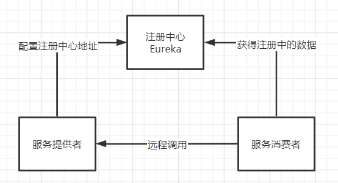
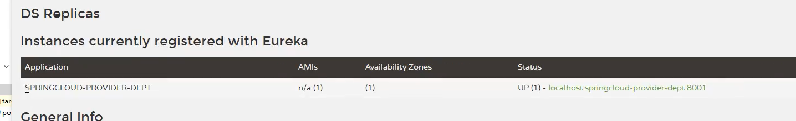
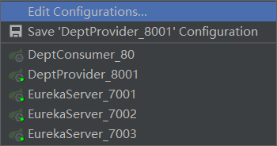
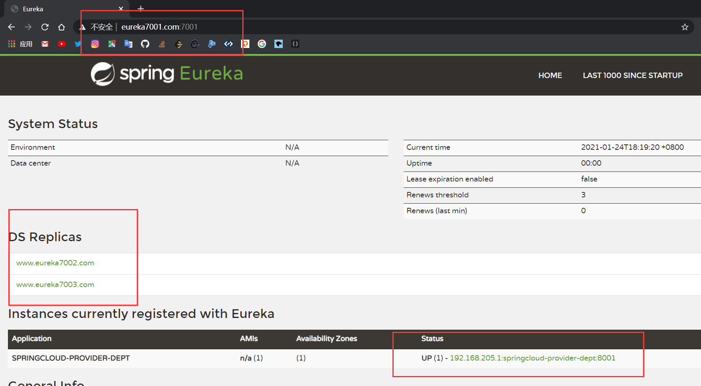

# SpringCloud

## 微服务

* 就目前而言，对于微服务，业界并没有一个统一的，标准的定义
* 但通常而言，微服务架构是一种架构模式，或者说是一种架构风格，**他提倡将单一的应用程序划分成一组小的服务**，每个服务运行在其独立的自己的进程内，服务之间互相协调，互相配置，为用户提供最终价值，**服务之间采用轻量级的通信机制互相沟通**，每个服务都围绕着具体的业务进行构建，并且能够被独立地部署到生产环境中，另外，应尽量避免统一的，集中式的服务管理机制，对具体的一个服务而言，应根据业务上下文，选择合适的语言和工具对其进行构建，可以有一个非常轻量级的集中式管理来协调这些服务，可以使用不同的语言来编写服务，也可以使用不同的数据存储。

微服务化的核心就是将传统的一站式应用，根据业务划分为一个一个的服务，彻底地去耦合，每一个微服务提供单个业务功能的服务，一个服务做一件事情，从技术角度看就是一种小二独立的处理过程，类似进程的概念，能够自行单独启动或销毁，拥有自己独立的数据库。

### 微服务与微服务架构

* 微服务：强调的是服务的大小，他关注的是某一个点，是具体解决某一个问题或提供落地对应服务的一个服务应用

* 微服务架构：一种新的架构形式

微服务架构是一种架构模式，他提倡将单一应用程序划分为一组小的服务，服务之间互相协调，互相配合，为用户提供最终价值，每个服务运行在其独立的进程中，服务与服务间采用轻量级的通信机制互相协调，每个服务都围绕着具体的业务进行构建，并且能够被独立地部署到生产环境中，另外，应尽量避免统一的，集中式的服务管理机制，对具体的一个服务而言，应根据业务上下文，选择合适的语言和工具对其进行构建

### 微服务优缺点

优点：

* 单一职责原则
* 每个服务足够内聚，足够小，代码容易理解，这样能聚焦一个指定业务功能或业务需求
* 开发简单，开发效率提高，一个服务可能就是专一地只干一件事
* 微服务能够被小团队单独开发
* 微服务是松耦合的，是由功能意义的服务，无论是在开发阶段或是部署阶段都是独立的
* 微服务能使用不同的语言开发
* 微服务易于和第三方集成，微服务允许容易且灵活的方式集成自动部署，通过持续集成工具
* 微服务易于被一个开发人员理解、修改和维护
* 微服务允许你利用融合最新技术
* 微服务只是业务逻辑的代码
* 每一个微服务都有自己的存储能力，可以有自己的数据库，也可以有统一数据库

缺点：

* 开发人员要处理分布式系统的复杂性
* 多服务运维难度大
* 系统部署依赖
* 服务间通信成本高
* 数据一致性
* 系统集成测试
* 性能监控

### 微服务技术栈

| 微服务条目       | 落地技术                                   |
| ---------------- | ------------------------------------------ |
| 服务开发         | SpringBoot  Spring  SpringMVC              |
| 服务配置与管理   | Netflix公司的Archaius  阿里的Diamond等     |
| 服务注册于发现   | Eureka  Consul  Zookeeper等                |
| 服务调用         | Rest   RPC   gRPC                          |
| 服务熔断器       | Hystrix   Envoy等                          |
| 负载均衡         | Ribbon   Nginx等                           |
| 服务接口调用     | Feign等                                    |
| 消息队列         | Kafka   RabbitMQ   ActiveMQ 等             |
| 服务配置中心管理 | SpringCloudConfig   Chef 等                |
| 服务路由         | Zuul 等                                    |
| 服务监控         | Zabbix   Nagios   Metrics   Specatator 等  |
| 全链路追踪       | Zipkin   Brave   Dapper 等                 |
| 服务部署         | Docker   OpenStack   Kubernetes等          |
| 数据流操作开发包 | SpringCloud Stream(封装与消息队列接收消息) |
| 事件消息总线     | SpringCloud Bus                            |

## SpringCloud

SpringCloud,基于SpringBoot提供了一套微服务解决方案，包括服务注册与发现，配置中心，全链路监控，服务网关，负载均衡，熔断器等组件，除了基于NetFlix的开源组件做高度抽象封装之外，还有一些选型中立的开源组件。

SpringCloud利用SpringBoot的开发便利性，巧妙地简化了分布式系统基础设施的开发，SpringCloud为开发人员提供了快速构建分布式系统的一些工具，包括配置管理，服务发现，断路器，路由，微代理，事件总线，全局锁，决策竞选，分布式会话等等，他们都可以用SpringBoot的开发风格做到一键启动和部署。

SpringBoot并没有重复造轮子，它只是将目前各家公司开发的比较成熟，经得起实际考研的服务框架组合起来，通过SpringBoot风格进行再封装，屏蔽掉了复杂的配置和实现原理，最终给开发者留出了一套简单易懂，易部署和易维护的分布式系统开发工具包。


SpringCloud是分布式微服务架构下的一站式解决方案，是各个微服务架构落地技术的集合体，俗称微服务全家桶。

SpringBoot 和 SpringCloud 的关系：

* SpringBoot 专注于快速方便地开发单个个体微服务
* SpringCloud 是关注全局的微服务协调整理治理框架，它将SpringBoot开发的一个个单位微服务整合并管理起来，为各个微服务之间提供：配置管理、服务发现、断路器、路由、微代理、事件总线、全局锁、决策竞选、分布式会话等等集成服务
* SpringBoot 可以离开 SpringCloud 独立使用，但是 SpringCloud 离不开 SpringBoot，属于依赖关系
* SpringBoot 专注于快速、方便地开发单个个体微服务，SpringCloud 关注全局的服务治理框架

SpringCloud 和 Dubbo 的区别：

|              | Dubbo         | Spring                       |
| ------------ | ------------- | ---------------------------- |
| 服务注册中心 | Zookeeper     | Spring Cloud Netflix Eureka  |
| 服务调用方式 | RPC           | REST API                     |
| 服务监控     | Dubbo-monitor | Spring Boot Admin            |
| 断路由       | 不完善        | Spring Cloud Netflix Hystrix |
| 服务网关     | 无            | Spring Cloud Netflix Zuul    |
| 分布式配置   | 无            | Spring Cloud Config          |
| 服务跟踪     | 无            | Spring Cloud Sleuth          |
| 消息总线     | 无            | Spring Cloud Bus             |
| 数据流       | 无            | Spring Cloud Stream          |
| 批量任务     | 无            | Spring Cloud Task            |

最大区别：SpringCloud 抛弃了Dubbo 的RPC 通信，采用的是基于HTTP的REST方式

严格来说，这两种方式各有优劣。虽然从一定程度上来说，后者牺牲了服务调用的性能，但也避免了上面提到的原生RPC带来的问题。而且REST相比RPC更为灵活，服务提供方和调用方的依赖只依靠一纸契约，不存在代码级别的强依赖，这在强调快速演化的微服务环境下，显得更加合适。

品牌机和组装机的区别：

很明显，Spring Cloud的功能比DUBBO更加强大，涵盖面更广，而且作为Spring的拳头项目，它也能够与SpringFramework、Spring Boot、Spring Data、Spring Batch等其他Spring项目完美融合，这些对于微服务而言是至关重要的。使用Dubbo构建的微服务架构就像组装电脑，各环节我们的选择自由度很高，但是最终结果很有可能因为一条内存质量不行就点不亮了，总是让人不怎么放心，但是如果你是一名高手，那这些都不是问题;而SpringCloud就像品牌机，在Spring Source的整合下，做了大量的兼容性测试，保证了机器拥有更高的稳定性，但是如果要在使用非原装组件外的东西，就需要对其基础有足够的了解。

SpringCloud的功能：

* Distributed/versioned configuration  分布式/版本控制配置
* Service registration and discovery 服务注册于发现
* Routing 路由
* Service-to-service calls 服务到服务的调用
* Load balancing 负载均衡配置
* Circuit Breakers 断路器
* Distributed messaging 分布式消息管理

[中文官网](https://www.springcloud.cc/)

# HelloWorld

父工程需要导入的依赖

```xml
<!--    打包方式-->
<packaging>pom</packaging>

<dependencyManagement>
    <dependencies>
        <!--springcloud 的依赖-->
        <dependency>
            <groupId>org.springframework.cloud</groupId>
            <artifactId>spring-cloud-dependencies</artifactId>
            <version>2020.0.0</version>
            <type>pom</type>
            <scope>import</scope>
        </dependency>
        <!--springboot-->
        <dependency>
            <groupId>org.springframework.boot</groupId>
            <artifactId>spring-boot-dependencies</artifactId>
            <version>2.4.2</version>
            <type>pom</type>
            <scope>import</scope>
        </dependency>
        <!--数据库-->
        <dependency>
            <groupId>mysql</groupId>
            <artifactId>mysql-connector-java</artifactId>
            <version>8.0.16</version>
        </dependency>
        <dependency>
            <groupId>com.alibaba</groupId>
            <artifactId>druid</artifactId>
            <version>1.2.4</version>
        </dependency>
        <!--springboot 启动器-->
        <dependency>
            <groupId>org.mybatis.spring.boot</groupId>
            <artifactId>mybatis-spring-boot-starter</artifactId>
            <version>2.1.4</version>
        </dependency>

        <!--日志相关-->
        <!--junit-->
        <dependency>
            <groupId>junit</groupId>
            <artifactId>junit</artifactId>
            <version>4.13</version>
        </dependency>
        <!--lombok-->
        <dependency>
            <groupId>org.projectlombok</groupId>
            <artifactId>lombok</artifactId>
            <version>1.18.10</version>
        </dependency>
        <!--log4j-->
        <dependency>
            <groupId>log4j</groupId>
            <artifactId>log4j</artifactId>
            <version>1.2.17</version>
        </dependency>
        <dependency>
            <groupId>ch.qos.logback</groupId>
            <artifactId>logback-core</artifactId>
            <version>1.2.3</version>
        </dependency>
    </dependencies>
</dependencyManagement>
```

## API模块

```java
@Data
@NoArgsConstructor
@Accessors(chain = true)  //链式写法
public class Dept implements Serializable { //序列化


    public Dept(String dName) {
        this.dName = dName;
    }

    private long deptNo;
    private String dName;
    private String dbSource;
}
```

API模块仅仅是创建了一个映射类

## Provider模块

MVC层写在Provider模块

```yml
server:
  port: 8001

#mybatis配置
mybatis:
  type-aliases-package: com.kai.springcloud.pojo
  config-location: classpath:mybatis/mybatis-config.xml
  mapper-locations: classpath:mybatis/mapper/*.xml

#spring
spring:
  application:
    name: springcloud-provider-dept
  datasource:
    type: com.alibaba.druid.pool.DruidDataSource
    driver-class-name: com.mysql.cj.jdbc.Driver
    url: jdbc:mysql://localhost:3306/db01?useUnicode=true&characterEncoding=utf8&serverTimezone=Asia/Shanghai
    username: root
    password: "123456"
```

## Consumer模块

```yml
server:
  port: 80
```

```java
@Configuration
public class ConfigBean {
    @Bean
    public RestTemplate getRestTemplate(){
        return new RestTemplate();
    }
}
```

```java
@RestController
public class DeptConsumerController {

    //消费者不应该有service层
    //RestTemplate   这些方法模板供我们直接调用
    //RestTemplate提供多种便捷访问远程http服务的方法
    //简单的restful服务模板

    @Autowired
    private RestTemplate restTemplate;

    private static final String REST_URL_PREFIX = "http://localhost:8001";

    @RequestMapping("/consumer/dept/get/{id}")
    public Dept get(@PathVariable("id") Long id) {
        return restTemplate.getForObject(REST_URL_PREFIX + "/dept/get/" + id, Dept.class);
    }

    @RequestMapping("/consumer/dept/add")
    public Boolean add(Dept dept) {
        return restTemplate.postForObject(REST_URL_PREFIX + "/dept/add", dept, Boolean.class);
    }

    @RequestMapping("/consumer/dept/list")
    public List<Dept> list(Dept dept) {
        return restTemplate.getForObject(REST_URL_PREFIX + "/dept/list", List.class);
    }
}
```

# Eureka服务注册与发现

Netflix在设计Eureka时，遵循的就是AP原则

Eureka是Netflix的一个子模块，也是核心模块之一，Eureka是一个基于REST的服务，用于定位服务，以实现云端中间层服务发现和故障转移，服务注册中心与发现对于微服务来说是非常重要的，有了服务发现与注册，只需要使用服务的标识符，就可以访问到服务，而不需要修改服务调用的配置文件了，功能类似于Dubbo的注册中心，如Zookeeper

## 原理



SpringCloud 封装了NetFlix公司开发的Eureka模块来实现服务注册和发现

Eureka采用CS的架构设计，EurekaServer 作为服务注册功能的服务器，他是服务注册中心

而系统中的其他微服务，使用Eureka的客户端连接到EurekaServer并维持心跳连接，这样系统的维护人员可以通过EurekaServer来监控系统中各个微服务是否正常运行，SpringCloud的一些其他模块就可以通过EurekaServer来发现系统的其他微服务，并执行相关的逻辑

## 配置

这里没有运行成功，版本问题没解决

```xml
<dependencies>
    <!--导入Eureka包-->
    <dependency>
        <groupId>org.springframework.cloud</groupId>
        <artifactId>spring-cloud-starter-netflix-eureka-server</artifactId>
    </dependency>
    <!--热部署工具-->
    <dependency>
        <groupId>org.springframework.boot</groupId>
        <artifactId>spring-boot-devtools</artifactId>
    </dependency>
</dependencies>
```

```yml
server:
  port: 7001

# Eureka配置
eureka:
  instance:
    hostname: localhost  #Eureka服务端的实例名称
  client:
    register-with-eureka: false #表示是否向注册中心注册自己
    fetch-registry: false #如果是false,则表示自己为注册中心
    service-url:  # 监控页面
      defaultZone: http://${eureka.instance.hostname}:${server.port}/eureka/
```

```java
@SpringBootApplication
@EnableEurekaServer
public class EurekaServer_7001 {
    public static void main(String[] args) {
        SpringApplication.run(EurekaServer_7001.class,args);
    }
}
```

运行成功后，访问`http://localhost:7001/`进入注册中心默认页面

## 服务注册

> 给提供者8001配置依赖

```xml
<dependency>
    <groupId>org.springframework.cloud</groupId>
    <artifactId>spring-cloud-starter-eureka</artifactId>
    <version>1.4.6.RELEASE</version>
</dependency>
```

> Eureka配置

```yml
#Eureka配置,服务注册
eureka:
  client:
    service-url:
      defaultZone: http://localhost:7001/eureka/
  instance:
  	instance-id: springcloud-provider-dept8001 #修改描述信息
```

最后在启动类总开启注解支持`@EnableEurekaClient`

这样，在服务启动后，自动注册到Eureka中

先开启7001服务，再开启8001服务，进入注册中心页面



若将8001断开,Eureka一段时间后会发生自我保护机制

> 添加监控信息

```xml
<dependency>
<groupId>org.springframework.boot</groupId>
<artifactId>spring-boot-starter-actuator</artifactId>
</dependency>
```

```yml
info:
  app.name: kai-springcloud
  company.name: com.kai
```

> 自我保护机制

某一时刻，一个微服务不可以用了，eureka不会立刻清理，依旧会对该服务的信息进行保存

默认情况下，如果EurekaServer在一定时间内没有接收到某个微服务实例的心跳，EurekaServer将会注销该实例（默认90秒)。但是当网络分区故障发生时，微服务与Eureka之间无法正常通行，以上行为可能变得非常危险了--因为微服务本身其实是健康的，此时本不应该注销这个服务。Eureka通过自我保护机制来解决这个问题--当EurekaServer节点在短时间内丢失过多客户端时（可能发生网络故障），那么这个节点会进入自我保护模式。一旦进入该模式，EurekaServer就会保护服务注册表中的信息，不再删除服务注册表中的数据（也就是不会注销任何微服务)。当网络故障恢复后，该EurekaServer节点会自动退出自我保护模式。

在自我保护模式中，EurekaServer会保护服务注册表中的信息，不再注销任何服务实例。当它收到的心跳数重新恢复到阈值以上时，该EurekaServer节点就会自动退出自我保护模式。它的设计哲学就是宁可保留错误的服务注册信息，也不盲目注销任何可能健康的服务实例。一句话:好死不如赖活着。

综上，自我保护模式是一种应对网络异常的安全保护措施。它的架构哲学是宁可同时保留所有微服务（健康的微服务和不健康的微服务都会保留)，也不盲目注销任何健康的微服务。使用自我保护模式，可以让Eureka集群更加的健壮和稳定

在SpringCloud中，可以使用`eureka.server.enable-self-preservation = false`禁用自我保护模式（不推荐关闭）

```java
//获取进来的微服务,获取一些消息
@Autowired
private DiscoveryClient client;
@GetMapping("/dept/discovery")
public Object discovery(){
    //获取微服务列表的清单
    List<String> services = client.getServices();
    System.out.println(services);
    //得到一个具体的微服务信息
    List<ServiceInstance> instances = client.getInstances("applicationName");
    for (ServiceInstance instance : instances) {
        System.out.println(instance.getHost());
    }
    return this.client;
}
//在启动类中加 @EnableDiscoveryClient
```

## 集群配置


配置依赖

修改配置文件中的端口号

编写对应的主启动类

在host中作地址映射


集群绑定

```yml
server:
  port: 7001

# Eureka配置
eureka:
  instance:
    hostname: www.eureka7001.com  #Eureka服务端的实例名称
  client:
    register-with-eureka: false #表示是否向注册中心注册自己
    fetch-registry: false #如果是false,则表示自己为注册中心
    service-url:
      # 单机监控页面  defaultZone: http://${eureka.instance.hostname}:${server.port}/eureka/
      # 集群  在7001里挂载7002和7003
      defaultZone: http://www.eureka7002.com:7002/eureka/,http://www.eureka7003.com:7003/eureka/
```

提供者配置,将提供者发布到三个注册中心

```yml
#Eureka配置,服务注册
eureka:
  client:
    service-url:
      defaultZone: http://www.eureka7001.com:7001/eureka/,http://www.eureka7002.com:7002/eureka/,http://www.eureka7003.com:7003/eureka/
```

启动



测试



此时关闭其中一个端口,其它端口仍可用

## 对比Zookeeper

CAP原则:

RDBMS(Mysql,Oracle,sqlServer)   ACID

NoSQL(Redis,Mongdb)  CAP

ACID:

* Atomicity 原子性
* Consistency 一致性
* Isolation 隔离性
* Durability 持久性

CAP:

* Consistency 强一致性
* Availability 可用性
* Partition Tolerance 分区容错性

CAP的三进二: CA  AP  CP

CAP理论的核心:

* 一个分布式系统不可能同时很好的满足一致性,可用性和可区容错性这三个需求
* 根据CAP原理,将NoSQL数据库分成了满足CA原则,满足CP原则,满足AP原则三大需求
  * CA: 单点集群,满足一致性,可用性的系统,通常可扩展性较差
  * CP: 满足一致性,分区容错性的系统,通常性能不是特别高
  * AP: 满足可用性,分区容错性的系统,通常对一致性要求低

> 作为服务注册中心,Eureka 比 Zookeeper 好在哪里?

著名的CAP理论指出,一个分布式系统不可能同时满足CAP原则

由于分区容错性P在分布式系统中是必须要保证的,因此我们只能在A和C之间进行权衡

* Zookeeper保证的是CP
* Eureka保证的是AP

Eureka 可以很好的应对网络故障导致部分节点失去联系的情况,而不会像Zookeeper那样使整个注册服务瘫痪 

# Ribbon

Spring Cloud Ribbon 是基于 Netflix Ribbon 实现的一套**客户端负载均衡**的工具

Ribbon的主要功能是提供客户端的软件负载均衡算法，将Netflix 的中间层服务连接在一起，Ribbon 的客户端组件提供一系列完整的配置项如：连接超时、重试等等。简单来说，就是在配置文件中列出Load Balance（LB，负载均衡）后面所有的机器，Ribbon 会自动帮助你基于某种规则（如简单轮询，随机连接等等）去连接这些机器。我们也很容易使用Ribbon实现自定义的负载均衡算法

## 功能

* LB，即负载均衡
* 负载均衡简单地说就是将用户的请求平摊地分配到多个服务上，从而达到系统的HA（高可用）
* 常见的负载均衡软件有 Nginx、Lvs等等
* dubbo、SpringCloud 中均给我们提供了负载均衡，SpringCloud 的负载均衡算法可以自定义

负载均衡简单分类：
  * 集中式LB：即在服务的消费方和提供方之间使用独立的LB设施，如Nginx，由该设施负责把访问请求通过某种策略转发至服务的提供方
  * 进程式LB：
      * 将LB逻辑集成到消费方，消费方从服务注册中心获知哪些地址可用，然后自己再从这些地址中选一个合适的服务器
      * Ribbon 就属于进程式LB，他只是一个类库，集成于消费方进程，消费方通过他来获取到服务提供方的地址