# SpringMVC

MVC是将业务逻辑、数据、显示分离的方法来组织代码

MVC主要作用是降低了视图与业务逻辑间的双向耦合

MVC不是设计模式，而实一种架构模式

MVC:

* 模型 Modle
  * 数据模型，提供要展示的数据，因此包含数据和行为，可以认为是领域模型或JavaBean组件（包含数据和行为），不过现在一般都分离开来：数据Dao层和服务Service层，也就是模型提供了模型数据查询和模型数据状态更新等功能，包括数据可业务

* 视图 View
  * 负责进行模型和展示，一般就是我们见到的用户界面，客户想看到的东西

* 控制器 Controller
  * 接收用户请求，委托模型进行处理（状态改变），处理完毕后把返回的模型数据返回给视图，由视图负责展示，也就是说控制器做了一个调度员的工作

典型的MVC就是： JSP + Servlet + JavaBean 模式

# 配置示例

## web.xml

```xml
<?xml version="1.0" encoding="UTF-8"?>
<web-app xmlns="https://jakarta.ee/xml/ns/jakartaee"
         xmlns:xsi="http://www.w3.org/2001/XMLSchema-instance"
         xsi:schemaLocation="https://jakarta.ee/xml/ns/jakartaee https://jakarta.ee/xml/ns/jakartaee/web-app_5_0.xsd"
         version="5.0">

    <!--注册DispatcherServlet-->
    <servlet>
        <servlet-name>springmvc</servlet-name>
        <servlet-class>org.springframework.web.servlet.DispatcherServlet</servlet-class>
        <!--关联一个springmvc配置文件-->
        <init-param>
            <param-name>contextConfigLocation</param-name>
            <param-value>classpath:springmvc-servlet.xml</param-value>
        </init-param>
        <!--启动级别1-->
        <load-on-startup>1</load-on-startup>
    </servlet>

    <!-- / 匹配所有的请求: (不包括.jsp)-->
    <!-- /* 匹配所有的请求: (包括.jsp)-->
    <servlet-mapping>
        <servlet-name>springmvc</servlet-name>
        <url-pattern>/</url-pattern>
    </servlet-mapping>

<!--    配置SpringMVC的乱码过滤-->
    <filter>
        <filter-name>encoding</filter-name>
        <filter-class>org.springframework.web.filter.CharacterEncodingFilter</filter-class>
        <init-param>
            <param-name>encoding</param-name>
            <param-value>utf-8</param-value>
        </init-param>
    </filter>
    <filter-mapping>
        <filter-name>encoding</filter-name>
        <url-pattern>/*</url-pattern>
    </filter-mapping>

</web-app>
```

## springmvc-servlet.xml

```xml
<?xml version="1.0" encoding="UTF-8"?>
<beans xmlns="http://www.springframework.org/schema/beans"
       xmlns:xsi="http://www.w3.org/2001/XMLSchema-instance"
       xmlns:context="http://www.springframework.org/schema/context"
       xmlns:mvc="http://www.springframework.org/schema/mvc"
       xsi:schemaLocation="http://www.springframework.org/schema/beans
        https://www.springframework.org/schema/beans/spring-beans.xsd
        http://www.springframework.org/schema/context
        https://www.springframework.org/schema/context/spring-context.xsd
        http://www.springframework.org/schema/mvc
        https://www.springframework.org/schema/mvc/spring-mvc.xsd">

    <context:component-scan base-package="com.kai.controller"/>
    <mvc:default-servlet-handler/>
    <mvc:annotation-driven/>

    <bean class="org.springframework.web.servlet.view.InternalResourceViewResolver" id="internalResourceViewResolver">
        <property name="prefix" value="/WEB-INF/jsp/"/>
        <property name="suffix" value=".jsp"/>
    </bean>
    
    <!--    json乱码-->
    <mvc:annotation-driven>
        <mvc:message-converters>
            <bean class="org.springframework.http.converter.StringHttpMessageConverter">
                <constructor-arg value="UTF-8"/>
            </bean>
            <bean class="org.springframework.http.converter.json.MappingJackson2HttpMessageConverter">
                <property name="objectMapper">
                    <bean class="org.springframework.http.converter.json.Jackson2ObjectMapperFactoryBean">
                        <property name="failOnEmptyBeans" value="false"/>
                    </bean>
                </property>
            </bean>
        </mvc:message-converters>
    </mvc:annotation-driven>

</beans>
```

# 初始SpringMVC

特点：

* 轻量级，简单易学
* 高效，基于请求响应的MVC框架
* 与Spring兼容性好，无缝结合
* 约定优于配置
* 功能强大：RESTful、数据验证、格式化、本地化、主题等
* 简介灵活

## HelloSpringMVC

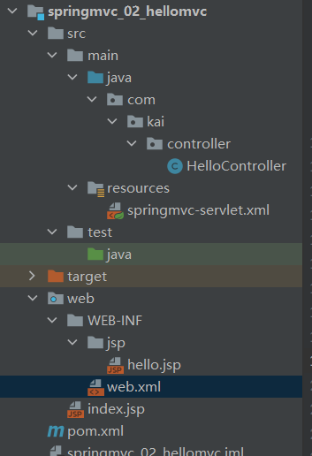

### web.xml

* 配置DispatchServlet
* DispatchServlet要绑定Spring的配置文件(res下创建spring配置文件)

```xml
<?xml version="1.0" encoding="UTF-8"?>
<web-app xmlns="https://jakarta.ee/xml/ns/jakartaee"
         xmlns:xsi="http://www.w3.org/2001/XMLSchema-instance"
         xsi:schemaLocation="https://jakarta.ee/xml/ns/jakartaee https://jakarta.ee/xml/ns/jakartaee/web-app_5_0.xsd"
         version="5.0">


    <!--注册DispatcherServlet-->
    <servlet>
        <servlet-name>springmvc</servlet-name>
        <servlet-class>org.springframework.web.servlet.DispatcherServlet</servlet-class>
        <!--关联一个springmvc配置文件-->
        <init-param>
            <param-name>contextConfigLocation</param-name>
            <param-value>classpath:springmvc-servlet.xml</param-value>
        </init-param>
        <!--启动级别1-->
        <load-on-startup>1</load-on-startup>
    </servlet>

    <!-- / 匹配所有的请求: (不包括.jsp)-->
    <!-- /* 匹配所有的请求: (包括.jsp)-->
    <servlet-mapping>
        <servlet-name>springmvc</servlet-name>
        <url-pattern>/</url-pattern>
    </servlet-mapping>
</web-app>
```

### springmvc-servlet.xml

* 处理器映射器
* 处理器适配器
* 视图解析器

```xml
<?xml version="1.0" encoding="UTF-8"?>
<beans xmlns="http://www.springframework.org/schema/beans"
       xmlns:xsi="http://www.w3.org/2001/XMLSchema-instance"
       xsi:schemaLocation="http://www.springframework.org/schema/beans
        https://www.springframework.org/schema/beans/spring-beans.xsd">

    <bean class="org.springframework.web.servlet.handler.BeanNameUrlHandlerMapping"/>
    <bean class="org.springframework.web.servlet.mvc.SimpleControllerHandlerAdapter"/>
    <!--视图解析器:DispatcherServlet给他的ModelAndView -->
    <bean class="org.springframework.web.servlet.view.InternalResourceViewResolver" id="internalResourceViewResolver">
        <!--前缀-->
        <property name="prefix" value="/WEB-INF/jsp/"/>
        <!--后缀-->
        <property name="suffix" value=".jsp"/>
    </bean>
    <!--Handler-->
    <bean id="/hello" class="com.kai.controller.HelloController"/>

</beans>
```

### HelloController.java

```java
public class HelloController implements Controller {
    @Override
    public ModelAndView handleRequest(HttpServletRequest request, HttpServletResponse response) throws Exception {
        //ModelAndView 模型和视图
        ModelAndView modelAndView = new ModelAndView();
        //封装对象,放在ModeAndView中
        modelAndView.addObject("msg", "HelloSpringMVC");
        //封装要跳转的视图,放在ModelAndView中
        modelAndView.setViewName("hello");//: /WEB-INF/jsp/hello.jsp
        return modelAndView;
    }
}
```

404报错可能的问题：IDEA项目发布中，没有添加lib依赖

打开项目管理，添加lib目录，依赖全部导入

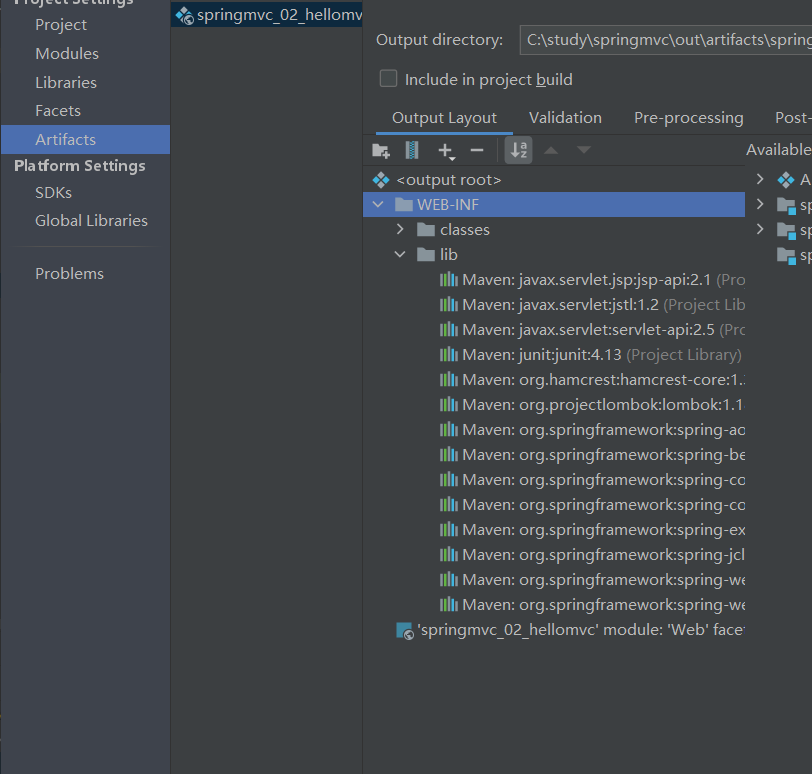

# 注解开发

## springmvc-servlet.xml

```xml
<?xml version="1.0" encoding="UTF-8"?>
<beans xmlns="http://www.springframework.org/schema/beans"
       xmlns:xsi="http://www.w3.org/2001/XMLSchema-instance"
       xmlns:context="http://www.springframework.org/schema/context"
       xmlns:mvc="http://www.springframework.org/schema/mvc"
       xsi:schemaLocation="http://www.springframework.org/schema/beans
        https://www.springframework.org/schema/beans/spring-beans.xsd
        http://www.springframework.org/schema/context
        https://www.springframework.org/schema/context/spring-context.xsd
        http://www.springframework.org/schema/mvc
        https://www.springframework.org/schema/mvc/spring-mvc.xsd">

    <context:component-scan base-package="com.kai.controller"/>
    <mvc:default-servlet-handler/>
    <mvc:annotation-driven/>
    
    <bean class="org.springframework.web.servlet.view.InternalResourceViewResolver" id="internalResourceViewResolver">
        <property name="prefix" value="/WEB-INF/jsp/"/>
        <property name="suffix" value=".jsp"/>
    </bean>

</beans>
```

```xml
<!--自动扫描包,让指定包下的注解生效,由IOC容器统一管理-->
<context:component-scan base-package="com.kai.controller"/>
<!--让spring MVC不处理静态资源  .css .js .html .mp3 .mp4-->
<mvc:default-servlet-handler/>

<!--
支持mvc注解驱动
    在spring中一般采用@RequestMapping注解来完成映射关系
    要使@RequestMapping注解生效
    必须向上下文中注册DefaultAnnotationHandlerMapping
    和一个AnnotationMethodHandlerAdapter实例
    这两个实例分别在类级别和方法级别处理
    而annotation-driven配置帮助我们自动完成上述两个实例的注入
 -->
<mvc:annotation-driven/>
```
## web.xml

```xml
<?xml version="1.0" encoding="UTF-8"?>
<web-app xmlns="https://jakarta.ee/xml/ns/jakartaee"
         xmlns:xsi="http://www.w3.org/2001/XMLSchema-instance"
         xsi:schemaLocation="https://jakarta.ee/xml/ns/jakartaee https://jakarta.ee/xml/ns/jakartaee/web-app_5_0.xsd"
         version="5.0">
    <servlet>
        <servlet-name>springmvc</servlet-name>
        <servlet-class>org.springframework.web.servlet.DispatcherServlet</servlet-class>
        <init-param>
            <param-name>contextConfigLocation</param-name>
            <param-value>classpath:springmvc-servlet.xml</param-value>
        </init-param>
        <load-on-startup>1</load-on-startup>
    </servlet>
    <servlet-mapping>
        <servlet-name>springmvc</servlet-name>
        <url-pattern>/</url-pattern>
    </servlet-mapping>
</web-app>
```

## HelloController.java

```java
@Controller
public class HelloController {

    @RequestMapping("/h1")
    public String hello(Model model){
        //封装数据
        model.addAttribute("msg","HelloSpring");
        return "hello"; //会被视图解析器处理 WEB-INF/jsp/hello.jsp
    }
}
```

SpringMVC必须配置的三大件:

处理器映射器、处理器适配器、视图解析器

通常只需要手动配置视图解析器，二处理器映射器和处理器适配器只需要开启注解驱动即可

# Controller

* 控制器复杂提供访问应用程序的行为，通常通过接口定义或注解两种方法实现
* 控制器负责解析用户的请求并将其转换为一个模型
* 在Spring MVC中一个控制器类可以包含多个方法
* 在Spring MVC中，对于Controller的配置方式有很多种

## 接口实现

实现接口Controller定义控制器是较老的方法

缺点：一个控制器只能有一个方法，如果要多个方法则需要定义多个Controller；定义的方法比较麻烦

```java
public class ControllerTest1 implements Controller {
    @Override
    public ModelAndView handleRequest(HttpServletRequest request, HttpServletResponse response) throws Exception {
        ModelAndView mv=new ModelAndView();
        mv.addObject("msg","ControllerTest1");
        mv.setViewName("test");
        return mv;
    }
```

```xml
<bean name="/t1" class="com.kai.controller.ControllerTest1"/>
```

## 注解实现

@Controller注解类型用于声明Spring类的实例是一个控制器

Spring可以使用扫描机制来找到应用程序中所有基于注解的控制器类，为了保证Spring能找到控制器，需要在配置文件中声明组件扫描

```xml
<context:component-scan base-package="com.kai.controller"/>
```

```java
//@Controller代表这个类被Spring接管
//被注解的类中,如果有方法返回String并且有具体页面跳转
//那么就会被视图器解析
@Controller
public class ControllerTest2 {

    @RequestMapping("/t2")
    public String test2(Model model){
        model.addAttribute("msg","ControllerTest2");
        return "test";
    }

    @RequestMapping("/t3")
    public String test3(Model model){
        model.addAttribute("msg","ControllerTest3");
        return "test";
    }
}

```

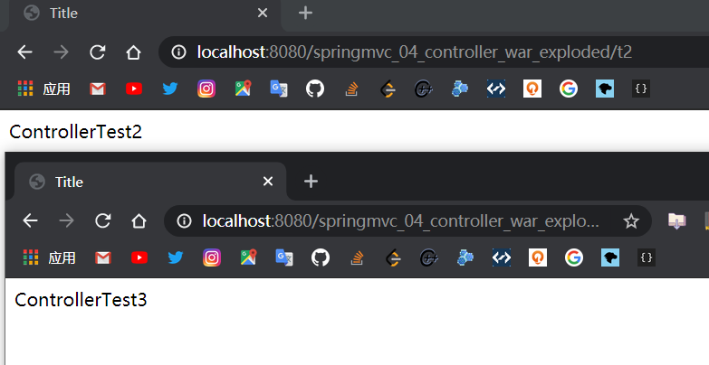

我们两个请求都指向一个视图，但是页面结果是不一样的，从这里可以看出视图是被复用的，而控制器与视图之间是弱耦合关系

## RequestMapping

@RequestMapping注解用于映射用于映射url到控制器类或一个特定的处理程序方法，可用于类或方法上，用于类上，表示类中的所有响应请求的方法都是以该地址作为父路径

```java
@Controller
@RequestMapping("/hello")
public class ControllerTest3 {

    @RequestMapping("/test")
    public String test4(Model model){
        model.addAttribute("msg","test4");
        return "test";
    }
}
```

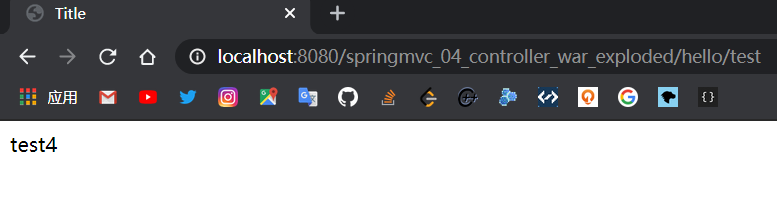

访问顺序，先访问类的路径，再访问方法的路径

## RestFul风格

RestFul就是一个资源定位及资源操作的风格，不是标准也不是协议，只是一种风格，基于这个风格设计的软件可以更加简洁，更有层次，更易于实现缓存等机制

功能：

* 资源：互联网所有事物都可以被抽象为资源
* 资源操作：使用POST、DELETE、PUT、GET等不同方法对资源进行操作
* 分别对应添加、删除、修改、查询

传统方式操作资源：通过不同的参数来实现不同的效果
```
http://127.0.0.1/item/queryitem?id=1	#查询GET
http://127.0.0.1/item/saveitem		#新增POST
```

使用RestFul操作资源：可以通过不同的请求方式来实现不同的效果

```
http://127.0.0.1/item/1		#查询GET
http://127.0.0.1/item	#新增POST
```

```java
@Controller
public class RestFulController {

    //原来的方式
    //http://localhost:8080/springmvc_04_controller_war_exploded/add?a=1&b=2
    @RequestMapping("/add")
    public String test01(int a, int b, Model model) {
        int res = a + b;
        model.addAttribute("msg", res);
        return "test";
    }

    //RestFul风格
    //http://localhost:8080/springmvc_04_controller_war_exploded/add2/5/6
    @RequestMapping("/add2/{a}/{b}")
    public String test02(@PathVariable int a, @PathVariable int b, Model model) {
        int res = a + b;
        model.addAttribute("msg", res);
        return "test";
    }
    //RestFul风格
    //@RequestMapping(value = "/add3/{a}/{b}",method = RequestMethod.GET)
    @GetMapping("/add3/{a}/{b}")
    public String test03(@PathVariable String a, @PathVariable String b, Model model) {
        String res = a + b;
        model.addAttribute("msg", res);
        return "test";
    }
}
```

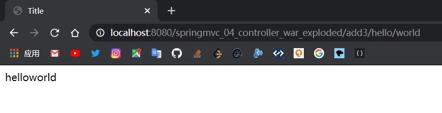

## 转发和重定向

通过SpringMVC来实现转发和重定向，无需视图解析器

URL不变为转发，URL改变为重定向

```java
@Controller
public class ModeTest1 {

    @RequestMapping("/m1/t1")
    public String test1(HttpServletRequest req, HttpServletResponse resp){
        //使用视图解析器
        HttpSession session = req.getSession();
        System.out.println(session.getId());
        return "test";
        
        //return "/WEB-INF/jsp/test.jsp"
    }
    @RequestMapping("/m1/t2")
    public String test2(Model model){
        //转发,无法直接访问WEB-INF中的jsp,hello.jsp在web目录下
        model.addAttribute("msg","hello");
        return "/hello.jsp";
    }
    @RequestMapping("/m1/t3")
    public String test3(Model model){
        //转发二
        model.addAttribute("msg","hello");
        return "forward:/hello.jsp";
    }
    @RequestMapping("/m1/t4")
    public String test4(Model model){
        //重定向
        model.addAttribute("msg","hello");
        return "redirect:/hello.jsp";
    }
}
```

## 数据处理

```java
@Controller
@RequestMapping("/user")
public class UserController {

    //不加@RequestParam localhost:8080/xxx/user/t1?name=leomaokai
    //加上@RequestParam localhost:8080/xxx/user/t1?username=leomaokai
    @GetMapping("/t1")
    public String test1(@RequestParam("username") String name, Model model){
        //1.接收前端参数
        System.out.println("接收到前端的参数:"+name);
        //2.将返回的结果传递给前端
        model.addAttribute("msg",name);
        //3.跳转视图
        return "test";
    }

    //前端接受User对象: id name age
    // localhost:8080/xxx/user/t2?name=leomaokai&id=10&age=20
    /*
    1.接收前端用户传递的参数,判断参数的名字,如果名字直接在方法上,可以直接使用
    2.假设传递的是一个对象user,匹配User对象中的字段名,如果名字一致,则可匹配
     */
    @GetMapping("/t2")
    public String test2(User user){
        System.out.println(user);
        return "test";
    }

    /*
    ModeMap:继承了LinkedHashMap,拥有LinkedHashMap的全部功能
    Model:精简版
     */
    @GetMapping("/t3")
    public String test3(ModelMap modelMap){
        modelMap.addAttribute("msg","ModelMap");
        return "test";
    }
}
```

## 乱码问题

可以配置SpringMVC的乱码过滤

也可以自己写一个过滤器

注意路径映射要 **/***

```xml
<?xml version="1.0" encoding="UTF-8"?>
<web-app xmlns="https://jakarta.ee/xml/ns/jakartaee"
         xmlns:xsi="http://www.w3.org/2001/XMLSchema-instance"
         xsi:schemaLocation="https://jakarta.ee/xml/ns/jakartaee https://jakarta.ee/xml/ns/jakartaee/web-app_5_0.xsd"
         version="5.0">

    <!--注册DispatcherServlet-->
    <servlet>
        <servlet-name>springmvc</servlet-name>
        <servlet-class>org.springframework.web.servlet.DispatcherServlet</servlet-class>
        <!--关联一个springmvc配置文件-->
        <init-param>
            <param-name>contextConfigLocation</param-name>
            <param-value>classpath:springmvc-servlet.xml</param-value>
        </init-param>
        <!--启动级别1-->
        <load-on-startup>1</load-on-startup>
    </servlet>

    <!-- / 匹配所有的请求: (不包括.jsp)-->
    <!-- /* 匹配所有的请求: (包括.jsp)-->
    <servlet-mapping>
        <servlet-name>springmvc</servlet-name>
        <url-pattern>/</url-pattern>
    </servlet-mapping>

<!--    配置SpringMVC的乱码过滤-->
    <filter>
        <filter-name>encoding</filter-name>
        <filter-class>org.springframework.web.filter.CharacterEncodingFilter</filter-class>
        <init-param>
            <param-name>encoding</param-name>
            <param-value>utf-8</param-value>
        </init-param>
    </filter>
    <filter-mapping>
        <filter-name>encoding</filter-name>
        <!--注意/*-->
        <url-pattern>/*</url-pattern>
    </filter-mapping>

<!--    <filter>-->
<!--        <filter-name>encoding</filter-name>-->
<!--        <filter-class>com.kai.filter.EncodingFilter</filter-class>-->
<!--    </filter>-->
<!--    <filter-mapping>-->
<!--        <filter-name>encoding</filter-name>-->
<!--        <url-pattern>/*</url-pattern>-->
<!--    </filter-mapping>-->

</web-app>
```

# JSON

## JSON

* JSON(JavaScript Object Notation,JS对象标记)是一种轻量级的数据交换格式，目前使用特别广泛

* 采用完全独立于编程语言的文本格式来储存和表示数据

* 简洁和清晰的层次结构使得JSON成为理想的数据交换语言

* 易于阅读和编写，同时也易于机器解析和生成，并有效地提升网络传输效率

在JavaScript语言中，一切都是对象，因此，任何JavaScript支持的类型都可以通过JSON来表示，例如字符串、数字、对象、数组等，语法格式：

* 对象表示为键值对，数据用逗号分隔
* 花括号保存对象
* 方括号保存数组

JSON键值对用来保存JavaScript对象的一种方式，和JavaScript对象写法也大同小异，键值对组合中的键名写在前面并用双引号包裹，用冒号分隔，然后紧跟着值

```json
{"name":"leomaokai"}
{"age":"18"}
{"sex":"man"}
```

```html
<!DOCTYPE html>
<html lang="en">
<head>
    <meta charset="UTF-8">
    <title>Title</title>

    <script type="text/javascript">
        //编写JavaScript对象
        var user = {
            name: "maokai",
            age: 3,
            sex: "man"
        };
        console.log(user);

        //将js对象转换为json对象
        var s = JSON.stringify(user);
        console.log(s);

        //将json对象转换为js对象
        var parse = JSON.parse(s);
        console.log(parse);
    </script>
</head>
<body>

</body>
</html>
```

## Jackson

* Jackson是目前比较好的JSON解析工具
* 还有阿里巴巴的fastjson

```xml
<!-- https://mvnrepository.com/artifact/com.fasterxml.jackson.core/jackson-databind -->
<dependency>
    <groupId>com.fasterxml.jackson.core</groupId>
    <artifactId>jackson-databind</artifactId>
    <version>2.11.2</version>
</dependency>
```

```java
//解决json乱码,配置Springmvc
@RequestMapping("/j4")
@ResponseBody //不会走视图解析器,会直接返回一个字符串
public String json4() throws JsonProcessingException {
    ObjectMapper mapper=new ObjectMapper();
    User user = new User("茂凯",10,"男");
    String valueAsString = mapper.writeValueAsString(user);
    return valueAsString;
    //{"name":"茂凯","age":10,"sex":"男"}
}
```

```xml
<!--解决json乱码-->
    <mvc:annotation-driven>
        <mvc:message-converters>
            <bean class="org.springframework.http.converter.StringHttpMessageConverter">
                <constructor-arg value="UTF-8"/>
            </bean>
            <bean class="org.springframework.http.converter.json.MappingJackson2HttpMessageConverter">
                <property name="objectMapper">
                    <bean class="org.springframework.http.converter.json.Jackson2ObjectMapperFactoryBean">
                        <property name="failOnEmptyBeans" value="false"/>
                    </bean>
                </property>
            </bean>
        </mvc:message-converters>
    </mvc:annotation-driven>
```

若将@RestController注解到类上，该类下面所有方法都不走视图解析器，直接返回Json字符串 

```java
@RestController
@RequestMapping("/json")
public class UserController2 {

    @RequestMapping("/j1")
    public String test1() throws JsonProcessingException {

        ObjectMapper mapper = new ObjectMapper();
        User user1 = new User("茂凯", 5, "man");
        User user2 = new User("茂凯", 5, "man");
        User user3 = new User("茂凯", 5, "man");
        List<User> userList=new ArrayList<>();
        userList.add(user1);
        userList.add(user2);
        userList.add(user3);
        String str = mapper.writeValueAsString(userList);
        return str;
        //[{"name":"茂凯","age":5,"sex":"man"},
        // {"name":"茂凯","age":5,"sex":"man"},
        // {"name":"茂凯","age":5,"sex":"man"}]
    }
}
```

## JsonUtils

```java
public class JsonUtils {

    public static String getJson(Object object){
        return getJson(object,"yyyy-MM-dd HH:mm:ss");
    }

    public static String getJson(Object object,String dateFormat){
        ObjectMapper mapper = new ObjectMapper();
        mapper.configure(SerializationFeature.WRITE_DATES_AS_TIMESTAMPS,false);
        SimpleDateFormat sdf = new SimpleDateFormat(dateFormat);
        mapper.setDateFormat(sdf);
        try {
            return mapper.writeValueAsString(object);
        } catch (JsonProcessingException e) {
            e.printStackTrace();
        }
        return null;
    }
```

```java
//使用工具类
@RequestMapping("/j5")
public String test5(){
    Date date = new Date();
    return JsonUtils.getJson(date,"yyyy-MM-dd HH:mm:ss");
    //"2021-01-11 22:35:25"
}
//使用工具类
@RequestMapping("/j6")
public String test6(){
    User user1 = new User("茂凯", 5, "man");
    User user2 = new User("茂凯", 5, "man");
    User user3 = new User("茂凯", 5, "man");
    List<User> userList=new ArrayList<>();
    userList.add(user1);
    userList.add(user2);
    userList.add(user3);
    return JsonUtils.getJson(userList);
}
```

## FastJson

```xml
<dependency>
    <groupId>com.alibaba</groupId>
    <artifactId>fastjson</artifactId>
    <version>1.2.73</version>
</dependency>
```

JSONObject 代表json对象

* JSONObject实现了Map接口
* JSONObject对应json对象，通过各种形式的get()方法获取json对象中的数据，也可利用诸如size(),isEmpty()等方法获取"键:值"对的个数和判断是否为空。其本质是通过实现Map接口并调用接口中的方法完成的

JSONArry代表json对象数组

* 内部是有List接口中的方法来完成操作的

JSON代表JSONObject和JSONArray的转化

* JSON类源码分析与使用
* 仔细观察这些方法，主要是实现json对象，json对象数组，javabean对象，json字符串之间的相互转化

```java
@RestController
@RequestMapping("/fastjson")
public class UserController3 {

    @RequestMapping("/t1")
    public String test1(){
        ArrayList<User> userList = new ArrayList<>();
        User user1 = new User("wang", 15, "man");
        User user2 = new User("wang", 15, "man");
        User user3 = new User("wang", 15, "man");
        userList.add(user1);
        userList.add(user2);
        userList.add(user3);

        //Java对象转JSON字符串
        String s = JSON.toJSONString(userList);
        String s1 = JSON.toJSONString(user1);
        //JSON转Java对象
        User user = JSON.parseObject(s1, User.class);
        System.out.println(user);

        //Java对象转JSON字符串
        JSONObject jsonObject1 = (JSONObject) JSON.toJSON(user2);
        System.out.println(jsonObject1);
        //JSON转Java对象
        User javaObject = JSON.toJavaObject(jsonObject1, User.class);
        System.out.println(javaObject);
        return s;
    }
}
```

# ssmbuild

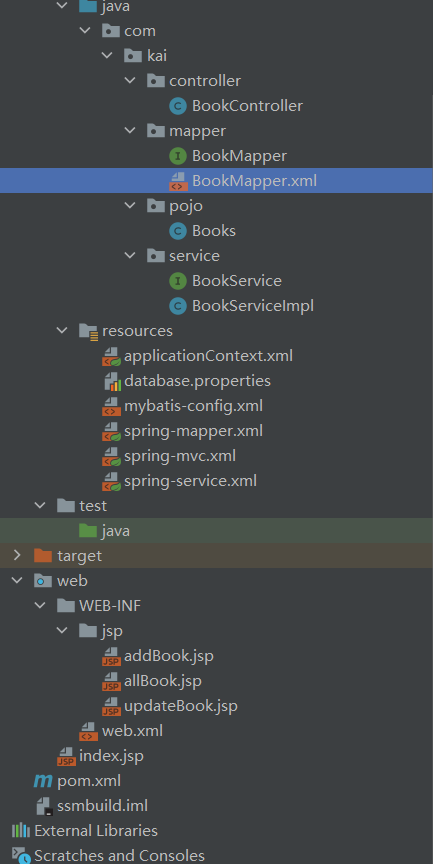

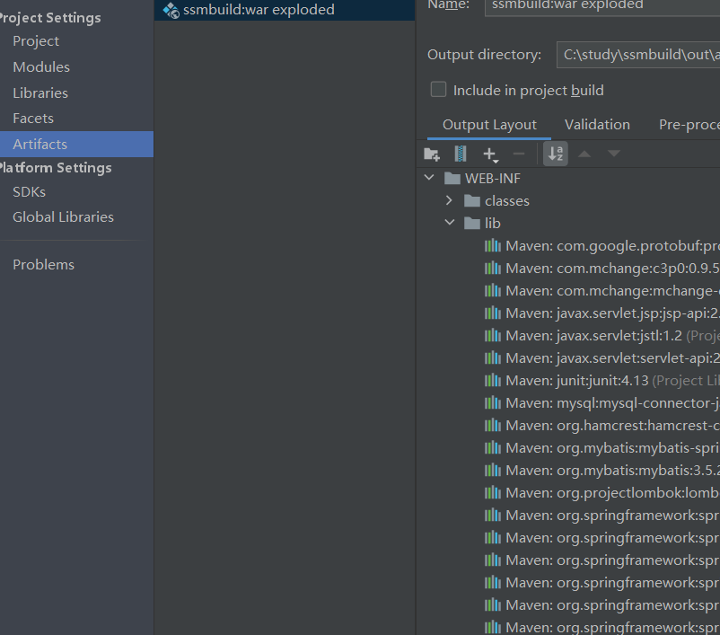

## mysql

```sql
CREATE DATABASE ssmbuild;
USE ssmbuild;
CREATE TABLE `books`(
`bookID` INT NOT NULL AUTO_INCREMENT COMMENT '书id',
`bookName` VARCHAR(100) NOT NULL COMMENT '书名',
`bookCounts` INT NOT NULL COMMENT '数量',
`detail` VARCHAR(200) NOT NULL COMMENT '描述',
KEY `bookID`(`bookID`)
)ENGINE=INNODB DEFAULT CHARSET=utf8;

INSERT INTO `books`(`bookID`,`bookName`,`bookCounts`,`detail`)VALUES
(1,'Java',1,'从入门到放弃'),
(2,'MySQL',10,'从删库到跑路'),
(3,'Linux',5,'从进门到进牢')
```

## pom.xml

```xml
<!--    junit,数据库,连接池,servlet,jsp,mybatis,mybatis-spring,spring-->
    <dependencies>
        <dependency>
            <groupId>junit</groupId>
            <artifactId>junit</artifactId>
            <version>4.13</version>
            <scope>test</scope>
        </dependency>
        <dependency>
            <groupId>org.projectlombok</groupId>
            <artifactId>lombok</artifactId>
            <version>1.18.10</version>
        </dependency>
        <dependency>
            <groupId>mysql</groupId>
            <artifactId>mysql-connector-java</artifactId>
            <version>8.0.16</version>
        </dependency>
        <dependency>
            <groupId>com.mchange</groupId>
            <artifactId>c3p0</artifactId>
            <version>0.9.5.2</version>
        </dependency>
        <dependency>
            <groupId>javax.servlet</groupId>
            <artifactId>servlet-api</artifactId>
            <version>2.5</version>
        </dependency>
        <dependency>
            <groupId>javax.servlet.jsp</groupId>
            <artifactId>jsp-api</artifactId>
            <version>2.1</version>
        </dependency>
        <dependency>
            <groupId>javax.servlet</groupId>
            <artifactId>jstl</artifactId>
            <version>1.2</version>
        </dependency>
        <dependency>
            <groupId>org.mybatis</groupId>
            <artifactId>mybatis</artifactId>
            <version>3.5.2</version>
        </dependency>
        <dependency>
            <groupId>org.mybatis</groupId>
            <artifactId>mybatis-spring</artifactId>
            <version>2.0.3</version>
        </dependency>
        <dependency>
            <groupId>org.springframework</groupId>
            <artifactId>spring-webmvc</artifactId>
            <version>5.2.9.RELEASE</version>
        </dependency>
        <dependency>
            <groupId>org.springframework</groupId>
            <artifactId>spring-jdbc</artifactId>
            <version>5.2.9.RELEASE</version>
        </dependency>
    </dependencies>
```

```xml
<!--    静态资源导出-->
    <build>
        <resources>
            <resource>
                <directory>src/main/resources</directory>
                <includes>
                    <include>**/*.properties</include>
                    <include>**/*.xml</include>
                </includes>
                <filtering>true</filtering>
            </resource>
            <resource>
                <directory>src/main/java</directory>
                <includes>
                    <include>**/*.properties</include>
                    <include>**/*.xml</include>
                </includes>
                <filtering>true</filtering>
            </resource>

        </resources>
    </build>
```

## resources

### mybatis-config.xml

```xml
<?xml version="1.0" encoding="UTF-8" ?>
<!DOCTYPE configuration
        PUBLIC "-//mybatis.org//DTD Config 3.0//EN"
        "http://mybatis.org/dtd/mybatis-3-config.dtd">
<configuration>

    <settings>
        <setting name="logImpl" value="STDOUT_LOGGING"/>
        <setting name="mapUnderscoreToCamelCase" value="true"/>
    </settings>

<!--    配置数据源,交给spring去做-->

    <typeAliases>
        <typeAlias type="com.kai.pojo.Books" alias="Books"/>
    </typeAliases>

    <mappers>
        <mapper class="com.kai.mapper.BookMapper"/>
    </mappers>
</configuration>
```

### database.properties

```properties
jdbc.driver=com.mysql.cj.jdbc.Driver
jdbc.url=jdbc:mysql://localhost:3306/ssmbuild?useUnicode=true&characterEncoding=utf8&serverTimezone=UTC
jdbc.username=root
jdbc.password=123456
```

### applicationContext.xml

```xml
<?xml version="1.0" encoding="UTF-8"?>
<beans xmlns="http://www.springframework.org/schema/beans"
       xmlns:xsi="http://www.w3.org/2001/XMLSchema-instance"
       xsi:schemaLocation="http://www.springframework.org/schema/beans
        https://www.springframework.org/schema/beans/spring-beans.xsd">

    <import resource="classpath:spring-mapper.xml"/>
    <import resource="classpath:spring-service.xml"/>
    <import resource="classpath:spring-mvc.xml"/>
</beans>
```

### spring-mapper.xml

```xml
<?xml version="1.0" encoding="UTF-8"?>
<beans xmlns="http://www.springframework.org/schema/beans"
       xmlns:xsi="http://www.w3.org/2001/XMLSchema-instance"
       xmlns:context="http://www.springframework.org/schema/context"
       xsi:schemaLocation="http://www.springframework.org/schema/beans
        https://www.springframework.org/schema/beans/spring-beans.xsd http://www.springframework.org/schema/context https://www.springframework.org/schema/context/spring-context.xsd">

    <!--关联数据库配置文件-->
    <context:property-placeholder location="classpath:database.properties"/>
    <!--连接池-->
    <bean id="dataSource" class="com.mchange.v2.c3p0.ComboPooledDataSource">
        <property name="driverClass" value="${jdbc.driver}"/>
        <property name="jdbcUrl" value="${jdbc.url}"/>
        <property name="user" value="${jdbc.username}"/>
        <property name="password" value="${jdbc.password}"/>
        <!--c3p0连接池的私有属性-->
        <property name="initialPoolSize" value="10"/>
        <property name="maxPoolSize" value="30"/>
        <property name="minPoolSize" value="10"/>
        <!--关闭连接后不自动commit-->
        <property name="autoCommitOnClose" value="false"/>
        <!--获取连接超时时间-->
        <property name="checkoutTimeout" value="10000"/>
        <!--当获取连接失败重试次数-->
        <property name="acquireRetryAttempts" value="2"/>
    </bean>

    <!--sqlSessionFactory-->
    <bean id="sqlSessionFactory" class="org.mybatis.spring.SqlSessionFactoryBean">
        <property name="dataSource" ref="dataSource"/>
        <property name="configLocation" value="classpath:mybatis-config.xml"/>
    </bean>

    <!--配置mapper接口扫描包,动态实现mapper接口注入到Spring容器中-->
    <bean class="org.mybatis.spring.mapper.MapperScannerConfigurer">
        <property name="sqlSessionFactoryBeanName" value="sqlSessionFactory"/>
        <property name="basePackage" value="com.kai.mapper"/>
    </bean>
</beans>
```

### spring-service.xml

```xml
<?xml version="1.0" encoding="UTF-8"?>
<beans xmlns="http://www.springframework.org/schema/beans"
       xmlns:xsi="http://www.w3.org/2001/XMLSchema-instance"
       xmlns:context="http://www.springframework.org/schema/context"
       xsi:schemaLocation="http://www.springframework.org/schema/beans
        https://www.springframework.org/schema/beans/spring-beans.xsd http://www.springframework.org/schema/context https://www.springframework.org/schema/context/spring-context.xsd">


    <!--扫描service下的包-->
    <context:component-scan base-package="com.kai.service"/>
    <!--讲所有业务类注入到spring-->
    <bean id="BookServiceImpl" class="com.kai.service.BookServiceImpl">
        <property name="bookMapper" ref="bookMapper"/>
    </bean>

    <!--声明式事务-->
    <bean id="transactionManager" class="org.springframework.jdbc.datasource.DataSourceTransactionManager">
        <property name="dataSource" ref="dataSource"/>
    </bean>


</beans>
```

### spring-mvc.xml

```xml
<?xml version="1.0" encoding="UTF-8"?>
<beans xmlns="http://www.springframework.org/schema/beans"
       xmlns:xsi="http://www.w3.org/2001/XMLSchema-instance"
       xmlns:mvc="http://www.springframework.org/schema/mvc"
       xmlns:context="http://www.springframework.org/schema/context"
       xsi:schemaLocation="http://www.springframework.org/schema/beans
        https://www.springframework.org/schema/beans/spring-beans.xsd
        http://www.springframework.org/schema/mvc
        https://www.springframework.org/schema/mvc/spring-mvc.xsd
        http://www.springframework.org/schema/context
        https://www.springframework.org/schema/context/spring-context.xsd">


    <!--注解驱动-->
    <mvc:annotation-driven/>
    <!--静态资源过滤-->
    <mvc:default-servlet-handler/>
    <!--扫描包-->
    <context:component-scan base-package="com.kai.controller"/>
    <!--视图解析器-->
    <bean class="org.springframework.web.servlet.view.InternalResourceViewResolver">
        <property name="prefix" value="/WEB-INF/jsp/"/>
        <property name="suffix" value=".jsp"/>
    </bean>
</beans>
```

## mapper

### BookMapper.java

```java
public interface BookMapper {
    //增删改查
    int insertBook(Books books);
    int deleteBook(@Param("bookID") int id);
    int updateBook(Books books);
    Books getBook(@Param("bookID") int id);
    List<Books> listBooks();

    List<Books> queryBookByName(@Param("bookName") String bookName);
}
```

### BookMapper.xml

```xml
<?xml version="1.0" encoding="UTF-8" ?>
<!DOCTYPE mapper
        PUBLIC "-//mybatis.org//DTD Config 3.0//EN"
        "http://mybatis.org/dtd/mybatis-3-mapper.dtd">
<mapper namespace="com.kai.mapper.BookMapper">

    <insert id="insertBook" parameterType="Books">
        insert into books(bookName, bookCounts, detail)
        values (#{bookName}, #{bookCounts}, #{detail});
    </insert>
    <delete id="deleteBook" parameterType="int">
        delete
        from books
        where bookID = #{bookID};
    </delete>
    <update id="updateBook" parameterType="Books">
        update books
        set bookName=#{bookName},
            bookCounts=#{bookCounts},
            detail=#{detail}
        where bookID = #{bookID};
    </update>
    <select id="getBook" parameterType="int" resultType="Books">
        select *
        from books
        where bookID = #{bookID};
    </select>
    <select id="listBooks" resultType="Books">
        select *
        from books;
    </select>

    <select id="queryBookByName" resultType="Books">
        select *
        from books where bookName like "%"#{bookName}"%";
    </select>
</mapper>
```

## pojo

Books.java

```java
@Data
@AllArgsConstructor
@NoArgsConstructor
public class Books {
    private int bookID;
    private String bookName;
    private int bookCounts;
    private String detail;
}
```

## service

```java
public interface BookService {

    int insertBook(Books books);
    int deleteBook(int id);
    int updateBook(Books books);
    Books getBook(int id);
    List<Books> listBooks();
    List<Books> queryBookByName(String bookName);
}
```

```java
public class BookServiceImpl implements BookService {
    private BookMapper bookMapper;
    
    public void setBookMapper(BookMapper bookMapper) {
        this.bookMapper = bookMapper;
    }

    @Override
    public int insertBook(Books books) {
        return bookMapper.insertBook(books);
    }

    @Override
    public int deleteBook(int id) {
        return bookMapper.deleteBook(id);
    }

    @Override
    public int updateBook(Books books) {
        return bookMapper.updateBook(books);
    }

    @Override
    public Books getBook(int id) { return bookMapper.getBook(id);
    }

    @Override
    public List<Books> listBooks() {
        return bookMapper.listBooks();
    }

    @Override
    public List<Books> queryBookByName(String bookName) {
        return bookMapper.queryBookByName(bookName);
    }
}
```

## controller

```java
@Controller
@RequestMapping("/book")
public class BookController {

    //调service层

    @Autowired
    @Qualifier("BookServiceImpl")
    private BookService bookService;

    //查询全部书籍,并且返回到一个书籍展示页面
    @RequestMapping("/allBook")
    public String list(Model model) {
        List<Books> books = bookService.listBooks();
        model.addAttribute("list", books);
        return "allBook";
    }

    //跳转到增加书籍页面
    @RequestMapping("/toaddBook")
    public String toAddPaper() {
        return "addBook";
    }

    //添加书籍的请求
    @RequestMapping("/addbook")
    public String addBook(Books book){
        bookService.insertBook(book);
        return "redirect:/book/allBook";
    }

    //跳转到修改页面
    @RequestMapping("/toUpdate")
    public String toUpdatePaper(int id,Model model){
        Books book = bookService.getBook(id);
        model.addAttribute("getbook",book);
        return "updateBook";
    }
    //修改书籍请求
    @RequestMapping("/updatebook")
    public String updateBook(Books book){
        bookService.updateBook(book);
        return "redirect:/book/allBook";
    }

    //删除书籍
    @RequestMapping("/toDelete/{bookid}")
    public String deleteBook(@PathVariable("bookid") int id){
        bookService.deleteBook(id);
        return "redirect:/book/allBook";
    }

    //查询书籍
    @RequestMapping("/queryBook")
    public String queryBook(String queryBookName,Model model){
        List<Books> books = bookService.queryBookByName(queryBookName);
        model.addAttribute("list",books);
        return "allBook";
    }
}
```

## Web

### web.xml

```xml
<?xml version="1.0" encoding="UTF-8"?>
<web-app xmlns="https://jakarta.ee/xml/ns/jakartaee"
         xmlns:xsi="http://www.w3.org/2001/XMLSchema-instance"
         xsi:schemaLocation="https://jakarta.ee/xml/ns/jakartaee https://jakarta.ee/xml/ns/jakartaee/web-app_5_0.xsd"
         version="5.0">

    <!--DispatchServlet-->
    <servlet>
        <servlet-name>springmvc</servlet-name>
        <servlet-class>org.springframework.web.servlet.DispatcherServlet</servlet-class>
        <init-param>
            <param-name>contextConfigLocation</param-name>
            <param-value>classpath:applicationContext.xml</param-value>
        </init-param>
        <load-on-startup>1</load-on-startup>
    </servlet>
    <servlet-mapping>
        <servlet-name>springmvc</servlet-name>
        <url-pattern>/</url-pattern>
    </servlet-mapping>

    <!--乱码过滤-->
    <filter>
        <filter-name>encodingFilter</filter-name>
        <filter-class>org.springframework.web.filter.CharacterEncodingFilter</filter-class>
        <init-param>
            <param-name>encoding</param-name>
            <param-value>utf-8</param-value>
        </init-param>
    </filter>
    <filter-mapping>
        <filter-name>encodingFilter</filter-name>
        <url-pattern>/*</url-pattern>
    </filter-mapping>

    <!--session过滤时间-->
    <session-config>
        <session-timeout>15</session-timeout>
    </session-config>

</web-app>
```

### index.jsp

```html
<%@ page contentType="text/html;charset=UTF-8" language="java" %>
<html>
  <head>
    <title>首页</title>
    <style>
      a{
        text-decoration: none;
        color:black;
        font-size: 18px;
      }
      h3{
        width:180px;
        height: 38px;
        margin: 100px auto;
        text-align:center;
        line-height: 38px;
        background: deepskyblue;
        border-radius: 5px;
      }
    </style>
  </head>
  <body>
  <h3>
    <a href="${pageContext.request.contextPath}/book/allBook">进入书籍页面</a>
  </h3>
  </body>
</html>
```

## jsp

### allBook.jsp

```jsp
<%@ taglib prefix="c" uri="http://java.sun.com/jsp/jstl/core" %>
<%@ page contentType="text/html;charset=UTF-8" language="java" %>
<html>
<head>
    <title>书籍展示</title>
    <%--BootStrap--%>
    <link href="https://cdn.staticfile.org/twitter-bootstrap/3.3.7/css/bootstrap.min.css" rel="stylesheet">

</head>
<body>
<div class="container">

    <div class="rew clearfix">
        <div class="col-md-12 colum">
            <div class="page-header">
                <h1>
                    <small>书籍列表</small>
                </h1>
            </div>
        </div>
        <div class="row">
            <div class="col-md-4 column">
                <a class="btn btn-primary" href="${pageContext.request.contextPath}/book/toaddBook">新增书籍</a>
                <a class="btn btn-primary" href="${pageContext.request.contextPath}/book/allBook">全部书籍</a>
            </div>
            <div class="col-md-4 column"></div>
            <div class="col-md-4 column">
                <form action="${pageContext.request.contextPath}/book/queryBook" method="post" style="float:right"
                      class="form-inline">
                    <input type="text" name="queryBookName" class="form-control" placeholder="请输入要查询的书籍名称">
                    <input type="submit" value="查询" class="btn btn-primary">
                </form>
            </div>
        </div>
    </div>
    <div class="row clearfix">
        <div class="col-md-12 colum">
            <table class="table table-hover table-striped">
                <thead>
                <tr>
                    <th>书籍编号</th>
                    <th>书籍名称</th>
                    <th>书籍数量</th>
                    <th>书籍详情</th>
                    <th>操作</th>
                </tr>
                </thead>
                <%--书籍从数据库中查询出来,从list中遍历--%>
                <tbody>
                <c:forEach var="book" items="${list}">
                    <tr>
                        <td>${book.bookID}</td>
                        <td>${book.bookName}</td>
                        <td>${book.bookCounts}</td>
                        <td>${book.detail}</td>
                        <td>
                            <a href="${pageContext.request.contextPath}/book/toUpdate?id=${book.bookID}">修改</a>
                            &nbsp; | &nbsp;
                            <a href="${pageContext.request.contextPath}/book/toDelete/${book.bookID}">删除</a>
                        </td>
                    </tr>
                </c:forEach>
                </tbody>
            </table>
        </div>
    </div>
</div>
</body>
</html>
```

### addBook.jsp

```jsp
<%@ page contentType="text/html;charset=UTF-8" language="java" %>
<html>
<head>
    <title>新增书籍</title>
    <link href="https://cdn.staticfile.org/twitter-bootstrap/3.3.7/css/bootstrap.min.css" rel="stylesheet">

</head>
<body>
<div class="container">

    <div class="rew clearfix">
        <div class="col-md-12 colum">
            <div class="page-header">
                <h1>
                    <small>新增书籍</small>
                </h1>
            </div>
        </div>
    </div>

    <form action="${pageContext.request.contextPath}/book/addbook" method="post">
        <div class="form-group">
            <label for="book1">书籍名称</label>
            <input type="text" name="bookName" class="form-control" id="book1" required>
        </div>
        <div class="form-group">
            <label for="book2">书籍数量</label>
            <input type="text" name="bookCounts" class="form-control" id="book2" required>
        </div>
        <div class="form-group">
            <label for="book3">书籍描述</label>
            <input type="text" name="detail" class="form-control" id="book3" required>
        </div>
        <div class="form-group">
            <input type="submit" class="form-control" value="添加">
        </div>
    </form>

</div>
</body>
</html>
```

### updateBook.jsp

```jsp
<%@ page contentType="text/html;charset=UTF-8" language="java" %>
<html>
<head>
    <title>修改书籍</title>
    <link href="https://cdn.staticfile.org/twitter-bootstrap/3.3.7/css/bootstrap.min.css" rel="stylesheet">

</head>
<body>
<div class="container">

    <div class="rew clearfix">
        <div class="col-md-12 colum">
            <div class="page-header">
                <h1>
                    <small>修改书籍</small>
                </h1>
            </div>
        </div>
    </div>

    <form action="${pageContext.request.contextPath}/book/updatebook" method="post">

        <%--隐藏域传递--%>
        <input type="hidden" name="bookID" value="${getbook.bookID}">

        <div class="form-group">
            <label for="book1">书籍名称</label>
            <input type="text" name="bookName" class="form-control" value="${getbook.bookName}" id="book1" required>
        </div>
        <div class="form-group">
            <label for="book2">书籍数量</label>
            <input type="text" name="bookCounts" class="form-control" value="${getbook.bookCounts}" id="book2" required>
        </div>
        <div class="form-group">
            <label for="book3">书籍描述</label>
            <input type="text" name="detail" class="form-control" value="${getbook.detail}" id="book3" required>
        </div>
        <div class="form-group">
            <input type="submit" class="form-control" value="修改">
        </div>
    </form>

</div>
</body>
</html>
```

# Ajax

异步无刷新请求

Ajax的核心是XMLHttpRequest对象，XHR向服务器发送请求和解析服务器响应提供了接口，能过以异步方式从服务器获取新数据

jQuery提供了多个与Ajax有关的方法

通过 jQuery AJAX 方法，能够使用 HTTP Get 和 HTTP Post 从远程服务器上请求文本、HTML、XML或JSON，同时将这些外部数据直接载入网页的被选元素中

jQuery是一个库，jQuery AJAX 本质就是XMLHttpRequest，对他进行了封装，方便调用

spring.xml文件中必须配置静态资源过滤

```
    <mvc:default-servlet-handler/>
```

## jQuery

```jsp
<%@ page contentType="text/html;charset=UTF-8" language="java" %>
<html>
    <head>
        <title>$Title$</title>
        <script src="${pageContext.request.contextPath}/statics/jquery.js"></script>
        <script>
            function a() {
                jQuery.post({
                    url: "${pageContext.request.contextPath}/a1",
                    data: {"name": $("#username").val()},
                    success: function (data) {
                        alert(data);
                    }
                })
            }

        </script>
    </head>
    <body>
        <%--  失去焦点时发送一个请求到后台--%>

        用户名<input type="text" id="username" onblur="a()">

    </body>
</html>
```

```java
@RequestMapping("/a1")
public void test02(String name, HttpServletResponse response) throws IOException {
    System.out.println(name);
    if(name.equals("maokai")){
        response.getWriter().print("true");
    }else {
        response.getWriter().print("false");
    }
}
```

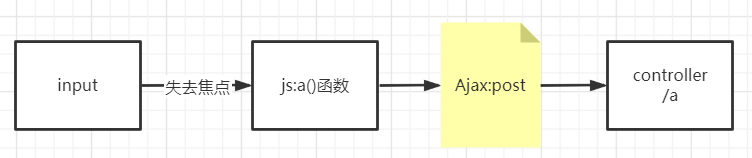

```javascript
jQuery.post({
    url: "${pageContext.request.contextPath}/a1",
    data: {"name": $("#username").val()},
    success: function (data) {
        alert(data);
    }
})
```

## 加载数据

```jsp
<%@ page contentType="text/html;charset=UTF-8" language="java" %>
<html>
<head>
    <title>Title</title>
    <script src="${pageContext.request.contextPath}/statics/jquery.js"></script>
    <script>
        $(function () {
            $("#btn").click(function () {
                $.post("${pageContext.request.contextPath}/a3", function (data) {
                    console.log(data);
                    var html = "";
                    for (let i = 0; i < data.length; i++) {
                        html += "<tr>" +
                            "<td>" + data[i].name + "</td>" +
                            "<td>" + data[i].age + "</td>" +
                            "</tr>"
                    }
                    $("#content").html(html);
                });
            })
        });
    </script>
</head>
<input type="button" value="加载数据" id="btn">
<body>
<table>
    <tr>
        <td>姓名</td>
        <td>年龄</td>
    </tr>
    <tbody id="content"></tbody>
</table>
</body>
</html>
```

```java
@RequestMapping("/a3")
public List<User> test03(){
    List<User> userList = new ArrayList<>();
    userList.add(new User("maokai1",5));
    userList.add(new User("maokai2",10));
    userList.add(new User("maokai3",15));
    return userList;
}
```

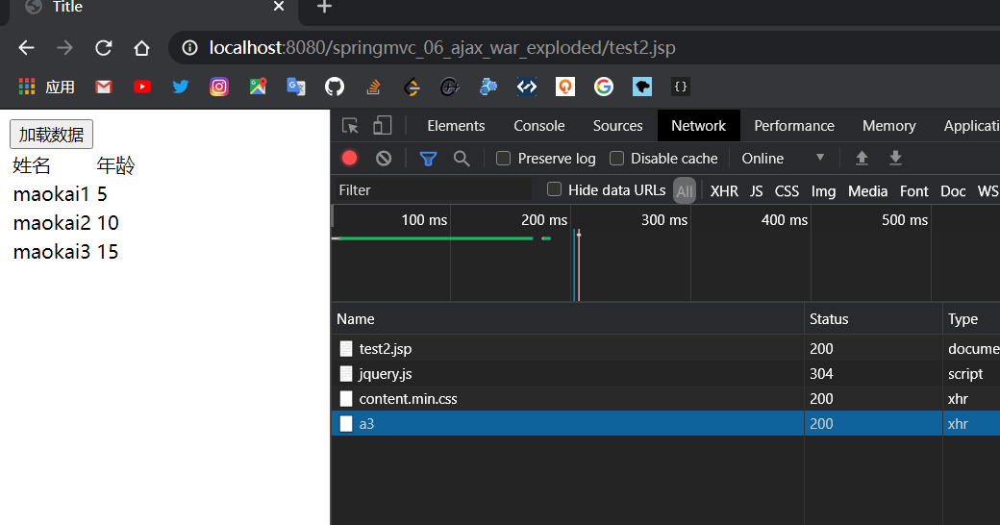

## 用户名验证

```jsp
<%@ page contentType="text/html;charset=UTF-8" language="java" %>
<html>
    <head>
        <title>Title</title>
        <script src="${pageContext.request.contextPath}/statics/jquery.js"></script>
        <script>
            function a1(){
                $.post({
                    url:"${pageContext.request.contextPath}/a4",
                    data:{"name":$("#name").val()},
                    success:function (data){
                        console.log(data);
                        if(data.toString()=='ok'){
                            $("#userInfo").css("color","green");
                        }else {
                            $("#userInfo").css("color","red");
                        }
                        $("#userInfo").html(data);
                    }
                })
            }
            function a2(){
                $.post({
                    url:"${pageContext.request.contextPath}/a4",
                    data:{"pwd":$("#pwd").val()},
                    success:function (data){
                        console.log(data);
                        if(data.toString()=='ok'){
                            $("#pwdInfo").css("color","green");
                        }else {
                            $("#pwdInfo").css("color","red");
                        }
                        $("#pwdInfo").html(data);
                    }
                })
            }
        </script>
    </head>
    <body>
        <p>
            用户名
            <input type="text" id="name" onblur="a1()">
            <span id="userInfo"></span>
        </p>
        <p>
            密码
            <input type="text" id="pwd" onblur="a2()">
            <span id="pwdInfo"></span>
        </p>
    </body>
</html>
```

```java
@RequestMapping("/a4")
public String test04(String name, String pwd) {
    String msg = "";
    if (name != null) {
        if ("admin".equals(name))
            msg = "ok";
        else {
            msg = "error";
        }
    }
    if (pwd != null) {
        if ("123456".equals(pwd))
            msg = "ok";
        else {
            msg = "error";
        }
    }
    return msg;
}
```

# Interceptor

SpringMVC的处理器拦截器类似于Servlet开发中的过滤器Filter，用于对处理器进行预处理和后处理

拦截器和过滤器的区别：

* 拦截器是AOP思想的具体应用
* 过滤器：
  * servlet规范中的一部分，任何 java web 工程都可以使用
  * 在 url-pattern 中配置了 /* 后，可以对所有要访问的资源进行拦截
* 拦截器：
  * 拦截器是SpringMVC框架自己的，只有使用了SpringMVC框架的工程才能使用
  * 拦截器只会拦截访问的控制器方法，如果访问的是 jsp/html/css/image/js 是不会进行拦截的

## 自定义拦截器

实现 HandlerInterceptor 接口

```java
package com.kai.config;

import org.springframework.web.servlet.HandlerInterceptor;
import org.springframework.web.servlet.ModelAndView;

import javax.servlet.http.HttpServletRequest;
import javax.servlet.http.HttpServletResponse;

public class MyInterceptor implements HandlerInterceptor {

    //return false : 阻止
    //return true : 放行
    @Override
    public boolean preHandle(HttpServletRequest request, HttpServletResponse response, Object handler) throws Exception {
        System.out.println("处理前");
        return true;
    }

    @Override
    public void postHandle(HttpServletRequest request, HttpServletResponse response, Object handler, ModelAndView modelAndView) throws Exception {
        System.out.println("处理后");
    }

    @Override
    public void afterCompletion(HttpServletRequest request, HttpServletResponse response, Object handler, Exception ex) throws Exception {
        System.out.println("清理");
    }
}
```

```java
@RestController
public class MyController {

    @GetMapping("/t1")
    public String test01(){
        System.out.println("MyController");
        return "ok";
    }
}j
```

```xml
<!--拦截器配置-->
<mvc:interceptors>
    <mvc:interceptor>
        <mvc:mapping path="/**"/>
        <bean class="com.kai.config.MyInterceptor"/>
    </mvc:interceptor>
</mvc:interceptors>
```

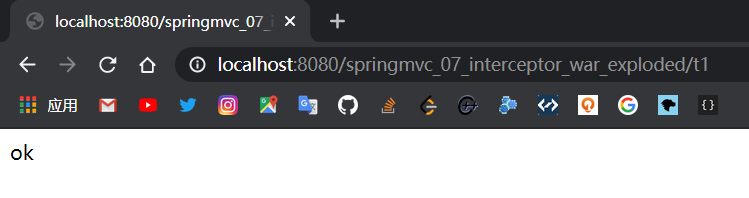

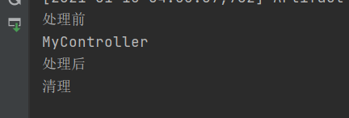

## 登录验证

```java
@Controller
public class LoginController {

    @RequestMapping("/login")
    public String tologin(){
        return "login";
    }
    @RequestMapping("/dologin")
    public String login(String username, String password, HttpSession session){
        //把用户的信息存在Session中
        session.setAttribute("userLoginInfo",username);
        return "redirect:/main";
    }
    @RequestMapping("/main")
    public String tomain(){
        return "main";
    }
    @RequestMapping("/logout")
    public String logout(HttpServletRequest request){
        request.getSession().removeAttribute("userLoginInfo");
        return "login";
    }
}
```

```java
@Override
public boolean preHandle(HttpServletRequest request, HttpServletResponse response, Object handler) throws Exception {
    if(request.getRequestURI().contains("login"))
        return true;
    if(request.getSession().getAttribute("userLoginInfo")!=null){
        return true;
    }
    response.sendRedirect(request.getContextPath()+"/login");
    return false;
}
```

# File

如果要使用Spring的文件上传功能，需要在上下文中配置MultipartResolver

前端表单要求：为了能上传文件，必须将表单的method设置为post，并将enctype设置为multipart/form-data。只有这样的情况下，浏览器才会把用户选择的文件以二进制数据发送给服务器：

对表单中的enctype属性详细说明：

* application/x-www=form-urlencoded：默认方式只处理表单域中的value属性值，采用这种编码方式的表单会将表单域中的值处理成URL编码方式
* mutipart/form-data：这种编码方式会以二进制流的方式来处理表单数据，这种编码方式会把文件域指定文件的内容也封装到请求参数中，不会对字符编码
* text/plain：除了把空格转换为"+"号外，其他字符都不做编码处理，这种方式适用直接通过表单发送邮件

```html
<form action="${pageContext.request.contextPath}/upload" enctype="multipart/form-data" method="post">
    <input type="file" name="file"/>
    <input type="submit" value="upload">
</form>
```

SpringMVC为文件上传提供了直接的支持，这种支持是用即插即用的MultipartResolver实现

SpringMVC 使用 Apache Commons FileUpload 技术实现了一个     MultipartResolver 实体类：CommonsMultipartResolver。SpringMVC 的文件上传还需要依赖 Apache Commons FileUpload 的组件

```xml
<!--文件上传-->
<dependency>
    <groupId>commons-fileupload</groupId>
    <artifactId>commons-fileupload</artifactId>
    <version>1.3.3</version>
</dependency>
<!--servlet-api导入高版本的-->
<dependency>
    <groupId>javax.servlet</groupId>
    <artifactId>javax.servlet-api</artifactId>
    <version>4.0.1</version>
</dependency>
```

## 文件上传

```xml
<!--文件上传-->
<dependency>
    <groupId>commons-fileupload</groupId>
    <artifactId>commons-fileupload</artifactId>
    <version>1.3.3</version>
</dependency>
<!--servlet-api导入高版本的-->
<dependency>
    <groupId>javax.servlet</groupId>
    <artifactId>javax.servlet-api</artifactId>
    <version>4.0.1</version>
</dependency>
```

spring.xml配置

```xml
<!--文件上传配置-->
<bean id="multipartResolver" class="org.springframework.web.multipart.commons.CommonsMultipartResolver">
    <!--请求的编码格式,必须和JSP的pageEncoding属性一致,以便正确读取表单的内容,默认为ISO-8859-1-->
    <property name="defaultEncoding" value="utf-8"/>
    <!--上传文件大小限制,单位为字节(10485760=10M)-->
    <property name="maxUploadSize" value="10485760"/>
    <property name="maxInMemorySize" value="40960"/>
</bean>
```

FileController.java

```java
//@RequestParam("file")将name=file控件得到的文件封装成CommonsMultipartFile对象
//批量上传CommonsMultipartFile则为数组即可
@RequestMapping("/upload")
public String fileUpload1(@RequestParam("file")CommonsMultipartFile file, HttpServletRequest request) throws IOException {
    //获取文件名:file.getOriginalFilename();
    String uploadFileName = file.getOriginalFilename();

    //如果文件名为空,直接返回首页
    if("".equals(uploadFileName)){
        return "redirect:/index.jsp";
    }
    System.out.println("filename:"+uploadFileName);

    //上传路径保存位置
    String path = request.getServletContext().getRealPath("/upload");
    //如果路径不存在则创建一个
    File realPath = new File(path);
    if(!realPath.exists()){
        realPath.mkdir();
    }
    System.out.println("filePath:"+realPath);

    //文件输入流
    InputStream is = file.getInputStream();
    //文件输出流
    OutputStream os = new FileOutputStream(new File(realPath, uploadFileName));

    //读取写出
    int len=0;
    byte[] buffer = new byte[1024];
    while((len=is.read(buffer))!=-1){
        os.write(buffer,0,len);
        os.flush();
    }
    os.close();
    is.close();
    return "redirect:/index.jsp";
}
```

```java
//采用file.TransferTo来保存上传的文件
@RequestMapping("/upload2")
public String fileUpload2(@RequestParam("file")CommonsMultipartFile file,HttpServletRequest request) throws IOException {
    
    //上传路径保存设置
    String path = request.getServletContext().getRealPath("/upload");
    File realPath = new File(path);
    if(!realPath.exists()){
        realPath.mkdir();
    }
    //上传文件地址
    System.out.println("uploadFilePath:"+realPath);
    //通过CommonsMultipartFile得方法直接写文件
    file.transferTo(new File(realPath+"/"+file.getOriginalFilename()));

    return "redirect:/index.jsp";
}
```

## 文件下载

设置response响应头

读取文件 InputStream

写文件	OutputStream

执行操作

关闭流,先开后关

```java
@RequestMapping("/download")
public String downLoads(HttpServletResponse response, HttpServletRequest request) throws Exception {
    //要下载图片的地址
    String path = request.getServletContext().getRealPath("/upload");
    String fileName = "hhxx.jpg";
    //设置response响应头
    response.reset();//设置页面不存在,清空buffer
    response.setCharacterEncoding("utf-8");//字符编码
    response.setContentType("multipart/form-data");
    //设置响应头
    response.setHeader("Content-Disposition",
            "attachment;fileName=" + URLEncoder.encode(fileName, "utf-8"));
    File file = new File(path, fileName);
    //读取文件输入流
    FileInputStream is = new FileInputStream(file);
    //写出文件输出流
    OutputStream out = response.getOutputStream();

    byte[] buff = new byte[1024];
    int index = 0;
    //执行写出操作
    while ((index = is.read(buff)) != -1) {
        out.write(buff, 0, index);
        out.flush();
    }
    out.close();
    is.close();
    return null;
}
```

