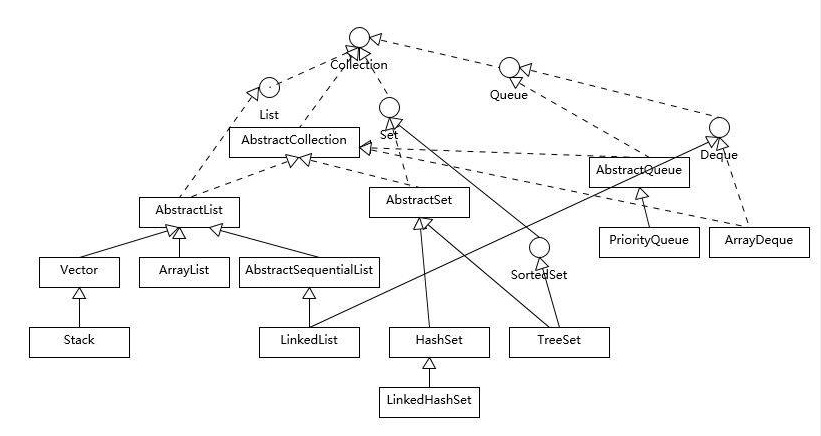

# Collection



List、Set、Queue 同一级别

 List 有序,可重复（存储顺序与添加顺序相同）

- ArrayList
  优点: 底层数据结构是数组，查询快，增删慢。
  缺点: 线程不安全，效率高
- Vector
  优点: 底层数据结构是数组，查询快，增删慢。
  缺点: 线程安全，效率低
- LinkedList
  优点: 底层数据结构是链表，查询慢，增删快。
  缺点: 线程不安全，效率高

Set 无序,唯一

- HashSet
  底层数据结构是哈希表。(无序,唯一)
  如何来保证元素唯一性?
  1.依赖两个方法：hashCode()和equals()
  
- LinkedHashSet
  底层数据结构是链表和哈希表。(FIFO插入有序,唯一)
  1.由链表保证元素有序
  2.由哈希表保证元素唯一
  
- TreeSet
  底层数据结构是红黑树。(唯一，有序)
  
  \1. 如何保证元素排序的呢?
  自然排序
  比较器排序
  2.如何保证元素唯一性的呢?
  根据比较的返回值是否是0来决定
  
  
  
  比较HashSet 、TreeSet 、LinkedHashSet

* HashSet使用哈希表实现的，元素是无序的。添加、删除操作时间复杂度都是O(1)。
* TreeSet内部结构是一个树结构(红黑树)，元素是有序的，添加、删除操作时间复杂度为O(log(n))，并且提供了first(), last(), headSet(), tailSet()等方法来处理有序集合。
* LinkedHashSet是介于HashSet 和 TreeSet之间，内部是一个双向链表结构，所以它的插入是有序的，时间复杂度是O(1)。

# 常用方法

| boolean add(E e)                          | 向集合添加元素e，若指定集合元素改变了则返回true              |
| ----------------------------------------- | ------------------------------------------------------------ |
| boolean addAll(Collection<? extends E> c) | 把集合C中的元素全部添加到集合中，若指定集合元素改变返回true  |
| void clear()                              | 清空所有集合元素                                             |
| boolean contains(Object o)                | 判断指定集合是否包含对象o                                    |
| boolean containsAll(Collection<?> c)      | 判断指定集合是否包含集合c的所有元素                          |
| boolean isEmpty()                         | 判断指定集合的元素size是否为0                                |
| boolean remove(Object o)                  | 删除集合中的元素对象o,若集合有多个o元素，则只会删除第一个元素 |
| boolean removeAll(Collection<?> c）       | 删除指定集合包含集合c的元素                                  |
| boolean retainAll(Collection<?> c)        | 从指定集合中保留包含集合c的元素,其他元素则删除               |
| int size()                                | 集合的元素个数                                               |
| T[] toArray(T[] a)                        | 将集合转换为T类型的数组                                      |

```java
@Test
public void testForeach() {
    Collection<String> collection = new ArrayList<>();
    collection.add("i");
    collection.add("love");
    collection.add("china");
    // foreach遍历
    collection.forEach(e-> System.out.println(e));
    // 可以使用方法引用简写
    collection.forEach(System.out::println);
    // 或者迭代器的forEachRemaining方法
    collection.iterator().forEachRemaining(System.out::println);
}

@Test
public void testPredicate() {
    Collection<Integer> collection = new ArrayList<>();
    // 添加0-49
    for (int i = 0; i < 50; i++) {
        collection.add(i);
    }
    // 移除10-49的数字
    collection.removeIf(e -> (e > 9 && e < 50));
    System.out.println(collection);// 输出[0, 1, 2, 3, 4, 5, 6, 7, 8, 9]
}

```

# Set

Set集合不允许包含相同的元素，如果试图把两个相同元素加入同一个Set集合中，则添加操作失败，add()方法返回false，且新元素不会被加入。

## HashSet

HashSet具有以下特点：

- 不能保证元素的排列顺序，顺序可能与添加顺序不同，顺序也可能发生变化；
- HashSet不是同步的；
- 集合元素值可以是null；

**重写hashCode方法和equals方法来判断两个元素是否相等，如果相等则覆盖原来的元素，依此来确保元素的唯一性**

```java
//判断判断两个对象是否相等，对象是否存在，对象的name和age是否相等
@Override
public boolean equals(Object o) {
    if (this == o) return true;
    if (o == null || getClass() != o.getClass()) return false;
    Student student = (Student) o;
    return age == student.age &&
        Objects.equals(name, student.name);
}

//返回对象的name和age的hash值
@Override
public int hashCode() {
    return Objects.hash(name, age);
}
```


**为什么不直接使用数组，而用HashSet呢？**

因为数组的索引是连续的而且数组的长度是固定的，无法自由增加数组的长度。而HashSet就不一样了，HashCode表用每个元素的hashCode值来计算其存储位置，从而可以自由增加HashCode的长度，并根据元素的hashCode值来访问元素。而不用一个个遍历索引去访问，这就是它比数组快的原因。

HashCode中每个存储元素的“槽位”通常称为“桶”，如果多个元素的hashCode值相同，但它们通过equals方法比较返回false，就需要在桶里放多个元素，这样会导致性能下降。

## LinkedHashSet

HashSet还有一个子类LinkedList、LinkedHashSet集合也是根据元素的hashCode值来决定元素的存储位置，但它同时使用**链表**维护元素的次序，这样使得元素看起来是以插入的**顺序保存**的，也就是说当遍历集合LinkedHashSet集合里的元素时，集合将会按元素的添加顺序来访问集合里的元素。

输出集合里的元素时，**元素顺序总是与添加顺序一致**。但是LinkedHashSet依然是HashSet，因此它不允许集合重复。

## TreeSet类

TreeSet是SortedSet接口的实现类，TreeSet可以确保集合元素处于排序状态。

TreeSet内部实现的是**红黑树**，默认整形排序为从小到大。

与HashSet集合相比，TreeSet还提供了几个额外方法：

- `Comparator comparator():`如果TreeSet采用了定制顺序，则该方法返回定制排序所使用的Comparator，如果TreeSet采用自然排序，则返回null；
- `Object first()`:返回集合中的第一个元素；
- `Object last():`返回集合中的最后一个元素；
- `Object lower(Object e)`：返回指定元素之前的元素。
- `Object higher(Object e)`：返回指定元素之后的元素。
- `SortedSet subSet（Object fromElement，Object toElement）：`返回此Set的子集合，含头不含尾；
- `SortedSet headSet(Object toElement)`：返回此Set的子集，由小于toElement的元素组成；
- `SortedSet tailSet(Object fromElement)`：返回此Set的子集，由大于fromElement的元素组成;

