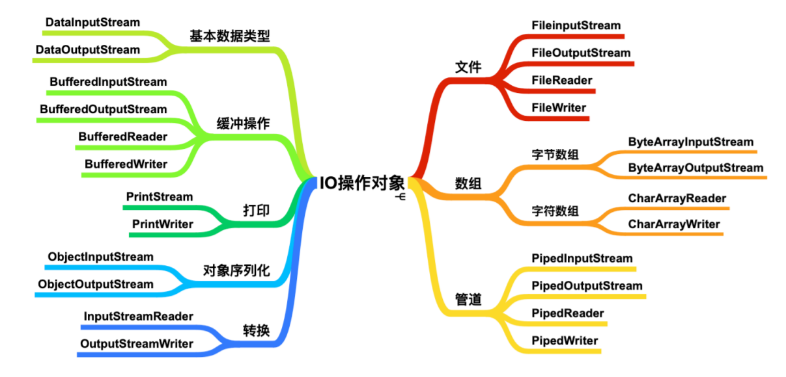

# IO流



字节流操作 byte 类型数据，主要操作类是 OutputStream、InputStream 的子类；不用缓冲区，直接对文件本身操作。 

字符流 操作字符类型数据，主要操作类是 Reader、Writer 的子类；使用缓冲区缓冲字符，不关闭流就不会输出任何内容。

# OutputStream

## 字节流写入的三种方式

```java
@Test
public void test01() throws IOException {

    // 字节流的三种写入方式
    FileOutputStream out = new FileOutputStream("C:\\study\\maven_java\\IOStream\\src\\main\\test01.txt");

    out.write(97);

    byte[] bytes = {99, 98, 97};
    out.write(bytes);

    byte[] bytes1 = "kkkkk".getBytes();
    out.write(bytes1);

    byte[] bytes2 = "77777".getBytes();
    out.write(bytes2,0, bytes2.length);

    for (int i = 0; i < 10; i++) {
        out.write("hello".getBytes());
        // 换行 Win:\r\n  linux:\n   max:\r
        out.write("\r\n".getBytes());
    }
    out.close();
}
```

## 追加写入

```java
@Test
public void test02() throws IOException {
    /**
     * 追加写入
     * FileOutputStream(String name, boolean append)
     * 创建文件输出流以指定的名称写入文件。
     * 如果第二个参数是true ，则字节将写入文件的末尾而不是开头。
     */
    FileOutputStream out = new FileOutputStream("C:\\study\\maven_java\\IOStream\\src\\main\\test02.txt",
                                                true);
    for (int i = 0; i < 10; i++) {
        // 追加写入
        out.write("world\r\n".getBytes());
    }
    out.close();
}
```

# InputStream

## 读取文件数据

```java
@Test
public void test01() throws IOException {

    FileInputStream in = new FileInputStream("C:\\study\\maven_java\\IOStream\\src\\main\\test01.txt");

    // 读取一个字节的数据,如果文件到达末尾,返回-1
    int read = in.read();
    System.out.println(read);
    int result = -1;
    while ((result = in.read()) != -1) {
        System.out.print((char)result);
    }
    in.close();
}

@Test
public void test04() throws IOException {
    File file = new File("test02.txt");
    FileInputStream in = new FileInputStream(file);
    byte[] bytes = new byte[1024];
    // 读取一个字节数组的数据
    // len为实际读取的长度
    // read读到末尾返回-1
    int len;
    while ((len = in.read(bytes)) != -1) {
        System.out.println(new String(bytes, 0, len));
    }
    in.close();
}
```

## 复制文本

```java
@Test
public void test02() throws IOException {
    File file1 = new File("test01.txt");
    File file2 = new File("test03.txt");
    FileInputStream in = new FileInputStream(file1);
    FileOutputStream out = new FileOutputStream(file2, true);

    int result = -1;
    while ((result = in.read()) != -1) {
        out.write(result);
    }

    out.close();
    in.close();
}
```

## 复制图片

