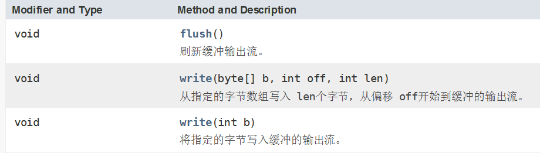
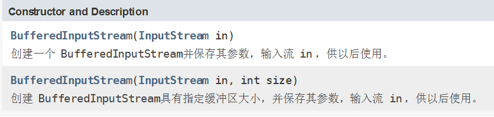
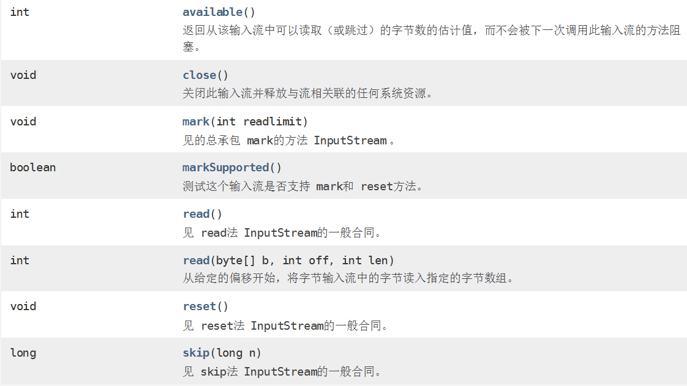
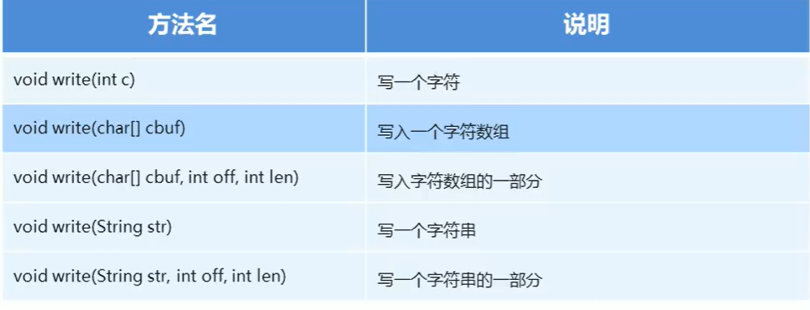
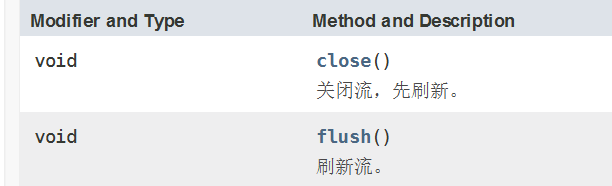
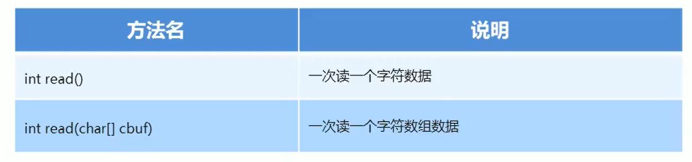

# IO流


字节流操作 byte 类型数据，主要操作类是 OutputStream、InputStream 的子类；不用缓冲区，直接对文件本身操作。 

字符流 操作字符类型数据，主要操作类是 Reader、Writer 的子类；使用缓冲区缓冲字符，不关闭流就不会输出任何内容。

# 文件流

## FileOutputStream

> 字节流写入的三种方式

```java
@Test
public void test01() throws IOException {

    // 字节流的三种写入方式
    FileOutputStream out = new FileOutputStream("C:\\study\\maven_java\\IOStream\\src\\main\\test01.txt");

    out.write(97);

    byte[] bytes = {99, 98, 97};
    out.write(bytes);

    byte[] bytes1 = "kkkkk".getBytes();
    out.write(bytes1);

    byte[] bytes2 = "77777".getBytes();
    out.write(bytes2,0, bytes2.length);

    for (int i = 0; i < 10; i++) {
        out.write("hello".getBytes());
        // 换行 Win:\r\n  linux:\n   max:\r
        out.write("\r\n".getBytes());
    }
    out.close();
}
```

> 追加写入

```java
@Test
public void test02() throws IOException {
    /**
     * 追加写入
     * FileOutputStream(String name, boolean append)
     * 创建文件输出流以指定的名称写入文件。
     * 如果第二个参数是true ，则字节将写入文件的末尾而不是开头。
     */
    FileOutputStream out = new FileOutputStream("C:\\study\\maven_java\\IOStream\\src\\main\\test02.txt",
                                                true);
    for (int i = 0; i < 10; i++) {
        // 追加写入
        out.write("world\r\n".getBytes());
    }
    out.close();
}
```

## FileInputStream

> 读取文件数据

```java
@Test
public void test01() throws IOException {

    FileInputStream in = new FileInputStream("C:\\study\\maven_java\\IOStream\\src\\main\\test01.txt");

    // 读取一个字节的数据,如果文件到达末尾,返回-1
    int read = in.read();
    System.out.println(read);
    int result = -1;
    while ((result = in.read()) != -1) {
        System.out.print((char)result);
    }
    in.close();
}

@Test
public void test04() throws IOException {
    File file = new File("test02.txt");
    FileInputStream in = new FileInputStream(file);
    byte[] bytes = new byte[1024];
    // 读取一个字节数组的数据
    // len为实际读取的长度
    // read读到末尾返回-1
    int len;
    while ((len = in.read(bytes)) != -1) {
        System.out.println(new String(bytes, 0, len));
    }
    in.close();
}
```

> 复制文本

```java
@Test
public void test02() throws IOException {
    File file1 = new File("test01.txt");
    File file2 = new File("test03.txt");
    FileInputStream in = new FileInputStream(file1);
    FileOutputStream out = new FileOutputStream(file2, true);

    int result = -1;
    while ((result = in.read()) != -1) {
        out.write(result);
    }

    out.close();
    in.close();
}
```

> 复制图片

```java
public class CopyImage {

    public static void main(String[] args){
        File file1 = new File("hhxx.jpg");
        File file2 = new File("hello.jpg");
        FileInputStream inputStream = new FileInputStream(file1);
        FileOutputStream outputStream = new FileOutputStream(file2,true);
        byte[] bytes = new byte[1024];
        int len;
        while ((len=inputStream.read(bytes))!=-1){
            outputStream.write(bytes,0,len);
        }
        outputStream.close();
        inputStream.close();
    }
}
```

## 缓冲流

字节缓冲流仅仅是提供了缓冲区，而真正的读写数据还得依靠基本的字节流对象进行操作

> BufferedOutputStream

- 该类实现缓冲输出流。  通过设置这样的输出流，应用程序可以向底层输出流写入字节，而不必为写入的每个字节导致底层系统的调用。 

- `BufferedOutputStream(OutputStream out)`  创建一个新的缓冲输出流，以将数据写入指定的底层输出流。
- `BufferedOutputStream(OutputStream out, int size)`  创建一个新的缓冲输出流，以便以指定的缓冲区大小将数据写入指定的底层输出流。 



```java
public BufferedOutputStream(OutputStream out) {
    this(out, 8192);
}
public BufferedOutputStream(OutputStream out, int size) {
    super(out);
    if (size <= 0) {
        throw new IllegalArgumentException("Buffer size <= 0");
    }
    buf = new byte[size]; // 内部缓冲区，默认8192
}
```

> BufferedInputStream

- `BufferedInputStream`为另一个输入流添加了功能，即缓冲输入和支持`mark`和`reset`方法的功能。  当创建`BufferedInputStream`时，将创建一个内部缓冲区数组。  当从流中读取或跳过字节时，内部缓冲区将根据需要从所包含的输入流中重新填充，一次有多个字节。  `mark`操作会记住输入流中的一点，并且`reset`操作会导致从最近的`mark`操作之后读取的所有字节在从包含的输入流中取出新的字节之前重新读取。 



```java
public BufferedInputStream(InputStream in) {
    this(in, DEFAULT_BUFFER_SIZE);
}
public BufferedInputStream(InputStream in, int size) {
    super(in);
    if (size <= 0) {
        throw new IllegalArgumentException("Buffer size <= 0");
    }
    buf = new byte[size]; // 内部缓冲区，默认8192
}
```



> test

```java
public class BufferStreamTest {

    public static void main(String[] args) throws IOException {
        File file = new File("test04.txt");
        FileOutputStream outputStream = new FileOutputStream(file, true);
        BufferedOutputStream out = new BufferedOutputStream(outputStream);

        // 写数据
        out.write("hello\r\n".getBytes());
        out.write("world\r\n".getBytes());

        out.close();

        BufferedInputStream in = new BufferedInputStream(new FileInputStream(file));
        int len1;
        while ((len1=in.read())!=-1){
            System.out.print((char)len1);
        }
        int len2;
        byte[] bytes = new byte[1024];
        while ((len2 = in.read(bytes)) != -1) {
            System.out.print(new String(bytes, 0, len2));
        }

        in.close();
    }

}
```

## 读写方式比较

```java
// 基本字节流一次读写一个字节
public static void method1() throws IOException {
    FileInputStream in = new FileInputStream("");
    FileOutputStream out = new FileOutputStream("",true);
    int by;
    while ((by=in.read())!=-1){
        out.write(by);
    }
    out.close();
    in.close();
}
// 基本字节流一次读写一个字节数组
public static void method2() throws IOException {
    FileInputStream in = new FileInputStream("");
    FileOutputStream out = new FileOutputStream("",true);
    int len;
    byte[] bytes = new byte[1024];
    while ((len=in.read(bytes))!=-1){
        out.write(bytes,0,len);
    }
    out.close();
    in.close();
}
// 字节缓冲流一个读写一个字节
public static void method3() throws IOException{
    BufferedInputStream bufferIn = new BufferedInputStream(new FileInputStream(""));
    BufferedOutputStream bufferOut = new BufferedOutputStream(new FileOutputStream("", true));
    int by;
    while ((by=bufferIn.read())!=-1){
        bufferOut.write(by);
    }
    bufferOut.close();
    bufferIn.close();
}
// 字节缓冲流一次读写一个字节数组
public static void method4() throws IOException{
    BufferedInputStream bufferIn = new BufferedInputStream(new FileInputStream(""));
    BufferedOutputStream bufferOut = new BufferedOutputStream(new FileOutputStream("", true));
    int len;
    byte[] bytes = new byte[1024];
    while ((len=bufferIn.read(bytes))!=-1){
        bufferOut.write(bytes,0,len);
    }
    bufferOut.close();
    bufferIn.close();
}
// 速度：4 > 2 > 3 >> 1
```

# 字符流

一个汉字，如果是GBK编码，占用2个字节，如果是UTF-8，占用3个字节

汉字存储第一个字节是负数

字符流= 字节流 + 编码表

```java
public static void main(String[] args) {
    String s="你好";
    // 编码
    byte[] bytes = s.getBytes(StandardCharsets.UTF_8);
    System.out.println(bytes);
    System.out.println(Arrays.toString(bytes));
    // 解码
    String s1 = new String(bytes);
    System.out.println(s1);
}
```

## 字符字节转换

```java
public static void main(String[] args) throws IOException {
    File file = new File("test05.txt");
    FileOutputStream out = new FileOutputStream(file,true);
    OutputStreamWriter osw = new OutputStreamWriter(out);
    osw.write("你好");
    osw.close();

    InputStreamReader isr = new InputStreamReader(new FileInputStream(file));
    int ch;
    while ((ch=isr.read())!=-1){
        System.out.print((char)ch);
    }
    isr.close();
}
```

InputStreamReader：从字节流到字符流的转换

OutputStreamWriter：从字符流到字节流的转换

## 读写数据

写数据的五种方式



字符流需要进行刷新流才能将数据写入文件



读数据的两种方式



```java
public static void main(String[] args) throws IOException {

    File file = new File("test05.txt");
    OutputStreamWriter osw = new OutputStreamWriter(new FileOutputStream(file,true));
    osw.write("hello");
    osw.flush();

    InputStreamReader isr = new InputStreamReader(new FileInputStream(file));
    char[] chars = new char[1024];
    int len=0;
    while ((len=isr.read(chars))!=-1){
        System.out.println(new String(chars,0,len));
    }

    isr.close();
    osw.close();
}
```

便捷类：FileReader 和 FileWriter

缓冲区类：BufferedReader，BufferedWriter
