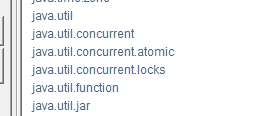
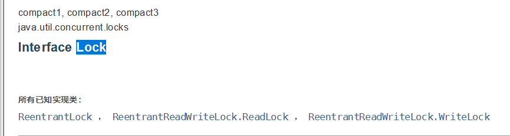
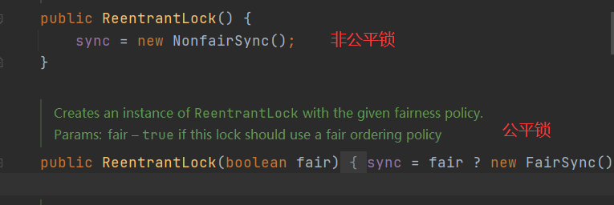
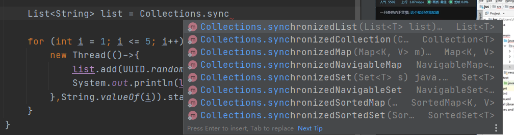
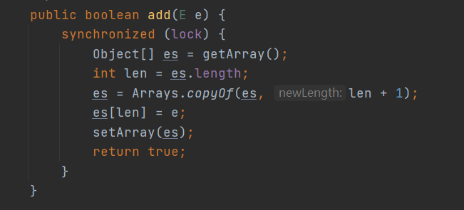
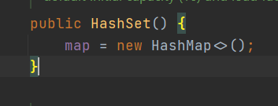
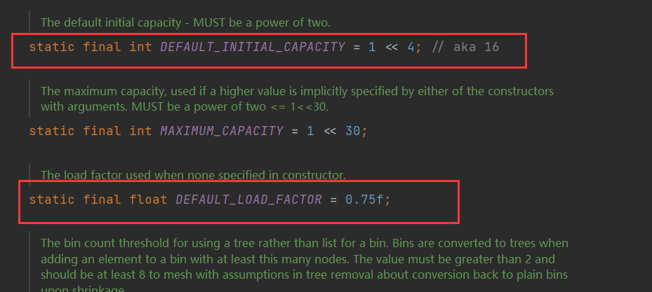

JUC是java.util下的三个包

# 线程和进程

Java默认有2个线程,main和GC

Java三种开启线程的方式:Thread,Runnable,Callable

Java实际上是调用C++开启线程

并发：多线程操作同一个资源，交替进行

并行：同时进行

```java
// 获取cpu的核数
Runtime.getRuntime().availableProcessors()
```

线程的状态：

```java
public enum State {
    // 新生
    NEW,
    // 运行
    RUNNABLE,
    // 阻塞
    BLOCKED,
    // 等待
    WAITING,
    // 超时等待
    TIMED_WAITING,
    // 中止
    TERMINATED;
}
```

wait和sleep区别：

* wait来自Object类，sleep是Thread类
* wait会释放锁，sleep不会
* 使用的范围不同，sleep可以在任何地方调用，而wait必须在同步代码块中

# Lock锁

## Synchronized

```java
public class SaleTicketDemo01 {
    public static void main(String[] args) {

        Ticket ticket = new Ticket();

        // 多线程
        new Thread(()->{
            for (int i = 0; i < 50; i++) {
                ticket.sale();
            }
        },"A").start();
        new Thread(()->{
            for (int i = 0; i < 50; i++) {
                ticket.sale();
            }
        },"B").start();
        new Thread(()->{
            for (int i = 0; i < 50; i++) {
                ticket.sale();
            }
        },"C").start();

    }
}

// 资源类
class Ticket {

    private int number=50;
    public synchronized void sale(){
        if(number>0){ System.out.println(Thread.currentThread().getName());
                     System.out.println(number--);
                    }
    }
}
```

## Lock





默认非公平锁

```java
class Ticket2 {

    Lock lock = new ReentrantLock(); // 可重入锁

    private int number = 50;

    public synchronized void sale() {
        lock.lock(); // 加锁
        try {
            // 业务代码
            if (number > 0) {
                System.out.println(Thread.currentThread().getName());
                System.out.println(number--);
            }
        } catch (Exception e) {
            e.printStackTrace();
        } finally {
            lock.unlock(); // 解锁
        }
    }
}
```

Synchronized和Lock的区别：

* Synchronized 是内置的Java关键字，而 Lock 是一个Java接口
* Synchronized 无法判断获取锁的状态，而 Lock 可以判断是否取到锁
* Synchronized 会自动释放锁，而 Lock 必须要手动释放锁，否则发发生死锁
* Synchronized 线程容易发生阻塞，而 Lock 不一定会一直等待
* Synchronized 是可重入锁，Lock 可重入锁，可以判断锁，可以设置公平锁
* Synchronized 适合锁少量的代码同步问题，Lock 锁适合锁大量的同步代码

# 生产者消费者

## Synchronized

```java
public class ProducerConsumerDemo01 {
    public static void main(String[] args) {

        test test = new test();
        new Thread(()->{
            for (int i = 0; i < 10; i++) {
                try {
                    test.increment();
                } catch (InterruptedException e) {
                    e.printStackTrace();
                }
            }
        },"A").start();
        new Thread(()->{
            for (int i = 0; i < 10; i++) {
                try {
                    test.decrement();
                } catch (InterruptedException e) {
                    e.printStackTrace();
                }
            }
        },"B").start();
        new Thread(()->{
            for (int i = 0; i < 10; i++) {
                try {
                    test.increment();
                } catch (InterruptedException e) {
                    e.printStackTrace();
                }
            }
        },"C").start();
        new Thread(()->{
            for (int i = 0; i < 10; i++) {
                try {
                    test.decrement();
                } catch (InterruptedException e) {
                    e.printStackTrace();
                }
            }
        },"D").start();

    }

}

class test{
    private int number=0;

    public synchronized void increment() throws InterruptedException {
        while (number!=0){
            this.wait();
        }
        number++;
        System.out.println(Thread.currentThread().getName()+"===>"+number);
        this.notifyAll();
    }
    public synchronized void decrement() throws InterruptedException {
        while (number==0){
            this.wait();
        }
        number--;
        System.out.println(Thread.currentThread().getName()+"===>"+number);
        this.notifyAll();
    }
}
```

判断等待条件时，应该使用循环而不是if，避免出现虚假唤醒

## Lock

```java
class test2 {

    private int number;
    private Lock lock;
    private Condition lockWait;

    public test2() {
        number = 0;
        lock = new ReentrantLock();
        lockWait = lock.newCondition();
    }


    public void increment() throws InterruptedException {
        lock.lock();
        try {
            while (number != 0) {
                lockWait.await();
            }
            number++;
            System.out.println(Thread.currentThread().getName() + "===>" + number);
            lockWait.signalAll();
        } catch (InterruptedException e) {
            e.printStackTrace();
        } finally {
            lock.unlock();
        }
    }

    public void decrement() throws InterruptedException {
        lock.lock();
        try {
            while (number == 0) {
                lockWait.await();
            }
            number--;
            System.out.println(Thread.currentThread().getName() + "===>" + number);
            lockWait.signalAll();
        } catch (InterruptedException e) {
            e.printStackTrace();
        } finally {
            lock.unlock();
        }
    }
}
```

>newCondition 可以精准通知线程

```java
class test3 {

    private Lock lock;
    private Condition lockWait1;
    private Condition lockWait2;

    public test3() {
        lock = new ReentrantLock();
        lockWait1 = lock.newCondition();
        lockWait2 = lock.newCondition();
    }

    public void testA() throws InterruptedException {
        Thread.sleep(1000);
        lock.lock();
        try {
            System.out.println("A");
            lockWait2.signal();
        } finally {
            lock.unlock();
        }
    }

    public void testB() throws InterruptedException {
        lock.lock();
        try {
            System.out.println("B waiting");
            lockWait1.await();
            System.out.println("B");
        } finally {
            lock.unlock();
        }
    }

    public void testC() throws InterruptedException {
        lock.lock();
        try {
            System.out.println("C waiting");
            lockWait2.await();
            System.out.println("C");
            lockWait1.signal();
        } finally {
            lock.unlock();
        }
    }
}
```

* `await`必须在对应的`signal`前调用，否则出现异常，`await`会释放锁让其他线程抢锁

* 若`signal`没有找到对应的`awit`方法，会抛出`IllegalMonitorStateException`

## 对象锁和类锁

理解对象锁和类锁

* 多个线程使用同一把锁（同一个对象），先调用的线程先执行
* 多个线程使用同一把锁，即使其中一个线程中有阻塞，还是顺序执行
* 多个线程有的有锁（同一个），有的没锁，有锁的线程按顺序执行，无锁的与有锁的不存在竞争关系，与有锁的线程随机执行
* 多个线程使用不同的锁（不同的对象），随机执行
* 被 synchronized 和 static 同时修饰的方法，锁的对象是类的 class 对象，是唯一的一把锁。线程之间是顺序执行。
* Class锁是唯一的，多个对象使用的也是同一个Class锁。
* 只被 synchronized 修饰的方法，是普通锁（如对象锁），不是Class锁，所以进程之间执行顺序互不干扰。
* 多个线程使用多个对象（不同的对象锁），随机执行

# 集合类不安全

并发修改异常：ConcurrentMoificationException

## List

ArrayList是线程不安全的

* 可以使用vector（底层为synchronized）
* Collections工具类下有线程安全的List



* JUC包下定义了线程安全的集合


```java
List<String> list = new ArrayList<>(); //线程不安全
List<String> list1 = new Vector<>();
List<String> list2 = Collections.synchronizedList(new ArrayList<>());
List<String> list3 = new CopyOnWriteArrayList<>();
```

CopeOnWrite：写入时复制，简称COW，是计算机设计领域的一种优化策略，有多个线程调用时，读取时是固定的，而写入时复制一份，在写入时避免覆盖

CopyOnWriteArrayList：只要使用了synchronized 方法，效率都比较低，而 CopeOnWrite 底层使用 Lock 锁，效率更高



## Set

> CopyOnWriteArraySet

```java
public static void main(String[] args) {
    Set<String> hashSet = new CopyOnWriteArraySet<>();
    for (int i = 1; i <= 10; i++) {
        new Thread(()->{
            hashSet.add(UUID.randomUUID().toString().substring(0,6));
            System.out.println(hashSet);
        },String.valueOf(i)).start();
    }
}
```

> HashSet 底层为 HashMap



```java
// set的本质为map，key无法重复
public boolean add(E e) {
    return map.put(e, PRESENT)==null;
}
```

## Map



默认加载因子0.75，处死化容量为16

> ConcurrentHashMap

```java
// Map<String,String> map=new HashMap<>();
Map<String,String> map1=new ConcurrentHashMap<>();
for (int i = 0; i < 10; i++) {
    new Thread(()->{
        map1.put(Thread.currentThread().getName(), UUID.randomUUID().toString().substring(0,5));
        System.out.println(map1);
    },String.valueOf(i)).start();
}
```