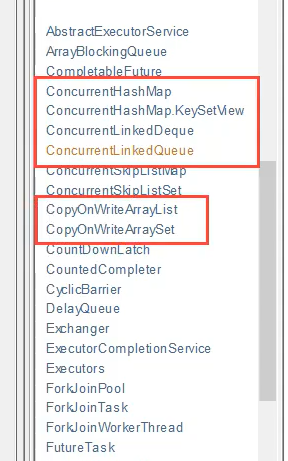
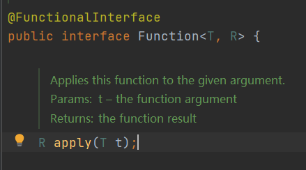

JUC是java.util下的三个包

# 线程和进程

Java默认有2个线程,main和GC

Java三种开启线程的方式:Thread,Runnable,Callable

Java实际上是调用C++开启线程

并发：多线程操作同一个资源，交替进行

并行：同时进行

```java
// 获取cpu的核数
Runtime.getRuntime().availableProcessors()
```

线程的状态：

```java
public enum State {
    // 新生
    NEW,
    // 运行
    RUNNABLE,
    // 阻塞
    BLOCKED,
    // 等待
    WAITING,
    // 超时等待
    TIMED_WAITING,
    // 中止
    TERMINATED;
}
```

wait和sleep区别：

* wait来自Object类，sleep是Thread类
* wait会释放锁，sleep不会
* 使用的范围不同，sleep可以在任何地方调用，而wait必须在同步代码块中

> 进程

进程就是用程序在内存中分配的空间，也就是正在运行的程序，各个进程之间互不干扰，同时进程保存着程序每个时刻运行的状态

> 线程

线程：让一个线程执行一个子任务，这样一个进程就包含了多个线程，每个线程负责一个单独的子任务

进程让操作系统的并发性成为了可能，而线程让进程的内部并发成为了可能

> 多进程的⽅式也可以实现并发，为什么我们要使⽤多线程？

进程间的通信⽐较复杂，⽽线程间的通信⽐较简单，通常情况下，我们需要使 ⽤共享资源，这些资源在线程间的通信⽐较容易。 

进程是重量级的，⽽线程是轻量级的，故多线程⽅式的系统开销更⼩。

> 进程和线程的区别

进程是⼀个独⽴的运⾏环境，⽽线程是在进程中执⾏的⼀个任务。他们两个本质的 区别是是否单独占有内存地址空间及其它系统资源（⽐如I/O）：

* 进程单独占有⼀定的内存地址空间，所以进程间存在内存隔离，数据是分开 的，数据共享复杂但是同步简单，各个进程之间互不⼲扰；⽽线程共享所属进 程占有的内存地址空间和资源，数据共享简单，但是同步复杂。
* 进程单独占有⼀定的内存地址空间，⼀个进程出现问题不会影响其他进程，不 影响主程序的稳定性，可靠性⾼；⼀个线程崩溃可能影响整个程序的稳定性， 可靠性较低。
* 进程单独占有⼀定的内存地址空间，进程的创建和销毁不仅需要保存寄存器和栈信息，还需要资源的分配回收以及⻚调度，开销较⼤；线程只需要保存寄存 器和栈信息，开销较⼩。
* 另外⼀个重要区别是，进程是操作系统进⾏资源分配的基本单位，⽽线程是操作系统进⾏调度的基本单位，即CPU分配时间的单位 。

# Lock锁

## Synchronized

```java
public class SaleTicketDemo01 {
    public static void main(String[] args) {

        Ticket ticket = new Ticket();

        // 多线程
        new Thread(()->{
            for (int i = 0; i < 50; i++) {
                ticket.sale();
            }
        },"A").start();
        new Thread(()->{
            for (int i = 0; i < 50; i++) {
                ticket.sale();
            }
        },"B").start();
        new Thread(()->{
            for (int i = 0; i < 50; i++) {
                ticket.sale();
            }
        },"C").start();

    }
}

// 资源类
class Ticket {

    private int number=50;
    public synchronized void sale(){
        if(number>0){ System.out.println(Thread.currentThread().getName());
                     System.out.println(number--);
                    }
    }
}
```

## Lock


默认非公平锁

```java
class Ticket2 {

    Lock lock = new ReentrantLock(); // 可重入锁

    private int number = 50;

    public synchronized void sale() {
        lock.lock(); // 加锁
        try {
            // 业务代码
            if (number > 0) {
                System.out.println(Thread.currentThread().getName());
                System.out.println(number--);
            }
        } catch (Exception e) {
            e.printStackTrace();
        } finally {
            lock.unlock(); // 解锁
        }
    }
}
```

Synchronized和Lock的区别：

* Synchronized 是内置的Java关键字，而 Lock 是一个Java接口
* Synchronized 无法判断获取锁的状态，而 Lock 可以判断是否取到锁
* Synchronized 会自动释放锁，而 Lock 必须要手动释放锁，否则发发生死锁
* Synchronized 线程容易发生阻塞，而 Lock 不一定会一直等待
* Synchronized 是可重入锁，Lock 可重入锁，可以判断锁，可以设置公平锁
* Synchronized 适合锁少量的代码同步问题，Lock 锁适合锁大量的同步代码

# 生产者消费者

## Synchronized

```java
public class ProducerConsumerDemo01 {
    public static void main(String[] args) {

        test test = new test();
        new Thread(()->{
            for (int i = 0; i < 10; i++) {
                try {
                    test.increment();
                } catch (InterruptedException e) {
                    e.printStackTrace();
                }
            }
        },"A").start();
        new Thread(()->{
            for (int i = 0; i < 10; i++) {
                try {
                    test.decrement();
                } catch (InterruptedException e) {
                    e.printStackTrace();
                }
            }
        },"B").start();
        new Thread(()->{
            for (int i = 0; i < 10; i++) {
                try {
                    test.increment();
                } catch (InterruptedException e) {
                    e.printStackTrace();
                }
            }
        },"C").start();
        new Thread(()->{
            for (int i = 0; i < 10; i++) {
                try {
                    test.decrement();
                } catch (InterruptedException e) {
                    e.printStackTrace();
                }
            }
        },"D").start();

    }

}

class test{
    private int number=0;

    public synchronized void increment() throws InterruptedException {
        while (number!=0){
            this.wait();
        }
        number++;
        System.out.println(Thread.currentThread().getName()+"===>"+number);
        this.notifyAll();
    }
    public synchronized void decrement() throws InterruptedException {
        while (number==0){
            this.wait();
        }
        number--;
        System.out.println(Thread.currentThread().getName()+"===>"+number);
        this.notifyAll();
    }
}
```

判断等待条件时，应该使用循环而不是if，避免出现虚假唤醒

## Lock

```java
class test2 {

    private int number;
    private Lock lock;
    private Condition lockWait;

    public test2() {
        number = 0;
        lock = new ReentrantLock();
        lockWait = lock.newCondition();
    }


    public void increment() throws InterruptedException {
        lock.lock();
        try {
            while (number != 0) {
                lockWait.await();
            }
            number++;
            System.out.println(Thread.currentThread().getName() + "===>" + number);
            lockWait.signalAll();
        } catch (InterruptedException e) {
            e.printStackTrace();
        } finally {
            lock.unlock();
        }
    }

    public void decrement() throws InterruptedException {
        lock.lock();
        try {
            while (number == 0) {
                lockWait.await();
            }
            number--;
            System.out.println(Thread.currentThread().getName() + "===>" + number);
            lockWait.signalAll();
        } catch (InterruptedException e) {
            e.printStackTrace();
        } finally {
            lock.unlock();
        }
    }
}
```

>newCondition 可以精准通知线程

```java
class test3 {

    private Lock lock;
    private Condition lockWait1;
    private Condition lockWait2;

    public test3() {
        lock = new ReentrantLock();
        lockWait1 = lock.newCondition();
        lockWait2 = lock.newCondition();
    }

    public void testA() throws InterruptedException {
        Thread.sleep(1000);
        lock.lock();
        try {
            System.out.println("A");
            lockWait2.signal();
        } finally {
            lock.unlock();
        }
    }

    public void testB() throws InterruptedException {
        lock.lock();
        try {
            System.out.println("B waiting");
            lockWait1.await();
            System.out.println("B");
        } finally {
            lock.unlock();
        }
    }

    public void testC() throws InterruptedException {
        lock.lock();
        try {
            System.out.println("C waiting");
            lockWait2.await();
            System.out.println("C");
            lockWait1.signal();
        } finally {
            lock.unlock();
        }
    }
}
```

* `await`必须在对应的`signal`前调用，否则出现异常，`await`会释放锁让其他线程抢锁

* 若`signal`没有找到对应的`awit`方法，会抛出`IllegalMonitorStateException`

## 对象锁和类锁

理解对象锁和类锁

* 多个线程使用同一把锁（同一个对象），先调用的线程先执行
* 多个线程使用同一把锁，即使其中一个线程中有阻塞，还是顺序执行
* 多个线程有的有锁（同一个），有的没锁，有锁的线程按顺序执行，无锁的与有锁的不存在竞争关系，与有锁的线程随机执行
* 多个线程使用不同的锁（不同的对象），随机执行
* 被 synchronized 和 static 同时修饰的方法，锁的对象是类的 class 对象，是唯一的一把锁。线程之间是顺序执行。
* Class锁是唯一的，多个对象使用的也是同一个Class锁。
* 只被 synchronized 修饰的方法，是普通锁（如对象锁），不是Class锁，所以进程之间执行顺序互不干扰。
* 多个线程使用多个对象（不同的对象锁），随机执行

# 集合类不安全

并发修改异常：ConcurrentMoificationException

## List

ArrayList是线程不安全的

* 可以使用vector（底层为synchronized）
* Collections工具类下有线程安全的List


* JUC包下定义了线程安全的集合



```java
List<String> list = new ArrayList<>(); //线程不安全
List<String> list1 = new Vector<>();
List<String> list2 = Collections.synchronizedList(new ArrayList<>());
List<String> list3 = new CopyOnWriteArrayList<>();
```

CopeOnWrite：写入时复制，简称COW，是计算机设计领域的一种优化策略，有多个线程调用时，读取时是固定的，而写入时复制一份，在写入时避免覆盖

CopyOnWriteArrayList：只要使用了synchronized 方法，效率都比较低，而 CopeOnWrite 底层使用 Lock 锁，效率更高


## Set

> CopyOnWriteArraySet

```java
public static void main(String[] args) {
    Set<String> hashSet = new CopyOnWriteArraySet<>();
    for (int i = 1; i <= 10; i++) {
        new Thread(()->{
            hashSet.add(UUID.randomUUID().toString().substring(0,6));
            System.out.println(hashSet);
        },String.valueOf(i)).start();
    }
}
```

> HashSet 底层为 HashMap


```java
// set的本质为map，key无法重复
public boolean add(E e) {
    return map.put(e, PRESENT)==null;
}
```

## Map


默认加载因子0.75，处死化容量为16

> ConcurrentHashMap

```java
// Map<String,String> map=new HashMap<>();
Map<String,String> map1=new ConcurrentHashMap<>();
for (int i = 0; i < 10; i++) {
    new Thread(()->{
        map1.put(Thread.currentThread().getName(), UUID.randomUUID().toString().substring(0,5));
        System.out.println(map1);
    },String.valueOf(i)).start();
}
```

# Callable等

## Thread和Runnable

继承 Thread 类，并重写 run ⽅法； 

实现 Runnable 接⼝的 run ⽅法；

Thread和Runnable的比较：

* 由于Java“单继承，多实现”的特性，Runnable接⼝使⽤起来⽐Thread更灵活。
* Runnable接⼝出现更符合⾯向对象，将线程单独进⾏对象的封装。
* Runnable接⼝出现，降低了线程对象和线程任务的耦合性。
* 如果使⽤线程时不需要使⽤Thread类的诸多⽅法，显然使⽤Runnable接⼝更为轻量。

## Callable


* 可以有返回值
* 可以抛出异常
* 方法不同,call()方法

```java
@FunctionalInterface
public interface Callable<V> {
 V call() throws Exception;
}
```

```java
public class CallableTest {

    public static void main(String[] args){

        // Callable ⼀般是配合线程池⼯具 ExecutorService 来使⽤的
        ExecutorService executorService = Executors.newCachedThreadPool();
        MyThread myThread = new MyThread();
        // ExecutorService 执行submit方法调用线程并返回一个Future
        Future<String> result = executorService.submit(myThread);
        // Future执行get方法可以得到线程的返回值,会阻塞
        System.out.println(result.get());
    }
}

class MyThread implements Callable<String> {

    @Override
    public String call() throws Exception {
        System.out.println("hello");
        return "hello,Callable";
    }
}
```

## Future

```java
public abstract interface Future<V> {
    // 试图取消一个线程
    public abstract boolean cancel(boolean paramBoolean);
    public abstract boolean isCancelled();
    public abstract boolean isDone();
    // 得到线程的返回结果，会阻塞
    public abstract V get();
    // 得到线程的返回结果，设置超时时间
    public abstract V get(long paramLong, TimeUnit paramTimeUnit);
}
```

## FutureTask

FutureTask 是 Future 的实现方法


RunnableFuture 接口继承了 Runnable 和 Future

```java
public interface RunnableFuture<V> extends Runnable, Future<V> {
    /**
 * Sets this Future to the result of its computation
 * unless it has been cancelled.
 */
    void run();
}
```

FutureTask 可用来包装 Callable 和 Runnable 对象


FutureTask 类具体实现了 Future  接口中的方法

Thread 类和 FutureTask 类同样继承了 Runnable 接口，使用Thread也可以启动 FutureTask

```java
public class CallableTest {

    public static void main(String[] args) {
        MyThread myThread2 = new MyThread();
        FutureTask<String> futureTask = new FutureTask<>(myThread2);
        new Thread(futureTask).start();
        System.out.println(futureTask.get());
    }
}

class MyThread implements Callable<String> {
    @Override
    public String call() throws Exception {
        System.out.println("hello");
        return "hello,Callable";
    }
}
```

FutureTask 能够在高并发的环境下确保任务只执行一次

FutureTask 的状态

```java
/**
 *
 * state可能的状态转变路径如下：
 * NEW -> COMPLETING -> NORMAL
 * NEW -> COMPLETING -> EXCEPTIONAL
 * NEW -> CANCELLED
 * NEW -> INTERRUPTING -> INTERRUPTED
 */
private volatile int state;
private static final int NEW = 0;
private static final int COMPLETING = 1;
private static final int NORMAL = 2;
private static final int EXCEPTIONAL = 3;
private static final int CANCELLED = 4;
private static final int INTERRUPTING = 5;
private static final int INTERRUPTED = 6;
```

> state表示任务的运⾏状态，初始状态为NEW。运⾏状态只会在set、 setException、cancel⽅法中终⽌。COMPLETING、INTERRUPTING是任 务完成后的瞬时状态。

# 常用的辅助类

## CountDownLatch

- 允许一个或多个线程等待直到在其他线程中执行的一组操作完成的同步辅助。 

```java
// 计数器
public class CountDownLatchTest {
    public static void main(String[] args){
        // 倒计时总数6
        CountDownLatch countDownLatch = new CountDownLatch(6);

        for (int i = 1; i <= 6; i++) {
            new Thread(()->{
                // -1
                System.out.println(Thread.currentThread().getName());
                countDownLatch.countDown();
            },String.valueOf(i)).start();
        }
        // 等待计数器归零再向下执行
        countDownLatch.await();
        System.out.println("end");
    }
}
/**
 * 1
 * 4
 * 5
 * 2
 * 3
 * 6
 * end
 */
```


## CyclicBarrier

加法计数器

```java
public class CyclicBarrierTest {

    public static void main(String[] args) {
        // 计数达到6后开辟一个线程执行打印end
        CyclicBarrier cyclicBarrier = new CyclicBarrier(6,()->{
            System.out.println("end");
        });
        for (int i = 1; i <= 7; i++) {
            final int temp =i;
            new Thread(()->{
                System.out.println(temp);
                try {
                    // 计数,达到设置的数后开辟一个新的线程
                    cyclicBarrier.await();
                } catch (InterruptedException e) {
                    e.printStackTrace();
                } catch (BrokenBarrierException e) {
                    e.printStackTrace();
                }
            },String.valueOf(i)).start();
        }
    }
}
```

## Semaphore

信号量，限制线程开启的数量

```java
public class SemaphoreTest {
    public static void main(String[] args) {

        // 限制的线程数
        Semaphore semaphore = new Semaphore(3);
        for (int i = 1; i <= 6; i++) {
            final int temp=i;
            new Thread(()->{
                // acquire() 从该信号量获取许可证，阻止直到可用
                // release() 释放许可证，将其返回到信号量
                try {
                    semaphore.acquire();
                    System.out.println(temp+"获得许可证");
                    TimeUnit.SECONDS.sleep(2);
                    System.out.println(temp+"释放许可证");
                    TimeUnit.SECONDS.sleep(1);
                } catch (InterruptedException e) {
                    e.printStackTrace();
                }finally {
                    semaphore.release();
                }
            }).start();

        }
    }
}
```

# 读写锁

```java
class MyCache {
    private volatile Map<String, String> map = new HashMap<>();
    // 读写锁,更加细粒度地控制
    private ReadWriteLock readWriteLock = new ReentrantReadWriteLock();

    // 写入时只希望同时只有一个线程写
    public void put(String key, String value) {
        // 写锁
        readWriteLock.writeLock().lock();
        try {
            System.out.println(Thread.currentThread().getName() + "写入:" + key);
            map.put(key, value);
            System.out.println(Thread.currentThread().getName() + "写入完毕");
        } finally {
            readWriteLock.writeLock().unlock();
        }
    }

    // 所有线程都可以读
    public void get() {
        // 读锁
        readWriteLock.readLock().lock();
        try {
            System.out.println(Thread.currentThread().getName() + "读取");
            System.out.println(map);
            System.out.println(Thread.currentThread().getName() + "读取完毕");
        } finally {
            readWriteLock.readLock().unlock();
        }
    }
}
```

# 阻塞队列

## blockingQueue


| 方式 | 抛出异常                    | 不抛出异常                        | 阻塞等待 | 超时等待   |
| ---- | --------------------------- | --------------------------------- | -------- | ---------- |
| 添加 | add 成功true，失败异常      | offer 成功返回true，失败返回false | put      | offer(e,T) |
| 移除 | remove 成功返回值，失败异常 | poll 成功返回值，失败返回null     | teke     | poll(T)    |
| 判断 | element 返回队首            | peek 返回队首                     |          |            |

```java
ArrayBlockingQueue blockingQueue = new ArrayBlockingQueue<>(3);

System.out.println(blockingQueue.offer("a"));
System.out.println(blockingQueue.offer("b"));
System.out.println(blockingQueue.offer("c"));
// false
System.out.println(blockingQueue.offer("d", 2, TimeUnit.SECONDS));

System.out.println(blockingQueue.poll());
System.out.println(blockingQueue.poll());
System.out.println(blockingQueue.poll());
// null
System.out.println(blockingQueue.poll(2, TimeUnit.SECONDS));
```

## SynchronousQueue

同步队列，最多只能存放一个元素，进去一个元素必须等待取出

put

take

# 线程池

降低资源的消耗

提高响应的速度

方便管理

## 三大方法

```java
// 单个线程
ExecutorService executorService = Executors.newSingleThreadExecutor();
// 固定线程池的大小
ExecutorService executorService1 = Executors.newFixedThreadPool(5);
// 可伸缩的线程池
ExecutorService executorService2 = Executors.newCachedThreadPool();

try {
    for (int i = 0; i < 5; i++) {
        executorService.submit(() -> {
            System.out.println("SingleThread:"+Thread.currentThread().getName());
        });
        executorService1.submit(() -> {
            System.out.println("FixedThread:"+Thread.currentThread().getName());
        });
        executorService2.submit(() -> {
            System.out.println("CachedThread:"+Thread.currentThread().getName());
        });
    }
} finally {
    // 线程池用完要关闭
    executorService.shutdown();
    executorService1.shutdown();
    executorService2.shutdown();
}
```

## 七大参数

```java
// 开启线程池的三种方法源码
public static ExecutorService newSingleThreadExecutor() {
    return new FinalizableDelegatedExecutorService
        (new ThreadPoolExecutor(1, 1,
                                0L, TimeUnit.MILLISECONDS,
                                new LinkedBlockingQueue<Runnable>()));
}

public static ExecutorService newFixedThreadPool(int nThreads) {
    return new ThreadPoolExecutor(nThreads, nThreads,
                                  0L, TimeUnit.MILLISECONDS,
                                  new LinkedBlockingQueue<Runnable>());
}

public static ExecutorService newCachedThreadPool() {
    return new ThreadPoolExecutor(0, Integer.MAX_VALUE,
                                  60L, TimeUnit.SECONDS,
                                  new SynchronousQueue<Runnable>());
}
// 本质为ThreadPoolExecutor
// Integer.MAX_VALUE 约为21亿
```


```java
// ThreadPoolExecutor 
// 有7个参数
public ThreadPoolExecutor(int corePoolSize,
                          int maximumPoolSize,
                          long keepAliveTime,
                          TimeUnit unit,
                          BlockingQueue<Runnable> workQueue,
                          ThreadFactory threadFactory,
                          RejectedExecutionHandler handler) {
    if (corePoolSize < 0 ||
        maximumPoolSize <= 0 ||
        maximumPoolSize < corePoolSize ||
        keepAliveTime < 0)
        throw new IllegalArgumentException();
    if (workQueue == null || threadFactory == null || handler == null)
        throw new NullPointerException();
    this.corePoolSize = corePoolSize;
    this.maximumPoolSize = maximumPoolSize;
    this.workQueue = workQueue;
    this.keepAliveTime = unit.toNanos(keepAliveTime);
    this.threadFactory = threadFactory;
    this.handler = handler;
}
// corePoolSize 核心线程池大小
// maximumPoolSize 最大线程池大小
// keepAliveTime 超时释放时间
// TimeUnit unit 超时的单位
// BlockingQueue<Runnable> workQueue 阻塞队列
// ThreadFactory threadFactory 线程工厂
// RejectedExecutionHandler handler 拒绝策略
```

> 自定义线程池

```java
ThreadPoolExecutor myThreadPool = new ThreadPoolExecutor(
    2,  // 核心线程数
    5,  // 最多线程数
    5,  // 超时时间,一个线程5s没有请求将被释放
    TimeUnit.SECONDS,  // 超时单位
    new LinkedBlockingQueue<>(3),// 阻塞队列默认大小3
    Executors.defaultThreadFactory(), // 线程工厂
    new ThreadPoolExecutor.AbortPolicy() // 队列满了,还有请求则抛出异常
);
// 最大承载线程数为  5 + 3 = 8
```

> 四种拒绝策略


```
AbortPolicy 		// 抛异常
CallerRunsPolicy 	// 打发走，让main线程执行多余的请求
DiscardOldestPolicy // 不抛异常，和第一个请求竞争线程或丢掉
DiscardPolicy		// 不抛异常，直接丢掉请求
```

> 最大线程数如何设置

CPU 密集型，最大线程数和CPU核数相同，可保证CPU效率最高

* ```java
  Runtime.getRuntime().availableProcessors(); // 得到核数
  ```

IO 密集型，判断程序任务中十分耗IO的线程，最大线程数要大于IO数

# 函数式接口

函数式接口：只有一个方法的接口

```java
@FunctionalInterface
public interface Runnable {
    public abstract void run();
}
```

## Function

输入T类型，返回R类型



只要是函数式接口，就可以用lambda表达式简化

```java
@Test
public void test01() {
    // 函数型接口
    Function<String, String> function = new Function<>() {
        @Override
        public String apply(String str) {
            return str;
        }
    };
    System.out.println(function.apply("aaa"));
	// aaa
    Function function1 = (str) -> {
        return str;
    };
    System.out.println(function1.apply("bbb"));
    // bbb
}
```

## Predicate


```java
@Test
public void test02() {
    // 断定型接口
    // 判断字符串是否为空
    Predicate<String> predicate = new Predicate<>() {
        @Override
        public boolean test(String str) {
            return str.isEmpty();
        }
    };
    System.out.println(predicate.test(""));
    // true

    Predicate<String> predicate1 = (str) -> {
        return str.isEmpty();
    };
    System.out.println(predicate1.test("aa"));
    // false

    Predicate<String> predicate2=String::isEmpty;
    System.out.println(predicate2.test(""));
    // true
}
```

## Consumer

消费型接口，只有输入没有返回值


```java
@Test
public void test03(){

    Consumer<String> consumer = new Consumer<>() {
        @Override
        public void accept(String str) {
            System.out.println(str);
        }
    };

    consumer.accept("hello");
    // hello

    Consumer<String> consumer1= (str) ->{
        System.out.println(str);
    };
    consumer1.accept("world");
    // world

    Consumer<String> consumer2=System.out::println;
    consumer2.accept("Consumer");
    // Consumer
}
```


## Supplier

供给型接口，没有参数，只有返回值


```java
@Test
public void test04(){
    Supplier<String> supplier = new Supplier<>() {
        @Override
        public String get() {
            return "hello";
        }
    };
    System.out.println(supplier.get());
    // hello

    Supplier<String> supplier1=()->{
        return "world";
    };
    System.out.println(supplier1.get());
    // world
}
```

# Stream

集合负责存储，流负责计算

流运算全部是函数式接口，可以用 Lambda 表达式省略

```java
public class Demo01 {
    @Test
    public void test01(){
        User a = new User(1, "a", 10);
        User b = new User(2, "b", 20);
        User c = new User(3, "c", 30);
        User d = new User(4, "d", 25);
        User e = new User(5, "e", 15);
        List<User> users = Arrays.asList(a, b, c, d, e);
        users.stream()
                // 过滤偶数
                .filter(u->{return u.getId()%2!=0;})
                // 过滤年龄小于8的
                .filter(u->{return u.getAge()>8;})
                // 将名字大写
                .map(u->{return u.getName().toUpperCase();})
                // 降序
                .sorted((u1,u2)->{return u2.compareTo(u1);})
                // 限制1个
                .limit(1)
                // 遍历
                .forEach(System.out::println);
    }
}

@Data
@AllArgsConstructor
@NoArgsConstructor
class User{
    private int id;
    private String name;
    private int age;
}
```

# ForkJoin

分支合并，并行执行任务，提高效率

工作窃取，能者多劳，先完成任务的线程可以去执行其他线程的任务

原理：任务队列为双端队列，A线程从队头开始执行，其他线程可以从队尾开始执行

```java
public class ForkJoinDemo {

    private static final Integer MAX = 1_000_0000;

    static class MyForkJoinTask extends RecursiveTask<Long> {
        // 子任务开始计算的值
        private long startValue;

        // 子任务结束计算的值
        private long endValue;

        public MyForkJoinTask(long startValue, long endValue) {
            this.startValue = startValue;
            this.endValue = endValue;
        }

        @Override
        protected Long compute() {
            // 如果条件成立，说明这个任务所需要计算的数值分为足够小了
            // 可以正式进行累加计算了
            if (endValue - startValue < MAX) {
                // System.out.println("开始计算的部分：startValue = " + startValue + ";endValue = " + endValue);
                long totalValue = 0;
                for (long index = this.startValue; index <= this.endValue; index++) {
                    totalValue += index;
                }
                return totalValue;
            }
            // 否则再进行任务拆分，拆分成两个任务
            else {
                long temp = (startValue + endValue) / 2;
                MyForkJoinTask subTask1 = new MyForkJoinTask(startValue, temp);
                subTask1.fork();
                MyForkJoinTask subTask2 = new MyForkJoinTask(temp + 1, endValue);
                subTask2.fork();
                return subTask1.join() + subTask2.join();
            }
        }
    }

    @Test
    public void test01() {
        long startTime = System.currentTimeMillis();

        // MAX = 1_000_0000;
        // 这是Fork/Join框架的线程池
        ForkJoinPool pool = new ForkJoinPool();
        ForkJoinTask<Long> taskFuture = pool.submit(new MyForkJoinTask(1, 1_0000_0000));
        try {
            long result = taskFuture.get();
            System.out.println(result);
        } catch (InterruptedException | ExecutionException e) {
            e.printStackTrace(System.out);
        }

        long endTime = System.currentTimeMillis();
        System.out.println(endTime - startTime);

        // 最快30ms
        // 平均38
    }

    @Test
    public void test02() {
        long startTime = System.currentTimeMillis();

        // 常规方法
        long result = 0;
        for (int i = 1; i <= 1_0000_0000; i++) {
            result += i;
        }
        System.out.println(result);

        long endTime = System.currentTimeMillis();
        System.out.println(endTime - startTime);
        // 平均45
    }

    @Test
    public void test03(){
        long startTime = System.currentTimeMillis();
        // stream 并行流
        //long result= LongStream.rangeClosed(0,1_0000_0000).parallel().reduce(0,Long::sum);
        long result= LongStream.rangeClosed(0,1_0000_0000).parallel().sum();
        System.out.println(result);
        long endTime = System.currentTimeMillis();
        System.out.println(endTime - startTime);
        // 评价40
    }
}
```


# 异步回调

# JMM

## JMM

Volatile 是Java虚拟机提供**轻量级**的同步机制

* 保证在多线程环境下变量的相互可见性与有序性

* 防止指令重排序

* **不保证原子性**

JMM(Java Memory Model) 是 Java 内存模型，是不存在的，概念

关于JMM 的一些约定：

* 线程在解锁前必须把共享变量立刻刷回主存
* 线程加锁前必须读取主存的最新值到工作内存中
* 加锁和解锁是同一把锁

## 八种指令


```markdown
- lock（锁定）：作用于主内存的变量，把一个变量标识为一条线程独占状态。
- unlock（解锁）：作用于主内存变量，把一个处于锁定状态的变量释放出来，释放后的变量才可以被其他线程锁定。
- read（读取）：作用于主内存变量，把一个变量值从主内存传输到线程的工作内存中，以便随后的load动作使用
- load（载入）：作用于工作内存的变量，它把read操作从主内存中得到的变量值放入工作内存的变量副本中。
- use（使用）：作用于工作内存的变量，把工作内存中的一个变量值传递给执行引擎，每当虚拟机遇到一个需要使用变量的值的字节码指令时将会执行这个操作。
- assign（赋值）：作用于工作内存的变量，它把一个从执行引擎接收到的值赋值给工作内存的变量，每当虚拟机遇到一个给变量赋值的字节码指令时执行这个操作。
- store（存储）：作用于工作内存的变量，把工作内存中的一个变量的值传送到主内存中，以便随后的write的操作。
- write（写入）：作用于主内存的变量，它把store操作从工作内存中一个变量的值传送到主内存的变量中。
```

> 八种指令的规则


```markdown
- 不允许read和load、store和write操作之一单独出现
- 不允许一个线程丢弃它的最近assign的操作，即变量在工作内存中改变了之后必须同步到主内存中。
- 不允许一个线程无原因地（没有发生过任何assign操作）把数据从工作内存同步回主内存中。
- 一个新的变量只能在主内存中诞生，不允许在工作内存中直接使用一个未被初始化（load或assign）的变量。即就是对一个变量实施use和store操作之前，必须先执行过了assign和load操作。
- 一个变量在同一时刻只允许一条线程对其进行lock操作，lock和unlock必须成对出现
- 如果对一个变量执行lock操作，将会清空工作内存中此变量的值，在执行引擎使用这个变量前需要重新执行load或assign操作初始化变量的值
- 如果一个变量事先没有被lock操作锁定，则不允许对它执行unlock操作；也不允许去unlock一个被其他线程锁定的变量。
- 对一个变量执行unlock操作之前，必须先把此变量同步到主内存中（执行store和write操作）。
```

## Volatile

保证可见性

不保证原子性

原子类可以保证原子性

```java
public class JMMDemo01 {

    // volatile 不保证原子性
    private volatile int num = 0;
    // 原子类的Integer
    private AtomicInteger atomicInteger = new AtomicInteger();

    // 不是原子性操作
    public void add1() {
        num++;
    }

    // 锁可以实现正确结果
    public synchronized void add2() {
        num++;
    }

    // 使用原子类
    public void add3() {
        atomicInteger.getAndIncrement();
    }

    @Test
    public void test01() {

        for (int i = 0; i < 20; i++) {
            new Thread(() -> {
                for (int j = 0; j < 1000; j++) {
                    add1(); // 错误
                    add2(); // 正确
                    add3(); // 正确
                }
            }).start();
        }

        while (Thread.activeCount() > 2) {
            Thread.yield();
        }
        System.out.println(num);
        System.out.println(atomicInteger);
    }
}
```

Volatile 可以禁止指令重排

处理器在进行指令重排时,考虑数据之间的依赖性

Volatile 可以在指令间形成内存屏障，避免重排

# 单例模式

## 饿汉式

```java
// 饿汉式单例
public class Hungry {

    private Hungry() {

    }

    private final static Hungry HUNGRY = new Hungry();

    public static Hungry getInstance() {
        return HUNGRY;
    }
}
```

## DCL懒汉式

```java
// 懒汉式单例
public class Lazy {

    // 通过标志位判断
    private static boolean sign = false;

    private Lazy() {
        // 反射可以破坏单例,在构造函数中判断可以比避免
        synchronized (Lazy.class) {
            if (sign == false) {
                sign = true;
            } else {
                throw new RuntimeException("错误");
            }
//            if (lazy != null) {
//                throw new RuntimeException("错误");
//            }
        }
        System.out.println(Thread.currentThread().getName());
    }

    // private static Lazy lazy;
    // 必须加上volatile,避免指令重排
    private volatile static Lazy lazy;

    // 双重检测锁模式的懒汉式单例,DCL懒汉式
    public static Lazy getInstance() {
        if (lazy == null) {
            synchronized (Lazy.class) {
                if (lazy == null) {
                    lazy = new Lazy(); // 不是原子性操作
                    /**
                     * 分配内存空间
                     * 执行构造方法,初始化对象
                     * 把这个对象指向这个空间
                     *
                     * 这三步可能发生指令重排
                     */
                }
            }
        }
        return lazy;
    }

    public static void main(String[] args) throws NoSuchMethodException, IllegalAccessException, InvocationTargetException, InstantiationException, NoSuchFieldException {

//        for (int i = 0; i < 10; i++) {
//            new Thread(Lazy::getInstance).start();
//        }


        // 反射可以破坏单例,在构造函数中判断可以比避免
        //Lazy instance1 = Lazy.getInstance();
//        Constructor<Lazy> declaredConstructor = Lazy.class.getDeclaredConstructor(null);
//        declaredConstructor.setAccessible(true);
//        Lazy instance2 = declaredConstructor.newInstance();
//        Lazy instance3 = declaredConstructor.newInstance();
//        //System.out.println(instance1.hashCode());
//        System.out.println(instance2.hashCode());
//        System.out.println(instance3.hashCode());

        // 标志位判断可以避免通过反射new两个实例,但仍可被反射破环
        Field sign = Lazy.class.getDeclaredField("sign");
        sign.setAccessible(true);
        Constructor<Lazy> declaredConstructor = Lazy.class.getDeclaredConstructor(null);
        declaredConstructor.setAccessible(true);
        Lazy instance = declaredConstructor.newInstance();
        // 将sign重新改为false
        sign.set(instance,false);
        Lazy instance1 = declaredConstructor.newInstance();
        System.out.println(instance.hashCode());
        System.out.println(instance1.hashCode());

        // 不能通过反射破环枚举
    }
}
```

## 静态内部类

```java
// 静态内部类实现单例模式
public class Holder {

    private Holder(){

    }
    public static Holder getInstance(){
        return InnerClass.HOLDER;
    }
    public static class InnerClass{
        private static final Holder HOLDER=new Holder();
    }
}
```

## 枚举实现


枚举不能用反射实例化

```java
// 枚举也是一个Class类,默认单例
public enum EnumSingle {
    INSTANCE;

    public EnumSingle getInstance(){
        return INSTANCE;
    }
}

class Test{
    public static void main(String[] args) throws NoSuchMethodException, IllegalAccessException, InvocationTargetException, InstantiationException {

        EnumSingle instance = EnumSingle.INSTANCE;
        EnumSingle instance1 = EnumSingle.INSTANCE;
        System.out.println(instance.hashCode());
        System.out.println(instance1.hashCode());

        // 枚举里存在一个有参构造方法
        Constructor<EnumSingle> declaredConstructor = EnumSingle.class.getDeclaredConstructor(String.class, int.class);
        declaredConstructor.setAccessible(true);
        EnumSingle enumSingle = declaredConstructor.newInstance();
        System.out.println(enumSingle);
        // error: Cannot reflectively create enum objects

    }
}
```

# CAS

## compareAndSet

比较当前工作内存中的值和主内存的值，如果这个值是期望的，则执行操作，如果不是，就一直循环

```java
// CAS
public static void main(String[] args) {

    AtomicInteger atomicInteger=new AtomicInteger(1909);
    // compareAndSet(int expectedValue, int newValue)
    // 比较并变化,如果期望的值达到了,就改成新值
    atomicInteger.compareAndSet(1909,2021);
    System.out.println(atomicInteger.get()); // 2021
    // CAS 是CPU的并发原语

    atomicInteger.getAndIncrement(); // ++

}
```

getAndIncrement 就调用了CAS


缺点：

* 自旋锁耗时
* 一次性只能保证一个共享变量的原子性
* ABA问题，狸猫换太子，内存中的值被其他线程从A换成B又换成A，其他线程不知道

## ABA

```java
@Test
public void test01(){
    AtomicInteger atomicInteger = new AtomicInteger(1);

    // 其他线程将1改为2又改为1
    atomicInteger.compareAndSet(1,2);
    atomicInteger.compareAndSet(2,1);

    // 期望将1改为3,但1已经被动过了
    atomicInteger.compareAndSet(1,3);

    System.out.println(atomicInteger.get());
}
```

## 原子引用

带版本号的的原子操作，可以解决ABA问题

和乐观锁的原理相同

```java
@Test
public void test02() throws InterruptedException {

    // 初始值为2020,版本号为1
    Integer expected=2020;
    AtomicStampedReference<Integer> atomicInteger = new AtomicStampedReference<>(expected, 1);

    new Thread(()->{
        // 获得版本号
        int stamp = atomicInteger.getStamp();
        System.out.println("a:"+stamp);

        try {
            TimeUnit.SECONDS.sleep(2);
        } catch (InterruptedException e) {
            e.printStackTrace();
        }

        // 将2020更新为2021,版本号+1
        Integer newValue=2021;
        atomicInteger.compareAndSet(expected, newValue,stamp,stamp+1);

        // 得到新的版本号
        int stamp1 = atomicInteger.getStamp();
        System.out.println("a:"+stamp1);

        // 将2021更新为2020,版本号+1
        atomicInteger.compareAndSet(newValue,expected,stamp1,stamp1+1);

        int stamp2 = atomicInteger.getStamp();
        System.out.println("a:"+stamp2);
    },"a").start();

    new Thread(()->{
        int stamp = atomicInteger.getStamp();
        System.out.println("b:"+stamp);

        try {
            TimeUnit.SECONDS.sleep(4);
        } catch (InterruptedException e) {
            e.printStackTrace();
        }

        // 将2020更新为1
        Integer newValue=1;
        boolean b = atomicInteger.compareAndSet(expected, newValue, stamp, stamp + 1);

        // 但版本号不同,更新失败
        if(!b){
            System.out.println("error");
        }
        int stamp1 = atomicInteger.getStamp();
        System.out.println("b:"+stamp1);

    },"b").start();

    TimeUnit.SECONDS.sleep(10);
}
```


# 锁

## 公平锁和非公平锁

公平锁：不能插队

非公平锁：可以插队，默认非公平锁，效率高

```java
// 非公平锁
Lock lock=new ReentrantLock();
// 公平锁
Lock lock1=new ReentrantLock(true);
```

## 可重入锁

所有锁都是可重入锁，也称为递归锁

拿到了外面的锁之后，就可以拿到里面的锁（自动获得），单点登录

## 自选锁


```java
// 自旋锁
public class SpinLock {

    AtomicReference<Thread> atomicReference = new AtomicReference<>();

    // 加锁
    public void myLock() {
        Thread thread = Thread.currentThread();
        int count = 0;
        // 自旋锁
        // CAS成功即退出自旋
        while (!atomicReference.compareAndSet(null, thread)) {
            if (count == 0) {
                System.out.println(thread.getName() + ":进入自旋");
                count++;
            }
        }
    }

    // 解锁
    public void myUnLock() {
        Thread thread = Thread.currentThread();
        System.out.println(thread.getName() + "unlock");
        atomicReference.compareAndSet(thread, null);
    }

    @Test
    public void test01() throws InterruptedException {
        SpinLock spinLock = new SpinLock();

        new Thread(() -> {
            spinLock.myLock();
            try {
                System.out.println(Thread.currentThread().getName() + ":开始运行");
                TimeUnit.SECONDS.sleep(3);
            } catch (InterruptedException e) {
                e.printStackTrace();
            } finally {
                System.out.println(Thread.currentThread().getName() + ":结束运行");
                spinLock.myUnLock();
            }

        }, "a").start();

        TimeUnit.SECONDS.sleep(1);
        new Thread(() -> {
            spinLock.myLock();
            try {
                System.out.println(Thread.currentThread().getName() + ":开始运行");
            } finally {
                System.out.println(Thread.currentThread().getName() + ":结束运行");
                spinLock.myUnLock();
            }
        }, "b").start();

        TimeUnit.SECONDS.sleep(5);
    }
}
```

## 死锁

两个线程试图获取对方的锁

```java
public class DeadLock {
    public static void main(String[] args) {
        String a = "hello";
        String b = "world";

        new Thread(new MyThread(a, b)).start();
        new Thread(new MyThread(b, a)).start();
    }
}

class MyThread implements Runnable {

    private String a;
    private String b;

    public MyThread(String a, String b) {
        this.a = a;
        this.b = b;
    }

    @Override
    public void run() {
        synchronized (a) {
            System.out.println(a + b);
            synchronized (b) {
                System.out.println(b + a);
            }
        }
    }
}
```

`jps -l`定位进程号


`jstack 进程号` 查看进程信息


