# JVM

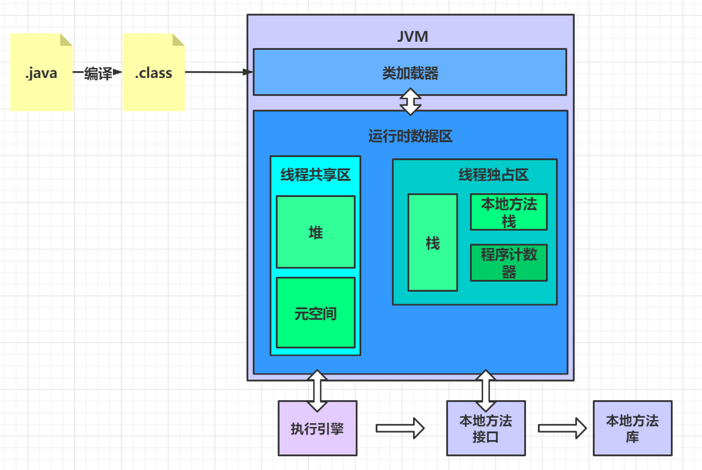

# 类加载系统

加载Class文件

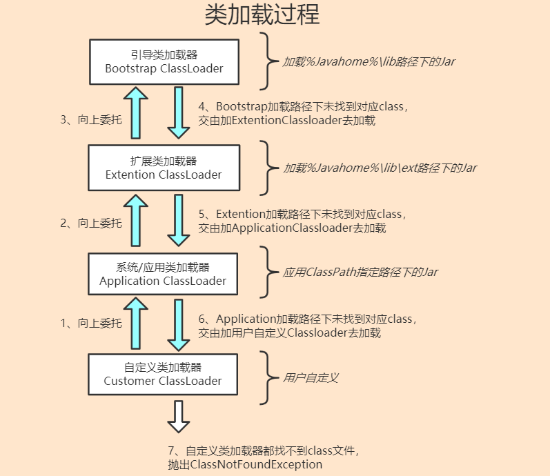

## 双亲委派

1. 类加载器收到类加载的请求
2. 将这个请求向上委托为父类加载器去完成，一直向上委托，直到启动类加载器
3. 启动类加载器检查是否能够加载当前的这个类，能加载就结束，使用当前的加载器，否则抛出异常，通知子加载器进行加载
4. 重复步骤 3

为什么需要双亲委派机制?（也就是双亲委派的优点）

* 双亲委派机制使得类加载出现层级，父类加载器加载过的类，子类加载器不会重复加载，可以**防止类重复加载**；
* 使得类的加载出现优先级，**防止了核心API被篡改**，提升了安全，所以越基础的类就会越上层进行加载，反而一般自己的写的类，就会在应用程序加载器（Application）直接加载。

如何打破双亲委派？

* 自定义类加载器，重写loadClass方法
* 使用线程上下文类加载器

## 沙箱安全机制

沙箱是一个限制程序运行的环境。沙箱机制就是将 Java 代码限定在虚拟机(JVM)特定的运行范围中，并且严格限制代码对本地系统资源访问，通过这样的措施来保证对代码的有效隔离，防止对本地系统造成破坏。沙箱**主要限制系统资源访问**，那系统资源包括什么？——CPU、内存、文件系统、网络。不同级别的沙箱对这些资源访问的限制也可以不一样。

所有的Java程序运行都可以指定沙箱，可以定制安全策略。

组成沙箱的基本组件:

* 字节码校验器（bytecode verifier）：确保Java类文件遵循Java语言规范。这样可以帮助Java程序实现内存保护。但并不是所有的类文件都会经过字节码校验，比如核心类。
* 类装载器（class loader）：其中类装载器在3个方面对Java沙箱起作用
  - 它防止恶意代码去干涉善意的代码；
  - 它守护了被信任的类库边界；
  - 它将代码归入保护域，确定了代码可以进行哪些操作。

# Native

```java
public synchronized void start() {

    if (threadStatus != 0)
        throw new IllegalThreadStateException();

    group.add(this);

    boolean started = false;
    try {
        start0(); // 调用了start0()方法
        started = true;
    } finally {
        try {
            if (!started) {
                group.threadStartFailed(this);
            }
        } catch (Throwable ignore) {

        }
    }
}
// 凡是带了native关键字的，就说明Java的作用范围达不到了，会去调用底层C语言的库
private native void start0(); //start0()方法的定义，这个方法会调用底层C
```

> Java在内存区域中专门开辟了一块标记区域——本地方法栈，用来登记native方法，凡是带了native关键字的，会进入到本地方法栈中，调用本地方法接口（JNI），在最终执行的时候，加载本地方法库中的方法通过JNI

- JNI的作用：扩展Java的使用，融合不同的编程语言为Java所用，不过最初是想融合C，C++的，因为Java诞生的时候，C，C++横行，想要立足的话就要有能调用C的程序
- 本地方法栈：具体做法是，在Native Method Stack中登记native方法，在执行引擎执行的时候加载Native Libraies【本地库】

# 堆栈

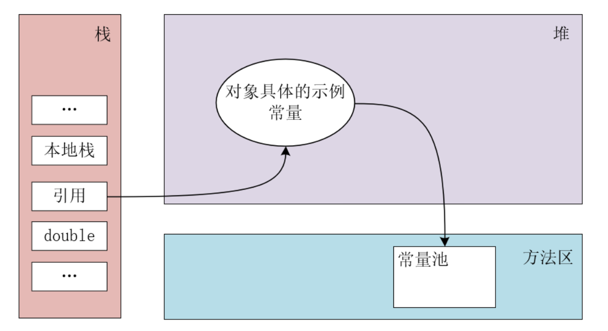

## 堆

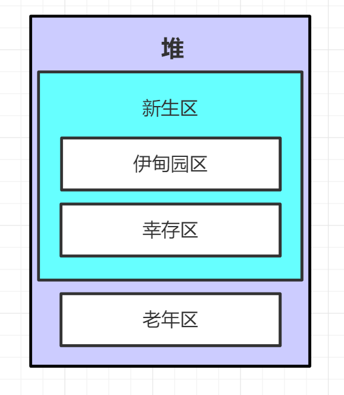

* 类，方法，常量，变量，保存我们所有应用类型的真实对象
* 新生区：所有对象都是在伊甸园区new出来的，如果GC没有把某个垃圾对象回收了，他就会从伊甸园区跑到幸存区
* 这个区域会产生大量的垃圾，所以要有GC来清理，JVM调优大多数也都是调这个区域的参数信息

## 元空间

也叫永久存储区

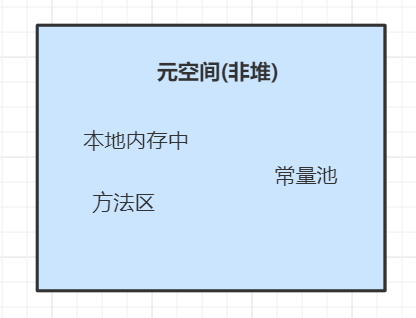

这个区域常驻内存，用来存放一些JDK自身携带的Class对象、Interface元数据，存储的是Java运行时的一些环境或类信息

不存在垃圾回收，关闭虚拟机就会释放这个区域的内存

## 栈

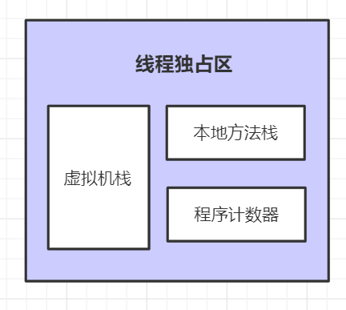

虚拟机栈：存放一些对象的引用，引用的具体内容指向堆，因为栈实线程独占区，所以每次new一个对象赋给新的引用，他们地址不一样

存储方式是先进先出，mian方法先进去被压到栈底，后就去的方法执行完弹出，当mian方法被弹出后，程序结束

存储的数据：八大基本数据类型，对象的引用，实例的方法

# GC

GC主要作于于堆区

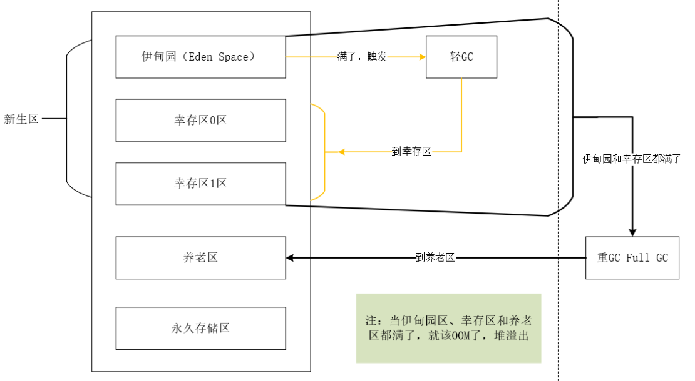

JVM在进行GC时，并不是对这三个区域统一回收，大部分时候，回收都是新生代

- 新生代
- 幸存区（form to）【会交换的，不是一成不变的】
- 老年区

GC两种类型：轻GC（普通的GC），重GC（全局GC）

> 引用计数法

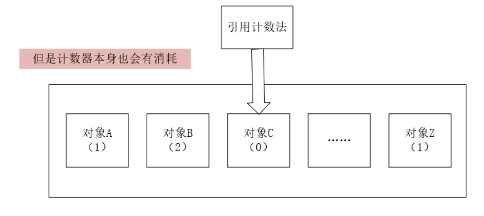

哪个对象的引用数位0就回收哪个对象

> 复制算法

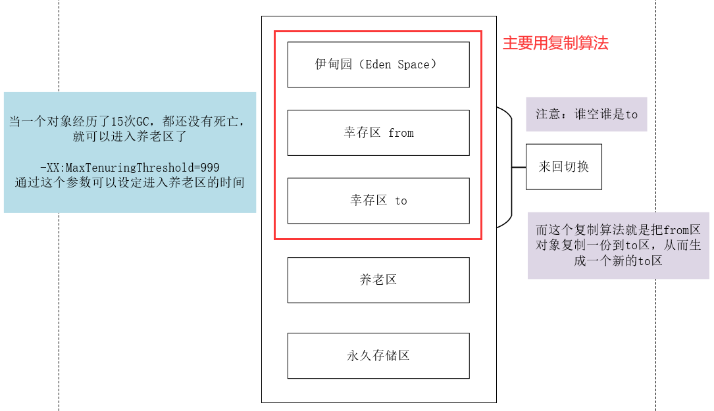

一般新生代（伊甸园区、幸存区）会使用复制算法，生成新的to区

- 好处：没有内存的碎片
- 坏处：浪费了内存空间，多了一半空间永远是空to

复制算法最佳使用场景：对象存活度较低的时候，也就是新生区

> 标记清除

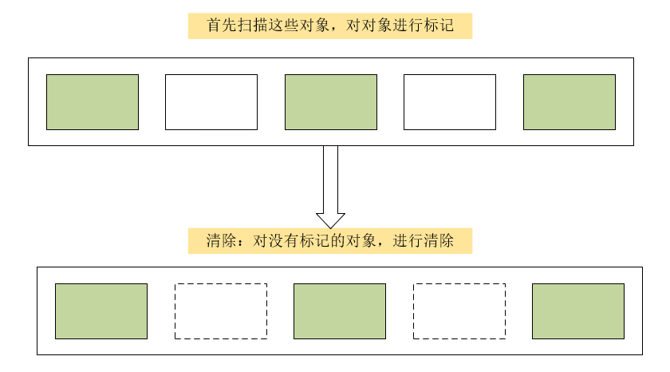

- 缺点：两次扫描，严重浪费时间，会产生内存碎片
- 优点：不需要额外的空间

> 标记压缩

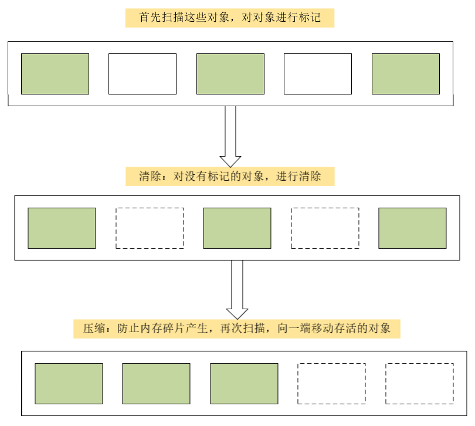

> 标记清除压缩

先标记清除一次，然后再压缩

## 总结

内存效率：复制算法 > 标记清除算法 > 标记压缩算法（时间复杂度）

内存整齐度：复制算法 = 标记压缩算法 > 标记清除算法

内存利用率：标记压缩算法 = 标记清除算法 > 复制算法

思考：难道没有最优算法吗？

答案：没有，没有最好的算法，只有最合适的——>GC：分代收集算法

**年轻代：**

- 存活率低
- 复制算法

**老年代：**

- 区域大，存活率高
- 标记清除（内存碎片不是太多） + 标记压缩混合实现