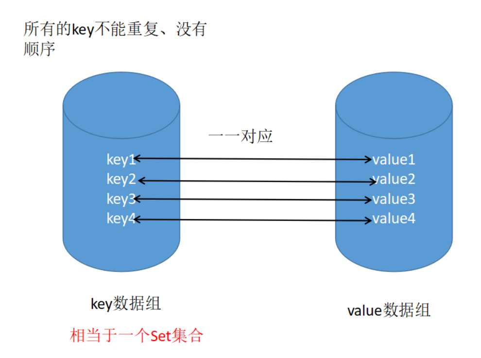

Map接口有三个比较重要的实现类，分别是HashMap、TreeMap和HashTable。

- TreeMap是有序的，HashMap和HashTable是无序的。
- Hashtable的方法是同步的，HashMap的方法不是同步的。这是两者最主要的区别。

- Hashtable是线程安全的，HashMap不是线程安全的。
- HashMap效率较高，Hashtable效率较低。如果对同步性或与遗留代码的兼容性没有任何要求，建议使用HashMap。 查看Hashtable的源代码就可以发现，除构造函数外，Hashtable的所有 public 方法声明中都有 synchronized关键字，而HashMap的源码中则没有。
- Hashtable不允许null值，HashMap允许null值（key和value都允许）
- 父类不同：Hashtable的父类是Dictionary，HashMap的父类是AbstractMap



**Map和Set的关系**

可以说关系是很密切了，虽然Map中存放的时键值对，Set中存放的是单个对象，但如果把value看做key的附庸，key在哪里，value就在哪里，这样就可以像对待Set一样来对待Map了。事实上，Map提供了一个Entry内部类来封装key-value对，再计算Entry存储时则只考虑Entry封装的key。

https://blog.csdn.net/mashaokang1314

# 常用方法

Map中的常用方法：

- `void clear()`:删除该Map对象中所有键值对；
- `boolean containsKey(Object key)`:查询Map中是否包含指定的key值；
- `boolean containsValue(Object value)`:查询Map中是否包含一个或多个value;
- **`Set entrySet()`:返回map中包含的键值对所组成的Set集合，每个集合都是Map.Entry对象。**
- `Object get()`：返回指定key对应的value，如果不包含key则返回null；
- `boolean isEmpty()`:查询该Map是否为空；
- **`Set keySet()`:返回Map中所有key组成的集合；**
- **`Collection values()`:返回该Map里所有value组成的Collection。**
- `Object put(Object key,Object value)`:添加一个键值对，如果集合中的key重复，则覆盖原来的键值对；
- `void putAll(Map m)`:将Map中的键值对复制到本Map中；
- `Object remove(Object key)`:删除指定的key对应的键值对，并返回被删除键值对的value，如果不存在，则返回null；
- `boolean remove(Object key,Object value)`:删除指定键值对，删除成功返回true；
- `int size()`:返回该Map里的键值对个数；

Map中包括一个内部类Entry,该类封装一个键值对，常用方法：

- `Object getKey()`:返回该Entry里包含的key值；
- `Object getvalue()`:返回该Entry里包含的value值；
- `Object setValue(V value)`:设置该Entry里包含的value值，并设置新的value值。

# Java8Map

- `Object compute（Object key，BiFurcation remappingFunction）：`使用remappingFunction根据原键值对计算一个新的value，只要新value不为null，就覆盖原value；如果新value为null则删除该键值对，如果同时为null则不改变任何键值对，直接返回null。

```java
HashMap<String, Integer> hm = new HashMap<>();

//放入元素
hm.put("Harry",23);
hm.put("Jenny",24);
hm.put("XiaoLi",20);

System.out.println(hm);//{XiaoLi=20, Harry=23, Jenny=24}
hm.compute("Harry",(key,value)->(Integer)value+10);
System.out.println(hm);//{XiaoLi=20, Harry=33, Jenny=24}
```


- Object computeIfAbsent（Object key，Furcation mappingFunction）：`如果传给该方法的key参数在Map中对应的value为null，则使用mappingFunction根据key计算一个新的结果，如果计算结果不为null，则计算结果覆盖原有的value，如果原Map原来不包含该Key，那么该方法可能会添加一组键值对。

```java
HashMap<String, Integer> hm = new HashMap<>();

//放入元素
hm.put("Harry",23);
hm.put("Jenny",24);
hm.put("XiaoLi",20);
hm.put("LiMing",null);

//指定key为null则计算结果作为value
hm.computeIfAbsent("LiMing",(key)->10);
System.out.println(hm);//{XiaoLi=20, Harry=23, Jenny=24, LiMing=10}

//如果指定key本来不存在，则添加对应键值对
hm.computeIfAbsent("XiaoHong",(key)->34);
System.out.println(hm);//{XiaoLi=20, Harry=23, XiaoHong=34, Jenny=24, LiMing=10}
```


- void forEach(BiConsumer action)`:遍历键值对。

```java
HashMap<String, Integer> hm = new HashMap<>();

//放入元素
hm.put("Harry",23);
hm.put("Jenny",24);
hm.put("XiaoLi",20);
hm.put("LiMing",null);

hm.forEach((key,value)-> System.out.println(key+"->"+value));
//XiaoLi->20
//Harry->23
//Jenny->24
//LiMing->null
```


- Object getOrDefault(Object key,V defaultValue)`：获取指定key对应的value，如果key不存在则返回defaultValue；

```java
 System.out.println(hm.getOrDefault("Harry",33));//23
```


- Object merge(Object key,Object value，BiFurcation remappingFunction)`：该方法会先根据key参数获取该Map中对应的value。如果获取的value为null，则直接用传入的value覆盖原有的value，如果获取的value不为null，则使用remappingFunction函数根据原value、新value计算一个新的结果，并用得到的结果去覆盖原有的value。

```java
HashMap<String, Integer> hm = new HashMap<>();

//放入元素
hm.put("Harry",23);
hm.put("Jenny",24);
hm.put("XiaoLi",20);
hm.put("LiMing",null);

hm.merge("LiMing",24,(key,value)->value+10);
System.out.println(hm);//{XiaoLi=20, Harry=23, Jenny=24, LiMing=24}
hm.merge("Harry",24,(key,value)->value+10);
System.out.println(hm);//{XiaoLi=20, Harry=34, Jenny=24, LiMing=24}
```


- `Object putIfAbsent(Object key,Object value)`：该方法会自动检测指定key对应的value是否为null，如果为null，则用新value去替换原来的null值。
- `Object replace（Object key,Object value)`:将key对应的value替换成新的value，如果key不存在则返回null。
- `boolean replace（K key,V oldValue,V newValue）`:将指定键值对的value替换成新的value，如果未找到则返回false；
- `replaceAll(BiFunction Function)`:使用BiFunction对原键值对执行计算，并将结果作为该键值对的value值。

# HashMap和Hashtable

HashMap和Hashtable的关系完全类似于ArrayList和Vector的关系。

**区别**

- Hashtable是线性安全的，HashMap是线性不安全的，所以后者效率更高。
- Hashtable不允许使用null作为key和value，否则会引发异常，而HashMap可以；

**和HashSet的关系**

- 与HashSet集合不能保证元素顺序一样，HashMap和Hashtable也不能保证键值对的顺序。他们判断两个key相等的标准也是：两个key通过equals方法比较返回true，两个key的hashCode值也相等。而判断value值相等的标准：只要两个对象通过equals方法比较返回true即可。
- 不能修改集合中的key，否则程序再也无法准确访问到Map中被修改过的key。

# Properties

Properties相当于一个key、value都是String类型的Map

- `String getProperty(String key)`:获取Properties中指定的属性名对应的属性值。
- `String getProperty(String key，String defaultValue)`：和前一个方法相同，只不过如果key不存在，则该方法指定默认值。
- `Object setProperty（String key,String value）`:设置属性值，类似于Hashtable的put方法；
- `void load(InputStream inStream)`:从属性文件中加载键值对，把加载出来的键值对追加到Properties里。
- `void store(OutputStream out,String comments)`:将Properties中的键值对输出到指定的属性文件中。

```java
public static void main(String[] args) throws Exception {
    Properties props = new Properties();

    //向Properties中添加属性
    props.setProperty("username","yeeku");
    props.setProperty("password","123456");

    //保存到文件中
    props.store(new FileOutputStream("a.ini"),"comment line");

    //新建一个Properties对象
    Properties props2 = new Properties();
    props2.setProperty("gender","male");
    //将文件中的键值对追加到对象中
    props2.load(new FileInputStream("a.ini"));
    System.out.println(props2);//{password=123456, gender=male, username=yeeku}
}
```
# TreeMap

```java
public static void main(String[] args) {
    TreeMap<String, Integer> stuTreeMap = new TreeMap<>(new Comparator<String>() {
        @Override
        public int compare(String o1, String o2) {
            int num=o1.compareTo(o2);
            return num;
        }
    });


    stuTreeMap.put("LiMing",14);
    stuTreeMap.put("LiMing",24);
    stuTreeMap.put("Jenny",16);
    stuTreeMap.put("Denny",24);

    System.out.println(stuTreeMap);//{Denny=24, Jenny=16, LiMing=24}

    System.out.println(stuTreeMap.firstEntry());//Denny=24

}
```

- `Map.Entry firstEntry():`返回该Map中最小的key所对应的键值对，如果Map为空则返回null；
- `Object firstKey()`:返回该Map中的最小key值，如果Map为空则返回null；
- `Object lastKey()`:返回该Map中的最大key值，如果Map为空则返回null；
- `Map.Entry higherEntry(Object key)`:返回该Map中位于key后一位的键值对；
- `Object higherKey(Object key)`:返回该Map中位于key后一位的key；
- `Map.Entry lowerEntry(Object key)`:返回该Map中位于key前一位的键值对；
- `Object lowererKey(Object key)`:返回该Map中位于key前一位的key；
- `NavigableMap tailMap(Object fromkey,boolean fromInclusive,Object toKey,boolean toInclusive)`:返回该Map的子Map，其key范围从fromkey（是否包含取决于第二个参数）到toKey(是否包含取决于第四个参数)。