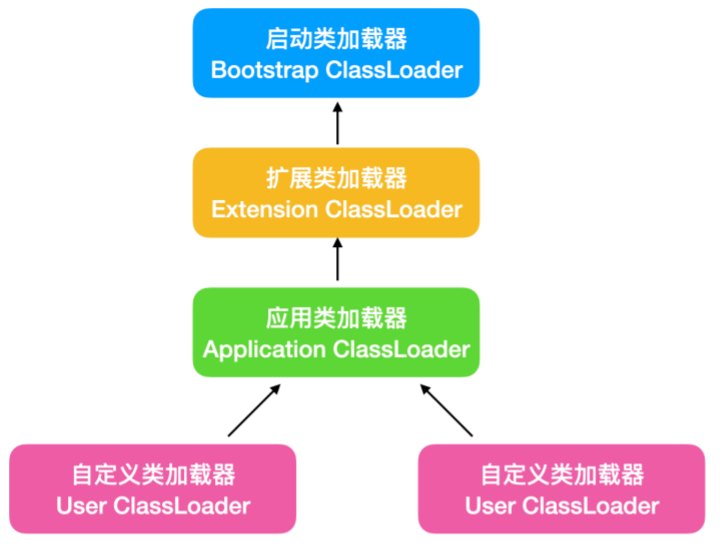

# 注解

## 内置注解

```
@Override:重写注解
@Deprecated:不推荐使用
@SupperssWarnings("all"):用来抑制编译器时的警告信息
```

## 元注解

```
@Target:用于描述注解的使用范围
@Retention:表示需要在什么级别保存该注释信息,用于描述注解的生命周期
@Documented:说明该注解将被包含在javadoc中
@Inherited:说明子类可以继承父类中的该注解
```

```java
//自定义一个注解,使用@interface
@Target(value={ElemenType.METHOD,ElemenType.TYPE})
@Retention(value=ElemenType.RUNTIME)
@Documented
@Inherited
@interface MyAnnotation{
}
```

## 自定义注解

```java
@Target(value={ElemenType.METHOD,ElemenType.TYPE})
@Retention(value=ElemenType.RUNTIME)
@interface MyAnnotation{
    //注解的参数:参数类型+参数名();
    String name() default "";//默认为空
    int age() default 0;
    int id() default -1;//如果默认值为-1,代表不存在
   	String[] schools() default {"cumt","beida"};
}

@Target(value={ElemenType.METHOD,ElemenType.TYPE})
@Retention(value=ElemenType.RUNTIME)
@interface MyAnnotation2{
    String value();//只有一个参数,使用value在赋值时可省略
}
```


# 反射

Java反射机制是在程序运行过程中,对于任何一个类,都能够知道它的所有属性和方法;对于任意一个对象,都能够知道调用它的任意属性和方法,这种动态获取信息以及动态调用对象方法的功能称为Java语言的反射机制

* 在运行时判断任意一个对象所属的类
* 在运行时构造任意一个类的对象
* 在运行时判断任意一个类所有的成员变量和方法
* 在运行时调用任意一个对象的方法

`Java.lang.reflect`包实现了反射机制

## Class类

在Java中,每定义一个java class实体都会产生以共Class对象

加载完类之后,在堆内存的方法区就产生了一个Class类型的对象(一个类只有一个Class对象),这个对象包含了完整的类的结构信息

Class对象用于表示这个类的类型信息

Class中没有公共的构造器,不能被实例化

Class类中的方法:

```java
public String toString(){
    return( isInterface()? "interface":(isPrimitive():"":"class") )+getName();
}
/*
toString()方法能将对象转换为字符串,toString()首先会判断Class类型是否为接口,普通类和接口都能够用Class对象来表示,然后判断是否是基本数据类型,然后是getName()方法,这个方法返回类的全限定名称
*/

toGenericString();//这个方法会返回类的全限定名称,包括类的修饰符和类型参数信息
forName();//根据类名获得一个Class对象的引用,这个方法会使对象进行初始化
Class t=Class.forName("java.lang.Thread");//能够初始化一个线程对象
```

得到Class

```java
//通过对象获得
Class c1=person.getClass();
//froname获得
Class c2=Class.forName("Clsspath");
//通过类名.class获得
Class c3=Student.class;

//获得父类类型
Class c5=c1.getSuperclass();
```

## Java内存

堆:

* 存放new的对象和数组
* 可以被所有线程共享,不会存放别的对象引用

栈:

* 存放基本变量类型,包含这个基本类型的具体数值
* 引用对象的变量,存放这个引用在堆里面的具体地址

方法区:

* 可以被所有线程共享
* 包含了所有的class和static变量

## 类的加载

**加载Load**:将class文件字节码内容加载到内存中,并将这些静态转换成方法区的运行时数据结构,然后生成一个代表这个类的java.lang.Class对象

**链接**:将Java类的二进制代码合并到JVM的运行状态之中的过程

* 验证:确保加载的类信息符合JVM规范,没有安全方面的问题
* 准备:正式为类变量(static)分配内存并设置类变量默认初始值的阶段,这些内存都将在方法区中进行分配
* 解析:虚拟机常量池内的符号引用(常量名)替换为直接引用(地址)的过程

**初始化**:

* 执行类构造器`<clinit>()`方法的过程,类构造器方法是由编译期自动收集类中所有类变量的赋值动作和静态代码块中的语句合并产生的(类构造器是构造类信息的,不是构造该类对象的构造器)
* 当初始化一个类的时候,如果发现其父类还没有进行初始化,则需要先触发器父类的初始化
* 虚拟机会保证一个类的`<clinit>()`方法在多线程环境中被正确加锁和同步

**什么时候会发生类初始化?**

类的主动引用,一定会发生类的初始化

* 当虚拟机启动,先初始化main方法所在的类
* new一个类的对象
* 调用类的静态成员(除了final常量)和静态方法
* 使用java.lang.reflect包的方法对类进行反射调用
* 当初始化一个类,如果其父类没有被初始化,则先会初始化它的父类

类的被动引用,不会发生类的初始化

* 当访问一个静态域时,只有真正声明这个域的类才会被初始化,当通过子类引用父类的静态变量,不会导致子类初始化
* 通过数组定义类引用,不会触发此类的初始化
* 引用常量不会触发此类的初始化(常量在链接阶段就存入调用类的常量池中了)

## 类加载器

类加载的作用:将class文件字节码内容加载到内存中,并将这些静态数据转换成方法区的运行时数据结构,然后再堆中生成一个代表这个类的java.lang.Class对象,作为方法区中类数据的访问入口

类缓存:标准JavaSE类加载器可以按要求类,但一旦某个类加载的类加载器中,它将维持加载(缓存)一段时间,不过JVM垃圾回收机制可以回收这些Class对象

类加载器作用是用来把类加载进内存

引导类加载器(Bootstap Classloader):用C++编写的,是JVM自带的类加载器,负责Java平台核心库(rt.jar),用来装载核心库,该加载器无法直接获取

扩展类加载器(Extension Classloader):负责 jre/lib/ext 指定目录下jar包装入工作库

**系统类加载器**(System Classloader):负责Java-classpath或Java.class.path所指定目录下的类与jar包装入工作库,是最常用的加载器

```java
ClassLoader.getSystemClassLoader();//获取系统类加载器
ClassLoader.getSystemClassLoader().getParent();//扩展类加载器

//获取类加载器可以加载的路径
System.getProperty("java.class.path");
```

双亲委派机制:



# 总结

## 实例化对象

```java
//第一种, forName + newInstance + set
Class c = Class.forName("com.kai.reflection.Student");
Student stu1 = (Student) c.newInstance();
stu1.set();
//第二种,取得全部构造函数,使用构造函数赋值
Class c = Class.forName("com.kai.reflection.Student");
Constructor<Student> constructor =c.getConstructor(String.class,
int.class,String.class, String.class);
Student stu2 = (Student) constructor.newInstance("",20,"","","");
```

## 获取方法并执行

```java
Class c = Class.forName("com.kai.reflection.Student");
Method show=c.getMethod("methodName");
Object object=show.invoke(stu2);//使用一个对象调用该方法
```

## 反射-基本信息操作

```java
int modifier = clazz.getModifiers(); //获取类的修饰符
Package package= clazz.getPackage();//获取类的包名
String fullClassName = clazz.getName();//获取类的全路径名称
String simpleClassName = clazz.getSimpleName();//获取类的简单名称
ClassLoader classLoader = clazz.getClassLoader();//获取类的类加载器
Class[] interfacesClasses = clazz.getInterfaces();//获取类实现的接口列表
Class fc= clazz.getSuperclass();//获取类的父类
Annotation[] annotations= clazz.getAnnotations(); //获取类的注解列表
```

## 反射-字段操作
```java
Field[] fields = clazz.getFields();//获取类中所有的公有字段 包含继承
Field[] declaredFields=clazz.getDeclaredFields();//获取类中定义的字段 内部
Field nameField=clazz.getField("name");//获取指定名称的公有字段
Field likeDescField=clazz.getDeclaredField("name");//获取指定名称类中定义的字段
int modifersFiled = likeDescField.getModifiers();//获取字段的修饰
nameField.setAccessible(true);//指定字段强制访问,关闭安全检测
nameField.set(user,"hello");//成员字段赋值(需指定对象)
descriptionField.set(null,"hello");//静态字段赋值
```
## 反射-方法操作
```java
Method[] methods = clazz.getMethods();//获取类中所有的公有方法 继承
Method[] declaredMethods = clazz.getDeclaredMethods();//获取类中定义的方法
Method method = clazz.getMethod("SetName", String.class);//获取类中指定名称和参数的公有方法
Method pugMethod = clazz.getDeclaredMethod("getUser") //获取类中定义指定名称和参数的方法
int modifers = pugMethod .getModifiers();//获取方法的修饰符
method.invoke(user,"hello");//指定对象进行成员方法的调用
pugMethod .setAccessible(true);//指定方法的强制访问
pickUpGirlsMethod.invoke(null);//静态方法的调用
```
## 反射-构造器操作
```java
Constructor[] cons = clazz.getConstructors();//获取类中所有的公有构造器
Constructor[] cons = clazz.getDeclaredConstructors();//获取类中所有的构造器
Constructor conNoParam= clazz.getDeclaredConstructor();//获取类中无参的构造器
Constructor con= clazz.getDeclaredConstructor(String.class,String.class); //获取类中有参构造
int modifers = con.getModifiers();//获取构造器的修饰符
conNoParam.newInstance();//构造器实例对象
con.setAccessible(true);//指定方法的强制访问
con.newInstance('abc','def');//有参构造调用
class.newInstacne();//class直接调用默认无参构造
```

