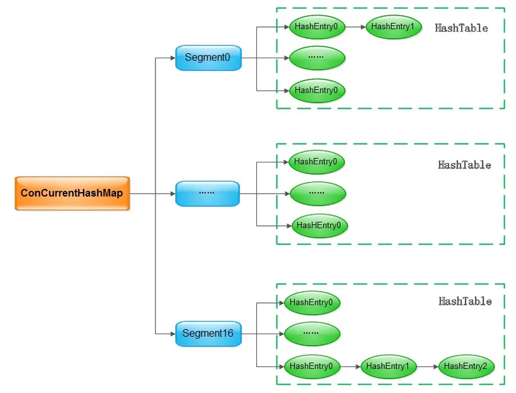
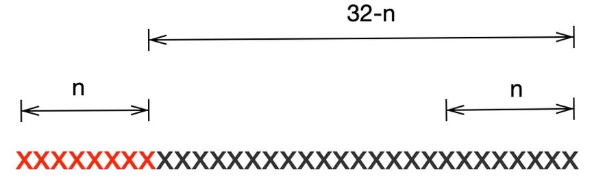

# ConcurrentHashMap

[ConcurrentHashMap中有十个提升性能的细节，你都知道吗？ (qq.com)](https://mp.weixin.qq.com/s/BwSfp1yfQP-OJc9BqecPvQ)

JDK1.7 的ConcurrentHashMap



```markdown
# java7 中 ConcurrentHashMap 的基本点
- ConcurrentHashMap 是一个线程安全的 Map 实现，其读取不需要加锁，通过引入 Segment，可以做到写入的时候加锁粒度足够小
- 由于引入了 Segment，ConcurrentHashMap 在读取和写入的时候需要做两次哈希，但这两次哈希换来的是更加细粒度的锁，也就意味着可以支持更高的并发
- 每个桶数组中的 key-value 对仍然以链表的形式存放在桶中，这一点和 HashMap 是一致的
```

`HashMap`中最重要的四点：初始化，数据寻址，数据存储，扩容，对于`ConcurrentHashMap`来说，这四个操作依然是最重要的，但是引入了更复杂的数据结构，因此在调用`size()`查看整个`ConcurrentHashMap`的数量大小时也有不小的挑战，我们也要重点查看 Doug Lea 在`size()`方法中的设计

## 初始化

```java
// initialCapacity 为所有实例的和(每个segment中entry的和)默认16
// loadFactor 为负载因子
// concurrencyLevel 为segment数组的大小,默认16
// 其实默认所有entry和为 32,而不是initialCapacity的16
public ConcurrentHashMap(int initialCapacity, float loadFactor, int concurrencyLevel) {
    if (!(loadFactor > 0) || initialCapacity < 0 || concurrencyLevel <= 0)
        throw new IllegalArgumentException();
    if (concurrencyLevel > MAX_SEGMENTS)
        concurrencyLevel = MAX_SEGMENTS;
    // Find power-of-two sizes best matching arguments
    int sshift = 0;
    int ssize = 1;
    // 保证ssize是大于concurrencyLevel的最小的2的整数次幂
    while (ssize < concurrencyLevel) {
        ++sshift;
        ssize <<= 1;
    }
    // 寻址需要两次哈希，哈希的高位用于确定segment，低位用于确定桶数组中的元素
    this.segmentShift = 32 - sshift;
    this.segmentMask = ssize - 1;
    if (initialCapacity > MAXIMUM_CAPACITY)
        initialCapacity = MAXIMUM_CAPACITY;
    // 向上取整求c
    int c = initialCapacity / ssize;
    if (c * ssize < initialCapacity)
        ++c;
    // 得到 cap 2的n次幂
    // cap 最小为 2
    int cap = MIN_SEGMENT_TABLE_CAPACITY;
    while (cap < c)
        cap <<= 1;
    // new 一个 segment s0 对象
    // 每一个segment中有 cap 个 entry
    Segment<K,V> s0 = new Segment<K,V>(loadFactor, (int)(cap * loadFactor), (HashEntry<K,V>[])new HashEntry[cap]);
    // 初始化 segment 数组
    Segment<K,V>[] ss = (Segment<K,V>[])new Segment[ssize];
    // 将 s0 对象放置到 ss[0] 中
    UNSAFE.putOrderedObject(ss, SBASE, s0); // ordered write of segments[0]
    this.segments = ss;
}
```

```markdown
# 初始化方法中做了三件重要的事：
- 确定了segments的数组的大小ssize，ssize根据入参concurrencyLevel确定，取大于concurrencyLevel的最小的2的整数次幂
- 确定哈希寻址时的偏移量，这个偏移量在确定元素在segment数组中的位置时会用到
- 初始化segment数组中的第一个元素，元素类型为HashEntry的数组，这个数组的长度为initialCapacity / ssize，即初始化大小除以segment数组的大小，segment数组中的其他元素在后续put操作时参考第一个已初始化的实例初始化
```

```java
static final class HashEntry<K,V> {
    final int hash; 
    final K key;
    volatile V value;
    volatile HashEntry<K,V> next; 

    HashEntry(int hash, K key, V value, HashEntry<K,V> next) {
        this.hash = hash;
        this.key = key;
        this.value = value;
        this.next = next;
    }
    final void setNext(HashEntry<K,V> n) {
        UNSAFE.putOrderedObject(this, nextOffset, n);
    }
}
```

```markdown
# 这里的HashEntry和HashMap中的HashEntry作用是一样的，它是ConcurrentHashMap的数据项，这里要注意两个细节：
# 细节一
- HashEntry的成员变量value和next是被关键字volatile修饰的，也就是说所有线程都可以及时检查到其他线程对这两个变量的改变，因而可以在不加锁的情况下读取到这两个引用的最新值
# 细节二
- HashEntry的setNext方法中调用了UNSAFE.putOrderedObject，这个接口是属于sun安全库中的api，并不是J2SE的一部分，它的作用和volatile恰恰相反，调用这个api设值是使得volatile修饰的变量延迟写入主存，那到底是什么时候写入主存呢？
> JMM中有一条规定：
对一个变量执行unlock操作之前，必须先把此变量同步到主内存中（执行store和write操作）
```

## 哈希与put

由于引入了`segment`，因此不管是调用`get`方法读还是调用`put`方法写，都需要做两次哈希，还记得在上文我们讲初始化的时候系统做了一件重要的事：

- 确定哈希寻址时的偏移量，这个偏移量在确定元素在`segment`数组中的位置时会用到

```java
this.segmentShift = 32 - sshift;
```

这里用32去减是因为`int`型的长度是32，有了`segmentShift`，`ConcurrentHashMap`是如何做第一次哈希的呢？

```java
public V put(K key, V value) {
    Segment<K,V> s;
    if (value == null)
        throw new NullPointerException();
    // 得到hash值
    int hash = hash(key);
    // 变量j代表着数据项处于segment数组中的第j项
    int j = (hash >>> segmentShift) & segmentMask;
    // 如果segment[j]为null,则下面的这个方法负责初始化之
    s = ensureSegment(j); 
    return s.put(key, hash, value, false);
}
```

我们以`put`方法为例，变量`j`代表着数据项处于`segment`数组中的第`j`项。如下图所示假如`segment`数组的大小为2的n次方，则`hash >>> segmentShift`正好取了key的哈希值的高n位，再与掩码`segmentMask`相与相当与仍然用key的哈希的高位来确定数据项在`segment`数组中的位置。



`hash`方法与非线程安全的`HashMap`相似，这里不再细说。

```markdown
# 细节三
- 在延迟初始化Segment数组时，作者采用了CAS避免了加锁，而且CAS可以保证最终的初始化只能被一个线程完成。在最终决定调用CAS进行初始化前又做了两次检查，第一次检查可以避免重复初始化tab数组，而第二次检查则可以避免重复初始化Segment对象，每一行代码作者都有详细的考虑。
```

```java
// 初始化 Segment 数组
// 多次使用 UNSAFE.getObjectVolatile 以及 CAS 确保segment对象由一个线程初始化
private Segment<K,V> ensureSegment(int k) {
    final Segment<K,V>[] ss = this.segments;
    // raw offset 实际的字节偏移量
    long u = (k << SSHIFT) + SBASE;
    Segment<K,V> seg;
    if ((seg = (Segment<K,V>)UNSAFE.getObjectVolatile(ss, u)) == null) {
        // 以初始化时创建的 s0 为原型
        // use segment 0 as prototype
        Segment<K,V> proto = ss[0];
        int cap = proto.table.length;
        float lf = proto.loadFactor;
        int threshold = (int)(cap * lf);
        HashEntry<K,V>[] tab = (HashEntry<K,V>[])new HashEntry[cap];
        // recheck 再检查一次是否已经被初始化
        if ((seg = (Segment<K,V>)UNSAFE.getObjectVolatile(ss, u)) == null) { 
            Segment<K,V> s = new Segment<K,V>(lf, threshold, tab);
            // 循环判断(妙啊)
            while ((seg = (Segment<K,V>)UNSAFE.getObjectVolatile(ss, u)) == null) {
                // 使用 CAS 确保只被初始化一次
                if (UNSAFE.compareAndSwapObject(ss, u, null, seg = s)) 
                    break;
            }
        }
    }
    return seg;
}
```

## put

```java
final V put(K key, int hash, V value, boolean onlyIfAbsent) {
    // 对当前的 segment 加锁
    // 加锁方法 scanAndLockForPut() 分段锁
    // lock() 为阻塞加锁, tryLock() 为非阻塞加锁
    // scanAndLockForPut() 保证一定加锁成功加锁
    HashEntry<K,V> node = tryLock() ? null : scanAndLockForPut(key, hash, value); 
    V oldValue;
    try {
        HashEntry<K,V>[] tab = table;
        int index = (tab.length - 1) & hash;
        HashEntry<K,V> first = entryAt(tab, index);
        for (HashEntry<K,V> e = first;;) {
            if (e != null) {
                K k;
                // 如果找到key相同的数据项，则直接替换
                if ((k = e.key) == key || (e.hash == hash && key.equals(k))) {
                    oldValue = e.value;
                    if (!onlyIfAbsent) {
                        e.value = value;
                        ++modCount; 
                    }
                    break;
                }
                e = e.next;
            }
            else {
                if (node != null)
                    // node不为空说明已经在自旋等待时初始化了
                    // 注意调用的是setNext，不是直接操作next
                    node.setNext(first); 
                else
                    // 否则，在这里新建一个HashEntry
                    node = new HashEntry<K,V>(hash, key, value, first);
                int c = count + 1; // 先加1
                if (c > threshold && tab.length < MAXIMUM_CAPACITY)
                    rehash(node);
                else
                    // 将新节点写入，注意这里调用的方法有门道
                    setEntryAt(tab, index, node); 
                ++modCount;
                count = c;
                oldValue = null;
                break;
            }
        }
    } finally {
        // 解锁
        unlock();
    }
    return oldValue;
}
```

```markdown
# 细节四
- CPU的调度是公平的，好不容易轮到的时间片如果因为获取不到锁就将本线程挂起无疑会降低本线程的效率，更何况挂起之后还要重新调度，切换上下文，又是一笔不小的开销。如果可以遇见其他线程占有锁的时间不会很长，采用自旋将会是一个比较好的选择，在这里面也有一个权衡，如果别的线程占有锁的时间过长，反而是挂起阻塞等待性能好一点，我们来看下ConcurrentHashMap的做法：
```

```java
// 保证一定加锁成功
private HashEntry<K,V> scanAndLockForPut(K key, int hash, V value) {
    HashEntry<K,V> first = entryForHash(this, hash);
    HashEntry<K,V> e = first;
    HashEntry<K,V> node = null;
    // 重试加锁次数
    int retries = -1; // negative while locating node
    // 自旋等待加锁
    // 若加锁失败,执行while里的代码
    // 在等待加锁的过程中可以先生成 entry 对象
    while (!tryLock()) { 
        HashEntry<K,V> f; // to recheck first below
        // 三个分支
        // 首先进入 retries < 0 的分支,遍历 entry 链表,创建 entry 对象
        if (retries < 0) {
            // 三个判断,遍历链表,创建 newEntry
            // 这个桶中还没有写入k-v项
            if (e == null) {
                if (node == null) // speculatively create node
                    // 直接创建一个新的节点
                    node = new HashEntry<K,V>(hash, key, value, null);
                retries = 0;
            }
            // key值相等，直接跳出去尝试获取锁
            else if (key.equals(e.key))
                retries = 0;
            else // 遍历链表
                e = e.next;
        }
        // 自旋等待超过一定次数之后只能挂起线程，阻塞等待了
        else if (++retries > MAX_SCAN_RETRIES) {
            lock();
            break;
        }
        // entry 链表被其它线程改变,通过比较头节点判断是否改变
        // 并不是每次都判断头节点是否发生改变,retries偶数才判断
        else if ((retries & 1) == 0 && (f = entryForHash(this, hash)) != first) { 
            // 如果头节点改变了，则重置次数，继续自旋等待
            e = first = f; 
            retries = -1; 
        }
    }
    return node;
}
```

```markdown
- ConcurrentHashMap的策略是自旋MAX_SCAN_RETRIES(默认64)次，如果还没有获取到锁则调用lock挂起阻塞等待，当然如果其他线程采用头插法改变了链表的头结点，则重置自旋等待次数。
```

```markdown
# 细节五
- 要知道，如果要从编码的角度提升系统的并发度，一个黄金法则就是减少并发临界区的大小。在scanAndLockForPut这个方法的设计上，有个小细节让我眼前一亮，就是在自旋的过程中初始化了一个HashEntry，这样做的好处就是线程在拿到锁之后不用初始化HashEntry了，占有锁的时间相应减小，进而提升性能。
```

```markdown
# 细节六
- 在put方法的开头，有这么一行不起眼的代码：
- - HashEntry<K,V>[] tab = table;
- 看起来好像就是简单的临时变量赋值，其实大有来头，我们看一下table的声明：
- - transient volatile HashEntry<K,V>[] table;
- - table变量被关键字volatile修饰，CPU在处理volatile修饰的变量的时候会有下面的行为：
> 嗅探
> 每个处理器通过嗅探在总线上传播的数据来检查自己缓存的值是不是过期了，当处理器发现自己缓存行对应的内存地址被修改，就会将当前处理器的缓存行设置成无效状态，当处理器对这个数据进行修改操作的时候，会重新从系统内存中把数据读到处理器缓存里
- 因此直接读取这类变量的读取和写入比普通变量的性能消耗更大，因此在put方法的开头将table变量赋值给一个普通的本地变量目的是为了消除volatile带来的性能损耗。这里就有另外一个问题：那这样做会不会导致table的语义改变，让别的线程读取不到最新的值呢？别着急，我们接着看。
```

```markdown
# 细节七
- 注意put方法中的这个方法：entryAt():
```
```java
static final <K,V> HashEntry<K,V> entryAt(HashEntry<K,V>[] tab, int i) {
    return (tab == null) ? null : (HashEntry<K,V>) UNSAFE.getObjectVolatile(tab, ((long)i << TSHIFT) + TBASE);
}
```

```markdown
- 这个方法的底层会调用UNSAFE.getObjectVolatile，这个方法的目的就是对于普通变量读取也能像volatile修饰的变量那样读取到最新的值，在前文中我们分析过，由于变量tab现在是一个普通的临时变量，如果直接调用tab[i]不一定能拿到最新的首节点的。细心的读者读到这里可能会想：Doug Lea是不是糊涂了，兜兜转换不是回到了原点么，为啥不刚开始就操作volatile变量呢，费了这老大劲。我们继续往下看。
```

```markdown
# 细节八
- 在put方法的实现中，如果链表中没有key值相等的数据项，则会把新的数据项插入到链表头写入到数组中，其中调用的方法是：
```

```java
static final <K,V> void setEntryAt(HashEntry<K,V>[] tab, int i, HashEntry<K,V> e) {
    UNSAFE.putOrderedObject(tab, ((long)i << TSHIFT) + TBASE, e);
}
```

```markdown
- putOrderedObject这个接口写入的数据不会马上被其他线程获取到，而是在put方法最后调用unclock后才会对其他线程可见，参见前文中对JMM的描述：
> 对一个变量执行unlock操作之前，必须先把此变量同步到主内存中（执行store和write操作）
- 这样的好处有两个，第一是性能，因为在持有锁的临界区不需要有同步主存的操作，因此持有锁的时间更短。第二是保证了数据的一致性，在put操作的finally语句执行完之前，put新增的数据是不对其他线程展示的，这是ConcurrentHashMap实现无锁读的关键原因。
```

我们在这里稍微总结一下`put`方法里面最重要的三个细节

首先将`volatile`变量转为普通变量提升性能

因为在`put`中需要读取到最新的数据，因此接下来调用`UNSAFE.getObjectVolatile`获取到最新的头结点

但是通过调用`UNSAFE.putOrderedObject`让变量写入主存的时间延迟到`put`方法的结尾，一来缩小临界区提升性能，二来也能保证其他线程读取到的是完整数据

```markdown
# 细节九
- 如果put真的需要往链表头插入数据项，那也得注意了，ConcurrentHashMap相应的语句是：
- node.setNext(first);
```

```java
final void setNext(HashEntry<K,V> n) {
    UNSAFE.putOrderedObject(this, nextOffset, n);
}
```

```markdown
- 因为next变量是用volatile关键字修饰的，这里调用UNSAFE.putOrderedObject相当于是改变了volatile的语义，这里面的考量有两个，第一个仍然是性能，这样的实现性能明显更高，这一点前文已经详细的分析过，第二点是考虑了语义的一致性，对于put方法来说因为其调用的是UNSAFE.getObjectVolatile，仍然能获取到最新的数据，对于get方法，在put方法未结束之前，是不希望不完整的数据被其他线程通过get方法读取的，这也是合理的。
```

## resize

```java
private void rehash(HashEntry<K,V> node) {
    HashEntry<K,V>[] oldTable = table;
    int oldCapacity = oldTable.length;
    int newCapacity = oldCapacity << 1;
    threshold = (int)(newCapacity * loadFactor);
    HashEntry<K,V>[] newTable = (HashEntry<K,V>[]) new HashEntry[newCapacity];
    int sizeMask = newCapacity - 1;
    for (int i = 0; i < oldCapacity ; i++) {
        HashEntry<K,V> e = oldTable[i];
        if (e != null) {
            HashEntry<K,V> next = e.next;
            int idx = e.hash & sizeMask;
             //  Single node on list 只有一个节点，简单处理
            if (next == null)
                newTable[idx] = e;
            else { 
                HashEntry<K,V> lastRun = e;
                int lastIdx = idx;
                // 保证下文中newTable[k]不会为null
                for (HashEntry<K,V> last = next;
                     last != null;
                     last = last.next) {
                    int k = last.hash & sizeMask;
                    if (k != lastIdx) {
                        lastIdx = k;
                        lastRun = last;
                    }
                }
                newTable[lastIdx] = lastRun;
                // Clone remaining nodes 对标记之前的不能重用的节点进行复制，再重新添加到新数组对应的hash桶中去
                for (HashEntry<K,V> p = e; p != lastRun; p = p.next) {
                    V v = p.value;
                    int h = p.hash;
                    int k = h & sizeMask;
                    HashEntry<K,V> n = newTable[k];
                    newTable[k] = new HashEntry<K,V>(h, p.key, v, n);
                }
            }
        }
    }
    int nodeIndex = node.hash & sizeMask; // add the new node 部分的put功能，把新节点添加到链表的最前面
    node.setNext(newTable[nodeIndex]);
    newTable[nodeIndex] = node;
    table = newTable;
}
```

```markdown
- 在整个桶数组长度为2的正整数幂的情况下，扩容前同一个桶中的元素在扩容后只会分布在两个桶中，其中一个桶的下标保持不变，我们称之为旧桶，另一个桶的下标为旧桶下标加上旧的容量，我们称之为新桶，其实第一个for循环的目的就是在一个链表中找到最后一个应该移到新桶的数据项，直接移到新桶中，这样做是为了保证后面调用`HashEntry<K,V> n = newTable[k];`的时候不会读取到null。第二个for就比较简单了，将所有的数据项移到新的桶数组中，当所有的操作完成之后才将newTable赋值给table。
- rehash方法中是没有加锁的，并不是说调用这个方法不需要加锁，作者是在外层加了锁，这一点需要注意。
```

## size

```java
public int size() {
    final Segment<K,V>[] segments = this.segments;
    int size;
    boolean overflow; // true if size overflows 32 bits
    long sum;         // sum of modCounts
    long last = 0L;   // previous sum
    int retries = -1; // first iteration isn't retry
    try {
        for (;;) {
            if (retries++ == RETRIES_BEFORE_LOCK) {
                for (int j = 0; j < segments.length; ++j)
                    ensureSegment(j).lock(); // force creation
            }
            sum = 0L;
            size = 0;
            overflow = false;
            for (int j = 0; j < segments.length; ++j) {
                Segment<K,V> seg = segmentAt(segments, j);
                if (seg != null) {
                    sum += seg.modCount;
                    int c = seg.count;
                    if (c < 0 || (size += c) < 0)
                        overflow = true;
                }
            }
            if (sum == last)
                break;
            last = sum;
        }
    } finally {
        if (retries > RETRIES_BEFORE_LOCK) {
            for (int j = 0; j < segments.length; ++j)
                segmentAt(segments, j).unlock();
        }
    }
    return overflow ? Integer.MAX_VALUE : size;
}
```

```markdown
- 在前面介绍put方法时我们选择忽略了一个小小的成员变量modCount，这个变量在这里大显身手，它的主要作用就是记录整个Segment中写入操作的次数，因为写入操作是会影响整个ConcurrentHashMap的大小的。
- 因为在读取ConcurrentHashMap大小的时候需要保证读到的是最新的值，因此其调用了UNSAFE.getObjectVolatile这个方法，虽然这个方法的性能比普通变量要差，但是比起全局加锁，可好多了。
```

```java
static final <K,V> Segment<K,V> segmentAt(Segment<K,V>[] ss, int j) {
    long u = (j << SSHIFT) + SBASE; // 计算实际的字节偏移量
    return ss == null ? null : (Segment<K,V>) UNSAFE.getObjectVolatile(ss, u);
}
```

```markdown
# 细节十
- 在size方法的设计上，ConcurrentHashMap先尝试无锁的方法，如果两次遍历所有segment数组的时候整个ConcurrentHashMap没有发生写入操作，则直接返回每个segment数组的size()之和，否则重新遍历，如果写入操作频繁，则不得已加锁处理，这里的加锁相当于是一个全局的锁，因为对segment数组的每一个元素都加了锁。那如何判断整个ConcurrentHashMap的写入是否频繁呢？就看无锁重试的次数，当无锁重试的次数超过阈值的话就全局加锁处理。
```

## 总结

```markdown
# ConcurrentHashMap的哪些操作需要加锁？
- 答：只有写入操作才需要加锁，读取操作不需要加锁
# ConcurrentHashMap的无锁读是如何实现的？
- 答：首先HashEntry中的value和next都是有volatile修饰的，其次在写入操作的时候通过调用UNSAFE库延迟同步了主存，保证了数据的一致性
# 在多线程的场景下调用size()方法获取ConcurrentHashMap的大小有什么挑战？ConcurrentHashMap是怎么解决的？
- 答：size()具有全局的语义，如何能保证在不加全局锁的情况下读取到全局状态的值是一个很大的挑战，ConcurrentHashMap通过查看两次无锁读中间是否发生了写入操作来决定读取到的size()是否可信，如果写入操作频繁，则再退化为全局加锁读取。
# 在有Segment存在的前提下，是如何扩容的？
- 答：segment数组的大小在一开始初始化的时候就已经决定了，扩容主要扩的是HashEntry数组，基本的思路与HashTable一致，但这是一个线程不安全方法，调用之前需要加锁。
```

