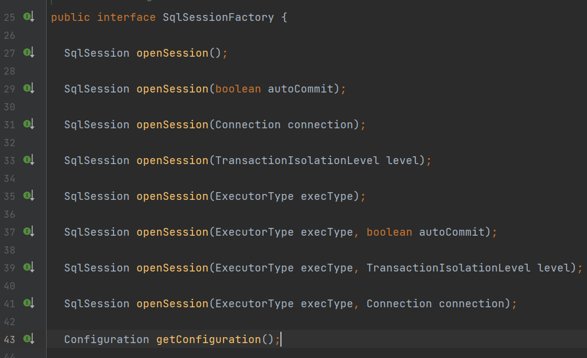

# Mybatis设计模式

https://mp.weixin.qq.com/s/Bl_etZJPG08gWoCRHoq-Yw

```markdown
# Mybatis 使用的设计模式
- Builder模式，例如SqlSessionFactoryBuilder、XMLConfigBuilder、XMLMapperBuilder、XMLStatementBuilder、CacheBuilder；
- 工厂模式，例如SqlSessionFactory、ObjectFactory、MapperProxyFactory；
- 单例模式，例如ErrorContext和LogFactory；
- 代理模式，Mybatis实现的核心，比如MapperProxy、ConnectionLogger，用的jdk的动态代理；还有executor.loader包使用了cglib或者javassist达到延迟加载的效果；
- 组合模式，例如SqlNode和各个子类ChooseSqlNode等；
- 模板方法模式，例如BaseExecutor和SimpleExecutor，还有BaseTypeHandler和所有的子类例如IntegerTypeHandler；
- 适配器模式，例如Log的Mybatis接口和它对jdbc、log4j等各种日志框架的适配实现；
- 装饰者模式，例如Cache包中的cache.decorators子包中等各个装饰者的实现；
- 迭代器模式，例如迭代器模式PropertyTokenizer；
```

## 建造者模式

Builder模式的定义是“将一个复杂对象的构建与它的表示分离，使得同样的构建过程可以创建不同的表示。”，它属于创建类模式，一般来说，**如果一个对象的构建比较复杂，超出了构造函数所能包含的范围，就可以使用工厂模式和Builder模式**，相对于工厂模式会产出一个完整的产品，Builder应用于更加复杂的对象的构建，甚至只会构建产品的一个部分。

在Mybatis环境的初始化过程中，SqlSessionFactoryBuilder 会调用 XMLConfigBuilder 读取所有的 MybatisMapConfig.xml和所有的 *Mapper.xml 文件，构建 Mybatis 运行的核心对象 Configuration 对象，然后将该 Configuration 对象作为参数构建一个 SqlSessionFactory 对象。

其中XMLConfigBuilder在构建Configuration对象时，也会调用XMLMapperBuilder用于读取*Mapper文件，而XMLMapperBuilder会使用XMLStatementBuilder来读取和build所有的SQL语句。

在这个过程中，有一个相似的特点，就是这些Builder会读取文件或者配置，然后做大量的XpathParser解析、配置或语法的解析、反射生成对象、存入结果缓存等步骤，这么多的工作都不是一个构造函数所能包括的，因此大量采用了Builder模式来解决。

```java
public class SqlSessionFactoryBuilder {
    public SqlSessionFactory build(Reader reader, String environment, Properties properties) {
        try {
            // 调用 XMLConfigBuilder
            XMLConfigBuilder parser = new XMLConfigBuilder(reader, environment, properties);
            // 调用 XMLConfigBuilder 的 parse 读取 mybatis-config.xml
            return build(parser.parse());
        } catch (Exception e) {
            throw ExceptionFactory.wrapException("Error building SqlSession.", e);
        } finally {
            ErrorContext.instance().reset();
            try {
                reader.close();
            } catch (IOException e) {
                // Intentionally ignore. Prefer previous error.
            }
        }
    }
}
public Configuration parse() {
    if (parsed) {
        throw new BuilderException("Each XMLConfigBuilder can only be used once.");
    }
    parsed = true;
    // parseConfiguration 方法解析配置文件中的标签
    parseConfiguration(parser.evalNode("/configuration"));
    // configuration 为 Configuration全局配置类的对象
    return configuration;
}
```

## 工厂模式

在Mybatis中比如SqlSessionFactory使用的是工厂模式，该工厂没有那么复杂的逻辑，是一个简单工厂模式。

简单工厂模式(Simple Factory Pattern)：又称为静态工厂方法(Static Factory Method)模式，它属于类创建型模式。在简单工厂模式中，可以根据参数的不同返回不同类的实例。简单工厂模式专门定义一个类来负责创建其他类的实例，被创建的实例通常都具有共同的父类。



SqlSession可以认为是一个Mybatis工作的核心的接口，通过这个接口可以执行执行SQL语句、获取Mappers、管理事务。类似于连接MySQL的Connection对象。

可以看到，该Factory的openSession方法重载了很多个，分别支持autoCommit、Executor、Transaction等参数的输入，来构建核心的SqlSession对象。

```java
// 默认工厂实现
public class DefaultSqlSessionFactory implements SqlSessionFactory {
    private final Configuration configuration;

    public DefaultSqlSessionFactory(Configuration configuration) {
        this.configuration = configuration;
    }

    @Override
    public SqlSession openSession() {
        return openSessionFromDataSource(configuration.getDefaultExecutorType(), null, false);
    }

    private SqlSession openSessionFromDataSource(...) {
        Transaction tx = null;
        // 从configuration读取对应的环境配置
        final Environment environment = configuration.getEnvironment();
        // 初始化TransactionFactory获得一个Transaction对象
        final TransactionFactory transactionFactory = getTransactionFactoryFromEnvironment(environment);
        // 然后通过Transaction获取一个Executor对象
        tx = transactionFactory.newTransaction(environment.getDataSource(), level, autoCommit);
        final Executor executor = configuration.newExecutor(tx, execType);
        // 通过configuration、Executor、是否autoCommit三个参数构建了SqlSession
        return new DefaultSqlSession(configuration, executor, autoCommit);
    }

}
```

## 单例模式

单例模式(Singleton Pattern)：单例模式确保某一个类只有一个实例，而且自行实例化并向整个系统提供这个实例，这个类称为单例类，它提供全局访问的方法。

单例模式的要点有三个：一是某个类只能有一个实例；二是它必须自行创建这个实例；三是它必须自行向整个系统提供这个实例。单例模式是一种对象创建型模式。单例模式又名单件模式或单态模式。

在Mybatis中有两个地方用到单例模式，ErrorContext和LogFactory，其中ErrorContext是用在每个线程范围内的单例，用于记录该线程的执行环境错误信息，而LogFactory则是提供给整个Mybatis使用的日志工厂，用于获得针对项目配置好的日志对象。

```java
public class ErrorContext {

    private static final ThreadLocal<ErrorContext> LOCAL = new ThreadLocal<ErrorContext>();

    private ErrorContext() {
    }

    public static ErrorContext instance() {
        ErrorContext context = LOCAL.get();
        if (context == null) {
            context = new ErrorContext();
            LOCAL.set(context);
        }
        return context;
    }
}
```

构造函数是private修饰，具有一个static的局部instance变量和一个获取instance变量的方法，在获取实例的方法中，先判断是否为空如果是的话就先创建，然后返回构造好的对象。

只是这里有个有趣的地方是，LOCAL的静态实例变量使用了ThreadLocal修饰，也就是说它属于每个线程各自的数据，而在instance()方法中，先获取本线程的该实例，如果没有就创建该线程独有的ErrorContext。