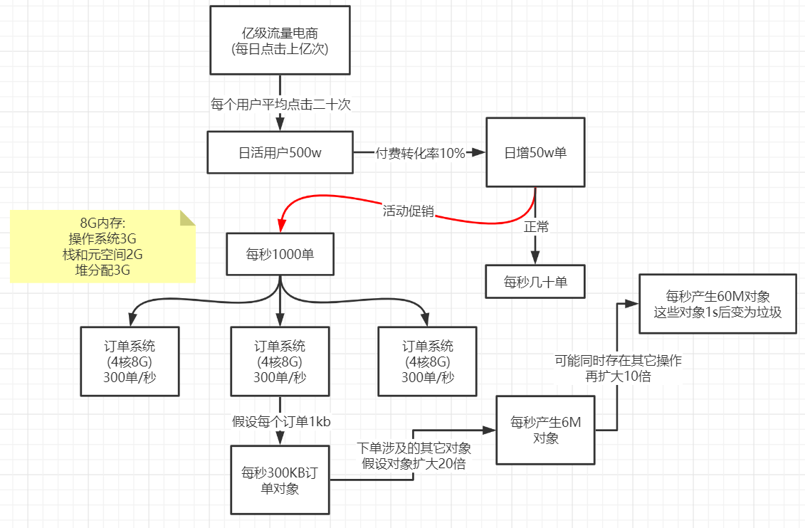
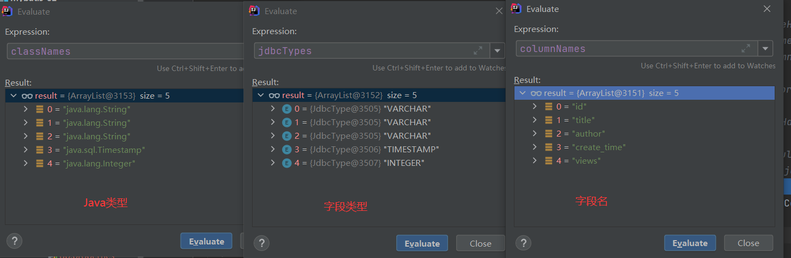

[2021最新JAVA面试题200集（真题必问）](https://www.bilibili.com/video/BV1nK4y1H7g9)

# JVM调优

## 基本概念


> 栈，用于存放程序运行时产生的局部变量
>
> 每一个线程都有自己的栈
>
> 栈中又分为栈帧（每一个方法有一个内存区域）


> 不同方法产生的局部变量分配在自己的栈帧中
>
> 程序的方法嵌套调用（先分配的后释放）与栈的先进后出的特点类似

> javap -c hello.class > hello.txt
>
> 输出字节码文件（反汇编）


> 程序计数器存放正在（即将）运行代码对应的位置
>
> 多线程时会出现CPU上下文切换，通过程序计数器可以知道被挂起的线程下次开始运行的位置


>动态链接：程序的运行过程中根据符号找到该方法在方法区的内存地址
>
>方法出口：方法执行完成后返回的处理（返回值，返回位置）


> 元空间存放常量，静态变量，类信息


> 本地方法栈分配本地方法的内存空间


> new 出来的对象先存放在 Eden 区，Eden 区放满之后触发 minor gc
>
> minior gc 会回收整个年轻代的垃圾对象，非垃圾对象的分代年龄会加一，并复制到空的某个幸存区，然后 Eden 和另一个幸存区清空内存，当分代年龄到达15时，会将对象移到老年代（静态变量，单例，对象缓存池，spring的容器bean）

```markdown
# 可达性分析算法
- 将“GC Roots”对象作为起点，从这些节点开始向下搜索引用的对象，找到的对象都标记为非垃圾对象，其余对象标记为垃圾对象
- GC Roots 根节点：线程栈的本地变量，静态变量，本地方法栈的变量
```


## 调优

> jdk 自带调优工具
>
> jvisualvm，jmap，jstack

> 当老年代内存满后会触发 full gc ，回收整个堆的内存空间，如果 full gc 无法回收垃圾对象（一直被 gc root ）则会发生 OOM

> linux Java调优工具：阿里巴巴开源的 Arthas

调优的目的：减少 GC

优先减少 Full GC：Full GC 会发生 STW(stop the world)

STW的原因：防止在 GC 过程中对象的引用状态发生变化（线程执行结束，内存释放，对象的 GC root 释放）




如何优化，使其几乎不发生 full gc？


> 将年轻代调为2G，老年代1G，这样不会触发对象动态年龄判断，将垃圾对象在年轻代就回收


## 垃圾收集器


当伊甸园的内存很大时（30G），minor gc 性能也会很低

* 边运行边回收，一次回收2~3G，STW总时间增加，但单次GC很快

通过设置垃圾收集器 G1 可以实现

# MySQL调优

## 索引

索引是帮助MySQL高效获取数据的排好序的数据结构

B树：每个节点存放较多的数据，一次 IO 即可查询较多的数据


B+树：所有数据存放在叶子节点


> MySQL每一个节点为一个数据页，约16KB

存储引擎修饰的是数据库表


> 聚集索引：数据和索引在一个文件(.IBD)
>
> 非聚集索引：数据和索引在不同的文件(.MYD .MYI)

> InnoDB 手动建主键的原因：InnoDB 要求必须有一个B+树来存储数据，如果没有建主键，InnoDB 会自己找一个数据不重复的字段作为唯一索引来组织整个表的数据，如果没有合适的字段，会维护一个隐藏列作为索引组织整个表的数据，而主键自带索引，以及减少MySQL的一些操作，所以建议手动建主键。
>
> 使用整型自增主键的原因：主键涉及大小比较，整型明显比字符串快，且占用空间更小，索引叶子节点从左到右依次递增，便于范围查找，为了维护依次递增，自增会将数据插入到最后一个叶子左边，效率高，而非自增会将数据插入叶子节点中间，B+树容易发生分裂和维护平衡，效率低


> 联合索引数叶子按字段依次排序，存在最左匹配原则

# JMM

maven_java/my_test/src/main/java/tuling/demo01


> 线程真正操作的工作内存的数据是主内存中数据的副本

```markdown
# JMM 数据原子操作
- read 读取：从主存中读取数据
- load 载入：将主内存读取到的数据写入工作内存
- use 使用：从工作内存读取数据来计算
- assign 赋值：将计算好的值重新赋值到工作内存中
- store 存储：将工作内存数据写入主内存
- write 写入：将store过去的变量值赋值给主内存中的变量
- lock 锁定：将主内存变量加锁，标识为线程独占状态
- unlock 解锁：将主内存变量解锁，解锁后其他线程可以锁定该变量
```

```java
// volatile demo
public class Demo01 {

    // private static boolean  initFlag = false;
    // 使用 volatile 关键字修饰才能跳出死循环
    private volatile static boolean initFlag = false;

    public static void main(String[] args) throws InterruptedException {
        new Thread(() -> {
            System.out.println("waiting data ...");
            // 死循环
            while (!initFlag) {
                // 这样也可以跳出循环
                // System.out.println(initFlag);
            }
            System.out.println("=======success=======");
        }).start();

        TimeUnit.SECONDS.sleep(2);
        new Thread(Demo01::prepareData).start();
    }

    public static void prepareData() {
        System.out.println("prepare data...");
        initFlag = true;
        System.out.println("prepare data end...");
    }
}
```

initFlag 没有加 volatile 修饰的内存工作模型：


```markdown
# volatile 缓存可见性实现原理
- 底层实现主要是通过汇编 lock 前缀指令，它会锁定这块内存区域的缓存，并回写到主内存
# lock 指令
- 会将当前处理器缓存行的数据立即写回到内存
- 这个写回内存的操作会引起其他 CPU 里缓存了该内存地址的数据无效（MESI 缓存一致性协议）
- 提供内存屏障功能，使 lock 前后指令不能重排序
```

```markdown
# 指令重排与内存屏障
- 并发编程三大特性:可见性,有序性,原子性
- volatile 保证可见性和有序性,但不保证原子性,保证原子性需要借助 synchronized 这样的锁机制
- 指令重排:在不影响单线程程序执行结果的前提下,计算机为了最大限度地发挥机器性能,会对机器指令重排序优化
- 重排序会遵循 as-if-serial 与 happens-before 原则
```

```markdown
- as-if-serial:不管怎样重排序,单线程内程序的执行结果不能被改变,即编译器和处理器不会对存在数据依赖关系的操作做重排序(语义分析是否存在依赖关系)
- happens-before:JMM可以通过happens-before关系向程序员提供跨线程的内存可见性保证（如果A线程的写操作a与B线程的读操作b之间存在happens-before关系，尽管a操作和b操作在不同的线程中执行，但JMM向程序员保证a操作将对b操作可见）
* 程序顺序规则：一个线程中的每个操作，happens-before于该线程中的任意后续操作。
* 监视器锁规则：对一个锁的解锁，happens-before于随后对这个锁的加锁。
* volatile变量规则：对一个volatile域的写，happens-before于任意后续对这个volatile域的读。
* 传递性：如果A happens-before B，且B happens-before C，那么A happens-before C。
* start()规则：如果线程A执行操作ThreadB.start()（启动线程B），那么A线程的ThreadB.start()操作happens-before于线程B中的任意操作。
* join()规则：如果线程A执行操作ThreadB.join()并成功返回，那么线程B中的任意操作happens-before于线程A从ThreadB.join()操作成功返回。
* 程序中断规则：对线程interrupted()方法的调用先行于被中断线程的代码检测到中断时间的发生。
* 对象finalize规则：一个对象的初始化完成（构造函数执行结束）先行于发生它的finalize()方法的开始。
```

对象的创建


```markdown
- 单例模式双重检测锁可能发生对象半初始化问题
- 解决方案:将目标属性声明为 volatile
```

```java
// JVM 规定volatile需要实现的内存屏障
// a 为 volatile 变量

a = 2; // volatile 写
/* StoreStore 屏障 */
a = 1; // volatile 写
/* StoreLoad 屏障 */
b = a; // volatile 读
/* LoadLoad 屏障 */
/* LoadStore 屏障 */

// 屏障的底层为汇编 lock 指令
```

# Java并发锁

maven_java/my_test/src/main/java/tuling/demo02

```java
public class A {
    int num = 0;
    AtomicInteger atomicInteger = new AtomicInteger();

    public long getNum() {
        // return num;
        return atomicInteger.get();
    }

    public void increase() {
        // synchronized (this){
        // 300ms
        // num++;
        // }
        // 200ms
        atomicInteger.incrementAndGet();
    }
    
    public static void main(String[] args) throws InterruptedException {
        A a = new A();
        long start = System.currentTimeMillis();
        Thread t1 = new Thread(() -> {
            for (int i = 0; i < 10000000; i++) {
                a.increase();
            }
        });
        t1.start();

        for (int i = 0; i < 10000000; i++) {
            a.increase();
        }
        t1.join();
        long end = System.currentTimeMillis();
        System.out.println(end-start);
        System.out.println(a.getNum());
    }
}
```

synchronized 底层在 JDK1.6之前为重量级锁(互斥锁,悲观锁,同步锁)


CAS : 无锁,自旋锁,乐观锁,轻量级锁

```java
public void increase() {
    //  atomicInteger.incrementAndGet();

    while (true) {
        // 得到旧值
        int oldValue = atomicInteger.get();
        // 对旧值 +1
        int newValue = oldValue + 1;
        // 用旧值与内存中的值做对比
        // 如果相同,说明内存中的值没有被其它线程修改,设置新值
        // 如果不相同,则不修改,返回 false,循环判断
        if (atomicInteger.compareAndSet(oldValue, newValue)) {
            break;
        }
    }
}
// 执行 CAS 代码并没有阻塞,而是自旋
```

```markdown
# CAS 问题
- 原子性问题: 底层通过 lock cmpxchgq 缓存行锁/总线锁
- ABA 问题: 版本号
- 轻量级锁不一定比重量级锁性能高(大量的CAS也比较耗性能)
```

```markdown
# synchronized 锁优化(JDK1.6 开始)
```


```xml
<!-- 打印对象内部的组成结构 -->
<dependency>
    <groupId>org.openjdk.jol</groupId>
    <artifactId>jol-core</artifactId>
    <version>0.10</version>
</dependency>
```

```java
@Data
@AllArgsConstructor
@NoArgsConstructor
public class User {
    private int id;
    private String name;
}


public class LockUpgrade {
    public static void main(String[] args) throws InterruptedException {
        User userTemp = new User();
        System.out.println("无状态(001): " + ClassLayout.parseInstance(userTemp).toPrintable());

        // jdk11 默认启动时开启偏向锁?
        /*
        Jvm 默认延时4秒开启偏向锁,可通过 -XX:BiasedLockingStartupDelay = 0 取消延时
        如果不要偏向锁,可通过 -XX:-UseBiasedLocking = false 设置
         */
        TimeUnit.SECONDS.sleep(5);
        User user = new User();
        System.out.println("启用偏向锁(101): " + ClassLayout.parseInstance(user).toPrintable());

        for (int i = 0; i < 2; i++) {
            synchronized (user) {
                System.out.println("偏向锁(101)(带线程id): " + ClassLayout.parseInstance(user).toPrintable());
            }
            // 即使跳出 synchronized 偏向锁不会释放
            System.out.println("偏向锁释放(101)(带线程id): " + ClassLayout.parseInstance(user).toPrintable());
        }

        // 只要之前是偏向锁,之后有其它线程操作该对象,则会发生锁升级
        // 轻量级锁
        new Thread(() -> {
            synchronized (user) {
                System.out.println("轻量级锁(00): " + ClassLayout.parseInstance(user).toPrintable());
                try {
                    System.out.println("睡眠3s================");
                    TimeUnit.SECONDS.sleep(3);
                } catch (InterruptedException e) {
                    e.printStackTrace();
                }
                System.out.println("轻量级-->重量级(10): " + ClassLayout.parseInstance(user).toPrintable());
            }
        }).start();

        TimeUnit.SECONDS.sleep(1);
        new Thread(() -> {
            synchronized (user) {
                System.out.println("重量级锁(10): " + ClassLayout.parseInstance(user).toPrintable());
            }
        }).start();
    }
}
// jdk11 默认开启偏向锁,即new一个对象,该对象头就开启即开启偏向锁
// 只要开启偏向锁,偏向锁就不会释放
// 当有其它线程加锁时,就会转为轻量级锁
// 当两个线程竞争时,就会转为重量级锁
// 重量级锁底层有优化
```

# HashMap

maven_java/my_test/src/main/java/tuling/demo03

```markdown
# HashMap 发生哈希冲突采用链表形式
- 数组中的引用始终指向链表的头节点
- jdk1.7 使用头插法,涉及数组中引用的修改
- jdk1.8 使用尾插法
```

ConcurrentHashMap


# 线程池

maven_java/my_test/src/main/java/tuling/demo04

```java
public ThreadPoolExecutor(
    int corePoolSize, // 核心线程数
    int maximumPoolSize, // 最大线程数
    long keepAliveTime, // 非核心线程数的存活时间
    TimeUnit unit, // 时间单位
    BlockingQueue<Runnable> workQueue, // 任务队列
    ThreadFactory threadFactory, // 线程工厂
    RejectedExecutionHandler handler // 拒绝策略
){}
```

```java
// newCachedThreadPool 最快
// 无核心线程
// MAX_VALUE 2^31-1 个非核心线程数
// SynchronousQueue 同步队列,大小为1
public static ExecutorService newCachedThreadPool() {
    return new ThreadPoolExecutor(0, Integer.MAX_VALUE,
                                  60L, TimeUnit.SECONDS,
                                  new SynchronousQueue<Runnable>());
}
// 线程复用
// 一个任务先进入同步队列后立刻被一个非核心线程执行
// 不会出现内存溢出,但占用CPU资源
```

```java
// newFixedThreadPool 慢
// nThreads 个核心线程数
// nThreads 个最大线程数
// LinkedBlockingQueue 无限长队列 2^31-1
public static ExecutorService newFixedThreadPool(int nThreads) {
    return new ThreadPoolExecutor(nThreads, nThreads,
                                  0L, TimeUnit.MILLISECONDS,
                                  new LinkedBlockingQueue<Runnable>());
}
// 所有任务进入无限长队列,由n个核心线程执行,每次执行n个任务
// 会出现内存溢出
```

```java
// newSingleThreadExecutor 最慢
// newSingleThreadExecutor 是 newFixedThreadPool 的单线程版本
public static ExecutorService newSingleThreadExecutor() {
    return new FinalizableDelegatedExecutorService
        (new ThreadPoolExecutor(1, 1,
                                0L, TimeUnit.MILLISECONDS,
                                new LinkedBlockingQueue<Runnable>()));
}
// 所有任务进入无限长队列,由1个核心线程执行,每次执行1个任务
```

```java
// 自定义
ThreadPoolExecutor threadPoolExecutor = new ThreadPoolExecutor(
    10, 
    20, 
    0L, 
    TimeUnit.MILLISECONDS, 
    new ArrayBlockingQueue<>(10)
);
// 第 31 个任务会触发拒绝策略
// 核心线程先执行任务
// 之后的任务进入队列等待
// 队列满后非核心线程开始执行任务
// 队列再满后会触发拒绝策略
```

```markdown
# 提交优先级和执行优先级
## 提交优先级
- 核心线程
- 队列
- 非核心线程
## 执行优先级
- 核心线程
- 非核心线程
- 队列
* 先进队列的任务但后被执行
```


```java
// 提交 execute 源码
public void execute 源码(Runnable command) {
    if (command == null)
        throw new NullPointerException();

    int c = ctl.get();
    // 小于核心数,优先使用核心线程
    if (workerCountOf(c) < corePoolSize) {
        if (addWorker(command, true))
            return;
        c = ctl.get();
    }
    // 大于核心数,判断是否可以存放到队列
    if (isRunning(c) && workQueue.offer(command)) {
        int recheck = ctl.get();
        if (! isRunning(recheck) && remove(command))
            reject(command);
        else if (workerCountOf(recheck) == 0)
            addWorker(null, false);
    }
    // 使用非核心线程,使用失败则调用拒绝策略
    else if (!addWorker(command, false))
        reject(command);
}
```


执行优先级的核心:先判断任务,再判断从队列中取任务

# Spring

手写Spring : maven_java/my_test/src/main/java/tuling/demo05

```markdown
# 创建 bean 的过程
- class --> new 对象 --> 填充属性 --> Aware --> 初始化 --> AOP --> 放到单例池 --> bean 对象
# bean 的生命周期
## 实例化
- refresh.finishBeanFactoryInitialization.preInstantiateSingletons.getBean.doGetBean.createBean
- 实例化前  createBean.resolveBeforeInstantiation -> InstantiationAwareBeanPostProcessor
- 实例化 doCreateBean.createBeanInstance -> instanceWrapper.getWrappedInstance -> Object bean
- 实例化后 doCreateBean.populateBean.postProcessAfterInstantiation
- 填充属性 doCreateBean.populateBean
## 初始化
- doCreateBean.initializeBean
- 执行Aware initializeBean.invokeAwareMethods -> BeanNameAware
- 初始化前 initializeBean.applyBeanPostProcessorsBeforeInitialization.BeanPostProcessor
- 初始化  initializeBean.invokeInitMethods -> InitializingBean
- 初始化后 initializeBean.applyBeanPostProcessorsAfterInitialization.BeanPostProcessor -> AOP
## 将bean放到单例池
```

```markdown
# BeanDefintion Bean定义
- Scope: singleton prototype ...
- Lazy
- ...
- 扫描包时,根据 class 上的注解生成对应的 BeanDefintion
# BeanFactory Bean工厂
```

# SpringAOP

spring_test/demo02

与传统OOP面向对象编程逻辑是自上而下的开发,在这些自上而下的开发过程中会产生一些横切性问题,这些横切性问题不会影响到主业务代码的各个部分,难以维护.而AOP编程思想就是把这些问题和主业务逻辑分开,达到与主业务逻辑解耦的目的

```xml
<dependency>
    <groupId>org.springframework.boot</groupId>
    <artifactId>spring-boot-starter-aop</artifactId>
</dependency>
```

```java
@Configuration
@Aspect
@Slf4j
public class AspectConfig {
    @Pointcut("execution(* com.example.demo02.service.*.*(..)))")
    private void pointcut() {
    }
    @Around("pointcut()")
    public Object around(ProceedingJoinPoint point) throws Throwable {
        long start = System.currentTimeMillis();
        Object result = point.proceed();
        long end = System.currentTimeMillis();
        log.info("执行时间: {}", end - start);
        return result;
    }
}

//@SpringBootApplication
@EnableAspectJAutoProxy
@ComponentScan("com.example.demo02")
public class Demo02Application {

    public static void main(String[] args) {
        // SpringApplication.run(Demo02Application.class, args);
        AnnotationConfigApplicationContext context = new AnnotationConfigApplicationContext(Demo02Application.class);

        // UserService 是接口, JDK 动态代理
        UserService bean = context.getBean(UserService.class);
        bean.login(10);
        // StudentServiceImpl 没有实现接口, CGlib 动态代理
        StudentServiceImpl studentService = context.getBean("studentService", StudentServiceImpl.class);
        studentService.student();
    }
}
```


代理对象若是接口，则使用 JDK 动态代理，代理对象是类，则使用 CGLIB 动态代理

```markdown
# AOP 实现
- 初始化后 initializeBean.applyBeanPostProcessorsAfterInitialization
- Spring的后置处理器 BeanPostProcessor
# AOP 实现方式的源码位置
- AbstractAutoProxyCreator.postProcessAfterInitialization
- postProcessAfterInitialization.wrapIfNecessary.createProxy
- createProxy.getProxy.createAopProxy.createAopProxy
```

一共有7个后置处理器，第4个( AnnotationAwareAspectJAutoProxyCreator) 处理 AOP


```java
// 动态代理方式的核心代码
public AopProxy createAopProxy(AdvisedSupport config) {
    if (NativeDetector.inNativeImage() 
        || !config.isOptimize() 
        && !config.isProxyTargetClass() 
        && !this.hasNoUserSuppliedProxyInterfaces(config)) {
        // isOptimize 默认 fasle
        // isProxyTargetClass 判断用户配置,默认 fasle
        // hasNoUserSuppliedProxyInterfaces 判断是否为接口，接口返回 false
        return new JdkDynamicAopProxy(config);
    } else {
        
        Class<?> targetClass = config.getTargetClass();
        
        if (targetClass == null) {
        } else {
            
            // isInterface 是否为接口
            // isProxyClass 是否已是代理类
            return (AopProxy)
                (
                !targetClass.isInterface() 
                && !Proxy.isProxyClass(targetClass
                                      ) ? 
                new ObjenesisCglibAopProxy(config) 
                : new JdkDynamicAopProxy(config));
        }
    }
}
```

```markdown
# 为什么接口用 JDK 动态代理
- 代理类要继承原始类
- JDK 动态代理需要继承 Proxy 类
- Java 不能多继承
- 但是代理类可以实现原始接口并继承 Proxy 类
```

# Mybatis

mybatis_java/myabtis_06

ORM框架：Object Relational Mapping 用于实现面向对象编程语言中不容类型系统的数据之间的转换


核心: 解析`mybatis-config.xml`文件,解析文件中的标签

```java
public static void main(String[] args) throws IOException {
    String resource = "mybatis-config.xml";
    InputStream inputStream = Resources.getResourceAsStream(resource);
    // SqlSessionFactoryBuilder 获取数据源与SQL语句
    SqlSessionFactory sqlSessionFactory = new SqlSessionFactoryBuilder().build(inputStream);
    // openSession 得到执行器
    SqlSession session = sqlSessionFactory.openSession();
    // selectOne 访问数据库
    Blog blog = session.selectOne("com.kai.mapper.BlogMapper.selectOne", 1);
    System.out.println(blog);
}
```

**SqlSessionFactoryBuilder ---> parse ---> parseConfiguration**

```java
// 全局配置文件方法 parseConfiguration
// parse 会分析 mybatis-config.xml 文件
// 将 configuration 标签内的内容保存在 XNode root 中
public Configuration parse() {
    if (parsed) {
        throw new BuilderException("Each XMLConfigBuilder can only be used once.");
    }
    parsed = true;
    parseConfiguration(parser.evalNode("/configuration"));
    return configuration;
}
// parseConfiguration 会对每个标签进行解析
// 因为代码的解析顺序已经确定,所以配置文件的配置顺序一定
private void parseConfiguration(XNode root) {
    try {
        // properties 标签解析
        propertiesElement(root.evalNode("properties"));
        Properties settings = settingsAsProperties(root.evalNode("settings"));
        loadCustomVfs(settings);
        loadCustomLogImpl(settings);
        typeAliasesElement(root.evalNode("typeAliases"));
        pluginElement(root.evalNode("plugins"));
        objectFactoryElement(root.evalNode("objectFactory"));
        objectWrapperFactoryElement(root.evalNode("objectWrapperFactory"));
        reflectorFactoryElement(root.evalNode("reflectorFactory"));
        settingsElement(settings);
        // 数据源标签 environments 解析
        environmentsElement(root.evalNode("environments"));
        databaseIdProviderElement(root.evalNode("databaseIdProvider"));
        typeHandlerElement(root.evalNode("typeHandlers"));
        mapperElement(root.evalNode("mappers"));
    } catch (Exception e) {
        throw new BuilderException("Error parsing SQL Mapper Configuration. Cause: " + e, e);
    }
}
```

## 获取数据源

```markdown
- SqlSessionFactoryBuilder.parse.parseConfiguration
- .environmentsElement.dataSourceElement.resolveClass
- dataSourceElement.getDataSource -> setEnvironment
- setEnvironment 将得到的 datasource 赋值给对应的类
```


----

有什么样的属性什么样的标签,就会有一一对应的具体的类


## 执行语句

```markdown
- .mapperElement.mapperParser.parse()
- .configurationElement.buildStatementFromContext 获得SQL语句
- 创建 XMLStatementBuilder 对象
- .parseStatementNode 解析 select 标签属性
- .addMappedStatement 通过建造者模式给属性赋值并全局配置类赋值
```


----


谁解析 mappers 标签谁执行 mapper.xml 文件里的语句


> Mybatis 加载 mapper 文件有 4 种方式  package resource url class


## 操作

```markdown
- SqlSessionFactory.openSession.openSessionFromDataSource.getEnvironment
- .newExecutor 创建执行器
```

```java
public Executor newExecutor(Transaction transaction, ExecutorType executorType) {
    executorType = executorType == null ? defaultExecutorType : executorType;
    executorType = executorType == null ? ExecutorType.SIMPLE : executorType;
    Executor executor;
    if (ExecutorType.BATCH == executorType) {
        executor = new BatchExecutor(this, transaction);
    } else if (ExecutorType.REUSE == executorType) {
        executor = new ReuseExecutor(this, transaction);
    } else {
        // 默认使用简单执行器
        executor = new SimpleExecutor(this, transaction);
    }
    if (cacheEnabled) {
        // 默认开启一级缓存
        executor = new CachingExecutor(executor);
    }
    executor = (Executor) interceptorChain.pluginAll(executor);
    return executor;
}
```

----

```markdown
- session.selectOne.selectList.getMappedStatement
- query.getBoundSql 得到需要执行的SQL
- createCacheKey 创建缓存的 Key
- query
- delegate.query
- queryFromDatabase.doQuery.newStatementHandler.RoutingStatementHandler 选择对应的执行器
- doQuery.prepareStatement.getConnection 得到连接器
- doQuery.query 得到 PreparedStatement.execute
- query.handleResultSets.getFirstResultSet.getResultSet 得到查询结果
- getFirstResultSet.ResultSetWrapper 结果映射(ORM)
- handleResultSets.handleResultSet.handleRowValues.handleRowValuesForSimpleResultMap
- getRowValue.applyAutomaticMappings.getResult.getNullableResult 结果处理,得到最后的Java结果
```


> 注意 Sql 语句 , #{} 变为 ?

```java
// query
public <E> List<E> query(...) {
    // 判断是否开启二级缓存,默认先查二级缓存
    Cache cache = ms.getCache();
    if (cache != null) {
        // ...
    }
    // cache == null 执行 delegate.query   装饰器模式,delegate为执行器
    return delegate.query(ms, parameterObject, rowBounds, resultHandler, key, boundSql);
}

// delegate.query(ms, parameterObject, rowBounds, resultHandler, key, boundSql);
public <E> List<E> query(...) throws {
    // ...
    try {
        queryStack++;
        // 先从本地缓存获取
        list = resultHandler == null ? (List<E>) localCache.getObject(key) : null;
        if (list != null) {
            // 缓存存在
            handleLocallyCachedOutputParameters(ms, key, parameter, boundSql);
        } else {
            // 从数据库中查询
            list = queryFromDatabase(ms, parameter, rowBounds, resultHandler, key, boundSql);
        }
    } finally {
        queryStack--;
    }
    if (queryStack == 0) {
        for (DeferredLoad deferredLoad : deferredLoads) {
            deferredLoad.load();
        }
        // issue #601
        deferredLoads.clear();
        if (configuration.getLocalCacheScope() == LocalCacheScope.STATEMENT) {
            // issue #482
            clearLocalCache();
        }
    }
    return list;
}

// queryFromDatabase
private <E> List<E> queryFromDatabase(...) {
    List<E> list;
    // 将 key 放到本地缓存
    localCache.putObject(key, EXECUTION_PLACEHOLDER);
    try {
        list = doQuery(ms, parameter, rowBounds, resultHandler, boundSql);
    } finally {
        localCache.removeObject(key);
    }
    // 刷新缓存
    localCache.putObject(key, list);
    if (ms.getStatementType() == StatementType.CALLABLE) {
        localOutputParameterCache.putObject(key, parameter);
    }
    return list;
}
```

```java
// 结果映射(ORM)
private final List<String> columnNames = new ArrayList<>();
private final List<String> classNames = new ArrayList<>();
private final List<JdbcType> jdbcTypes = new ArrayList<>();
public ResultSetWrapper(...){
    final int columnCount = metaData.getColumnCount();
    for (int i = 1; i <= columnCount; i++) {
        columnNames.add(...);
        jdbcTypes.add(...);
        classNames.add(...);
    }
}
```



# Redis

