# JavaScript

JavaScript是世界上最流行的脚本语言

# HelloWorld

## 引入JavaScript

```javascript
<!--script标签内些js代码-->
    <script>
    //内部标签,成对出现
    //alert("hello,world");
    </script>

<!--外部引入-->
    <script src="js/test.js"></script>
```

```javascript
//test.js
alert("hello,world");
```

## 语法入门

不区分小数和整数

`===`绝对等于,类型一样,数值一样

`isNaN(NaN`判断这个数是否是`NaN`

数组是中括号,对象用大括号

```js
var person = {
    name:"kai",
    age:5,
    tags:['c++','java','python','...']
}
var arry = [1,2,3,4,"2","4",true];
```

对象中每个属性用逗号隔开,最后一个不需要加逗号

```js
//取对象的值
person.name
>"kai"
```

## 严格检查模式

```js
<script>
    //严格检查模式,预防js随意性导致产生的问题,写在第一行
    'user strict';
</script>
```

ES6语法:局部变量建议都是用`let`定义

# 函数

## 定义函数

```js
var abs = function(x){
    if(typeof x!=='number'){
        throw 'Not a Number';
    }
    if(x>=0){
        return x;
    }else{
        return -x;
    }
}
```

```js
var abs = function(x){
    for(let i=0;i<arguments.length;i++){
        console.log(arguments[i]);
    }
    if(x>=0){
        return x;
    }else{
        return -x;
    }
}
```

`arguments`是JS免费赠送的关键字,代表传递进来的所有参数,是一个数组

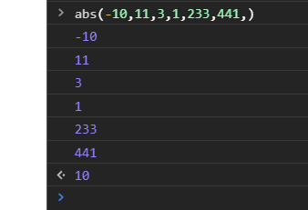

`rest`获取除了已经定义的参数之外的所有参数

```js
function test02(a,b,...rest){
    console.log("a==>"+a);
    console.log("b==>"+b);
    console.log(rest);
}
```

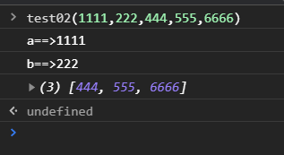

## 变量作用域

> 作用域

在js中,var定义的变量实际是有作用域的,假设在函数体内声明,则在函数体外未定义

```js
//变量的作用域
function test01(){
    var x=1;
    x+=1;
    console.log(x);
}
//会报错,x未定义
// x+=1;
// console.log(x);
```

> 就近原则

```js
function test02(){
    var x=1;
    function test03(){
        var x='A';
        console.log(x);
    }
    test03();
    console.log(x);
}
```

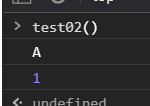

内部函数变量和外部函数变量重名,内部变量会屏蔽到外部变量,就近原则

> 提升作用域

```js
function test04(){
    var x='x + '+y;
    console.log(x);
    var y='y';
}
```

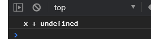

说明`y`声明了但是没有定义

等效于

```js
function test04(){
    var y;
    var x='x + '+y;
    console.log(x);
    y='y';
}
```

JS执行引擎,自动提升了`y`的声明,但是不会提升`y`的赋值

所以JS中所有的变量声明都在代码最前面

> 全局变量

将变量定义在函数外

全局对象 window ,默认全部的全局变量都自动绑定在window对象下

```js
var x="hello";
alert(x);
alert(window.x);
```

本质上,`altert`函数本身也是一个`window`的变量

```js
var x="test";
window.alert(x);
var y=window.alert;
y(x);
window.alert=function (){
}
alert(555);//alert失效
window.alert=y;//alert恢复
alert(123);
```

JS实际上只有一个全局作用域,任何变量(函数也可以视为变量),假设没有在函数作用范围内找到,就会向往查找,如果在全局作用域都没有找到,就会报错

> 如何减少重复变量名冲突

```js
//唯一全局变量
var Kai={};
//定义全局变量
Kai.name="kai";
kai.test01=function(a,b){
    return a+b;
}
```

把自己的代码全部放在自己定义的唯一空间名字中,降低命名冲突的问题

> 局部作用域let

`let`关键字解决局部作用域冲突

```js
function test06(){
    for (let i = 0; i < 100; i++) {
        console.log(i);
    }
    // console.log(i+1);
}
```

建议使用`let`定义变量

> 只读变量const

```js
const PI=3.14;
```

## 方法

> 定义方法:方法就是把函数放在对象里

```js
var kai={
    name:"kai",
    birth:2010,
    // 方法
    age:function (){
        let year = new Date().getFullYear();
        return year-this.birth;
    }
}
//属性
kai.name;
//方法
kai.age();//11
```

```js
function getAge(){
    let year = new Date().getFullYear();
    return year-this.birth;
}
var kai2={
    name:"kai2",
    birth:2011,
    age:getAge
}
kai2.age();//10
getAge();//NaN
```

`this`始终指向调用它的对象

> apply

在JS中,可以控制`this`的指向

```js
getAge.apply(kai,[]);//this指向了kai对象,参数为空
```

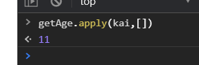

# 内部对象

## Date

```js
let date = new Date();
date.getFullYear();
date.getMonth();//月, 0-11
date.getDate();//日
date.getDay();//星期
date.getHours();

date.getTime();//时间戳
date.toLocaleString();//本地时间
```

## JSON

在JS中,一切皆为对象,任何JS支持类型都可以用JSON来表示

* 对象都用 `{}`
* 数组都用 `[]`
* 所有的键值对,都是 `key : value`

```js
//JSON
var user={
    name:"kai",
    age:18,
    sex:"man"
}
//对象转为JSON字符串
let s1 = JSON.stringify(user);
console.log(s1);
//将JSON字符串转为对象
let obj = JSON.parse("{\"name\":\"kai\",\"age\":18,\"sex\":\"man\"}");
console.log(obj);
```

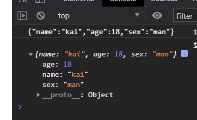

# 面向对象

## 原型

JS和其他面向对象的语言有点区别

```js
//面向对象
var Student={
    name:"student",
    test:function (){
        console.log(this.name+" is testing");
    }
}
var kai={
    name:"kai"
}
//kai的原型是Student
kai.__proto__=Student;
kai.test();//kai is testing
console.log(kai);
```

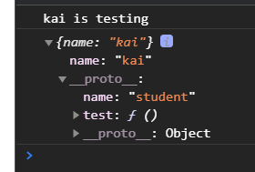

类似于继承

## Class

```js
class Student{
    constructor(name) {
        this.name=name;
    }
    hello(){
        alert("hello");
    }
}
let student = new Student("kai");
student.hello();
```

```js
class Student{
    constructor(name) {
        this.name=name;
    }
    hello(){
        alert("hello");
    }
}
let student = new Student("kai");
//student.hello();

class Book extends Student{
    constructor(name,whose) {
        super(name);
        this.whose=whose;
    }
    bookName(){
        alert(this.whose);
    }
}
let book = new Book("hello","C++");
book.bookName();
book.hello();
```

本质:原型

# 操作BOM

## BOM

BOM:浏览器对象模型

JS和浏览器的关系:

* JS诞生就是为了能够让他在浏览器中运行

## window

window代表浏览器窗口

> Navigator

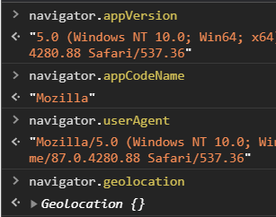

大多数情况不使用这个对象,因为会被人为修改

> screen

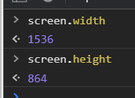

> location

`location`代表当前页面的URL信息

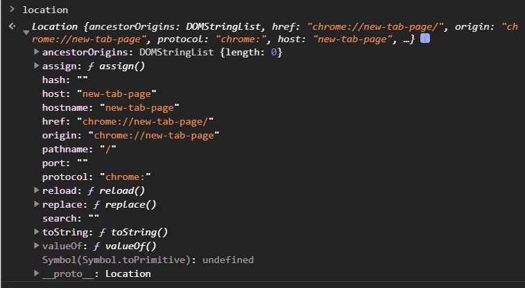
```
host: 主机
href: 当前页面
protocol: 协议
location.reload() 刷新页面
location.assign("https://blog.csdn.net/code_tree") 跳转
```

> document

代表当前页面

```js
document.title;//获取当前页面的标题
document.title="leomaokai";//修改当前页面的标题
```

获取具体的文档树节点

```html
<dl id="app">
    <dt>Java</dt>
    <dd>JavaSE</dd>
    <dd>JavaEE</dd>
</dl>
<script>
    let elementById = document.getElementById("app");
</script>
```

可获取网页的cookie

```
document.cookie
```

> history

代表浏览器的历史记录

```
history.back();//后退
history.forward();//前进
```

# 操作DOM

DOM: 文档对象模型

浏览器页面就是一个Dom树形结构

## DOM节点

> 获取DOM节点

```html
<div id="father">
    <h1>标题一</h1>
    <p id="p1">p1</p>
    <p class="p2">p2</p>
</div>
<script>
    //对应css的选择器
    let h1 = document.getElementsByTagName("h1");
    let p1 = document.getElementById("p1");
    let p2 = document.getElementsByClassName("p2");
    let father = document.getElementById("father");
    let children = father.children;//获取父节点下的所有子节点
    father.firstChild;
    father.lastChild;
</script>
```

> 更新DOM节点

```html
<div id="id1">
</div>
<script>
    let id1 = document.getElementById("id1");
    id1.innerText="hello";//修改文本的值
    id1.innerHTML="<strong>world</strong>";//可以解析标签
    id1.style.color="red";
    id1.style.fontSize="200px";
    id1.style.padding="1em";
</script>
```

> 删除DOM节点

先获取父节点和子节点,再通过父节点删除子节点

```html
<div id="father">
    <h1>标题一</h1>
    <p id="p1">p1</p>
    <p class="p2">p2</p>
</div>
<script>
    let p1 = document.getElementById("p1");
    let father = p1.parentElement;//通过子节点获取父结点
    father.removeChild(p1);
</script>
```

```html
<div id="father">
    <h1>标题一</h1>
    <p id="p1">p1</p>
    <p class="p2">p2</p>
</div>
<script>
    let p1 = document.getElementById("p1");
    let father = p1.parentElement;//通过子节点获取父结点
    father.removeChild(father.children[0]);//删除h1
    father.removeChild(father.children[0]);//删除p1
    father.removeChild(father.children[0]);//删除p2
</script>
```

## 插入DOM节点

先要获得某的Dom节点,假设这个Dom节点是空的,可以通过`innerHTML`就可以增加元素,已经存在元素,则会发生覆盖

> append追加

```html
<p id="js">JavaScript</p>
<div id="list">
    <p id="java">Java</p>
    <p id="cpp">C++</p>
    <p id="py">Python</p>
</div>
<script>
    let list = document.getElementById("list");
    let js = document.getElementById("js");
    list.appendChild(js);//将js节点追加到list子节点
</script>
```

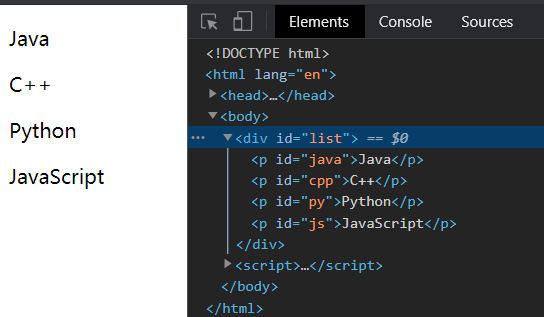

> create创建一个新的标签

```js
//通过js创建一个新的节点
let newP = document.createElement("p");//创建一个p标签
newP.id="newp";//对p标签赋值id
newP.innerText="hello,JS";//赋值文本内容
list.appendChild(newP);//追加
```

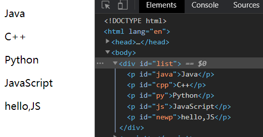

```js
//创建一个新的标签节点
let scriptElement = document.createElement("script");
scriptElement.setAttribute("type","text/javascript");
list.appendChild(scriptElement);
```

通过`setAttribute`可以设置任意的属性值

> insert

```js
let cpp = document.getElementById("cpp");
list.insertBefore(newP,cpp);
```

将newP节点插入到cpp节点前,list是父节点

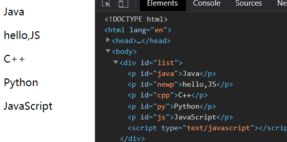

# 操作表单

```
文本框:	text
下拉框:	select
单选框:	radio
多选框:	checkbox
隐藏域:	hidden
密码框:	password
```

表单是为了提交信息

> 获得要提交的信息

```html
<form method="post">
    <p>
        <span>用户名:</span>
        <input type="text" id="username">
    </p>
    <!--多选框的值就是定义好的value值-->
    <p>
        <span>性别:</span>
        <input type="radio" name="sex" id="boy" value="man">man
        <input type="radio" name="sex" id="girl" value="woman">woman
    </p>
</form>
<script>
    let inputID = document.getElementById("username");
    //得到输入框的值
    inputID.value;
    //修改输入框的值
    inputID.value = "helloWorld";
    let boyID = document.getElementById("boy");
    let girlID = document.getElementById("girl");
    //对于单选框,多选等等value只能去固定的值
    boyID.value;
    //checked可以判断是否被选中,如果为true,这被选中
    boyID.checked;
    girlID.checked = true;//选中woman
</script>
```

## 提交表单

MD5工具类

```html
<script src="https://cdn.bootcdn.net/ajax/libs/blueimp-md5/2.18.0/js/md5.min.js"></script>
```

```html
<form action="https://www.baidu.com/" method="post">
    <p>
        <span>用户名:</span>
        <input type="text" id="username" name="username">
    </p>
    <p>
        <span>密码:</span>
        <input type="password" id="input-pwd">
    </p>
    <p>
        <input type="hidden" id="md5-pwd">
    </p>
    <p>
        <!--绑定事件-->
        <button type="submit" onclick="return test()">提交</button>
    </p>
</form>

<script>
    function test() {
        let userName = document.getElementById("username");
        let pwd = document.getElementById("input-pwd");
        let md5pwd = document.getElementById("md5-pwd");
        // console.log(pwd.value);
        // //MD5算法
        // pwd.value=md5(pwd);
        // console.log(pwd.value);
        md5pwd.value=md5(pwd.value);

        //true通过提交,false阻止提交
        return true;
    }
</script>
```

# jQuery

JavaScript 和 jQuery 的关系:

jQuery库,里面存在大量的Javascript的库

## 获取jQuery

```html
<script src="https://cdn.bootcdn.net/ajax/libs/jquery/3.5.1/jquery.js"></script>
```

```html
<a href="" id="test-jquery">ok</a>
<script>
  $("#test-jquery").click(function (){
      alert("hello,jquery");
  })
</script>
```

## 选择器

[中文文档](https://jquery.cuishifeng.cn/index.html)

```html
<script>
    //原生JS选择器
    //标签
    document.getElementsByTagName();
    //id
    document.getElementById();
    //类
    document.getElementsByClassName();

    //jQuery选择器 css中的选择器都可以用
    $('p').click();//p标签选择器
    $('#id').click();//id选择器
    $('.class').click();//类选择器
    
</script>
```

## 事件

```html
<!--获取鼠标当前的坐标-->
mouse:<span id="move"></span>
<div id="divMove">
    移动鼠标
</div>
<style>
    #divMove{
        width:500px;
        height: 500px;
        border:1px solid red;
    }
</style>
<script>
    //当网页元素加载完毕之后,响应事件
    $(function (){
        $('#divMove').mousemove(function (e){
            $('#move').text('x:'+e.pageX+' '+'y:'+e.pageY);
        })
    })
</script>
```

## 操作DOM

```html
<ul id="test">
    <li class="java">Java</li>
    <li name="cpp">C++</li>
</ul>
<script>
    $('#test li[name=cpp]').text('python');//设置值
    $('#test li[class=java]').text()//获得值
    $('#test li[class=java]').html()//获得值
    $('#test li[class=java]').html('<strong>123</strong>')//设置值
    $('#test li[name=cpp]').css({"color":"red"})//修改css
    $('#test li[name=cpp]').show()//显示
    $('#test li[name=cpp]').hide()//隐藏
</script>
```

