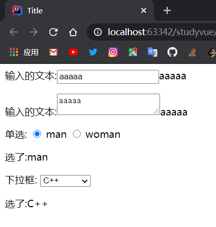
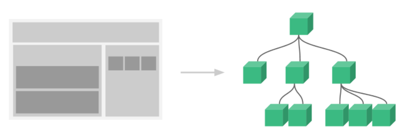
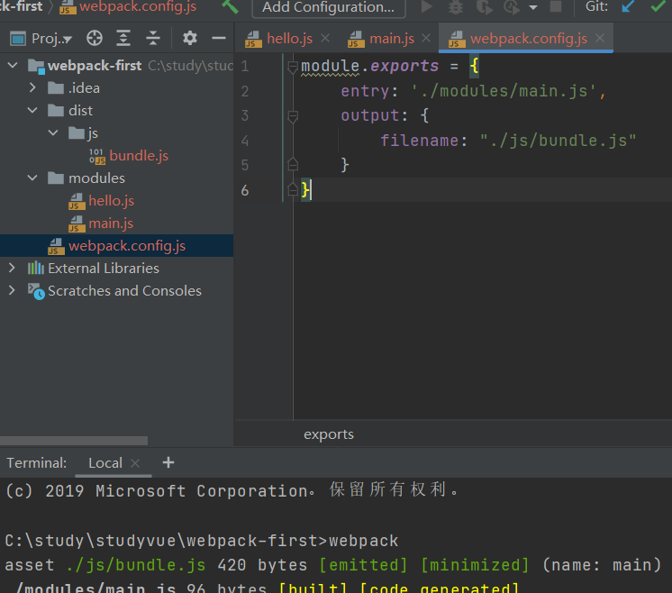
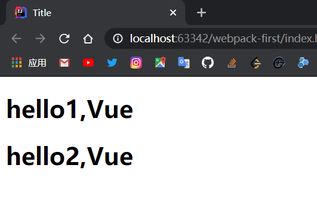

# Vue

Vue是一套用于构建用户界面的渐进式框架,发布于2014年2月,与其它大型框架不同的是,Vue被设计为可以自底向上逐层应用,Vue的核心库只关注视图层,不仅易于上手,还便于与第三方库或既有项目整合

## MVVM模式

Model：模型层，这里表示JS对象

View：视图层，这里表示DOM

ViewModel：连接视图和数据的中间件，Vue.js就是MVVM中ViewModel层的实现者

在MVVM架构中，是不允许数据和视图直接通信的，只能通过ViewModel来通信，而ViewModel就是定义了一个Observer观察者

ViewModel能够观察到数据的变化，并对视图对应的内容进行更新

ViewModel能够监听到视图的变化，并能够通知数据发生改变

Veu.js就是一个MVVM的实现者，其核心就是实现了DOM监听与数据绑定

## 优点

轻量级，压缩后只有20多kb

移动优先，更适合移动端

易上手

吸取了 Angular（模块化）和 React（虚拟DOM）的长处，并拥有自己独特的功能，如计算属性

# HelloWorld

```html
<script src="https://cdn.jsdelivr.net/npm/vue/dist/vue.js"></script>
```

```html
<div id="app">
    {{message}}
</div>

<!--导入Vue.js-->
<script src="https://cdn.jsdelivr.net/npm/vue/dist/vue.min.js"></script>
<script>
    let vm = new Vue({
        el: "#app",
        data: {
            message: "hello,vue!"
        }
    });
</script>
```

# 基本语法

## 判断循环

> v-if

```html
<div id="app">
    <h1 v-if="ok==='A'">A</h1>
    <h1 v-else-if="ok==='B'">B</h1>
    <h1 v-else>C</h1>
</div>
<script src="https://cdn.jsdelivr.net/npm/vue/dist/vue.min.js"></script>
<script>
    let vm = new Vue({
        el: "#app",
        data: {
            ok: 'A'
        }
    });
</script>
```

> v-for

```html
<div id="app">
    <li v-for="item in items">
        {{item.message}}
    </li>
    <p></p>
    <li v-for="(item,index) in items">
        {{item.message}}---{{index}}
    </li>
</div>
<script src="https://cdn.jsdelivr.net/npm/vue/dist/vue.min.js"></script>
<script>
    let vm = new Vue({
        el: "#app",
        data: {
            items:[
                {message:'JavaScript'},
                {message:'Java'},
                {message:'Spring'}
            ]
        }
    });
</script>
```

## 事件绑定

> v-on

```html
<div id="app">
    <button v-on:click="sayHi">click</button>
</div>
<script src="https://cdn.jsdelivr.net/npm/vue/dist/vue.min.js"></script>
<script>
    let vm = new Vue({
        el: "#app",
        data: {
            message:"hello"
        },
        //方法必须定义在Vue的methods中
        methods:{
            sayHi:function (){
                alert(this.message);
            }
        }
    });
</script>
```

方法必须定义在Vue的methods中

## 双向绑定

Vue.js 是一个MVVM框架，即数据双向绑定，即当数据发生变化时，视图也就发生变化，当视图法生变化的时候，数据也会跟着同步变化

可以用`v-mode`指令在表单`<input>,<textarea>,<select>`元素上创建双向数据绑定，他会根据控件类型自动选取正确的方式来更新元素

```html
<div id="app">
    输入的文本:<input type="text" v-model="message">{{message}}
    <p></p>
    输入的文本:<textarea v-model="message"></textarea>{{message}}
</div>
<p></p>
<div id="app2">
    单选:
    <input type="radio" name="sex" v-model="message" value="man"> man
    <input type="radio" name="sex" v-model="message" value="woman"> woman
    <p>
        选了:{{message}}
    </p>
</div>
<div id="app3">
    下拉框:
    <select v-model="message">
        <option value="">--请选择--</option>
        <option>Java</option>
        <option>C++</option>
        <option>Python</option>
    </select>
    <p>
        选了:{{message}}
    </p>
</div>
<script src="https://cdn.jsdelivr.net/npm/vue/dist/vue.min.js"></script>
<script>
    let vm = new Vue({
        el: "#app",
        data:{
            message:""
        }
    });
    let vm2 = new Vue({
        el: '#app2',
        data:{
            message: ""
        }
    });
    let vm3 = new Vue({
        el:"#app3",
        data:{
            message:""
        }
    });
</script>
```



## 组件

组件时可复用的`Vue`实例，可重复使用的模板

例如：博客有页头、侧边栏、内容区等组件，每个组件又包含了其它的像导航链接、博文之类的组件




```html
<div id="app">
    <!--自定义组件 v-for遍历数组,v-bind绑定参数-->
    <kai v-for="i in items" v-bind:item="i"></kai>
</div>
<script src="https://cdn.jsdelivr.net/npm/vue/dist/vue.min.js"></script>
<script>
    //component组件，kai为组件名
    Vue.component("kai", {
        props: ['item'],//接收参数
        template: '<li>{{item}}</li>'
    });
    let vm = new Vue({
        el: "#app",
        data: {
            items: ["java", "Linxu", "cpp"]
        },
    });
</script>
```

# Axios异步通信

Axios 是一个开源的可以在浏览器端和 NodeJS 的异步通信框架，主要作用是实现 AJAX异步通信，功能特点

* 从浏览器中创建`XMLHttpRequest`
* 从`node.js`创建`http`请求
* 支持`Promise API`(JS链式编程)
* 拦截请求和响应
* 转换请求数据和响应数据
* 取消请求
* 自动转换JSON数据
* 客户端支持防御`XSRF`(跨站请求伪造)

[GitHub](https://github.com/axios/axios)

[中文文档](http://axios-js.com/)

```html
<!--v-clock解决闪烁问题-->
<style>
    [v-clock] {
        display: none;
    }
</style>
<div id="vue" v-clock>
    <div>
        {{info.name}}
        <p></p>
        <a v-bind:href="info.url">aa</a>
    </div>
</div>
<script src="https://cdn.jsdelivr.net/npm/vue/dist/vue.min.js"></script>
<script src="https://unpkg.com/axios/dist/axios.min.js"></script>
<script type="text/javascript">
    let vm = new Vue({
        el: '#vue',
        data() {
            return {
                info: {
                    name: null,
                    address: {
                        stress: null,
                        city: null,
                        country: null
                    },
                    url: null
                }
            }
        },
        //钩子函数
        mounted() {
            axios.get('../data.json').then(response => (this.info = response.data));
        }
    });
</script>
```

# 计算属性

一个能够将计算结果缓存起来的属性,将行为转化成了静态的属性,可以想象为缓存

```html
<div id="app">
    <p>currentTime:{{sayHi()}}</p>
    <p>currentTime:{{sayHello}}</p>
</div>
<script src="https://cdn.jsdelivr.net/npm/vue/dist/vue.min.js"></script>
<script>
    let vm = new Vue({
        el: "#app",
        data: {
            message:"hello"
        },
        //方法必须定义在Vue的methods中
        methods:{
            sayHi:function (){
                return Date.now();
            }
        },
        computed:{  //计算属性
            sayHello:function (){
                return Date.now();
            }
        }
    });
</script>
```

* method：定义方法，调用方法需要使用`()`
* computed：定义计算属性，使用时不需要带括号，会将结果缓存
* 如果计算属性中的某一个值发生了变化，缓存就会更新

计算数学特性就是为了将不经常计算结果进行缓存，以节约我们的系统开销

# 插槽slot

在`Vue.js`中我们使用`<slot>`元素作为承载分发内容的出口，可以应用在组合组件场景中

```html
<div id="app">
    <todo>
        <todo-title slot="todo-title" :title="title"></todo-title>
        <todo-items slot="todo-items" v-for="item in todoItems" :item="item"></todo-items>
    </todo>
</div>
<script src="https://cdn.jsdelivr.net/npm/vue/dist/vue.min.js"></script>
<script>
    //slot:插槽
    Vue.component("todo",{
        template:
            '<div>'+
                '<slot name="todo-title"></slot>'+
                '<ul>' +
                    '<slot name="todo-items"></slot>'+
                '</ul>'+
            '</div>'
    });
    Vue.component("todo-title",{
        props:['title'],
        template:'<p>{{title}}</p>'
    });
    Vue.component("todo-items",{
        props: ['item'],
        template:'<li>{{item}}</li>'
    });
    let vm = new Vue({
        el: "#app",
        data:{
            title:"leomaokai",
            todoItems:['Java','Cpp','Python']
        }
    });
</script>
```

# 自定义事件

```html
<div id="app">
    <todo>
        <todo-title slot="todo-title" :title="initTitle"></todo-title>
        <todo-items slot="todo-items" v-for="(i_item,j_index) in todoItems"
                    :item="i_item" :index="j_index"
                    v-on:remove="removeItem(j_index)"></todo-items>
    </todo>
</div>
<script src="https://cdn.jsdelivr.net/npm/vue/dist/vue.min.js"></script>
<script>
    //slot:插槽
    Vue.component("todo",{
        template:
            '<div>'+
                '<slot name="todo-title"></slot>'+
                '<ul>' +
                    '<slot name="todo-items"></slot>'+
                '</ul>'+
            '</div>'
    });
    Vue.component("todo-title",{
        props:['title'],
        template:'<p>{{title}}</p>'
    });
    Vue.component("todo-items",{
        props: ['item','index'],
        //只能绑定当前组件的方法
        template:'<li>{{index}}---{{item}}-<button @click="remove">del</button></li>',
        methods:{
            remove:function (index){
                //自定义事件分发
                this.$emit("remove",index);
            }
        }
    });
    let vm = new Vue({
        el: "#app",
        data:{
            initTitle:"leomaokai",
            todoItems:['Java','Cpp','Python']
        },
        methods: {
            removeItem:function (index){
                this.todoItems.splice(index,1);//一次删除一个元素
            }
        }
    });
</script>
```

# 入门小结

核心：数据驱动，组件化

有点：借鉴了 AngulaJS 的模块化开发和 React 的虚拟 Dom，虚拟 Dom 就是把 Dom 操作放到内存中执行

常用的属性：

* v-if
* v-else-if
* v-else
* v-for
* v-on 绑定事件，简写`@`
* v-model 数据双向绑定
* v-bind 给组件绑定参数，简写`:`

组件化：

* 组合组件 slot 插槽
* 组件内部绑定事件需要使用的`this.$emit("事件名",参数);`
* 计算属性的特色，缓存计算数据

遵循 SoC 关注分离原则，Vue 是纯粹的视图框架，并不包含比如 Ajax 之类的通信功能，为了解决通信问题，我们需要使用 Axios 框架做异步通信

# Vue-cli

Vue-cli 官方提供的一个脚手架，用于快速生成一个vue的项目模块

需要安装 Node.js 

cmd下输入`node -v`查看版本号

cmd下输入`npm -v`查看版本号

```
#安装淘宝镜像加速
npm install cnpm -g
```

安装位置C盘用户的`AppData\Roaming\npm`下

```
#安装vue-cli
cnpm install vue-cli -g

#测试是否安装成功
vue list
```

```
#在目录下创建vue-cli程序
vue init webpack myvue
#myvue为目录名
#一路选择no
```

```
#初始化并运行
cd myvue
npm install
npm run dev
```

# Webpack

本质上 Webpack 是现代化 JavaScript 应用程序的静态模块打包器，当 Webpack 处理应用程序时，他会递归地构建一个依赖关系图，其中包含应用程序需要的每个模块，然后将所有这些模块打包成一个或多个 bundle

WebPack 是一款模块加载器兼打包工具，他能把各种资源，如JS、JSX、ES6、SASS、LESS、图片等作为模块来处理和使用

```
#安装
npm install webpack -g
npm install webpack-cli -g
#测试安装成功 
webpack -v
webpack-cli -v
```

创建`webpack.config.js`配置文件

* entry：入口文件，指定 WebPack 用哪个文件作为项目的入口
* output：输出，指定 WebPack 把处理完成的文件放置到指定路径
* module：模块，用于处理各种类型的文件
* plugins：插件，如热更新、代码重用等
* resolve：设置路径指向
* watch：监听，用于设置文件改动后直接打包

```js
//hello.js
//暴露一个方法
exports.sayHi1 = function () {
    document.write("<h1>hello1,Vue</h1>")
}
exports.sayHi2 = function () {
    document.write("<h1>hello2,Vue</h1>")
}
exports.sayHi3 = function () {
    document.write("<h1>hello3,Vue</h1>")
}
exports.sayHi4 = function () {
    document.write("<h1>hello4,Vue</h1>")
}
```

```js
//main.js
//接收一个方法
let hi = require("./hello");
//调用方法
hi.sayHi1();
hi.sayHi2();
```

```js
//webpack.config.js
module.exports = {
    entry: './modules/main.js',
    output: {
        filename: "./js/bundle.js"
    }
}
```



```html
<!DOCTYPE html>
<html lang="en">
<head>
    <meta charset="UTF-8">
    <title>Title</title>
</head>
<body>
    <!--引入打包后的js文件，前端的模块化开发-->
<script src="dist/js/bundle.js"></script>
</body>
</html>
```



# Vue Router

Vue Router 是 Vue.js 官方的路由管理器，他和 Vue.js 的核心深度集成，让构建单页面应用变得易如反掌，其功能有：

* 嵌套的路由/视图表
* 模块化、基于组件的路由配置
* 路由参数、查询、通配符
* 基于 Vue.js 过渡系统的视图过滤效果
* 细粒度的导航控制
* 带有自动激活的 CSS class 的链接
* HTML5 历史模式或 hash 模式，在 IE9 中自动降级
* 自定义的滚动条行为

```
#在工程目录下安装vue-router
npm install vue-router --save-dev
```

```js
//如果在一个模块化工程中使用它，必须通过Veu.use()明确地安装路由功能
import Vue from 'Vue'
import vueRouter from 'vue-router'

Vue.use(VueRouter);
```

