# HTTP/1.1

## 什么是HTTP

#### 浏览器发起HTTP请求的典型场景

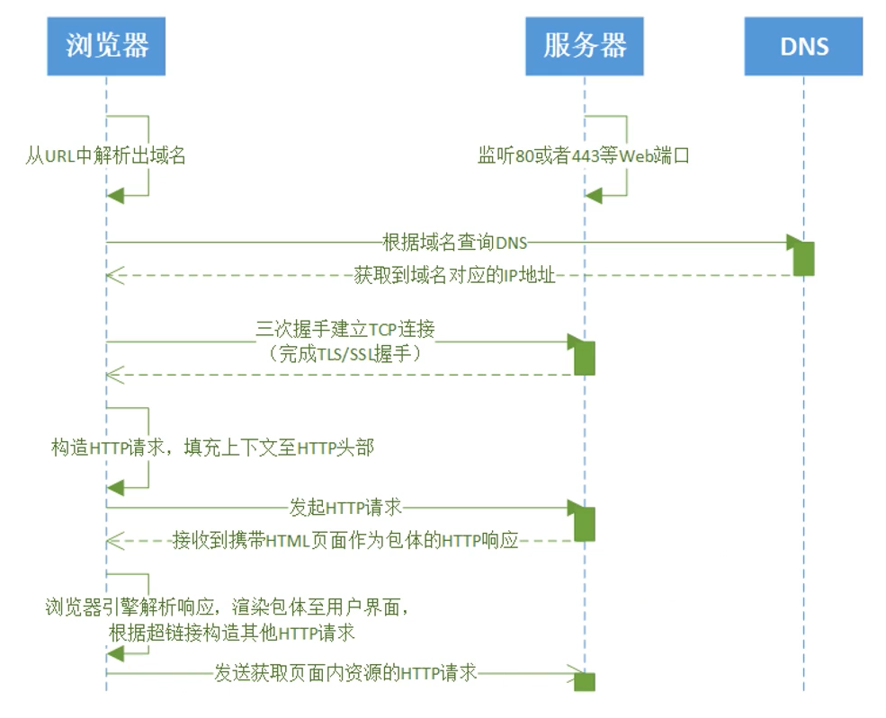

* 首先有一个服务器监听打开了80或443等Web端口
* 浏览器从URL中解析出域名
* 根据域名查询DNS获取到与域名对应的IP地址
* 浏览器与服务器进行三次握手建立TCP连接,如果使用的是HTTPS还要完成TLS/SSL握手
* 建立连接后,构造HTTP请求,填充上下文至HTTP头部
* 然后浏览器发向服务器发起HTTP请求,服务器接收到请求后发出响应,浏览器接收携带HTML页面作为包体的HTTP响应
* 浏览器引擎解析接收到的响应,渲染包体至用户界面,并根据超链接构造其它HTTP请求
* 浏览器再次发起新的HTTP请求

#### HTTP协议

Hypertext Transfer Protocol(HTTP)协议:

一种**无状态的**(stateless)、应用层的、以**请求/应答**(request/response)方式运行的协议，它使用**可扩展的语义**(extensible semantics)和**自描述**(self-descriptive)消息格式，与基于**网络的超文本信息**(hypertext information)系统灵活的互动。

* 无状态:前后两个请求相互之间无影响

* 请求/应答:基于连接,首先由客户端发起请求,然后服务器才能在这个连接上发起响应

* 可扩展的语义:例如服务器仍使用HTTP1.0版本,不支持1.1版本,而浏览器支持1.1版本,浏览器和服务器之间仍可以连接

* 自描述:浏览器和服务器之间传递的消息是自描述的消息,从一个请求中我们可知道这段消息是视频还是照片,不需要依赖其它请求

* 超文本信息:浏览器和服务器所传递的不仅仅是文本消息,还可以是视频图片等

## HTTP格式

#### 环境搭建

```jsp
<%--一个简单的使用post方式登录的页面--%>
<html>
    <head>
        <title>登录</title>
    </head>
    <body>
        <h1>登录</h1>
        <div style="text-align:center">

            <%--以post方式提交表单,提交到我们的login请求--%>
            <form action="${pageContext.request.contextPath}/login" method="post">
                用户名:<input type="username" name="username"><br>
                密码:<input type="password" name="password"><br>
                爱好:
                <input type="checkbox" name="hobby" value="C++">C++
                <input type="checkbox" name="hobby" value="Java">Java
                <input type="checkbox" name="hobby" value="Python">Python
                <input type="checkbox" name="hobby" value="Linux">Linux
                <br>
                <input type="submit">
            </form>
        </div>
    </body>
</html>
```

* 启动tomcat
* 在Chrome浏览器中输入本页面的URL地址
* 打开浏览器的Networt面板后刷新

#### 具体格式

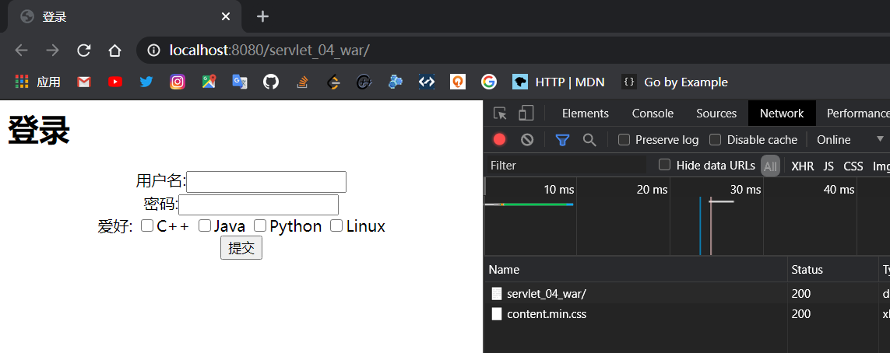

查看左边的`servlet_04_war`的内容,查看请求和响应

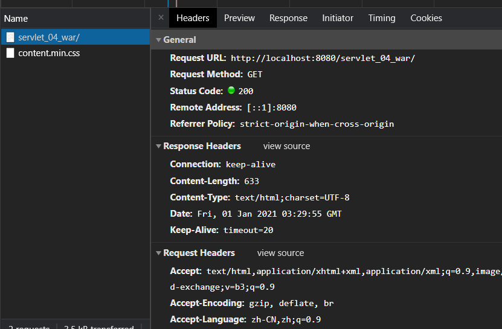

得到了这个网页的请求和响应的格式

```bash
#General 总体
Request URL: http://localhost:8080/servlet_04_war/	#URL地址
Request Method: GET		#请求方式为get
Status Code: 200 		#请求状态为200
Remote Address: [::1]:8080
Referrer Policy: strict-origin-when-cross-origin
```

```bash
#Response Headers	响应体
Connection: keep-alive	#保持连接
Content-Length: 633
Content-Type: text/html;charset=UTF-8	#编码格式
Date: Fri, 01 Jan 2021 03:29:55 GMT		#相应时间
Keep-Alive: timeout=20
```

```bash
#Request Headers 请求体
Accept: text/html	#告诉浏览器所支持的数据类型
Accept-Encoding: gzip, deflate, br	#支持的编码格式
Accept-Language: zh-CN,zh;q=0.9		#语言格式
Cache-Control: max-age=0		#缓存控制
Connection: keep-alive		 #告诉浏览器请求完成断开还是保持连接
Cookie: JSESSIONID=CFCB457D91C5FA97755059685253A5BD #缓存
Host: localhost:8080
```

#### ABFN核心规则

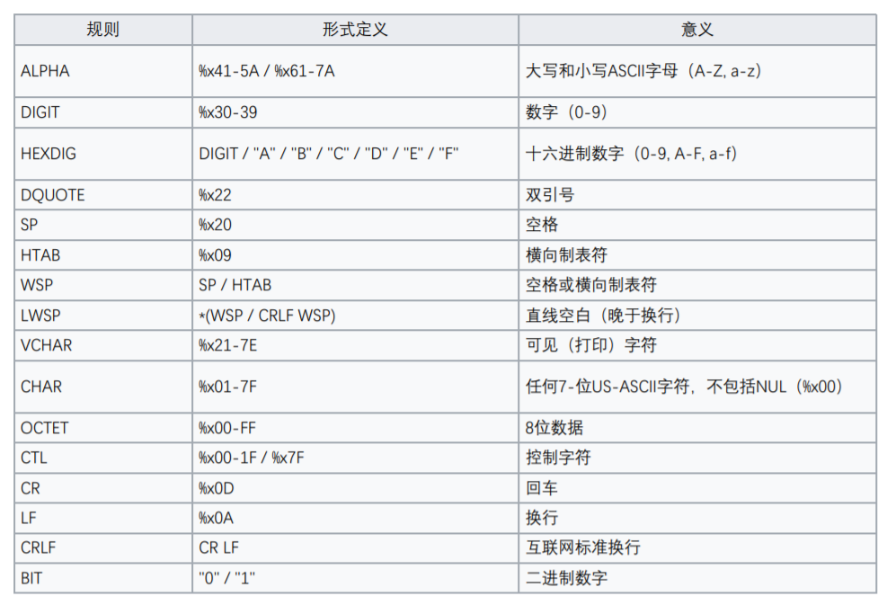

使用Wireshark分析HTTP格式

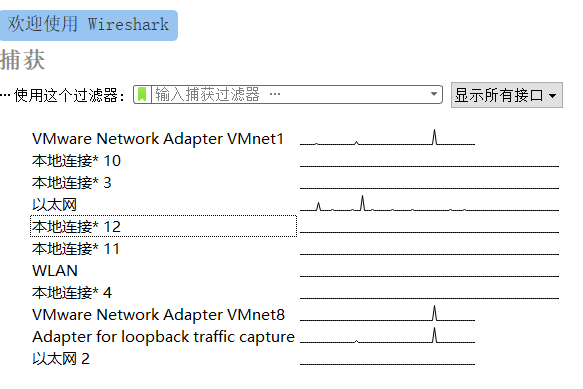

目前我各个网卡的流量

使用上方的捕获功能,对以太网80端口进行抓包

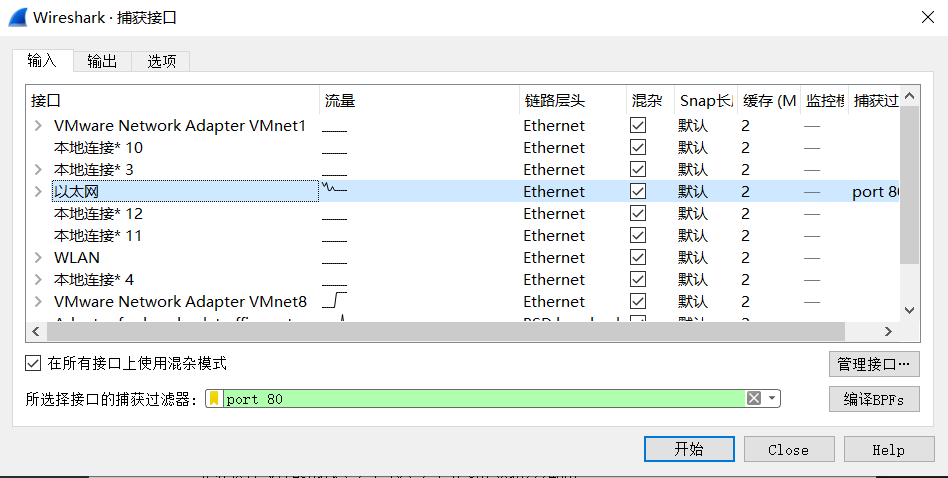

使用Xshell终端工具

```
先输入:  telnet www.taohui.pub 80
按回车后出现:  Trying 116.62.160.193...
              Connected to www.taohui.pub.
              Escape character is '^]'.
再输入:	  GET /wp-content/plugins/Pure-Highlightjs_1.0/assets/pure-highlight.css?ver=0.1.0 HTTP/1.1
回车后输入:  Host:www.taohui.pub
```

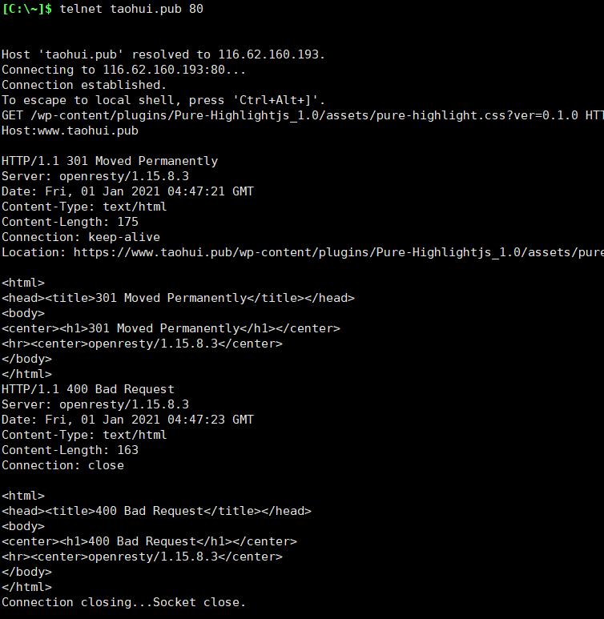

查看Wireshark并停止抓包

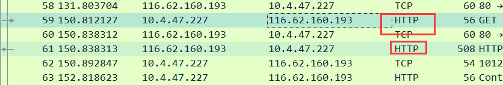

这是得到的HTTP请求和响应的报文,双击打开报文

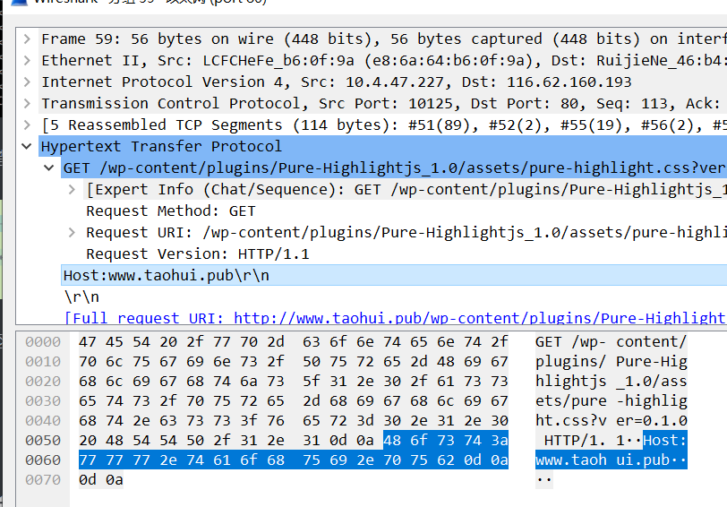

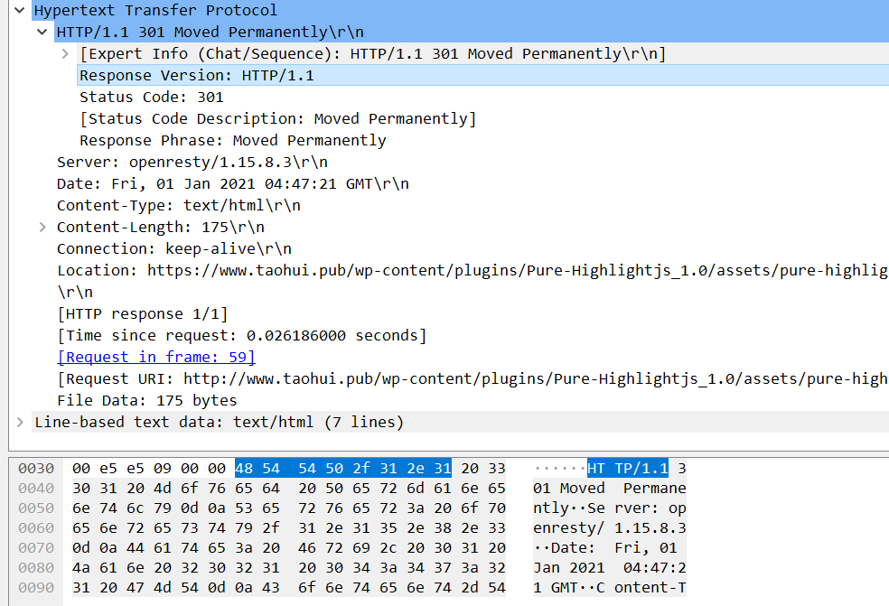

通过16进制与ABFN规则进行对比,可以清楚每一个HTTP的具体格式

## 网络分层

#### OSI概念模型

具体每一层的功能可查阅相关书籍

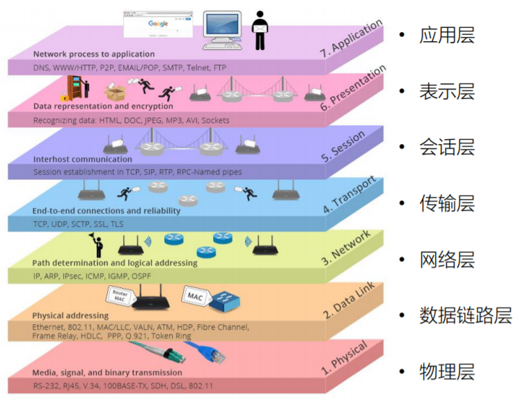

#### TCP/IP模型

OSI仅为概念模型,实际中使用TCP/IP模型

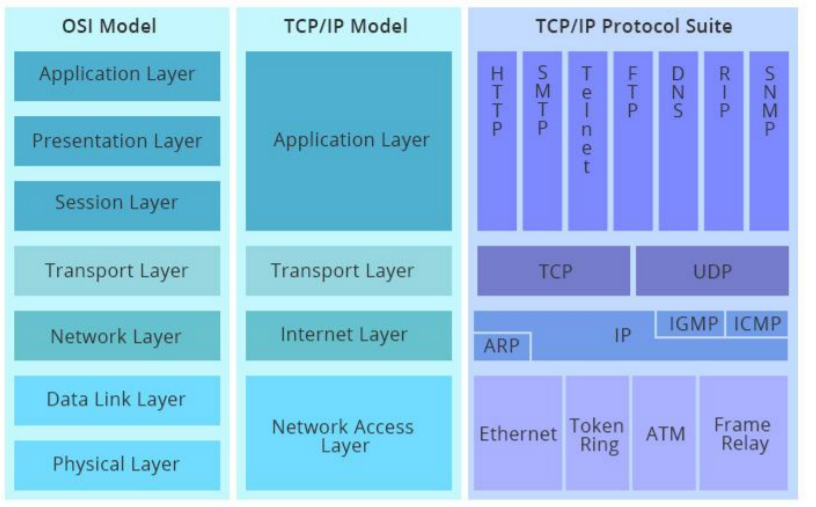

通过分层,每层只与外层进行交互而不会影响其内层

#### 报文分析

使用Wireshark打开一个报文

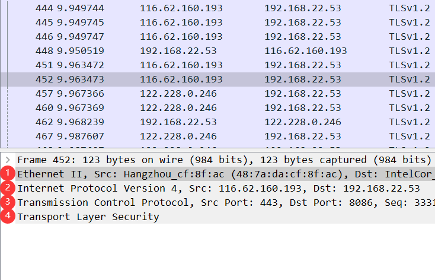

1、2、3、4分别为TCP/IP模型中的物理层、网络层、传输层和应用层，打开可以查看每一层的具体信息

## Web架构

#### 架构原则

* 性能Performance：影响高可用的关键因素
* 可伸缩性Scalability：支持部署可以相互交互的大量组件
* 简单性Simplicity：易理解、易实现、易验证
* 可见性Visiable：对两个组件间的交互进行监视后者仲裁的能力
* 可移植性Portability：在不同环境下运行的能力
* 可靠性Reliability：出现部分故障时，对整体影响的程度
* 可修改性Modifiability：对系统做出修改的难易程度，由可进化性、可定制性、可扩展性、可配置性、可重用性构成

#### 性能

* 网络性能：吞吐量，开销
* 用户感知到的性能：延迟、完成时间
* 网络效率：重用缓存、减少交互次数、传输距离

#### 可修改性

* 可进化性：一个组件独立升级而不影响其他组件
* 可扩展性：想系统添加功能，而不会影响到系统的其他部分
* 可定制性：临时性、定制性地更改某一要素来提供服务，不对常规客户产生影响
* 可配置性：应用部署后可通过修改配置提供新的功能
* 可重用性：组件可以不做修改在其他应用上使用

#### REST架构

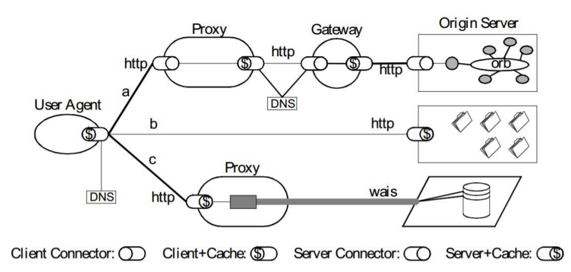

浏览器可以通过3条路径找到服务器，充分体现了架构原则

#### 架构风格

数据流风格：Data-flow Styles

* 优点：简单性、可进化性、可扩展性、可配置性、可重用性

复制风格：Replication Styles

* 优点：用户可察觉的性能、可伸缩性、网络效率、可靠性

分层风格：Hierarchical Styles

* 优点：简单性、可进化性、可伸缩性

移动代码风格：Mobile Code Styles

* 优点：可移植性、可扩展性、网络效率

点对点风格：Peer-to-Peer Styles

* 优点：可进化性、可重用性、可扩展性、可配置性

## NetWork

使用Chrome抓包可以快速定位HTTP协议问题

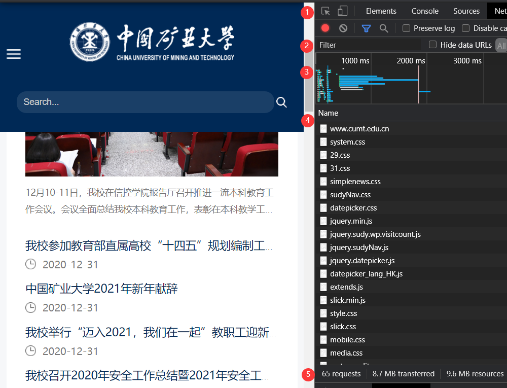

按Ctrl+Shift+i打开ChromeNetWork面板，访问中国矿业大学主页，可以观察到Network面板的变化。

* 第一部分是控制器，控制面板的外观和功能
* 第二部分是过滤器，用于过滤请求列表中显示的资源
* 第三部分是概览，显示HTTP请求，响应的时间轴
* 第四部分是请求列表，可以点击请求查看请求的详细信息
* 第五部分是概要，显示请求总数、总数据量、总花费时间等

## URI

URL：Uniform Resource Locator，表示资源的位置，期望提供查找资源的方法

URN：Uniform Resource Name，期望为资源提供持久的、位置无关的标识方式，并允许简单地将多个命名空间映射到单一URN命名空间

URI：Uniform Resource Identifier，用以区分资源，是URL和URN的超集，用以取代URL和URN概念

Uniform Resource Identifier，统一资源标识符，资源可以是图片、文档等，可以是不能痛过互联网访问的实体，也可以是抽象的概念，一个资源可以有多个URI，Identifier标识符将当前资源与其他资源区分开的名称，Uniform允许不同种类的资源在同一上下文中出现，对不同种类的资源标识符可以使用同一种语义进行解读，引入新标识符时，不会对已有标识符产生影响，允许同一资源标识符在不同的、internet规模下的上下文中出现

URI的组成：schema，user information，host，port，path，query，fragment

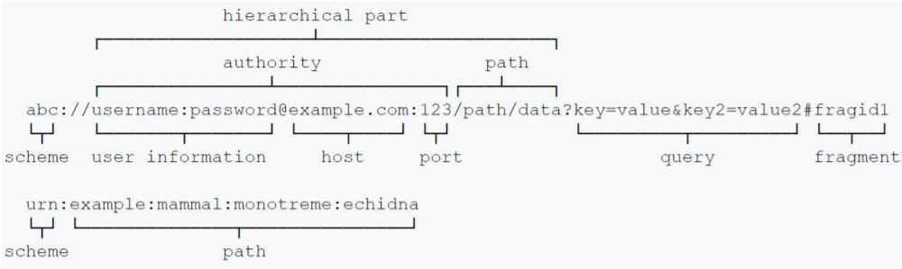

## HTTP请求行

请求行=请求方法+请求目的+版本号

```
request-line = method SP request-target SP HTTP-version CRLF
method 方法：指明操作目的，动词
request-target = origin-form / absolute-form / authority-form / asterisk-form
HTTP-version 版本号
```

GET和POST请求有什么不同：

* 协议格式不同，特别是POST请求中的包体，就存在表单包体，以及多元素表单，非表单包体等
* 应用场景不同，GET用于获取资源，POST则是修改资源，防火墙更多针对的是POST请求，POST请求也要更复杂

## HTTP响应行

响应行=版本号+响应码+描述信息

```
status-line = HTTP-version SP status-code SP reason-phrase CRLF
```

响应状态码:  200:请求响应成功  3xx:请求重定向  404:找不到资源  500:服务器代码出错  502:网关错误

# HTTP/2

## HTTP/2

如今，Web传输从几KB大小的消息到几MB大小的消息，从每个页面小于10个资源到每个页面100多个资源，从文本为主的内容，到富媒体为主的内同，对页面内容实时性要求的应用越来越多。

HTTP/1.1的问题：

* 高延迟问题，高延迟带来页面加载速度的降低，随着带宽的增加，延迟并没有显著下降。且并发连接有限，同一连接同时只能完成一个HTTP事务才能处理下一个事务
* 无状态特性带来的巨大HTTP头部

什么是HTTP/2：

* 在应用层上修改，基于并充分挖掘TCP协议性能
* 客户端向server发送request这种基本模型不会变
* 没有改变HTTP/1.1的语义
* 多路复用带来的提升

访问https://http2.akamai.com/demo可以查看HTTP2与HTTP1的区别

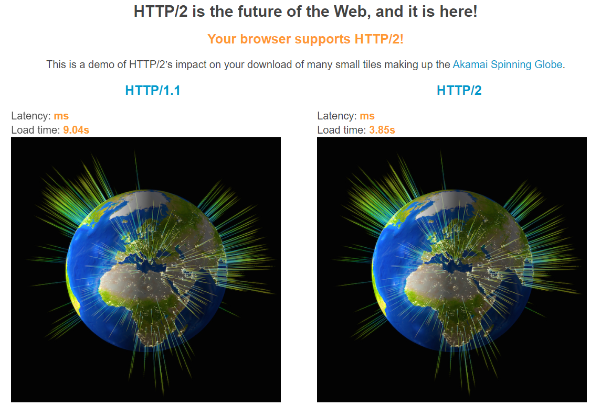

同样是加载一张图片，HTTP/1.1需要9.04s，而HTTP/2仅需要3.85s

通过抓包工具再次观察其区别

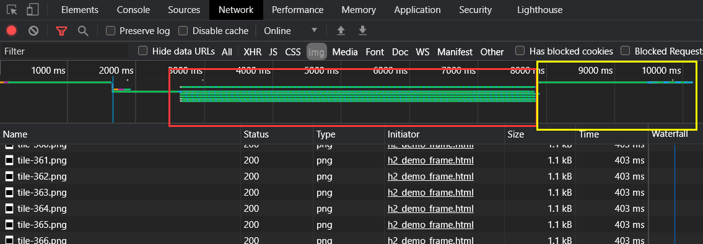

红框为HTTP/1的请求，并发6个连接而且速度慢

黄框为HTTP/2的请求，只有一个请求且速度快

HTTP/2的主要特性：

* 传输数据量大幅减少，以二进制方式传输，标头压缩
* 多路复用及相关功能，消息优先级
* 服务器消息推送，并行推送

HTTP/2的问题:

HTTP/2 解决了 Web 上的许多问题，但不是全部。在 TCP 协议级别上仍然存在类似类型的线头问题，而 TCP 仍然是 Web 的基础构建块。当 TCP 数据包在传输过程中丢失时，在服务器重新发送丢失的数据包之前，接收方无法确认传入的数据包。由于 TCP 在设计上不遵循 HTTP 之类的高级协议，因此单个丢失的数据包将阻塞所有进行中的 HTTP 请求的流，直到重新发送丢失的数据为止。这个问题在不可靠的连接上尤为突出，这在无处不在的移动设备时代并不罕见。

## HTTP/3

由于 HTTP/2 的问题不能仅靠应用程序层来解决，因此协议的新迭代必须更新传输层。但是，创建新的传输层协议并非易事。传输协议需要硬件供应商的支持，并且需要大多数网络运营商的部署才能普及。由于此事涉及的成本和工作量，运营商们不愿进行更新。以 IPv6 为例：它是 24 年前推出的，但如今距离获得普遍支持还有很远的距离。

幸运的是还有另一种选择。UDP 协议与 TCP 一样得到广泛支持，但前者足够简单，可以作为在其之上运行的自定义协议的基础。UDP 数据包是一劳永逸的：没有握手、持久连接或错误校正。HTTP3 背后的主要思想是放弃 TCP，转而使用基于 UDP 的 QUIC 协议。QUIC 以对 Web 环境有意义的方式添加了许多必要的功能（包括以前由 TCP 提供的功能，以及更多功能）。

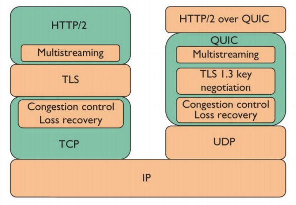

# TLS/SSL

HTTP协议使用起来非常方便，但是它存在一个致命的缺点：不安全。

HTTPS其实就是SSL+HTTP的简称，如今SSL已经被TLS取代。

TLS设计目的：身份验证，保密性，完整性。

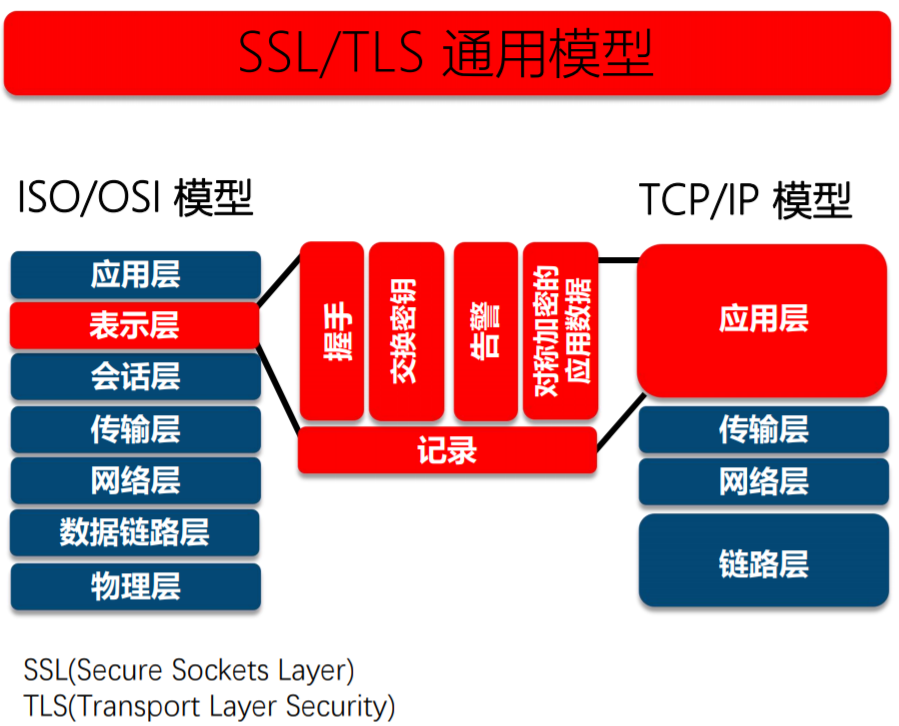

TLS安全加密套件：

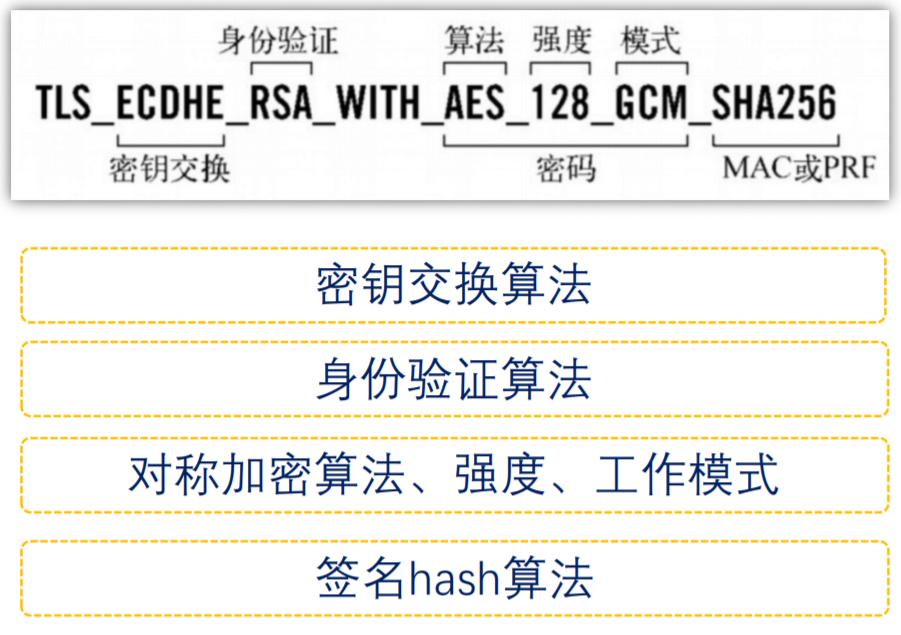

## 对称加密算法

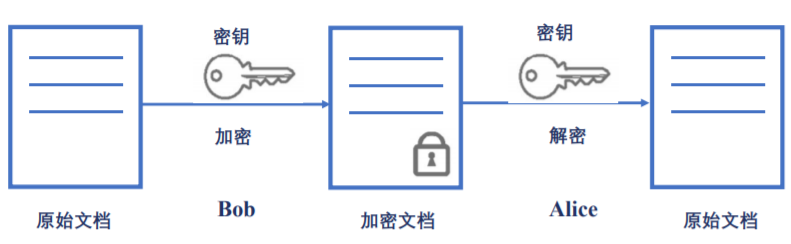

在对称加密算法中，加密和解密使用同一个密钥，如Bob和Alice使用同一个密钥进行加密通信。

密钥与明文进行异或运算得到密文

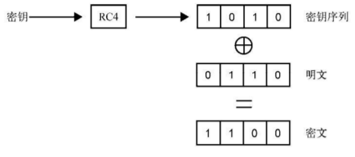

对称加密的问题：如何将密钥传递给双方。

## 非对称加密

非对称密码即每一个参与方都有一对密钥，为公钥和私钥，公钥想对方公开，私钥仅自己使用。如果Alice与Bob通信，Alice可以得到Bob的公钥，使用Bob的公钥对信息进行加密，而这个信息，只有Bob的私钥可以解开，即使用对方的公钥加密消息，使用自己的私钥解密消息。

PSA算法中公私钥的产生：

* 随机选择两个不相等的质数 p 和 q 
* 计算 p 和 q 的乘积 n
* 计算 n 的欧拉公式 v
* 随机选择一个整数 k，1< k < v，且 k 与 v 互质
* 计算 k 对于 v 的模反元素 d 
* 公钥：( k,n )
* 私钥：( d,n)
