# Docker

Docker 是基于Go语言开发的

* 传统虚拟机：虚拟出一套硬件，运行一个完整的操作系统，然后在这个系统上安装和运行软件

* 容器内的应用直接运行在宿主机的内核上，容器是没有自己的内核的，也没有虚拟硬件，所以很轻便

* 每个容器间是互相隔离的，每个容器内都有一个属于自己的文件系统，互不影响

DevOps（开发、运维）

**应用更快速地交互和部署**

Docker：打包镜像，发布测试，一键运行

**更便捷地升级和扩缩容**

打包成一个镜像，扩展服务

**更简单地系统运维**

**更高效地计算资源利用**

Docker是内核级别的虚拟化，服务器的性能可以压榨到极致

https://docs.docker.com/

# 安装

## 基本组成


镜像(image)：类似于模板，可以通过这个镜像创建容器服务，通过镜像可以创建多个服务，最终服务运行在容器中

容器(container)：Docker利用容器技术独立运行一个或一组应用，通过镜像来创建

仓库(repository)：仓库就是存放镜像的地方，分为公有仓库和私有仓库


## 安装

```bash
# 系统内核3.10以上
[root@iZ8vb7zutfxx5a3uhxmnksZ /]# uname -r
3.10.0-1062.18.1.el7.x86_64
```

```bash
# 系统版本
[root@iZ8vb7zutfxx5a3uhxmnksZ /]# cat /etc/os-release
NAME="CentOS Linux"
VERSION="7 (Core)"
ID="centos"
ID_LIKE="rhel fedora"
VERSION_ID="7"
PRETTY_NAME="CentOS Linux 7 (Core)"
ANSI_COLOR="0;31"
CPE_NAME="cpe:/o:centos:centos:7"
HOME_URL="https://www.centos.org/"
BUG_REPORT_URL="https://bugs.centos.org/"

CENTOS_MANTISBT_PROJECT="CentOS-7"
CENTOS_MANTISBT_PROJECT_VERSION="7"
REDHAT_SUPPORT_PRODUCT="centos"
REDHAT_SUPPORT_PRODUCT_VERSION="7"
```

```bash
# 卸载旧的版本
yum remove docker \
        docker-client \
        docker-client-latest \
        docker-common \
        docker-latest \
        docker-latest-logrotate \
        docker-logrotate \
        docker-engine
# 需要的安装包
yum install -y yum-utils
# 设置镜像的仓库  阿里云镜像
yum-config-manager \
    --add-repo \
    https://mirrors.aliyun.com/docker-ce/linux/centos/docker-ce.repo
# 更新yum软件包索引
yum makecache fast
# 安装最新版Docker引擎 社区版
yum install docker-ce docker-ce-cli containerd.io
# 启动Docker 
systemctl start docker
# 版本
docker version
# 测试helloworld
docker run hello-world
# 查看下载的hello镜像
docker images
```

docker的默认工作路径 `/var/lib/docker` 

阿里云配置加速


```
sudo mkdir -p /etc/docker
sudo tee /etc/docker/daemon.json <<-'EOF'
{
  "registry-mirrors": ["https://q46j78jy.mirror.aliyuncs.com"]
}
EOF
sudo systemctl daemon-reload
sudo systemctl restart docker
```

# 原理

## 运行流程


## 底层原理

Docker是一个 Client-Server 结构的系统，Docker 的守护进程运行在主机上，通过Socket 从客户端访问

DockerServer 接收到 Docker-client的命令，就会执行这个命令


docker为什么比虚拟机快？

* docker有着比虚拟机更少的抽象层


新建一个容器的时候，Docker不需要像虚拟机一样重新加载一个操作系统内核，避免引导，利用宿主机的操作系统，省略了复杂的过程

# 常用命令

[官方文档](https://docs.docker.com/reference/)

## 帮助命令

```bash
docker version	#显示docker的版本信息
docker info		#显示docker的系统信息，包括镜像和容器的数量
docker 命令 --help  #万能命令
```

## 镜像命令

```bash
docker images	#查看所有镜像
[root@iZ8vb7zutfxx5a3uhxmnksZ /]# docker images
REPOSITORY    TAG       IMAGE ID       CREATED         SIZE
hello-world   latest    bf756fb1ae65   12 months ago   13.3kB

#解释
REPOSITORY	#镜像的仓库源
TAG			#镜像的标签
IMAGE ID	#镜像的ID
CREATED		#镜像的创建时间
SIZE		#镜像的大小

# Options:
-a, --all	#列出所有镜像
-q, --quiet	#只显示镜像ID
```

```bash
docker search	#搜索镜像
#可选项
--filter=STARTS=3000	#搜索出来的镜像STARTS大于3000的
```

```bash
docker pull		#下载镜像
[root@iZ8vb7zutfxx5a3uhxmnksZ /]# docker pull mysql
Using default tag: latest	#默认最新版
latest: Pulling from library/mysql
a076a628af6f: Pull complete 	#分层下载，docker image核心
f6c208f3f991: Pull complete 
Digest: sha256:feada149cb8ff54eade1336da7c1d080c4a1c7ed82b5e320efb5beebed85ae8c	#签名
Status: Downloaded newer image for mysql:latest
docker.io/library/mysql:latest	#真实地址

# 指定版本下载,因为分层的原因，只下载不同的层
docker pull mysql:5.7
```

```bash
# 根据id删除
docker rmi -f id
# 全部删除
docker rmi -f $(docker images -aq)
```

## 容器命令

我们有了镜像才可以创建容器

```
docker pull centos #下载最新centos镜像
```

新建容器并启动

```bash
docker run [可选参数] imageid

# 参数说明
--name="Name"	#容器名字
-d		#后台方式运行
-it		#使用交互方式运行,进入容器查看内容
-p		#指定容器端  -p  主机端口:容器端口
-P		#大p随机指定端口

# 启动并进入容器
[root@iZ8vb7zutfxx5a3uhxmnksZ /]# docker run -it centos /bin/bash
[root@1c1dc868d111 /]# ls
bin  etc   lib	  lost+found  mnt  proc  run   srv  tmp  var
dev  home  lib64  media       opt  root  sbin  sys  usr
[root@1c1dc868d111 /]# exit
exit
[root@iZ8vb7zutfxx5a3uhxmnksZ /]# 
```

列出所有运行的容器

```bash
docker ps		#当前运行的容器
docker ps -a	#运行过的容器
docker ps -n=1	#显示最近运行过的1个容器
docker ps -aq	#显示运行过的容器编号
```

退出容器

```bash
exit	#退出容器并停止运行
Ctrl + P + Q #容器不停止退出
```

删除容器

```bash
docker rm 容器id	#删除指定容器,不能删除正在运行的容器
#强制删除 rm -f
docker rm -f $(docker ps -aq)	#删除全部容器
docker ps -a -q | xargs docker rm	#删除所有容器
```

启动和停止容器的操作

```bash
docker start 容器id
docker restart 容器id
docker stop 容器id
docker kill 容器id
```

## 其他命令

后台启动容器

```bash
# docker run -d 镜像名
docker run -d centos
#docker ps 时发现centos停止了
#docker 容器使用后台运行,就必须有一个前台进程,docker发现没有应用,就会自动停止
#容器启动后没有提供服务就会立刻停止
```

查看日志命令

```bash
docker logs
docker logs -tf --tail 10 容器id	#显示10条日志
docker logs -tf 容器id	#显示全部日志
```

查看容器中进程信息

```bash
docker top 容器id
```

查看镜像的元数据

```bash
docker inspect 容器id
```

进入当前正在运行的容器

```bash
# 通常容器都是通过后台运行的

docker exec -it 容器id /bin/bash
docker attach 容器id	#正在执行当前的代码

# 区别: 
# exec 进入容器后开启一个新的终端,可以在里面操作
# attach 进入容器正在执行的终端,不会启动新的进程
```

容器内拷贝文件到主机

```bash
docker cp 容器id:容器内路径 目的的主机路径
```

打包与加载

```bash
# 将容器打包成一个新的镜像
docker commit -m "描述" -a "作者信息" (容器Id或者名称) 打包名称:标签
# 将镜像备到文件
docker save 镜像名:标签 -o imageName-tag.tar
# 加载镜像
docker load -i imageName-tag.tar
```

# 练习

## MySQL8.0

```bash
docker pull mysql:8.0

docker run -d -p 3311:3306 --name mysql80 -v /home/mysql8/conf:/etc/mysql -v /home/mysql8/data:/var/lib/mysql -v /home/mysql8/mysql-files:/var/lib/mysql-files/ -e MYSQL_ROOT_PASSWORD=123456 mysql:8.0

docker exec -it mysql80 bash

mysql -uroot -p
```

更改权限,外部连接

```mysql
grant all PRIVILEGES on *.* to root@'%' WITH GRANT OPTION;

ALTER user 'root'@'%' IDENTIFIED WITH mysql_native_password BY '123456';

FLUSH PRIVILEGES;
```

## 部署Nginx

```bash
docker pull nginx
docker images
# -d 后台运行
# --name 命名
# -p 端口映射
docker run -d --name nginx01 -p 3344:80 nginx
docker ps
curl localhost:3344

# 进入容器
docker exec -it nginx01 /bin/bash
whereis nginx
cd etc/nginx
```

每次改动nginx配置文件,都需要进入容器内部,十分麻烦,我们可以在容器外部提供一个映射路径,在容器外部修改文件,容器内部自动修改 (-v 数据卷)

## 部署Tomcat

```bash
# 官方测试
docker run -it --rm tomcat:9.0
# 我们之前的启动都是后台停止了容器后,容器还可以查到
# --rm 用完即删

# 下载
docker pull tomcat
# 启动运行
docker images
docker run -d -p 3355:8080 --name tomcat01 tomcat
# 进入容器
docker exec -it tomcat01 /bin/bash
#问题:linux 命令少了,没有webapps,因为默认最小镜像,不必要的都剔除了
```

## 部署ES

```bash
# ES 暴露的端口很多
# ES 十分的耗内存
# ES 的数据一般放置在安全目录
# --net somenetwork 网络配置
# docker run -d --name elasticsearch --net somenetwork -p 9200:9200 -p 9300:9300 -e "discovery.type=single-node" elasticsearch:tag
docker run -d --name elasticsearch -p 9200:9200 -p 9300:9300 -e "discovery.type=single-node" elasticsearch:7.6.2
# 启动服务器卡
# 查看cpu的状态
docker stats
# 测试
curl localhost:9200
# 关闭
docker stop id
# 增加内存限制,修改配置文件 -e 环境配置修改
docker run -d --name elasticsearch -p 9200:9200 -p 9300:9300 -e "discovery.type=single-node" -e ES_JAVA_OPTS="-Xms64m -Xmx512m" elasticsearch:7.6.2
```

使用Kibana连接ES:通过Linux内网ip进行连接

## 可视化

* portainer
* Rancher(CI/CD)

```bash
docker run -d -p 8088:9000 \
--restart=always -V /var/run/docker.sock:/var/run/docker.sock \
--privileged=true portainer/portainer
```

访问测试 外网:8088

# 镜像

镜像是一种轻量级、可执行的独立软件包，用来打包软件运行环境和基于运行环境开发的软件，他包含运行某个软件所需的所有内容，包括代码、库、环境变量和配置文件

如何得到镜像：

* 从远程仓库下载
* 自己制作一个镜像 DockerFile

## 加载原理

> UnionFS（联合文件系统）

联合文件系统：Union文件系统是一种分层、轻量级并且高性能的文件系统，他支持对文件系统的修改作为一次提交来一层层的叠加，同时可以将不同目录挂载到同一个虚拟文件系统。Union 文件系统时 Dokcer 镜像的基础，镜像可以通过分层来进行继承，基于基础镜像，可以制作各种具体的应用镜像

特性：一次同时加载多个文件系统，但从外面看起来，只能看到一个文件系统，联合加载会把各层文件系统叠加起来，这样最终的文件系统会包含2所有底层的文件和目录

> 镜像加载原理

Docker 的镜像实际上由一层一层的文件系统组成

## 分层原理

下载一个镜像，可以看到是一层一层地下载

Docker镜像都是只读的，当容器启动时，一个新的可写层被加载到镜像顶部

这一层就是我们通常说容器层，容器层之下都是镜像层

提高复用率

## 提交镜像

```bash
docker commit # 提交容器成为一个新的副本
docker commit -m="描述信息" -a="作者" 容器id 目标镜像名:[tag]
```

# 容器数据卷

如果数据在容器中，那么容器删除，数据就会丢失

数据应该存储在本地

容器之间可以有一个数据共享的技术

Docker容器中产生的数据，同步到本地，这就是卷技术

目录的挂载，将我们容器内的目录，挂载到Linux上

容器的持久化和同步操作，容器间也是可以数据共享的

## 使用数据卷

> 直接使用命令来挂载 -v

```bash
docker run -it -v 主机目录:容器内目录
# 将本机的home/test目录与容器内的home目录挂载，实现自动同步
docker run -it -v /home/test:/home centos /bin/bash
```

`docker inspect id` 查看容器挂载信息

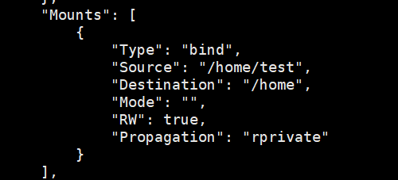

## 数据卷

```markdown
# 数据卷作用
- 用来实现容器和宿主机之间的数据共享
# 数据卷特点
- 数据卷可以在容器之间共享和重用
- 对数据卷的修改会立即影响到对应容器
- 对数据卷的更新或修改不会影响镜像
- 数据卷会默认一直存在,即使容器被删除
```

```bash
# 配置数据卷,主机影响容器,容器不影响主机 :ro
docker run -d -p 8081:8080 --name tomcat01 -v /root/apps:/usr/local/tomcat/webapps:ro tomcat:8.0
```

```bash
# 查看数据卷
docker volume ls
# 查看数据卷的细节
docker volume inspect 卷名
```

## MySQL同步数据

MySQL的数据持久化问题

```bash
docker pull mysql:5.7

# 安装启动mysql，需要配置密码
# 官方启动： 
docker run --name some-mysql -e MYSQL_ROOT_PASSWORD=my-secret-pw -d mysql:tag
# 启动
# -d 后台运行
# -p 端口映射
# -v 数据卷挂载
# -e 环境配置
docker run -d -p 3310:3306 -v /home/mysql/conf:/etc/mysql/conf -v /home/mysql/data:/var/lib/mysql -e MYSQL_ROOT_PASSWORD=123456 --name mysql01 mysql:5.7
```

使用SQLyog连接服务器端口3310

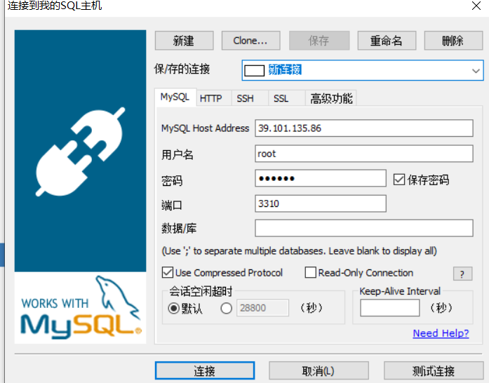

主机查看，挂载成功

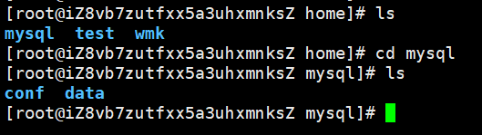

此时删除容器，主机数据仍然存在

## 具名和匿名挂载

```bash
# 匿名挂载
-v 容器内路径
docker run -d -P nginx01 -v /etc/nginx nginx
# 查看所有本地镜像
docker volume ls

# 具名挂载
docker run -d -P nginx02 -v juming-nginx:/etc/nginx nginx

docker volume ls

# 查看卷的路径
docker volume inspect juming-nginx
# 所有的docker容器的卷，没有指定目录的情况下在/var/lib/docker/volumes/xxxx/_data
# 通过具名挂载，可以方便找到卷
```

区分如何挂载

```bash
-v 容器内路径	# 匿名挂载
-v 卷名	# 具名挂载
-v /宿主机路径/:容器内路径	# 指定路径挂载
```

```bash
# 通过 -v 容器内路径:ro rw 可以改变读写权限(相对于容器)
# ro:只读
# rw:读写
# 一旦设定了容器权限，容器对我们挂载的内容就有了限定了
docker run -d -P nginx02 -v juming-nginx:/etc/nginx:ro nginx
# ro只要看到ro，就说明这个路径里的内容只能通过主操作
```

## Dockerfile挂载

Dockerfile 就是用来构建docker镜像的构建文件，是一个脚本文件，通过这个脚本，可以生成镜像，镜像是一层一层的，脚本是一个个的命令，每个命令就是一层

```bash
# 编写Dockerfile
FORM centos
# 使用dockerfile挂载
VOLUME ["volume01","volume02"]

CMD echo "---end----"
CMD /bin/bash
```

```bash
# 构建镜像
docker build -f /home/docker-test/dockerfile01 -t kaicentos01:1.0 .
```

```bash
[root@iZ8vb7zutfxx5a3uhxmnksZ docker-test]# docker build -f /home/docker-test/dockerfile01 -t kaicentos01:1.0 .
file01 -t kaicentos01:1.0 .
Sending build context to Docker daemon  2.048kB
Step 1/4 : FROM centos
 ---> 300e315adb2f
Step 2/4 : VOLUME ["volume01","volume02"]
 ---> Running in ecd7a503bf3d
Removing intermediate container ecd7a503bf3d
 ---> 4b782549b0d5
Step 3/4 : CMD echo "---end----"
 ---> Running in 60d61f7b81eb
Removing intermediate container 60d61f7b81eb
 ---> 244ac729cbd4
Step 4/4 : CMD /bin/bash
 ---> Running in 33af9e58fced
Removing intermediate container 33af9e58fced
 ---> f5adca509e54
Successfully built f5adca509e54
Successfully tagged kaicentos01:1.0
```

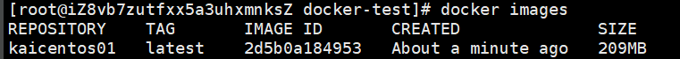

进入容器，下面两目录就是我们生成镜像时自动挂载的

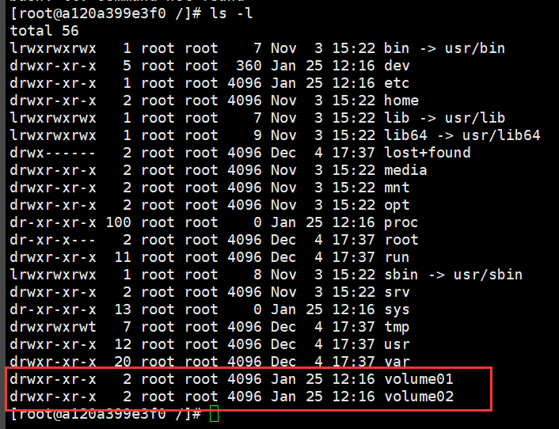

使用`docker inspect `查看挂载信息，匿名挂载

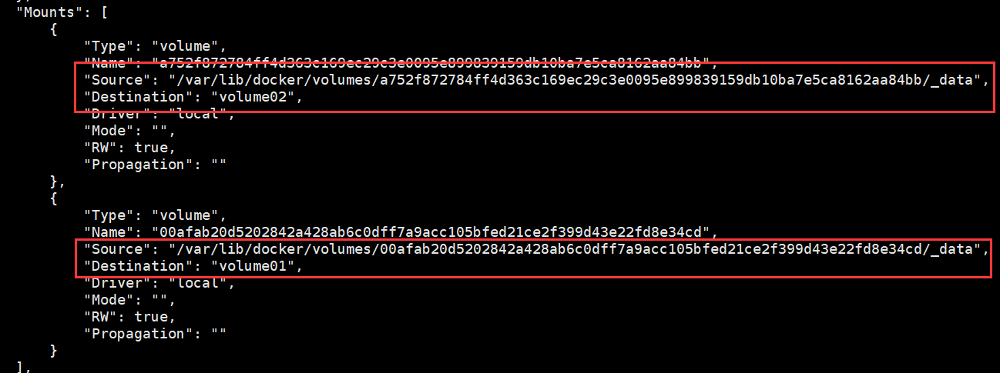

## 数据卷容器

多个容器之间同步数据

```bash
# --volumes-from
# 通过自己的镜像测试
docker run -it --name docker01 kaicentos01:1.0
docker run -it --name docker02 --volumes-from docker01 kaicentos01:1.0
# 测试 
```

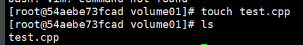

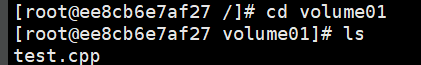

```bash
[root@iZ8vb7zutfxx5a3uhxmnksZ /]# docker run -it --name docker03 --volumes-from docker01 kaicentos01:1.0
[root@fc478b601c46 /]# ls
bin  etc   lib	  lost+found  mnt  proc  run   srv  tmp  var	   volume02
dev  home  lib64  media       opt  root  sbin  sys  usr  volume01
[root@fc478b601c46 /]# cd volume01
[root@fc478b601c46 volume01]# ls
test.cpp
[root@fc478b601c46 volume01]# 
```

三个容器间数据共享

此时删除 docker01 数据仍然存在

备份机制

多个mysql实现数据共享

```bash
docker run -d -p 3310:3306 -v /home/mysql/conf:/etc/mysql/conf.d -v /home/mysql/data:/var/lib/mysql -e MYSQL_ROOT_PASSWORD=123456 --name mysql01 mysql:5.7
docker run -d -p 3310:3306 -e MYSQL_ROOT_PASSWORD=123456 --name mysql02  --volumes-from mysql01 mysql:5.7
```

容器之间配置信息的传递,数据卷容器的生命周期一直持续到没有容器使用到为止

但是数据一旦持久化到本地,本地的数据是不会删除的

# Dockerfile

DockerFile是用来构建docker镜像的文件,命令参数脚本

日后用户可以将自己的应用打包成镜像,这样可以让我们应用进行容器运行

构建步骤:

* 编写一个 dockerfile 文件
* dockerfile 文件所在的文件夹会成为上下文
* docker bulid 构建成为一个镜像(包括上下文的全部文件)
* docker run 运行
* docker push 发布镜像(DockerHub,阿里云镜像仓库)

## Dockerfile构建过程

基础知识:

* 每个保留关键字(指令)都是必须大写字母
* 执行从上到下顺序执行
*  `#` 表示注释
* 每个指令都会创建提交一个新的镜像层,并提交
* 最后会生成一个最终构建镜像
* 指令生成的其它镜像在缓冲区 docker cache,可以复用

dockerfile是面向开发的

## Dockerfile的指令

```dockerfile
FROM # 基础镜像,一切从这里开始构建,centos
MAINTAINER(弃用)	# 镜像是谁写
RUN	# 镜像构建时需要运行的命令
ADD	# 将宿主机目录下的文件拷贝进镜像且会自动处理URL和解压tar包
COPY # 类似 ADD 命令,将我们的文件拷贝到镜像中
WORKDIR	# 镜像的工作目录
VOLUME	# 容器数据卷,挂载的目录,用于数据保存和持久化
EXPOSE	# 暴露端口配置
ENV	# 构建时设置环境变量
CMD	# 指定这个容器启动时要运行的命令,只有最后一个会生效,可被替代
ENTRYPOINT	# 指定这个容器启动时要运行的命令,可以追加命令
ONBUILD	# 当构建一个被继承 DockerFile 时会运行 ONBUILD 指令
```

```dockerfile
FROM <image>
FROM <image>[:<tag>] # 
FROM <image>[@<digest>]
```


## 实战测试

Docker Hub 中 99%镜像的基础镜像`FROM scratch`\

> 编写mycentos

```dockerfile
# 编写dockerfile的文件 mydockerfile-centos
FROM centos
MAINTAINER kai<123456@qq.com>

ENV MYPATH /usr/local
WORKDIR $MYPATH	# 工作目录

RUN yum -y install vim	# 添加vim
RUN yum -y install net-tools	# 添加net-tools

EXPOSE 80

CMD echo $MYPATH
CMD echo "--------end--------"
CMD /bin/bash
```

```dockerfile
# 构建镜像 docker build [--no-cache]
# docker build -f dockerfile文件路径 -t 镜像名:[版本号] .
docker build -f mydockerfile-centos -t mycentos:0.1 .
```

```dockerfile
# 测试运行
docker run -it mycentos:0.1
# 这个centos可以用vim和ifconfig了
```

```bash
docker history 镜像id # 查看镜像生成过程
```

> CMD 和 ENTRYPOINT 的区别

```dockerfile
CMD	# 指定这个容器启动时要运行的命令,只有最后一个会生效,可被替代
ENTRYPOINT	# 指定这个容器启动时要运行的命令,可以追加命令
```

```dockerfile
FROM centos
CMD ["ls","-a"]
```

```
docker build -f mydockerfile-cmd -t cmdtest .
```

运行该镜像发现CMD命令生效了

```bash
[root@iZ8vb7zutfxx5a3uhxmnksZ dockerfiledir]# docker run -it cmdtest
.   .dockerenv	dev  home  lib64       media  opt   root  sbin	
[root@iZ8vb7zutfxx5a3uhxmnksZ dockerfiledir]# docker run cmdtest -l
docker: Error response from daemon: OCI runtime create failed: container_linux.go:370: starting container process caused: exec: "-l": executable file not found in $PATH: unknown.
ERRO[0000] error waiting for container: context canceled 
# cmd 的情况下追加-l 替换了文件中 CMD的命令,-l不是命令,所以报错
```

测试`ENTRYPOINT`,运行时追加命令仍可成功

```dockerfile
FROM centos
ENTRYPOINT ["ls","-a"]

docker build -f mudockerfile-entry -t entrytest .

[root@iZ8vb7zutfxx5a3uhxmnksZ dockerfiledir]# docker run 060dd63848c2 -l
total 56
drwxr-xr-x   1 root root 4096 Jan 26 13:08 .
drwxr-xr-x   1 root root 4096 Jan 26 13:08 ..
-rwxr-xr-x   1 root root    0 Jan 26 13:08 .dockerenv
lrwxrwxrwx   1 root root    7 Nov  3 15:22 bin -> usr/bin
drwxr-xr-x   5 root root  340 Jan 26 13:08 dev
```

## 实战:Tomcat镜像

* 准备镜像文件:tomcat压缩包,jdk压缩包
* 编写dockerfile文件

```dockerfile
# Dockerfile,官方默认命名,build时自动寻找这个文件
FROM centos
MAINTAINER kai<123456@qq.com>

COPY readme.txt /usr/local/teadme.txt
# ADD 自动解压
ADD jdk-8u11-linux-x64.tar.gz /usr/local/
ADD apache-tomcat-9.0.22.tat.gz /usr/local/

RUN yum -y install vim

ENV MYPATH /usr/local
WORKDIR $MYPATH

ENV JAVA_HOME /usr/local/jdk1.8_11
ENV CLASSPATH $JAVA_HOME/lib/dt.jar:$JAVA_HOME/lib/tools.jar
ENV CATALINA_HOME /usr/local/apache-tomcat-9.0.22
ENV CATALINA_BASH /usr/local/apache-tomcat-9.0.22
ENV PATH $PATH:$JAVA_HOME/bin:$CATALINA_HOME/lib:$CATALINA_BASH/bin

EXPOSE 8080
CMD /usr/local/apache-tomcat-9.0.22/bin/startup.sh && tail -F /usr/local/apache-tomcat-9.0.22/bin/logs/catalina.out
```

```
docker build -t mytomcat .
```

```
docker run -d -p 9090:8080 --name kaitomcat -v /home/kai/build/tomcat/test:/usr/local/apache-tomcat-9.0.22/webapps/test -v /home/kai/build/tomcat/tomcatlogs:/usr/local/apache-tomcat-9.0.22/logs mytomcat
```

## 发布镜像

> 提交到DockerHub  在服务器上提交镜像

登录

```bash
[root@iZ8vb7zutfxx5a3uhxmnksZ ~]# docker login -u 04181425
Password: 

Login Succeeded
```

提交

```bash
# 修改要push的镜像的名称
docker tag hello-world 04181425/hello-world
# push这个镜像
docker push 04181425/hello-world
```

查看仓库

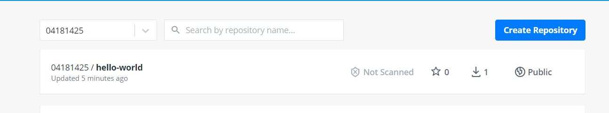

> 提交到阿里云镜像服务上

登录阿里云

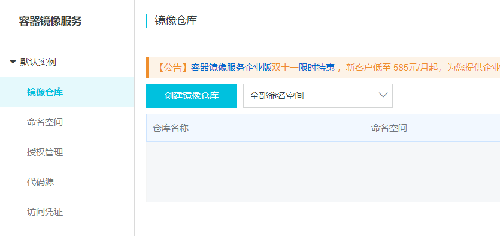

创建命名空间

创建容器镜像

查看仓库

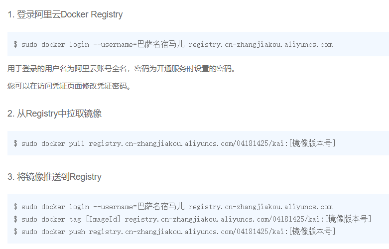

```bash
[root@iZ8vb7zutfxx5a3uhxmnksZ ~]# docker login --username=巴萨名宿马儿 registry.cn-hangzhou.aliyuncs.com
Password: 
WARNING! Your password will be stored unencrypted in /root/.docker/config.json.
Configure a credential helper to remove this warning. See
https://docs.docker.com/engine/reference/commandline/login/#credentials-store

Login Succeeded

[root@iZ8vb7zutfxx5a3uhxmnksZ ~]# docker tag bf756fb1ae65 registry.cn-hangzhou.aliyuncs.com/04181425/kai:1.0
[root@iZ8vb7zutfxx5a3uhxmnksZ ~]# docker push registry.cn-hangzhou.aliyuncs.com/04181425/kai:1.0
The push refers to repository [registry.cn-hangzhou.aliyuncs.com/04181425/kai]
9c27e219663c: Pushed 
1.0: digest: sha256:90659bf80b44ce6be8234e6ff90a1ac34acbeb826903b02cfa0da11c82cbc042 size: 525
```

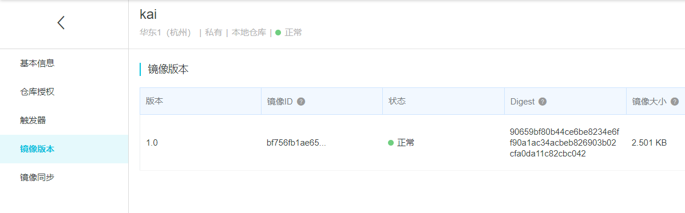

## 构建SpringBoot应用

```markdown
- 开发 SpringBoot 应用程序
- 对 SpringBoot 应用程序进行打包
	- - war ===> tomcat
	- - jar ===> jdk
- 打包项目
- 在服务器中创建 Dockerfile 上下文目录
- 创建 Dockerfile 文件
- 上传应用 jar 包到 context 目录
```

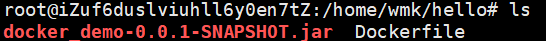

```dockerfile
# 编写 DockerFile
# 基于 jdk8
FROM openjdk:8-jre
# 定义进入容器时的默认位置,接下来后续操作的工作位置
WORKDIR /app
# 将上下文中的 jar 包复制到工作目录,同时修改名称为 app.jar
ADD docker_demo-0.0.1-SNAPSHOT.jar app.jar
# 让当前的容器暴露项目的端口
EXPOSE 8080
# 启动应用的固定命令
ENTRYPOINT ["java","-jar"]
# 执行 jar 的名称
CMD ["app.jar"]
```

```bash
# 执行构建
docker build -t demo:01 .
```

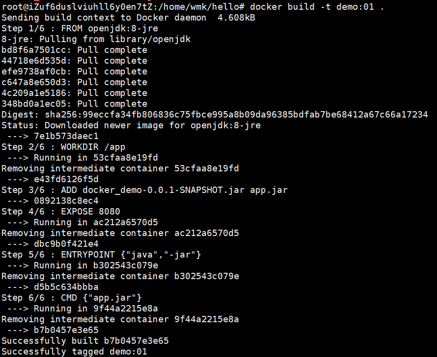

```bash
# 查看
docker images
# 运行镜像
docker run -d -p 8081:8080 --name demo demo:01
```

## IDEA与Docker

安装 Docker 插件

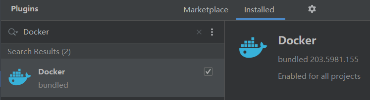

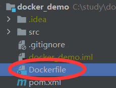


# Docker网络

## 通信机制和网桥

```markdown
# 为什么提供网络功能
- docker 允许通过外部访问容器或容器互联的方式来提供网络服务
# docker容器与操作系统之间的通信机制
- docker启动时,会自动在主机上创建一个 docker0 虚拟网桥,实际上是 Linux 的一个 bridge ,可以理解为软件交换机,他会在挂载他的网口之间进行转发
- 同时 docker 会随机分配一个本地未占用的私有网段中的一个地址给 docker0 接口,比如典型的 172.17.42.1 ,掩码为 255.255.0.0 ,此后启动的容器内的网口也会自动分配一个同一网段 (172.17.0.0/16) 的地址
- 当创建一个 docker 容器时,同时会创建一对 veth pair 接口(当数据包发送到一个接口时,另外一个接口也可以收到同样的数据包).这时接口一端在容器内,即 eth0 ;另一端在本地并被挂载到 docker0 网桥,名称以 veth 开头(例如 vethAQI2QT).通过这种方式,主机可以跟容器通信,容器之间也可以通信, docker 就创建了在主机和所有容器之间一个虚拟共享网络
# docker 网络使用
- 一般在使用 docker 网桥(bridge)实现容器与容器通信时,都是站在一个应用角度进行容器通信(一个应用使用一个网桥,若使用默认网桥,会影响其它容器的带宽)
```

```bash
# 查看 docker 网桥配置
docker network ls
# 自定义网桥
docker network create 网桥名
docker network create -d bridge 网桥名
# 启动容器时指定网桥
docker run -d -p 8081:8080 --network 网桥名 --name myTomcat01 tomcat:8.0
# 一旦在启动容器时指定了网桥之后,日后可以在任何这个网桥关联的容器中使用容器名进行与其他容器通信
# 删除网桥
docker network rm 网桥名
# 查看网桥细节
docker network inspect 网桥名
```

# 常用服务安装

## MySQL

```bash
docker run -d -p 3307:3306 --name mysql80 -v /home/tools/mysql8.0/conf:/etc/mysql -v /home/tools/mysql8.0/data:/var/lib/mysql -v /home/tools/mysql8.0/mysql-files:/var/lib/mysql-files/ -e MYSQL_ROOT_PASSWORD=123456 mysql:8.0
```

## Tomcat

```bash
# pull tomcat 注意jdk版本
docker pull tomcat:jdk11-openjdk
# 启动
docker run -d -p 8081:8080 --name myTomcat -v /home/tools/tomcat/apps:/usr/local/tomcat/webapps -v /home/tools/tomcat/conf:/usr/local/tomcat/conf tomcat:jdk11
```

## Redis

```bash
docker pull redis:6.0
# 启动
docker run -d -p 6380:6379 --name redis6.0 redis:6.0
# 开启持久化
docker run -d -p 6380:6379 --name redis6.0 -v /home/tools/redis6.0/data:/data -v /home/tools/redis6.0/conf:/usr/local/etc/redis redis:6.0 redis-server --appendonly yes
# 配置文件
# 需要手动下载一个redis.conf复制到宿主机,再进行挂载
docker run -d -p 6380:6379 --name redis6.0 -v /home/tools/redis6.0/data:/data -v /home/tools/redis6.0/conf:/usr/local/etc/redis redis:6.0 redis-server /usr/local/etc/redis/redis.conf
# 配置文件和持久化不能一起配置????
```

# Compose

`Compose` 项目是`Docker`官方的开源项目,负责实现对`Docker`容器集群的快速编排

它允许用户通过一个单独的`docker-compose.yml`模板文件来定义一组相关联的应用容器为一个项目服务

`Compose`中两个重要的概念:

- 服务`service`:一个应用的容器,实际上可以包括若干运行相同镜像的容器实例
- 项目`project`:由一组关联的应用容器组成的一个完整业务单元,在`docker-compose.yml`文件中定义

## 安装

```bash
sudo curl -L https://github.com/docker/compose/releases/download/1.16.1/docker-compose-`uname -s`-`uname -m` -o /usr/local/bin/docker-compose

sudo chmod +x /usr/local/bin/docker-compose

docker-compose --version
docker-compose version 1.16.1, build 1719ceb
```

## 使用

```yml
# 建立 docker-compose.yml 文件
version: "3.0"
# 多个服务
services:
 # 服务名唯一
 tomcat01:
  # 服务镜像
  image: tomcat:jdk11
  # 宿主机端口与容器端口映射
  ports:
   - "8081:8080"
  networks:
   - hello
 
 tomcat02:
  image: tomcat:jdk11
  prots:
   - "8082:8080"
  # 配置网络
  networks:
   # hello 网桥
   - hello
  # 指定容器名
  container_name: tomcat02

# 声明服务使用的网桥名,默认bridge
networks:
 hello:
```

```bash
# 启动 compose 中的所有服务
docker-compose up
```

```yml
# 使用数据卷
vsersion: "3.0"

services:
 my_slq:
  image: mysql:8.0
  volumes:
  # 自动映射,卷名必须声明
   - mysql_data:/var/lib/mysql
  # 自定义映射
  # - /home/wmk/mysql:/var/lib/mysql
  # 使用环境变量
  environment:
   - MYSQL_ROOT_PASSWORD=123456
  
 redis:
  image: redis:6.0
  container_name: redis
  ports:
   - "6379:6379"
  volumes:
   - redisdata:/data
  # 覆盖命令,开启持久化
  command: "redis-server --appendonly yes"
  # 解决容器依赖,启动先后的问题
  depends_on: 
   # 服务名,先启动 my_sql,在启动 redis
   - my_sql

# 声明卷名
volumes:
 mysql_data:
 redistata:
```

```yml
# build 指令,用来将指定的 Dockerfile 打包成对应镜像,然后运行该镜像
services:
 demo:
  build: # 用来指定 Dockerfile 所在的目录
   context: demo # 指定上下文目录
   dockerfile: Dockerfile
  container_name: demo
  ports:
   - "8081:8081"
  ...
```

## 指令

```bash

```

