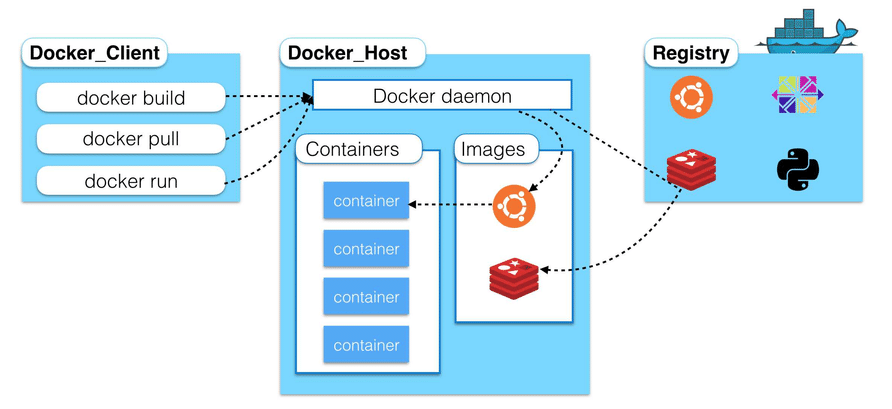
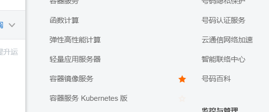
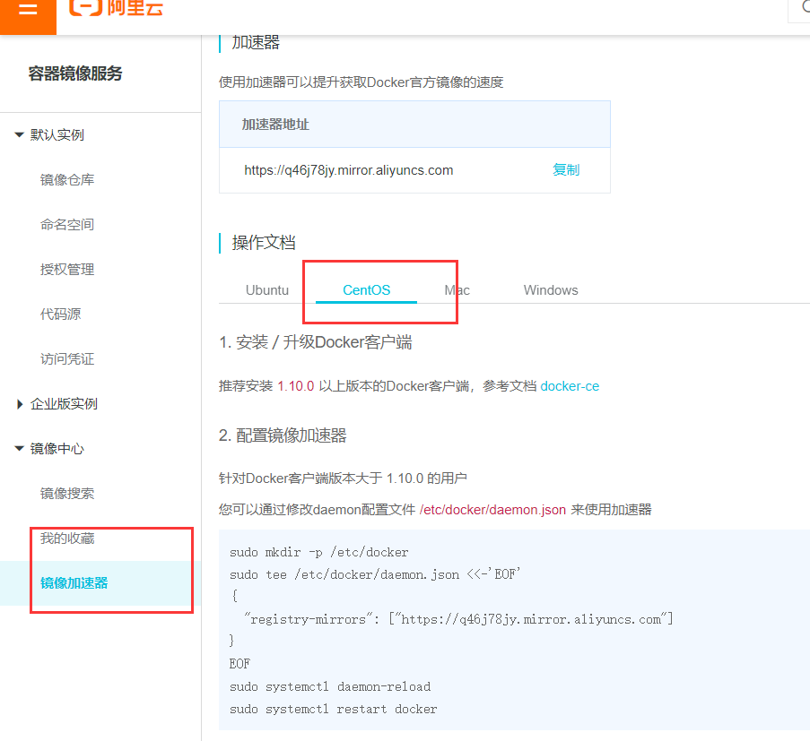
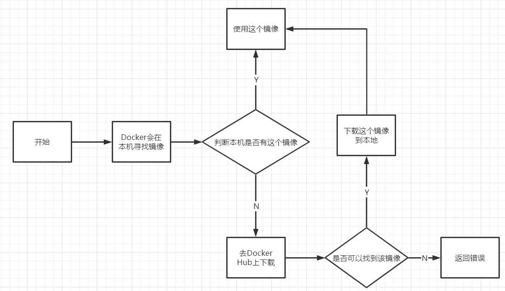
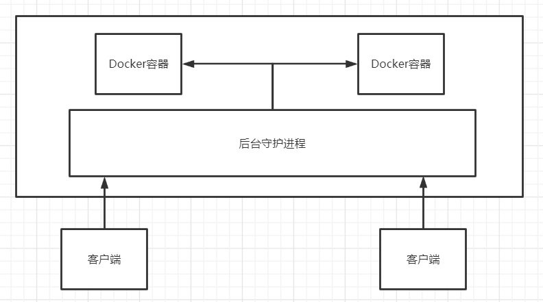
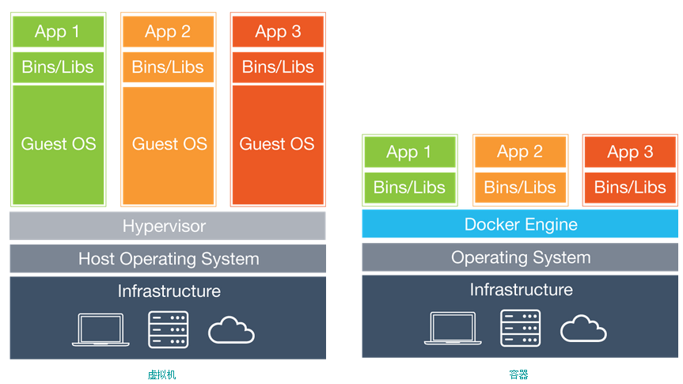

# Docker

Docker 是基于Go语言开发的

* 传统虚拟机：虚拟出一套硬件，运行一个完整的操作系统，然后在这个系统上安装和运行软件

* 容器内的应用直接运行在宿主机的内核上，容器是没有自己的内核的，也没有虚拟硬件，所以很轻便

* 每个容器间是互相隔离的，每个容器内都有一个属于自己的文件系统，互不影响

DevOps（开发、运维）

**应用更快速地交互和部署**

Docker：打包镜像，发布测试，一键运行

**更便捷地升级和扩缩容**

打包成一个镜像，扩展服务

**更简单地系统运维**

**更高效地计算资源利用**

Docker是内核级别的虚拟化，服务器的性能可以压榨到极致

https://docs.docker.com/

# 安装

## 基本组成



镜像(image)：类似于模板，可以通过这个镜像创建容器服务，通过镜像可以创建多个服务，最终服务运行在容器中

容器(container)：Docker利用容器技术独立运行一个或一组应用，通过镜像来创建

仓库(repository)：仓库就是存放镜像的地方，分为公有仓库和私有仓库


## 安装

```bash
# 系统内核3.10以上
[root@iZ8vb7zutfxx5a3uhxmnksZ /]# uname -r
3.10.0-1062.18.1.el7.x86_64
```

```bash
# 系统版本
[root@iZ8vb7zutfxx5a3uhxmnksZ /]# cat /etc/os-release
NAME="CentOS Linux"
VERSION="7 (Core)"
ID="centos"
ID_LIKE="rhel fedora"
VERSION_ID="7"
PRETTY_NAME="CentOS Linux 7 (Core)"
ANSI_COLOR="0;31"
CPE_NAME="cpe:/o:centos:centos:7"
HOME_URL="https://www.centos.org/"
BUG_REPORT_URL="https://bugs.centos.org/"

CENTOS_MANTISBT_PROJECT="CentOS-7"
CENTOS_MANTISBT_PROJECT_VERSION="7"
REDHAT_SUPPORT_PRODUCT="centos"
REDHAT_SUPPORT_PRODUCT_VERSION="7"
```

```bash
# 卸载旧的版本
yum remove docker \
        docker-client \
        docker-client-latest \
        docker-common \
        docker-latest \
        docker-latest-logrotate \
        docker-logrotate \
        docker-engine
# 需要的安装包
yum install -y yum-utils
# 设置镜像的仓库  阿里云镜像
yum-config-manager \
    --add-repo \
    https://mirrors.aliyun.com/docker-ce/linux/centos/docker-ce.repo
# 更新yum软件包索引
yum makecache fast
# 安装最新版Docker引擎 社区版
yum install docker-ce docker-ce-cli containerd.io
# 启动Docker 
systemctl start docker
# 版本
docker version
# 测试helloworld
docker run hello-world
# 查看下载的hello镜像
docker images
```

docker的默认工作路径 `/var/lib/docker` 

阿里云配置加速





```
sudo mkdir -p /etc/docker
sudo tee /etc/docker/daemon.json <<-'EOF'
{
  "registry-mirrors": ["https://q46j78jy.mirror.aliyuncs.com"]
}
EOF
sudo systemctl daemon-reload
sudo systemctl restart docker
```

# 原理

## 运行流程



## 底层原理

Docker是一个 Client-Server 结构的系统，Docker 的守护进程运行在主机上，通过Socket 从客户端访问

DockerServer 接收到 Docker-client的命令，就会执行这个命令



docker为什么比虚拟机快？

* docker有着比虚拟机更少的抽象层



新建一个容器的时候，Docker不需要像虚拟机一样重新加载一个操作系统内核，避免引导，利用宿主机的操作系统，省略了复杂的过程

# 常用命令

[官方文档](https://docs.docker.com/reference/)

## 帮助命令

```bash
docker version	#显示docker的版本信息
docker info		#显示docker的系统信息，包括镜像和容器的数量
docker 命令 --help  #万能命令
```

## 镜像命令

```bash
docker images	#查看所有镜像
[root@iZ8vb7zutfxx5a3uhxmnksZ /]# docker images
REPOSITORY    TAG       IMAGE ID       CREATED         SIZE
hello-world   latest    bf756fb1ae65   12 months ago   13.3kB

#解释
REPOSITORY	#镜像的仓库源
TAG			#镜像的标签
IMAGE ID	#镜像的ID
CREATED		#镜像的创建时间
SIZE		#镜像的大小

# Options:
-a, --all	#列出所有镜像
-q, --quiet	#只显示镜像ID
```

```bash
docker search	#搜索镜像
#可选项
--filter=STARTS=3000	#搜索出来的镜像STARTS大于3000的
```

```bash
docker pull		#下载镜像
[root@iZ8vb7zutfxx5a3uhxmnksZ /]# docker pull mysql
Using default tag: latest	#默认最新版
latest: Pulling from library/mysql
a076a628af6f: Pull complete 	#分层下载，docker image核心
f6c208f3f991: Pull complete 
88a9455a9165: Pull complete 
406c9b8427c6: Pull complete 
7c88599c0b25: Pull complete 
25b5c6debdaf: Pull complete 
43a5816f1617: Pull complete 
1a8c919e89bf: Pull complete 
9f3cf4bd1a07: Pull complete 
80539cea118d: Pull complete 
201b3cad54ce: Pull complete 
944ba37e1c06: Pull complete 
Digest: sha256:feada149cb8ff54eade1336da7c1d080c4a1c7ed82b5e320efb5beebed85ae8c	#签名
Status: Downloaded newer image for mysql:latest
docker.io/library/mysql:latest	#真实地址

# 指定版本下载,因为分层的原因，只下载不同的层
docker pull mysql:5.7
```

```bash
# 根据id删除
docker rmi -f id
# 全部删除
docker rmi -f ${docker images -aq}
```

## 容器命令