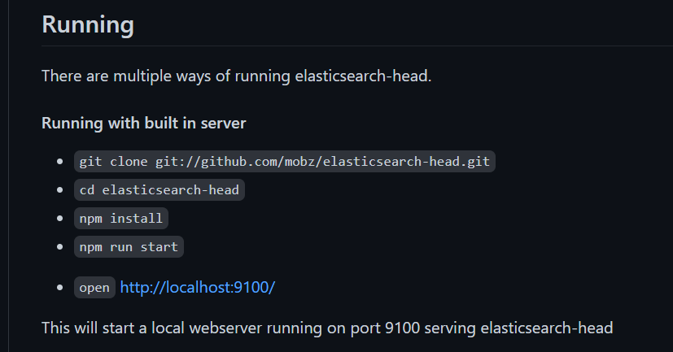

# ElasticSearch

Elaticsearch简称ES，是一个开源的高扩展的分布式全文检索引擎

* 近乎实时的存储、检索数据
* 扩展性很好，可以扩展到上百台服务器
* 处理PB级别的数据（大数据）

ES使用Java开发并使用Lucene作为其核心来实现所有索引和搜索的功能，但是其目的是通过简单的 RESTful API 来隐藏Lucene的复杂性，从而让全文搜索变得简单

ELK:

* ELK是 Elasticsearch , Logstash , Kibana 三大开源框架首字母的简称.

* Elasticsearch 是一个基于 Lucene ,分布式,通过Restful方式进行交互的近实时搜索平台框架

* Logstah是ELK的中央数据流引擎,用于从不同目标收集的不同格式数据,经过过滤后支持输出到不同目的地

* Kibana可以将Elasticsearch 的数据通过友好的页面展示出来,提供实时分析的功能

# 安装

> 官网安装ES

```markdown
* bin 启动文件目录
* config 配置文件目录
	log4j2	日志配置文件
	jvm.options	java虚拟机相关配置
	elasticsearch.yml	elasticsearch的配置文件,默认端口9200
* plgins 插件目录

* elasticsearch.yml 配置跨域
	* http.cors.enabled: true
	* http.cors.allow-origin: "*"
```

> 安装可视化界面 head插件



https://github.com/mobz/elasticsearch-head

```
npm intsll
npm run start
```

> 安装Kibana

## Docker

> 部署elasticsearch

```bash
docker run -d --name elasticsearch -p 9200:9200 -p 9300:9300 -e "discovery.type=single-node" -v /data/elasticsearch:/usr/share/elasticsearch/data docker.elastic.co/elasticsearch/elasticsearch:7.9.2
# 参数说明
docker run 创建并启动容器
-d 后台运行 
--name elasticsearch 指定容器唯一的名称，方便管理
-p 9200:9200 -p 9300:9300 映射容器端口到宿主机上
-e "discovery.type=single-node" 环境变量配置单机模式
-v /data/elasticsearch:/usr/share/elasticsearch/data 持久化数据存储
docker.elastic.co/elasticsearch/elasticsearch:7.9.2 镜像名称及版本
# 进入容器进行配置
docker exec -it elasticsearch /bin/bash
vim config/elasticsearch.yml
# 开启允许跨站访问，开启x-pack安全功能
http.cors.enabled: true
http.cors.allow-origin: "*"
xpack.security.enabled: true
# 退出容器
exit
# 重新启动
docker restart elasticsearch
```

```bash
# 安全性
# 宿主机上运行，进入容器的命令行终端
docker exec -it elasticsearch /bin/bash
# 随机产生密码并设置
bin/elasticsearch-setup-passwords auto
```

> 部署Kibana

```bash
docker run -d --name kibana --link elasticsearch -e ELASTICSEARCH_URL=http://elasticsearch:9200 -p 5601:5601 kibana:7.9.2
# 参数说明
docker run 创建并启动容器
-d 后台运行 
--name kibana 指定容器唯一的名称，方便管理
--link elasticsearch 使kibana与elasticsearch同处于一个网络方便主机名通讯
-p 5601:5601 映射容器端口到宿主机上
-e ELASTICSEARCH_URL=http://elasticsearch:9200 环境变量配置ES地址
kibana:7.9.2 镜像名称及版本

# 宿主机上运行，进入容器的命令行终端
docker exec -it kibana /bin/bash
# 进入容器后，容器内编辑配置
vim config/kibana.yml

# 连接至elasticsearch的主机名及相关的账户鉴权
monitoring.ui.container.elasticsearch.enabled: true
elasticsearch.hosts: [ "http://elasticsearch:9200" ]
xpack.security.enabled: true
elasticsearch.username: elastic
# 这里的密码是在Elasticsearch setup-password产生的
elasticsearch.password: xxx

# 退出容器
exit
# 重启容器使配置生效
docker restart kibana
```

# 核心概念

| Elasticsearch | MySql           |
| ------------- | --------------- |
| 索引          | 数据库 database |
| types         | 表 tables       |
| documents     | 行 rows         |
| fields        | 字段 columns    |

Elasticsearch 在后台把每个索引分成多个分片,每个分片可以在集群中的不同服务器间迁移

倒排索引

# IK分词器

