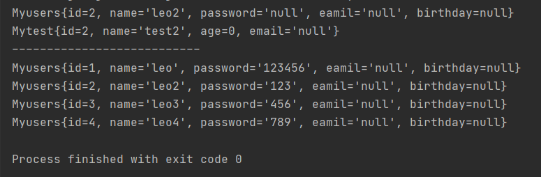

[尚硅谷JDBC核心技术---宋红康](https://www.bilibili.com/video/BV1eJ411c7rf)

# BaseDao

```java
import java.io.IOException;
import java.io.InputStream;
import java.sql.*;
import java.util.Properties;

public abstract class BaseDao {

    private static String driver;
    private static String url;
    private static String username;
    private static String password;

    static {
        Properties properties = new Properties();
        //通过类加载器读到对应的资源
        InputStream is = BaseDao.class.getClassLoader().getResourceAsStream("db.properties");

        try {
            properties.load(is);
        } catch (IOException e) {
            e.printStackTrace();
        }
        driver = properties.getProperty("driver");
        url = properties.getProperty("url");
        username = properties.getProperty("username");
        password = properties.getProperty("password");

    }

    //获取连接
    public static Connection getConnection(){
        Connection connection = null;
        try {
            //加载驱动
            Class.forName(driver);
            //获取连接
            connection = DriverManager.getConnection(url, username, password);
        } catch (Exception e) {
            e.printStackTrace();
        }
        return connection;
    }
    //关闭连接
    public static boolean closeResources(Connection conn, PreparedStatement pstm, ResultSet rs){
        boolean flag = true;
        if (rs != null) {
            try {
                rs.close();
                rs = null;
            } catch (SQLException throwables) {
                throwables.printStackTrace();
                flag = false;
            }
        }
        if (pstm != null) {
            try {
                pstm.close();
                pstm = null;
            } catch (SQLException throwables) {
                throwables.printStackTrace();
                flag = false;
            }
        }
        if (conn != null) {
            try {
                conn.close();
                conn = null;
            } catch (SQLException throwables) {
                throwables.printStackTrace();
                flag = false;
            }
        }
        return flag;
    }
}
```

## db.proterties

```xml
#Mysql 8
driver=com.mysql.cj.jdbc.Driver
url=jdbc:mysql://localhost:3306/smbms?useUnicode=true&characterEncoding=utf8&serverTimezone=UTC
username=root
password=123456
```


# 通用操作

注意：Java与数据库交互涉及到的相关Java API中的索引都从1开始。

## 查询

```java
import java.lang.reflect.Field;
import java.sql.*;
import java.util.ArrayList;
import java.util.List;

public class UpdateTest {

    //查询一个对象
    public <T> T getInstance(Class<T> tClass, String sql, Object... args) {
        Connection conn = null;
        PreparedStatement ps = null;
        ResultSet rs = null;
        try {
            conn = BaseDao.getConnection();
            ps = conn.prepareStatement(sql);

            for (int i = 0; i < args.length; ++i) {
                ps.setObject(i + 1, args[i]);
            }
            rs = ps.executeQuery();
            //获取结果集的元数据:ResultSetMetaData
            ResultSetMetaData rsmd = rs.getMetaData();
            //通过ResultSetMetaData获取结果集中的列数
            int columnCount = rsmd.getColumnCount();
            if (rs.next()) {
                T t = tClass.newInstance();
                for (int i = 0; i < columnCount; ++i) {
                    //获取列值
                    Object columnVal = rs.getObject(i + 1);
                    //获取列的别名
                    String columnLabel = rsmd.getColumnLabel(i + 1);
                    //使用反射,给对象相对应的属性赋值
                    Field declaredField = tClass.getDeclaredField(columnLabel);
                    declaredField.setAccessible(true);
                    declaredField.set(t, columnVal);
                }
                return t;
            }
        } catch (Exception throwables) {
            throwables.printStackTrace();
        } finally {
            //关闭资源
            BaseDao.closeResources(conn, ps, rs);
        }
        return null;
    }

    //查询多个对象
    public <T> List<T> getForList(Class<T> tClass,String sql,Object ...args){
        Connection conn = null;
        PreparedStatement ps = null;
        ResultSet rs = null;
        try {
            conn = BaseDao.getConnection();
            ps = conn.prepareStatement(sql);
            for (int i = 0; i < args.length; ++i) {
                ps.setObject(i + 1, args[i]);
            }
            rs = ps.executeQuery();
            //获取结果集的元数据:ResultSetMetaData
            ResultSetMetaData rsmd = rs.getMetaData();
            //通过ResultSetMetaData获取结果集中的列数
            int columnCount = rsmd.getColumnCount();
            //创建集合对象
            ArrayList<T> list = new ArrayList<>();
            while (rs.next()) {
                T t = tClass.newInstance();
                for (int i = 0; i < columnCount; ++i) {
                    //获取列值
                    Object columnVal = rs.getObject(i + 1);
                    //获取列的别名
                    String columnLabel = rsmd.getColumnLabel(i + 1);
                    //使用反射,给对象相对应的属性赋值
                    Field declaredField = tClass.getDeclaredField(columnLabel);
                    declaredField.setAccessible(true);
                    declaredField.set(t, columnVal);
                }
                list.add(t);
            }
            return list;
        } catch (Exception throwables) {
            throwables.printStackTrace();
        } finally {
            //关闭资源
            BaseDao.closeResources(conn, ps, rs);
        }
        return null;
    }


    @Test
    public void test(){
        //查询单条数据测试
        String sql1="select id,name from myusers where id = ?";
        Myusers myusers = getInstance(Myusers.class, sql1, 2);
        System.out.println(myusers);
        String sql2="select id,name from mytest where id =?";
        Mytest mytest = getInstance(Mytest.class, sql2, 2);
        System.out.println(mytest);
        System.out.println("---------------------------");
        //查询多条数据测试
        String sql3="select id,name,password from myusers where id < ?";
        List<Myusers> list = getForList(Myusers.class, sql3, 5);
        for (Myusers Myusers1 : list) {
            System.out.println(Myusers1);
        }

    }
}
```



## 增删改

```java
public int update(Connection conn,String sql,Object...args){
    PreparedStatement ps=null;
    try{
        ps=conn.prepareStatement(sql);
        for(int i=0;i<args.length;i++){
            ps.setObject(i+1,args[i]);
        }
        return ps.executeUpdate();
    }catch(Exception e){
        e.printStackTrace();
    }finally{
        //考虑事务,同一个连接不能关闭
        BaseDao.closeResources(null,ps,null);
    }
    return 0;
}
```

## 其它

```java
//select conunt(*) from tables;查某一表的数据总量或其它最值查询
public  <E>E getValue(Connection conn,String sql,Object...args){
    PreparedStatement ps=null;
    ResultSet rs=null;
    try{
        ps=conn.prepareStatement(sql);
        for(int i=0;i<args.length;i++){
            ps.setObject(i+1,args[i]);
        }
        rs=ps.executeQuery();
        if(rs.next()){
            return (E) rs.getObject(1);
        }
    }catch(Exception e){
        e.printStackTrace();
    }finally{
        //考虑事务,同一个连接不能关闭
        BaseDao.closeResources(null,ps,rs);
    }
    return null;
}
```

# BLOB操作

MySQL中，BLOB是一个二进制大型对象，是一个可以存储大量数据的容器，它能容纳不同大小的数据。

插入BLOB类型的数据必须使用PreparedStatement，因为BLOB类型的数据无法使用字符串拼接写的。

## 插入

```java
//获取连接
Connection conn = JDBCUtils.getConnection();	
String sql = "insert into customers(name,email,birth,photo)values(?,?,?,?)";
PreparedStatement ps = conn.prepareStatement(sql);
// 填充占位符
ps.setString(1, "徐海强");
ps.setString(2, "xhq@126.com");
ps.setDate(3, new Date(new java.util.Date().getTime()));//时间设置
// 操作Blob类型的变量
FileInputStream fis = new FileInputStream("xhq.png");
ps.setBlob(4, fis);
//执行
ps.execute();	
fis.close();
JDBCUtils.closeResource(conn, ps);
```

## 修改

```java
Connection conn = JDBCUtils.getConnection();
String sql = "update customers set photo = ? where id = ?";
PreparedStatement ps = conn.prepareStatement(sql);
// 填充占位符
// 操作Blob类型的变量
FileInputStream fis = new FileInputStream("coffee.png");
ps.setBlob(1, fis);
ps.setInt(2, 25);
ps.execute();
fis.close();
JDBCUtils.closeResource(conn, ps);
```

## 读取

```java
String sql = "SELECT id, name, email, birth, photo FROM customer WHERE id = ?";
conn = getConnection();
ps = conn.prepareStatement(sql);
ps.setInt(1, 8);
rs = ps.executeQuery();
if(rs.next()){
	Integer id = rs.getInt(1);
    String name = rs.getString(2);
	String email = rs.getString(3);
    Date birth = rs.getDate(4);
	Customer cust = new Customer(id, name, email, birth);
    System.out.println(cust); 
    //读取Blob类型的字段
	Blob photo = rs.getBlob(5);
	InputStream is = photo.getBinaryStream();
	OutputStream os = new FileOutputStream("c.jpg");
	byte [] buffer = new byte[1024];
	int len = 0;
	while((len = is.read(buffer)) != -1){
		os.write(buffer, 0, len);
	}
    JDBCUtils.closeResource(conn, ps, rs);		
	if(is != null){
		is.close();
	}	
	if(os !=  null){
		os.close();
	} 
}
```


# 批量操作

## 批量执行SQL语句

当需要成批插入或者更新记录时，可以采用Java的批量**更新**机制，这一机制允许多条语句一次性提交给数据库批量处理。通常情况下比单独提交处理更有效率

JDBC的批量处理语句包括下面三个方法：
- **addBatch(String)：添加需要批量处理的SQL语句或是参数；**
- **executeBatch()：执行批量处理语句；**
- **clearBatch():清空缓存的数据**

通常我们会遇到两种批量执行SQL语句的情况：
- 多条SQL语句的批量处理；
- 一个SQL语句的批量传参；

## 高效的批量插入

举例：向数据表中插入20000条数据

- 数据库中提供一个goods表。创建如下：

```sql
CREATE TABLE goods(
id INT PRIMARY KEY AUTO_INCREMENT,
NAME VARCHAR(20)
);
```

### 实现层次一：使用Statement

```java
Connection conn = JDBCUtils.getConnection();
Statement st = conn.createStatement();
for(int i = 1;i <= 20000;i++){
	String sql = "insert into goods(name) values('name_' + "+ i +")";
	st.executeUpdate(sql);
}
```

###  实现层次二：使用PreparedStatement

```java
long start = System.currentTimeMillis();	
Connection conn = JDBCUtils.getConnection();		
String sql = "insert into goods(name)values(?)";
PreparedStatement ps = conn.prepareStatement(sql);
for(int i = 1;i <= 20000;i++){
	ps.setString(1, "name_" + i);
	ps.executeUpdate();
}
long end = System.currentTimeMillis();
System.out.println("花费的时间为：" + (end - start));//82340
JDBCUtils.closeResource(conn, ps);
```

### 实现层次三

```java
/*
 * 修改1： 使用 addBatch() / executeBatch() / clearBatch()
 * 修改2：mysql服务器默认是关闭批处理的，我们需要通过一个参数，让mysql开启批处理的支持。
 * 		 ?rewriteBatchedStatements=true 写在配置文件的url后面
 * 修改3：使用更新的mysql 驱动：mysql-connector-java-5.1.37-bin.jar
 * 
 */
@Test
public void testInsert1() throws Exception{
	long start = System.currentTimeMillis();
	Connection conn = JDBCUtils.getConnection();
	String sql = "insert into goods(name)values(?)";
	PreparedStatement ps = conn.prepareStatement(sql);
	for(int i = 1;i <= 1000000;i++){
		ps.setString(1, "name_" + i);
		//1.“攒”sql
		ps.addBatch();
		if(i % 500 == 0){
			//2.执行
			ps.executeBatch();
			//3.清空
			ps.clearBatch();
		}
	}
	long end = System.currentTimeMillis();
	System.out.println("花费的时间为：" + (end - start));//20000条：625  1000000条:14733  
	JDBCUtils.closeResource(conn, ps);
}
```

### 实现层次四

```java
/*
* 层次四：在层次三的基础上操作
* 使用Connection 的 setAutoCommit(false)  /  commit()
*/
@Test
public void testInsert2() throws Exception{
	long start = System.currentTimeMillis();		
	Connection conn = JDBCUtils.getConnection();		
	//1.设置为不自动提交数据
	conn.setAutoCommit(false);		
	String sql = "insert into goods(name)values(?)";
	PreparedStatement ps = conn.prepareStatement(sql);	
	for(int i = 1;i <= 1000000;i++){
		ps.setString(1, "name_" + i);	
		//1.“攒”sql
		ps.addBatch();
			
		if(i % 500 == 0){
			//2.执行
			ps.executeBatch();
			//3.清空
			ps.clearBatch();
		}
	}	
	//2.提交数据
	conn.commit();	
	long end = System.currentTimeMillis();
	System.out.println("花费的时间为：" + (end - start));//1000000条:4978 	
	JDBCUtils.closeResource(conn, ps);
}
```

# 事务操作

## 事务的ACID属性

1. **原子性（Atomicity）**
   原子性是指事务是一个不可分割的工作单位，事务中的操作要么都发生，要么都不发生。 
2. **一致性（Consistency）**
   事务必须使数据库从一个一致性状态变换到另外一个一致性状态。
3. **隔离性（Isolation）**
   事务的隔离性是指一个事务的执行不能被其他事务干扰，即一个事务内部的操作及使用的数据对并发的其他事务是隔离的，并发执行的各个事务之间不能互相干扰。
4. **持久性（Durability）**
   持久性是指一个事务一旦被提交，它对数据库中数据的改变就是永久性的，接下来的其他操作和数据库故障不应该对其有任何影响。

## 数据库并发问题

- 对于同时运行的多个事务, 当这些事务访问数据库中相同的数据时, 如果没有采取必要的隔离机制, 就会导致各种并发问题:
  - **脏读**: 对于两个事务 T1, T2, T1 读取了已经被 T2 更新但还**没有被提交**的字段。之后, 若 T2 回滚, T1读取的内容就是临时且无效的。
  - **不可重复读**: 对于两个事务T1, T2, T1 读取了一个字段, 然后 T2 **更新**了该字段。之后, T1再次读取同一个字段, 值就不同了。
  - **幻读**: 对于两个事务T1, T2, T1 从一个表中读取了一个字段, 然后 T2 在该表中**插入**了一些新的行。之后, 如果 T1 再次读取同一个表, 就会多出几行。

- **数据库事务的隔离性**: 数据库系统必须具有隔离并发运行各个事务的能力, 使它们不会相互影响, 避免各种并发问题。

- 一个事务与其他事务隔离的程度称为隔离级别。数据库规定了多种事务隔离级别, 不同隔离级别对应不同的干扰程度, **隔离级别越高, 数据一致性就越好, 但并发性越弱。**

##  四种隔离级别

- 数据库提供的4种事务隔离级别：
  - 读未提交(`read uncommitted`):一个事务还没提交时,它做的变更就能被别的事务看到
  - 读提交(`read committed`):一个事务提交之后,它做的变更才能被其它事务看到
  - 可重复读(`repeatable read`):一个事务执行过程中看到的数据,总是跟这个事务在启动时看到数据是一致的,未提交变更对其它事务也是不可见的
  - 串行化(`serializable`):对一行记录,写会加写锁,读会加读锁,当出现读写锁冲突时,后访问的事务必须等前一个事务执行完成,才能继续执行
- Oracle 支持的 2 种事务隔离级别：**READ COMMITED**, SERIALIZABLE。 Oracle 默认的事务隔离级别为: **READ COMMITED** 。


- Mysql 支持 4 种事务隔离级别。Mysql 默认的事务隔离级别为: **REPEATABLE READ。**

###  在MySql中设置隔离级别

- 每启动一个 mysql 程序, 就会获得一个单独的数据库连接. 每个数据库连接都有一个全局变量 @@tx_isolation, 表示当前的事务隔离级别。

- 查看当前的隔离级别: 

  ```mysql
  SELECT @@tx_isolation;
  ```

- 设置当前 mySQL 连接的隔离级别:  

  ```mysql
  set  transaction isolation level read committed;
  ```

- 设置数据库系统的全局的隔离级别:

  ```mysql
  set global transaction isolation level read committed;
  ```

- 补充操作：

  - 创建mysql数据库用户：

    ```mysql
    create user tom identified by 'abc123';
    ```

  - 授予权限

    ```mysql
    #授予通过网络方式登录的tom用户，对所有库所有表的全部权限，密码设为abc123.
    grant all privileges on *.* to tom@'%'  identified by 'abc123'; 
    #给tom用户使用本地命令行方式，授予atguigudb这个库下的所有表的插删改查的权限。
    grant select,insert,delete,update on atguigudb.* to tom@localhost identified by 'abc123'; 
    ```

## 设置隔离级别

```java
//java获取当前连接的隔离级别
conn.getTransactionIsolation();
//设置数据库的隔离级别,Connection中的常量
conn.setTransactionIsolation(Connection.TRANSACTION_READ_COMMITTED);
```

# 连接池

优点:

* 资源重用
* 更快的系统反应速度
* 新的资源分配手段
* 统一的连接管理,避免数据库连接泄露

- JDBC 的数据库连接池使用 javax.sql.DataSource 来表示，DataSource 只是一个接口，该接口通常由服务器(Weblogic, WebSphere, Tomcat)提供实现，也有一些开源组织提供实现：
  - **DBCP** 是Apache提供的数据库连接池。tomcat 服务器自带dbcp数据库连接池。**速度相对c3p0较快**，但因自身存在BUG，Hibernate3已不再提供支持。
  - **C3P0** 是一个开源组织提供的一个数据库连接池，**速度相对较慢，稳定性还可以。**hibernate官方推荐使用
  - **Proxool** 是sourceforge下的一个开源项目数据库连接池，有监控连接池状态的功能，**稳定性较c3p0差一点**
  - **BoneCP** 是一个开源组织提供的数据库连接池，速度快
  - **Druid** 是阿里提供的数据库连接池，据说是集DBCP 、C3P0 、Proxool 优点于一身的数据库连接池，但是速度不确定是否有BoneCP快
- DataSource 通常被称为数据源，它包含连接池和连接池管理两个部分，习惯上也经常把 DataSource 称为连接池
- **DataSource用来取代DriverManager来获取Connection，获取速度快，同时可以大幅度提高数据库访问速度。**
- 特别注意：
  - 数据源和数据库连接不同，数据源无需创建多个，它是产生数据库连接的工厂，因此**整个应用只需要一个数据源即可。**
  - 当数据库访问结束后，程序还是像以前一样关闭数据库连接：conn.close(); 但conn.close()并没有关闭数据库的物理连接，它仅仅把数据库连接释放，归还给了数据库连接池。

## C3P0

```java
//使用C3P0数据库连接池的配置文件方式，获取数据库的连接：推荐
private static DataSource cpds = new ComboPooledDataSource("helloc3p0");
public static Connection getConnection2() throws SQLException{
    Connection conn = cpds.getConnection();
    return conn;
}
```

```xml
<?xml version="1.0" encoding="UTF-8"?>
<c3p0-config>
    <named-config name="helloc3p0">
        <!-- 获取连接的4个基本信息 -->
        <property name="user">root</property>
        <property name="password">abc123</property>
        <property name="jdbcUrl">jdbc:mysql:///test</property>
        <property name="driverClass">com.mysql.jdbc.Driver</property>
        <!-- 涉及到数据库连接池的管理的相关属性的设置 -->
        <!-- 若数据库中连接数不足时, 一次向数据库服务器申请多少个连接 -->
        <property name="acquireIncrement">5</property>
        <!-- 初始化数据库连接池时连接的数量 -->
        <property name="initialPoolSize">5</property>
        <!-- 数据库连接池中的最小的数据库连接数 -->
        <property name="minPoolSize">5</property>
        <!-- 数据库连接池中的最大的数据库连接数 -->
        <property name="maxPoolSize">10</property>
        <!-- C3P0 数据库连接池可以维护的 Statement 的个数 -->
        <property name="maxStatements">20</property>
        <!-- 每个连接同时可以使用的 Statement 对象的个数 -->
        <property name="maxStatementsPerConnection">5</property>
    </named-config>
</c3p0-config>
```

## DPCP

- DBCP 是 Apache 软件基金组织下的开源连接池实现，该连接池依赖该组织下的另一个开源系统：Common-pool。如需使用该连接池实现，应在系统中增加如下两个 jar 文件：
  - Commons-dbcp.jar：连接池的实现
  - Commons-pool.jar：连接池实现的依赖库
- **Tomcat 的连接池正是采用该连接池来实现的。**该数据库连接池既可以与应用服务器整合使用，也可由应用程序独立使用。
- 数据源和数据库连接不同，数据源无需创建多个，它是产生数据库连接的工厂，因此整个应用只需要一个数据源即可。
- 当数据库访问结束后，程序还是像以前一样关闭数据库连接：conn.close(); 但上面的代码并没有关闭数据库的物理连接，它仅仅把数据库连接释放，归还给了数据库连接池。
- 配置属性说明

| 属性                       | 默认值 | 说明                                                         |
| -------------------------- | ------ | ------------------------------------------------------------ |
| initialSize                | 0      | 连接池启动时创建的初始化连接数量                             |
| maxActive                  | 8      | 连接池中可同时连接的最大的连接数                             |
| maxIdle                    | 8      | 连接池中最大的空闲的连接数，超过的空闲连接将被释放，如果设置为负数表示不限制 |
| minIdle                    | 0      | 连接池中最小的空闲的连接数，低于这个数量会被创建新的连接。该参数越接近maxIdle，性能越好，因为连接的创建和销毁，都是需要消耗资源的；但是不能太大。 |
| maxWait                    | 无限制 | 最大等待时间，当没有可用连接时，连接池等待连接释放的最大时间，超过该时间限制会抛出异常，如果设置-1表示无限等待 |
| poolPreparedStatements     | false  | 开启池的Statement是否prepared                                |
| maxOpenPreparedStatements  | 无限制 | 开启池的prepared 后的同时最大连接数                          |
| minEvictableIdleTimeMillis |        | 连接池中连接，在时间段内一直空闲， 被逐出连接池的时间        |
| removeAbandonedTimeout     | 300    | 超过时间限制，回收没有用(废弃)的连接                         |
| removeAbandoned            | false  | 超过removeAbandonedTimeout时间后，是否进 行没用连接（废弃）的回收 |

```java
//使用dbcp数据库连接池的配置文件方式，获取数据库的连接：推荐
private static DataSource source = null;
static{
    try {
        Properties pros = new Properties();

        InputStream is = DBCPTest.class.getClassLoader().getResourceAsStream("dbcp.properties");

        pros.load(is);
        //根据提供的BasicDataSourceFactory创建对应的DataSource对象
        source = BasicDataSourceFactory.createDataSource(pros);
    } catch (Exception e) {
        e.printStackTrace();
    }

}
public static Connection getConnection4() throws Exception {

    Connection conn = source.getConnection();

    return conn;
}
```

```properties
#dbcp.properties
driverClassName=com.mysql.jdbc.Driver
url=jdbc:mysql://localhost:3306/test?rewriteBatchedStatements=true&useServerPrepStmts=false
username=root
password=abc123

initialSize=10
#...
```

## Druid

Druid是阿里巴巴开源平台上一个数据库连接池实现，它结合了C3P0、DBCP、Proxool等DB池的优点，同时加入了日志监控，可以很好的监控DB池连接和SQL的执行情况，可以说是针对监控而生的DB连接池，**可以说是目前最好的连接池之一。**

```java
package com.atguigu.druid;

import java.sql.Connection;
import java.util.Properties;

import javax.sql.DataSource;

import com.alibaba.druid.pool.DruidDataSourceFactory;

public class TestDruid {
    public static void main(String[] args) throws Exception {
        Properties pro = new Properties();		 pro.load(TestDruid.class.getClassLoader().getResourceAsStream("druid.properties"));
        DataSource ds = DruidDataSourceFactory.createDataSource(pro);
        Connection conn = ds.getConnection();
        System.out.println(conn);
    }
}
```

```properties
#druid.properties
url=jdbc:mysql://localhost:3306/test?rewriteBatchedStatements=true
username=root
password=123456
driverClassName=com.mysql.jdbc.Driver

initialSize=10
maxActive=20
maxWait=1000
filters=wall
```

- 详细配置参数：

| **配置**                      | **缺省** | **说明**                                                     |
| ----------------------------- | -------- | ------------------------------------------------------------ |
| name                          |          | 配置这个属性的意义在于，如果存在多个数据源，监控的时候可以通过名字来区分开来。   如果没有配置，将会生成一个名字，格式是：”DataSource-” +   System.identityHashCode(this) |
| url                           |          | 连接数据库的url，不同数据库不一样。例如：mysql :   jdbc:mysql://10.20.153.104:3306/druid2      oracle :   jdbc:oracle:thin:@10.20.149.85:1521:ocnauto |
| username                      |          | 连接数据库的用户名                                           |
| password                      |          | 连接数据库的密码。如果你不希望密码直接写在配置文件中，可以使用ConfigFilter。详细看这里：<https://github.com/alibaba/druid/wiki/%E4%BD%BF%E7%94%A8ConfigFilter> |
| driverClassName               |          | 根据url自动识别   这一项可配可不配，如果不配置druid会根据url自动识别dbType，然后选择相应的driverClassName(建议配置下) |
| initialSize                   | 0        | 初始化时建立物理连接的个数。初始化发生在显示调用init方法，或者第一次getConnection时 |
| maxActive                     | 8        | 最大连接池数量                                               |
| maxIdle                       | 8        | 已经不再使用，配置了也没效果                                 |
| minIdle                       |          | 最小连接池数量                                               |
| maxWait                       |          | 获取连接时最大等待时间，单位毫秒。配置了maxWait之后，缺省启用公平锁，并发效率会有所下降，如果需要可以通过配置useUnfairLock属性为true使用非公平锁。 |
| poolPreparedStatements        | false    | 是否缓存preparedStatement，也就是PSCache。PSCache对支持游标的数据库性能提升巨大，比如说oracle。在mysql下建议关闭。 |
| maxOpenPreparedStatements     | -1       | 要启用PSCache，必须配置大于0，当大于0时，poolPreparedStatements自动触发修改为true。在Druid中，不会存在Oracle下PSCache占用内存过多的问题，可以把这个数值配置大一些，比如说100 |
| validationQuery               |          | 用来检测连接是否有效的sql，要求是一个查询语句。如果validationQuery为null，testOnBorrow、testOnReturn、testWhileIdle都不会其作用。 |
| testOnBorrow                  | true     | 申请连接时执行validationQuery检测连接是否有效，做了这个配置会降低性能。 |
| testOnReturn                  | false    | 归还连接时执行validationQuery检测连接是否有效，做了这个配置会降低性能 |
| testWhileIdle                 | false    | 建议配置为true，不影响性能，并且保证安全性。申请连接的时候检测，如果空闲时间大于timeBetweenEvictionRunsMillis，执行validationQuery检测连接是否有效。 |
| timeBetweenEvictionRunsMillis |          | 有两个含义： 1)Destroy线程会检测连接的间隔时间2)testWhileIdle的判断依据，详细看testWhileIdle属性的说明 |
| numTestsPerEvictionRun        |          | 不再使用，一个DruidDataSource只支持一个EvictionRun           |
| minEvictableIdleTimeMillis    |          |                                                              |
| connectionInitSqls            |          | 物理连接初始化的时候执行的sql                                |
| exceptionSorter               |          | 根据dbType自动识别   当数据库抛出一些不可恢复的异常时，抛弃连接 |
| filters                       |          | 属性类型是字符串，通过别名的方式配置扩展插件，常用的插件有：   监控统计用的filter:stat日志用的filter:log4j防御sql注入的filter:wall |
| proxyFilters                  |          | 类型是List，如果同时配置了filters和proxyFilters，是组合关系，并非替换关系 |

# 知识点

##  PreparedStatement vs Statement

- 代码的可读性和可维护性。

- **PreparedStatement 能最大可能提高性能：**
  - DBServer会对**预编译**语句提供性能优化。因为预编译语句有可能被重复调用，所以<u>语句在被DBServer的编译器编译后的执行代码被缓存下来，那么下次调用时只要是相同的预编译语句就不需要编译，只要将参数直接传入编译过的语句执行代码中就会得到执行。</u>
  - 在statement语句中,即使是相同操作但因为数据内容不一样,所以整个语句本身不能匹配,没有缓存语句的意义.事实是没有数据库会对普通语句编译后的执行代码缓存。这样<u>每执行一次都要对传入的语句编译一次。</u>
  - (语法检查，语义检查，翻译成二进制命令，缓存)

- PreparedStatement 可以防止 SQL 注入 

## Java与SQL对应数据类型转换表

| Java类型           | SQL类型                  |
| ------------------ | ------------------------ |
| boolean            | BIT                      |
| byte               | TINYINT                  |
| short              | SMALLINT                 |
| int                | INTEGER                  |
| long               | BIGINT                   |
| String             | CHAR,VARCHAR,LONGVARCHAR |
| byte   array       | BINARY  ,    VAR BINARY  |
| java.sql.Date      | DATE                     |
| java.sql.Time      | TIME                     |
| java.sql.Timestamp | TIMESTAMP                |