# Http

## Http请求


```bash
#Request Headers
Accept: text/html
Accept-Encoding: gzip, deflate, br
Accept-Language: zh-CN,zh;q=0.9,en;q=0.8,en-GB;q=0.7,en-US;q=0.6
Cache-Control: max-age=0
Connection: keep-alive
Cookie: BAIDUID=8EC988CCC74064E5FE6CB45F8B845D8C:FG=1; 
```

请求行:

* 请求行中的请求方式:GET
* 请求方式:Get,Post,HEAD,DELETE,PUT...
  * get:一次请求能够请求携带的参数比较少,大小有限制,会在浏览器的URL地址栏显示数据内容,不安全但高效
  * post:一次请求能够请求携带的参数没有限制,大小没有限制,不会在浏览器的URL地址栏显示数据内容,安全但不高效

请求体:

```bash
Accept: text/html #告诉浏览器所支持的数据类型
Accept-Encoding: gzip, deflate, br #支持的编码格式
Accept-Language: zh-CN,zh; #语言格式
Cache-Control: max-age=0  #缓存控制
Connection: keep-alive   #告诉浏览器请求完成断开还是保持连接
```


## Http响应

```bash
#Response Headers
Bdpagetype: 2
Bdqid: 0xc5c156af00001ddd
Cache-Control: private		#缓存控制
Connection: keep-alive		#连接		
Content-Encoding: gzip		#编码类型
Content-Type: text/html;charset=utf-8
```

响应体:

```bash
Accept: text/html #告诉浏览器所支持的数据类型
Accept-Encoding: gzip, deflate, br #支持的编码格式
Accept-Language: zh-CN,zh; #语言格式
Cache-Control: max-age=0  #缓存控制
Connection: keep-alive   #告诉浏览器请求完成断开还是保持连接
Refrush:		#告诉客户端,多久刷新一次
Location:		#让网页重新定位
```

响应状态码:

200:请求响应成功

3xx:请求重定向

404:找不到资源

500:服务器代码出错

502:网关错误

# Servlet

Servlet（Server Applet）是JavaServlet的简称，称为小服务程序或服务连接器，用Java编写的服务器端程序，具有独立于平台和协议的特性，主要功能在于交互式地浏览和生成数据，生成动态Web内容。

狭义的Servlet是指Java语言实现的一个接口，广义的Servlet是指任何实现了这个Servlet接口的类，一般情况下，人们将Servlet理解为后者。Servlet运行于支持Java的应用服务器中。从原理上讲，Servlet可以响应任何类型的请求，但绝大多数情况下Servlet只用来扩展基于HTTP协议的Web服务器。(百度百科)

## Maven构建

```xml
  <dependencies>
    <dependency>
      <groupId>junit</groupId>
      <artifactId>junit</artifactId>
      <version>4.11</version>
      <scope>test</scope>
    </dependency>

    <!--       加入servlet依赖 -->
    <dependency>
      <groupId>javax.servlet</groupId>
      <artifactId>servlet-api</artifactId>
      <version>2.5</version>
      <scope>provided</scope>
    </dependency>
<!--    加入jsp的依赖-->
    <dependency>
      <groupId>javax.servlet.jsp</groupId>
      <artifactId>jsp-api</artifactId>
      <version>2.1</version>
      <scope>provided</scope>
    </dependency>
  </dependencies>
```

## HttpServlet


```java
public class HelloServlet  extends HttpServlet {
    //Get与Post只是请求方式不同,业务逻辑相同,可相互调用
    @Override
    protected void doGet(HttpServletRequest req, HttpServletResponse resp) throws ServletException, IOException {
        PrintWriter writer = resp.getWriter();//响应流
        writer.print("hello servlet");
    }
    @Override
    protected void doPost(HttpServletRequest req, HttpServletResponse resp) throws ServletException, IOException {
        doGet(req,resp);
    }
}
```

## Servlet映射

我们的是Java程序,而浏览器需要连接web服务器,我们需要在web服务器中注册我们写的Servlet,还需要给它一个浏览器能够访问的路径

```xml
<!--    注册servlet-->
<servlet>
   <servlet-name>hello</servlet-name>
   <servlet-class>com.kai.servlet.HelloServlet</servlet-class>
</servlet>
<!--    servlet的映射路径-->
<servlet-mapping>
    <servlet-name>hello</servlet-name>
    <url-pattern>/hello</url-pattern>
</servlet-mapping>
```

将war包放置tomcat下,用浏览器测试结果


### Servlet原理


## Mapping

### 地址映射

```xml
<!--多个Servlet注册需要 4.0 web_xml声明-->
<?xml version="1.0" encoding="UTF-8"?>
<web-app xmlns="http://xmlns.jcp.org/xml/ns/javaee"
         xmlns:xsi="http://www.w3.org/2001/XMLSchema-instance"
         xsi:schemaLocation="http://xmlns.jcp.org/xml/ns/javaee
                      http://xmlns.jcp.org/xml/ns/javaee/web-app_4_0.xsd"
         version="4.0">

</web-app>
```

一个Servlet可以指定一个映射路径

```xml
<servlet-mapping>
    <servlet-name>hello</servlet-name>
    <url-pattern>/hello</url-pattern>
</servlet-mapping>
```

一个Servlet可以指定多个映射路径

```xml
<servlet-mapping>
    <servlet-name>hello</servlet-name>
    <url-pattern>/hello1</url-pattern>
</servlet-mapping>
<servlet-mapping>
    <servlet-name>hello</servlet-name>
    <url-pattern>/hello2</url-pattern>
</servlet-mapping>
```

一个Servlet可以指定通用映射路径

```xml
<servlet-mapping>
    <servlet-name>hello</servlet-name>
    <url-pattern>/hello/*</url-pattern>
</servlet-mapping>
```

默认请求路径

```xml
<servlet-mapping>
    <servlet-name>hello</servlet-name>
    <url-pattern>/*</url-pattern>
</servlet-mapping>
```

指定一些后缀或者前缀等等

```xml
<servlet-mapping>
    <servlet-name>hello</servlet-name>
    <url-pattern>*.kai</url-pattern>
</servlet-mapping>
<!--注意*前面不能有指定路径-->
```

### Error

自定义Error页面

```xml
<servlet>
   <servlet-name>error</servlet-name>
   <servlet-class>com.kai.servlet.ErrorServlet</servlet-class>
</servlet>
<servlet-mapping>
    <servlet-name>error</servlet-name>
    <url-pattern>/*</url-pattern>
</servlet-mapping>
```

```java
//ErrorServlet.java
public class ErrorServlet  extends HttpServlet {

    @Override
    protected void doGet(HttpServletRequest req, HttpServletResponse resp) throws ServletException, IOException {
        resp.setContentType("text/html");
        resp.setCharacterEncoding("utf-8");

        PrintWriter writer = resp.getWriter();
        writer.print("error");
    }

    @Override
    protected void doPost(HttpServletRequest req, HttpServletResponse resp) throws ServletException, IOException {
        doGet(req, resp);
    }
}
```

测试结果


**固有的映射路径优先级最高**,如果找不到会找默认的处理请求

# ServletContex


## Contex对象

Web容器启动时,为每个Web程序都创建一个对应的ServletContex对象,它代表了当前的Web对象

## 共享数据

两个Servlet中的数据共享

```java
public class HelloContex  extends HttpServlet {

    @Override
    protected void doGet(HttpServletRequest req, HttpServletResponse resp) throws ServletException, IOException {

        resp.setContentType("text/html");
        resp.setCharacterEncoding("utf-8");

        //this.getInitParameter();  //初始化参数
        //this.getServletConfig();  //Service配置
        //this.getServletContext(); //上下文

        ServletContext servletContext = this.getServletContext();

        String username="好好学习";
        //将一个数据保存到ServletContex
        servletContext.setAttribute("username",username);
    }

    @Override
    protected void doPost(HttpServletRequest req, HttpServletResponse resp) throws ServletException, IOException {
        doGet(req, resp);
    }
}
```

```java
public class ReadContex extends HttpServlet {
    @Override
    protected void doGet(HttpServletRequest req, HttpServletResponse resp) throws ServletException, IOException {
        resp.setContentType("text/html");
        resp.setCharacterEncoding("utf-8");

        ServletContext servletContext = this.getServletContext();
        
        //读取ServletContex中的数据
        Object username = (String)servletContext.getAttribute("username");

        resp.getWriter().print("username"+username);

    }

    @Override
    protected void doPost(HttpServletRequest req, HttpServletResponse resp) throws ServletException, IOException {
        doGet(req, resp);
    }
}
```

先执行ReadContex,显示null


再执行HelloContex,将"好好学习"保存到Contex中


再次执行ReadContex,成功实现数据共享


## 获取初始化参数

```java
protected void doGet(HttpServletRequest req, HttpServletResponse resp) throws ServletException, IOException {
    resp.setContentType("text/html");
    resp.setCharacterEncoding("utf-8");

    ServletContext servletContext = this.getServletContext();
    //获得初始化参数
    String url = servletContext.getInitParameter("url");
    resp.getWriter().print(url);

}
```

```xml
<!--    配置一些Web应用的初始化参数-->
<contex-param>
    <param-name>url</param-name>
    <param-value>jdbc:mysql://localhost:3306/mybatis</param-value>
</contex-param>

<servlet>
    <servlet-name>getparam</servlet-name>
    <servlet-class>com.kai.contex.contex03</servlet-class>
</servlet>
<servlet-mapping>
    <servlet-name>getparam</servlet-name>
    <url-pattern>/getparam</url-pattern>
</servlet-mapping>
```

## 请求转发

访问这个Servlet直接跳转到上例的Servlet,且URL不变

```java
ServletContext servletContext = this.getServletContext();
//转发请求路径,该路径为上例web.xml的映射地址
servletContext.getRequestDispatcher("/getparam").forward(req,resp);
```

## 读取资源文件

创建一个资源文件


classes被称为classpath(类路径),资源文件都会生成在类路径中

```java
//Java代码
protected void doGet(HttpServletRequest req, HttpServletResponse resp) throws ServletException, IOException {
	//文件流
    InputStream resourceAsStream = this.getServletContext().getResourceAsStream("/WEB-INF/classes/db.properties");

    Properties prop=new Properties();
    prop.load(resourceAsStream);
    String username = prop.getProperty("username");
    String password = prop.getProperty("password");

    resp.getWriter().print(username+" "+password);

}
```


# Response

Web服务器接收到客户端的http请求,针对这个请求,分别创建一个代理请求HttpServletReqest对象,代表响应的一个HttpServletResponse对象

* 如果要获取客户端请求过来的参数,使用HttpServletRequest

* 如果要给客户端相应一些信息,使用HttpServletResponse

## 方法分类

Response方法定义在两个接口中

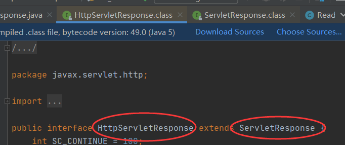

负责向浏览器发送数据的方法

```java
ServletOutputStream getOutputStream() throws IOException;
PrintWriter getWriter() throws IOException;
```

负责向浏览器发送响应头的方法

```java
void setCharacterEncoding(String var1);
void setContentLength(int var1);
void setContentType(String var1);
void setDateHeader(String var1, long var2);
void addDateHeader(String var1, long var2);
void setHeader(String var1, String var2);
void addHeader(String var1, String var2);
void setIntHeader(String var1, int var2);
void addIntHeader(String var1, int var2);
```

状态码常量

```java
int SC_OK = 200;
int SC_NOT_FOUND = 404;
int SC_INTERNAL_SERVER_ERROR = 500;
int SC_BAD_GATEWAY = 502;
```

## 常见应用

### 向浏览器输出消息

### 下载文件

```java
//获取路径
String realPath ="filePath";
//获取文件名
String filename = realPath.substring(realPath.lastIndexOf("\\" + 1));

//设置下载头信息
//resp.setHeader("Content-disposition","attachment;filename"+ URLEncoder.encode(filename));
resp.setHeader("Content-disposition","attachment;filename"+ URLEncoder.encode(filename,"UTF-8"));

//将文件输入流再输出
FileInputStream fileInputStream = new FileInputStream(realPath);
int len=0;
byte[] buffer = new byte[1024];
ServletOutputStream outputStream = resp.getOutputStream();
while((len=fileInputStream.read(buffer))>0){
    outputStream.write(buffer,0,len);
}

outputStream.close();
fileInputStream.close();
```

### 验证码功能

```java
public class ImageServlet extends HttpServlet {

    @Override
    protected void doGet(HttpServletRequest req, HttpServletResponse resp) throws ServletException, IOException {

        //让浏览器5s刷新一次
        resp.setHeader("refresh","3");

        //在内存中创建一个图片
        BufferedImage bufferedImage = new BufferedImage(80,20,BufferedImage.TYPE_INT_RGB);
        //得到图片
        Graphics2D graphics = (Graphics2D) bufferedImage.getGraphics();//笔
        //设置图片的背景颜色
        graphics.setColor(Color.white);
        graphics.fillRect(0,0,80,20);
        //给图片写数据
        graphics.setColor(Color.BLUE);
        graphics.setFont(new Font(null,Font.BOLD,20));
        graphics.drawString(Randomnum(),0,20);

        //告诉浏览器,这个请求用图片的方式打开
        resp.setContentType("image/png");
        //网站存在缓存,不让浏览器缓存
        resp.setDateHeader("expires",-1);
        resp.setHeader("Cache-Control","no-cache");
        resp.setHeader("Pragma","no-cache");

        //把图片写给浏览器
        ImageIO.write(bufferedImage,"png",resp.getOutputStream());
    }

    //创建随机数
    private String Randomnum(){
        Random random = new Random();
        String s = random.nextInt(9999999) + "";
        StringBuffer stringBuffer = new StringBuffer();
        for (int i = 0; i < 7 - s.length(); i++) {
            stringBuffer.append("0");
        }
        s = stringBuffer.toString() + s;
        return s;
    }
```

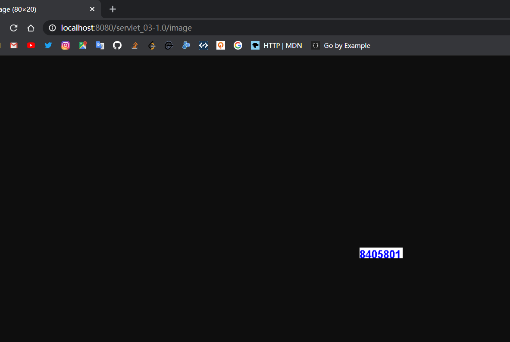

### 重定向

一个Web资源收到客户端请求后,他回通知客户端去访问另外一个Web资源

```java
void sendRedirect(String var1) throws IOException;
```

```java
//resp.setHeader("Location","/servlet_03-1.0/image");
//resp.setStatus(302);

//重定向一定要注意路径问题
resp.sendRedirect("/servlet_03-1.0/image");//重定向
```

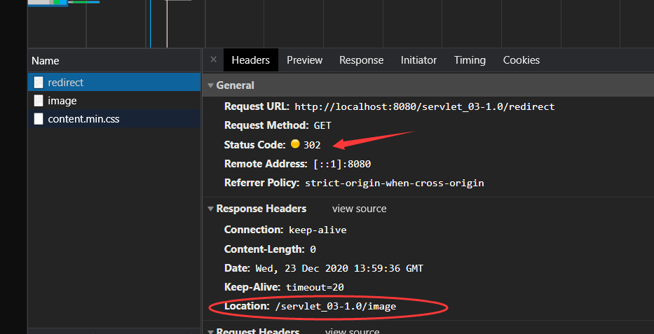

重定向和请求转发的区别?

相同点

* 页面都会实现跳转

不同点

* 请求转发时,url不会发生跳转
* 重定向时,url会发生跳转

### 主页面跳转

编写主页面

```jsp
<html>
<body>
<h2>Hello World!</h2>
<%@ page contentType="text/html; charset=UTF-8"  %>


<%--这里提交的路径,需要寻找到项目的路径--%>
<%--${pageContext.request.contextPath}这个代表当前项目--%>
<form action="${pageContext.request.contextPath}/login" method="get">
    用户名:<input type="text" name="username"> <br>
    密码:<input type="password" name="password"> <br>
    <input type="submit">
</form>
</body>
</html>
```

编写响应请求类

```java
//该类的映射地址为 /login
protected void doGet(HttpServletRequest req, HttpServletResponse resp) throws ServletException, IOException {
    resp.setContentType("text/html");
    resp.setCharacterEncoding("utf-8");
    PrintWriter writer = resp.getWriter();
    writer.print("进入这个请求了");

    //处理请求
    String username = req.getParameter("username");
    String password = req.getParameter("password");

    writer.print("username:"+username);
    writer.print("password:"+password);

}
```

测试,进入主页面后输入用户名和密码

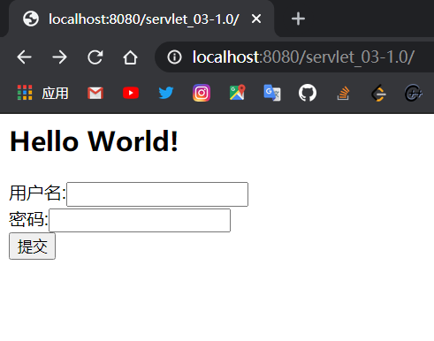

提交后进入我们写的响应类

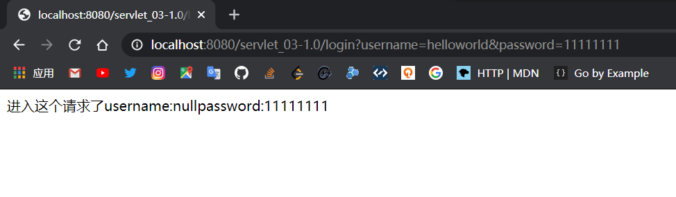

# Request

HttpServletRequest代表客户端的请求,用户通过HTTP协议访问服务器

HTTP请求中的所有信息会被封装到HttpServletRequest 

通过HttpServletRequest方法,获得客户端的所有信息

## 获取参数

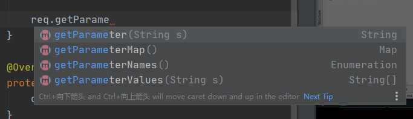

```jsp
<%--index.jsp--%>
<h1>登录</h1>
<div style="text-align:center">

    <%--以post方式提交表单,提交到我们的login请求--%>
    <form action="${pageContext.request.contextPath}/login" method="post">
        用户名:<input type="username" name="username"><br>
        密码:<input type="password" name="password"><br>
        爱好:
        <input type="checkbox" name="hobby" value="C++">C++
        <input type="checkbox" name="hobby" value="Java">Java
        <input type="checkbox" name="hobby" value="Python">Python
        <input type="checkbox" name="hobby" value="Linux">Linux
        <br>
        <input type="submit">
    </form>
</div>
```

```jsp
<%--success.jsp--%>
<h1>登录成功</h1>
```

```java
//RequestTest.java
resp.setCharacterEncoding("utf-8");
resp.setContentType("text/html");

String username = req.getParameter("username");
String password = req.getParameter("password");

String[] parameterValues = req.getParameterValues("hobby");
//在页面上输出获取的参数,三秒后跳转到success页面
for (String parameterValue : parameterValues) {
    resp.getWriter().print(parameterValue);
}
resp.setHeader("refresh","3;URL=success.jsp");

//通过请求转发
//req.getRequestDispatcher("/servlet_04-01/success.jsp").forward(req,resp);
```

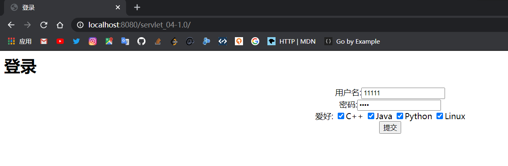

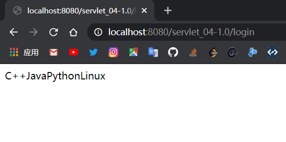

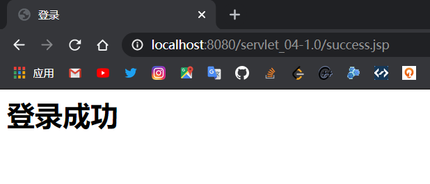

# CookieSession

会话:用户打开一个浏览器,点击了很多超链接,访问了很多Web资源,关闭了浏览器,这个过程称为会话

Cookie:服务器给客户端一个信件,客户端下次访问服务器端带上信件就可以了

Session:服务器登记你来过,下次来的时候进行匹配

保存会话的两种技术:

* cookie
  * 客户端技术(请求和响应)

* session
  * 服务器技术,利用这个技术可以保存用户的会话信息,可以把信息或者数据放在session中

常见场景:网站登录后不用再次登录

## Cookie

网站登录后记录时间,再次登录网站显示上次访问的时间

```java
resp.setContentType("text/html");
req.setCharacterEncoding("utf-8");
resp.setCharacterEncoding("utf-8");

//保存用户上一次访问的时间

PrintWriter out = resp.getWriter();
//Cookie,服务器从客户端获取
//返回数组,cookie可能存在多个
Cookie[] cookies = req.getCookies();

boolean flag = false;//标记是否访问过
for (Cookie cookie : cookies) {
    //判断设置的时间cookie是否存在
    //获取cookie的名字
    if (cookie.getName().equals("lastLoginTime")) {
        flag = true;
        out.write("你上一次访问的时间是:");
        //获取cookie中的值,将cookie值转为时间戳
        long l = Long.parseLong(cookie.getValue());
        Date date = new Date(l);
        out.print(date.toLocaleString());
    }
}
//如果没有访问过
if(!flag)
    out.print("这是你第一次访问");

//服务器给客户端响应一个cookie
Cookie cookie = new Cookie("lastLoginTime", System.currentTimeMillis() + "");
//设置cookie有效期
cookie.setMaxAge(100);
resp.addCookie(cookie);
```

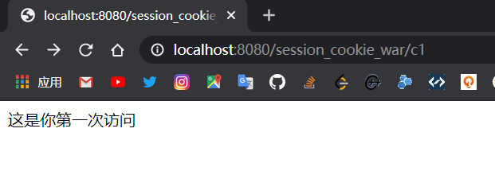

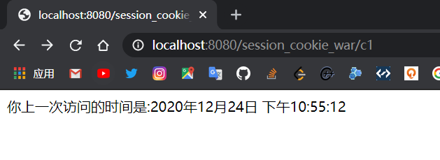

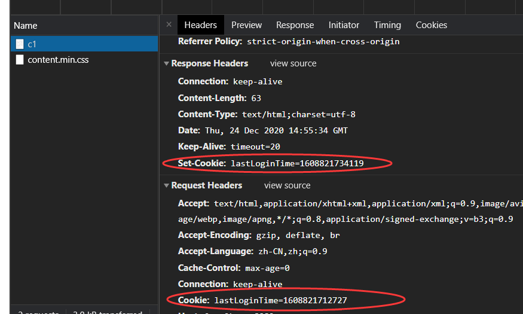

一个网站Cookie能否存在上限?

* 一个Cookie只能保存一个信息
* 一个Web服务器可以给浏览器发送多个Cookie,最多存放20个Cookie
* Cookie的大小有限制
* 浏览器Cookie上限300个

删除Cookie:

* 不设置有效期,关闭浏览器自动失效
* 设置有效期时间为0

## Session

服务器会给每一个用户创建一个Session对象,一个Session独占一个Session,只要浏览器没关闭,这个Session就存在

用户登录之后,整个网站都可以访问(保存用户的信息)

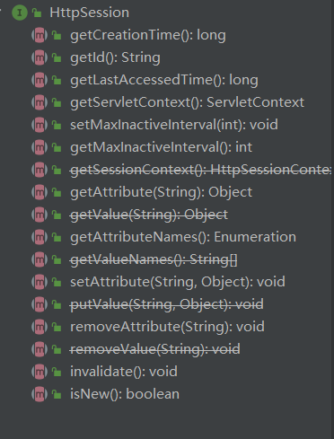

获取属性

```java
//SessionDemo01给Session存一个name,好好学习
req.setCharacterEncoding("utf-8");
resp.setCharacterEncoding("utf-8");
resp.setContentType("text/html");
PrintWriter out = resp.getWriter();

//得到Session
HttpSession session = req.getSession();
//给Session存东西
session.setAttribute("name", "好好学习");
//获取Session的ID,每个用户ID唯一
String id = session.getId();

//判断Session是不是新创建的
if (session.isNew()) {
    out.write("Session创建成功,ID为:" + id);
} else {
    out.write("Session已经存在,ID为:" + id);
}
//Session创建时做了什么事情
//Cookie jsessionid = new Cookie("JSESSIONID", id);
//resp.addCookie(jsessionid);
```

```java
//SessionDemo02得到Session并打印到页面
req.setCharacterEncoding("utf-8");
resp.setCharacterEncoding("utf-8");
resp.setContentType("text/html");
PrintWriter out = resp.getWriter();

//得到Session
HttpSession session = req.getSession();

Object name = session.getAttribute("name");

out.print(name);
```

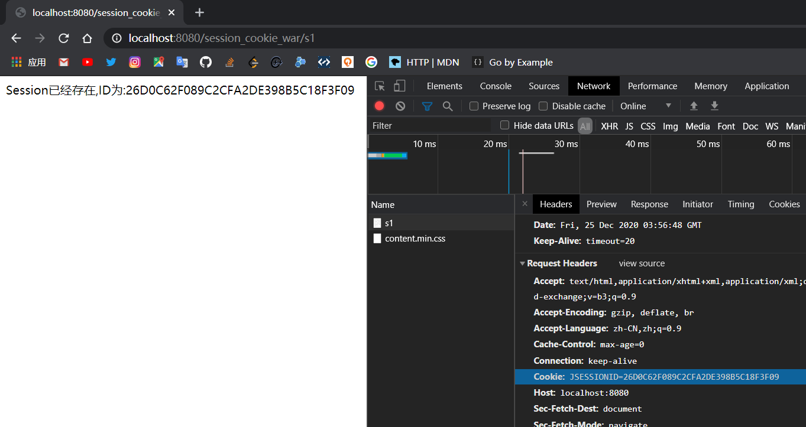

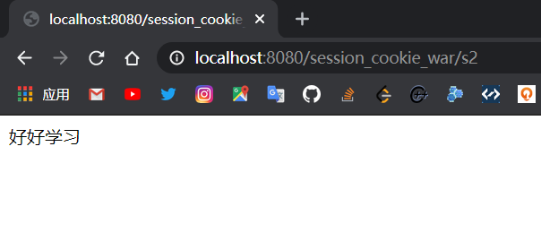

Session可以存一个对象

注销Session

```java
HttpSession session = req.getSession();
session.removeAttribute("name");
//手动注销Session
session.invalidate();
```

```xml
<!--    设置Session默认的失效时间-->
<session-config>
    <!--        1分钟后Session自动失效-->
    <session-timeout>1</session-timeout>
</session-config>
```

Session和Cookie的区别:

* Cookie是把用户的数据写给用户的浏览器,浏览器保存
* Session是把用户的数据写到独占Session,服务器端保存
* Session对象由服务器创建

使用场景:

* 保存一个用户的信息
* 购物车信息
* 在整个网站中,经常会使用的数据,将它保存在Session中

# JSP

Java Server Pages:Java服务器端页面,和Servler一样,用于动态Web技术

浏览器向服务器发送请求,不管访问什么资源,其实都是在访问Servlet

JSP最终也会被转换为一个Java类,本质上就是一个Servlet

## JSP原理

```java
//index_jsp.java

//初始化
public void _jspInit();
//销毁
public void _jspDestroy();
//服务
public void _jspService(HttpServletRequest request, HttpServletResponse response);

//内置对象,可以在JSP中直接使用
final javax.servlet.jsp.PageContext pageContext;//页面上下文
javax.servlet.http.HttpSession session = null;	//Session
final javax.servlet.ServletContext application;//ServletContex
final javax.servlet.ServletConfig config;	//config
javax.servlet.jsp.JspWriter out = null;		//out
final java.lang.Object page = this;			//当前页
HttpServletRequest request;		//请求
HttpServletResponse response;	//响应

//输出页面前增加的代码
response.setContentType("text/html; charset=UTF-8");
pageContext = _jspxFactory.getPageContext(this, request, response,null, true, 8192, true);
_jspx_page_context = pageContext;
application = pageContext.getServletContext();
config = pageContext.getServletConfig();
session = pageContext.getSession();
out = pageContext.getOut();
_jspx_out = out;
```

在JSP页面中,只要是JAVA代码,会原封不动地输出,只要是HTML代码,会被转换为这样的格式,输出到前端

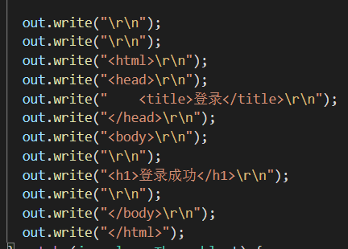

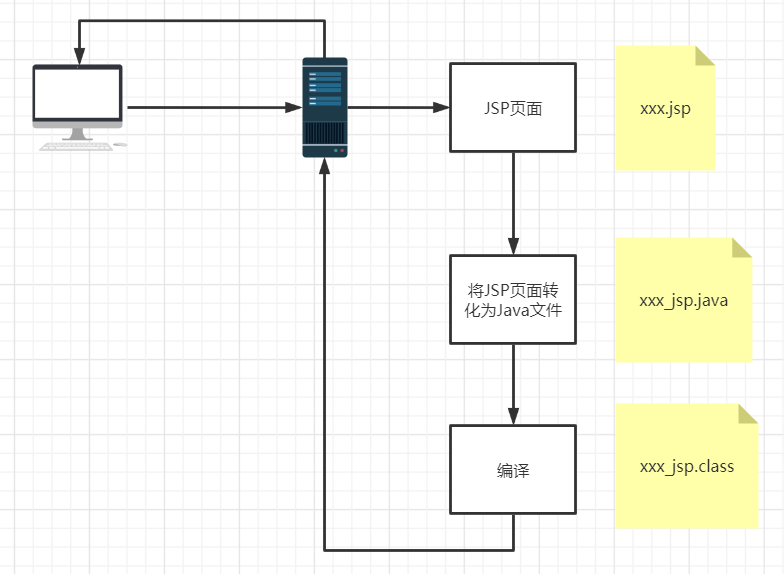

## JSP语法

```xml
<!--    加入jsp的依赖-->
<dependency>
    <groupId>javax.servlet.jsp</groupId>
    <artifactId>jsp-api</artifactId>
    <version>2.1</version>
</dependency>
<!--    JSTL表达式的依赖-->
<dependency>
    <groupId>javax.servlet.jsp.jstl</groupId>
    <artifactId>jstl-api</artifactId>
    <version>1.2</version>
</dependency>
<!--standard标签库-->
<dependency>
    <groupId>taglibs</groupId>
    <artifactId>standard</artifactId>
    <version>1.1.2</version>
</dependency>
```


JSP表达式

```
<%--JSP表达式
用来将程序的输出输出到客户端
<%= 变量或者表达式%>
--%>
<%=new java.util.Date()%>
```

JSP脚本片段

```jsp
<%--JSP脚本片段--%>
<%
    int sum=0;
    for (int i = 0; i < 100; i++) {
        sum+=i;
    }
    out.println(sum);
%>
```

## JavaBean

实体类

特定写法:

* 必须有一个无参构造
* 属性必须私有化
* 必须有对应的get/set方法

一般用来和数据库字段做映射

ORM:对象关系映射

* 表--->类
* 字段--->属性
* 行记录--->对象

| id   | name  | age  | address  |
| ---- | ----- | ---- | -------- |
| 1    | leo   | 19   | xian     |
| 2    | messi | 20   | shanghai |
| 3    | kai   | 21   | beijing  |

```java
class Person{
    private int id;
    private String name;
    private int age;
    private String address;
}
class A{
    new Person(1,"leo",20,"xian")
}
```

```java
//People类
private int id;
private String name;
private int age;
private String address;
...构造,set,get
```

```jsp
<jsp:useBean id="people" class="com.kai.pojo.People" scope="page"/>

<jsp:setProperty name="people" property="address" value="xian"/>
<jsp:setProperty name="people" property="id" value="1"/>
<jsp:setProperty name="people" property="age" value="20"/>
<jsp:setProperty name="people" property="name" value="leo"/>

name:<jsp:getProperty name="people" property="name"/>
id:<jsp:getProperty name="people" property="id"/>
age:<jsp:getProperty name="people" property="age"/>
address:<jsp:getProperty name="people" property="address"/>
```

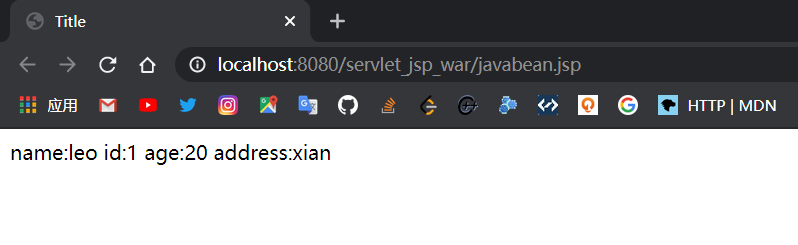

# MVC

模型,视图,控制器

Model View Control

早些年架构

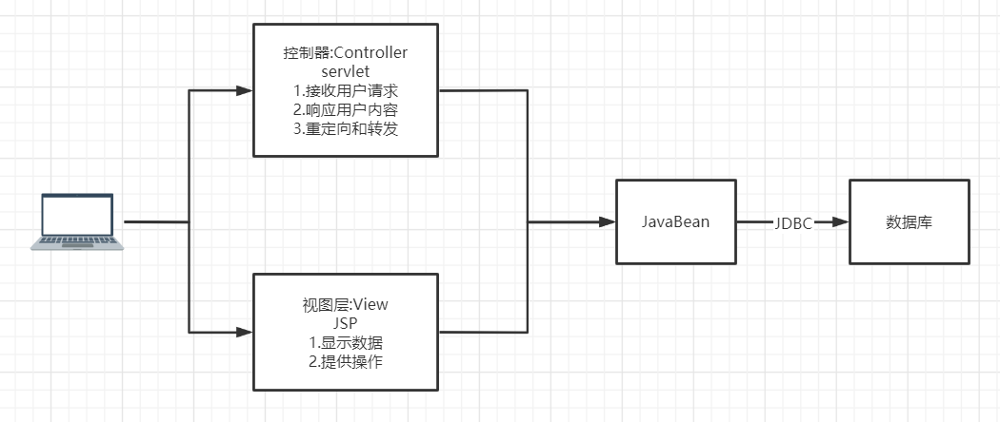

用户直接访问控制层,控制层直接操作数据库

这样不利于维护,代码臃肿,耦合度高

## 三层架构

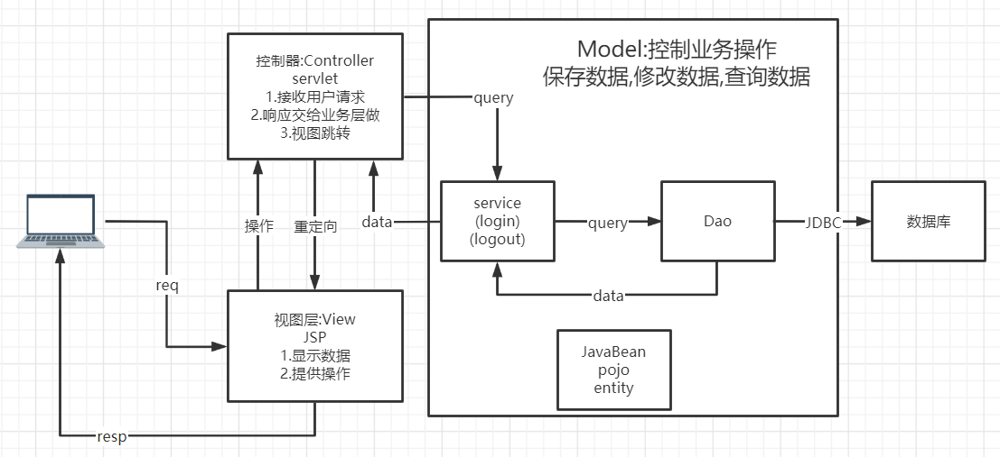

Model:

* 业务处理:业务逻辑(Service)
* 数据持久层:CRUD(Dao)

View:

* 展示数据
* 提供链接发起Servlet请求( a , form , img....)

Controller:

* 接收用户请求:请求参数,Session信息
* 交给业务层处理对应的代码
* 控制视图的跳转

```
登录--->接收用户的登录请求--->处理用户的请求--->交给业务层处理登录业务--->Dao层查询用户名和密码是否正确--->数据库
```

# Filter

过滤器,用来过滤网站的数据

## 原理

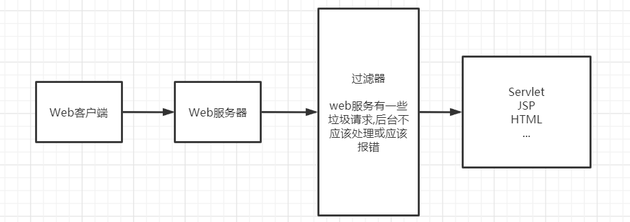

## 开发步骤

### CharacterEncodingFilter.java

```java
package com.kai.Filter;

import javax.servlet.*;
import java.io.IOException;

public class CharacterEncodingFilter implements Filter {
    @Override
    //初始化:web服务器启动,过滤器就初始化成功了
    public void init(FilterConfig filterConfig) throws ServletException {
        System.out.println("initok");
    }

    @Override
    public void doFilter(ServletRequest servletRequest, ServletResponse servletResponse, FilterChain filterChain) throws IOException, ServletException {
        servletRequest.setCharacterEncoding("utf-8");
        servletResponse.setCharacterEncoding("utf-8");
        servletResponse.setContentType("text/html;charset=UTF-8");

        //filterChain过滤器链
        /*
        * 1.过滤器中的所有代码,在过滤特定请求的时候都会执行
        * 2.必须要让过滤器继续通行
        * */
        System.out.println("CharacterEncodingFilter执行前");
        //让我们的请求继续走,如果不写,程序将被拦截
        filterChain.doFilter(servletRequest,servletResponse);
        System.out.println("CharacterEncodingFilter执行后");
    }

    @Override
    //销毁
    public void destroy() {
        System.out.println("destroyok");
    }
}
```

```java
//ServletDemo01.java
PrintWriter out = resp.getWriter();
out.write("好好学习");
```

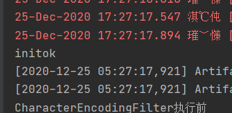

初始化:web服务器启动,过滤器就初始化成功了,随时等待过滤对象,服务器关闭时过滤器才会销毁

### web.xml

```xml
<servlet>
    <servlet-name>filtertest01</servlet-name>
    <servlet-class>com.kai.Filter.ServletDemo01</servlet-class>
</servlet>
<servlet-mapping>
    <servlet-name>filtertest01</servlet-name>
    <url-pattern>/show</url-pattern>
</servlet-mapping>

<servlet>
    <servlet-name>filtertest02</servlet-name>
    <servlet-class>com.kai.Filter.ServletDemo01</servlet-class>
</servlet>
<servlet-mapping>
    <servlet-name>filtertest02</servlet-name>
    <!--        有过滤器支持-->
    <url-pattern>/filter/show</url-pattern>
</servlet-mapping>

<filter>
    <filter-name>characterencodingfilter</filter-name>
    <filter-class>com.kai.Filter.CharacterEncodingFilter</filter-class>
</filter>
<filter-mapping>
    <filter-name>characterencodingfilter</filter-name>
    <!--        只要是/filter下的任何请求,都会经过这个过滤器-->
    <url-pattern>/filter/*</url-pattern>
</filter-mapping>
```

### 测试

没有经过过滤器的请求

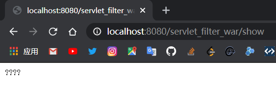

经过过滤器的请求

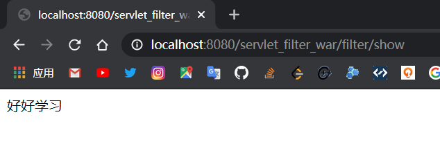

## 监听器

### OnlineCountListener.java

```java
//统计网站在线人数:统计Session
public class OnlineCountListener implements HttpSessionListener {
    @Override
    //创建Session监听
    //一旦创建Session就会触发这个事件
    public void sessionCreated(HttpSessionEvent httpSessionEvent) {
        ServletContext servletContext = httpSessionEvent.getSession().getServletContext();

        System.out.println(httpSessionEvent.getSession().getId());

        Integer onlineCount = (Integer) servletContext.getAttribute("OnlineCount");


        if (onlineCount == null) {
            onlineCount = new Integer(1);
        } else {
            int count = onlineCount.intValue();
            onlineCount = new Integer(count + 1);
        }
        servletContext.setAttribute("OnlineCount", onlineCount);
    }

    @Override
    //销毁Session监听
    //一旦销毁Session就会触发这个事件
    public void sessionDestroyed(HttpSessionEvent httpSessionEvent) {
        ServletContext servletContext = httpSessionEvent.getSession().getServletContext();
        Integer onlineCount = (Integer) servletContext.getAttribute("OnlineCount");


        if (onlineCount == null) {
            onlineCount = new Integer(0);
        } else {
            int count = onlineCount.intValue();
            onlineCount = new Integer(count - 1);
        }
        servletContext.setAttribute("OnlineCount", onlineCount);


    }
}
```

### web.xml

```xml
<!--    注册监听器-->
<listener>
    <listener-class>com.kai.Listener.OnlineCountListener</listener-class>
</listener>

<session-config>
    <session-timeout>1</session-timeout>
</session-config>
```

## 权限拦截

特别要注意路径问题

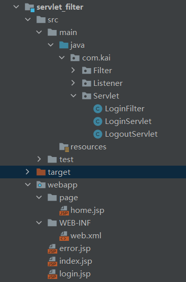

login.jsp

```jsp
<form action="/servlet_filter_war/login" method="post">
    <input type="text" name="username">
    <input type="submit">
</form>
```

LoginServlet.java

```java
//获取前端请求的参数
String username = req.getParameter("username");
if(username.equals("admin")){
    //登录成功
    req.getSession().setAttribute("USER_SESSION",req.getSession().getId());
    resp.sendRedirect("/servlet_filter_war/page/home.jsp");
}else {
    //登录失败
    resp.sendRedirect("/servlet_filter_war/error.jsp");
}
```

home.jsp(page目录下)

```jsp
<%--权限控制--%>
<%--<%--%>
<%--    Object session1 = request.getSession().getAttribute("USER_SESSION");--%>
<%--    if(session1==null){--%>
<%--        //pageContext.forward("/login.jsp");--%>
<%--        response.sendRedirect("/servlet_filter_war/login.jsp");--%>
<%--    }--%>
<%--%>--%>
<h1>主页</h1>
<p><a href="/servlet_filter_war/logout">注销</a></p>
```

error.jsp

```jsp
<h1>错误</h1>
<h3>用户名错误</h3>
<p><a href="/servlet_filter_war/login.jsp">返回登录</a></p>
```

LogoutServlet.java

```java
Object user_session = req.getSession().getAttribute("USER_SESSION");
if(user_session!=null){
    req.getSession().removeAttribute("USER_SESSION");
    resp.sendRedirect("/servlet_filter_war/login.jsp");
}else {
    resp.sendRedirect("/servlet_filter_war/login.jsp");
}
```

LoginFilter.java

```java
HttpServletRequest req1 = (HttpServletRequest) req;
HttpServletResponse resp1 = (HttpServletResponse) resp;

Object user_session = req1.getSession().getAttribute("USER_SESSION");
if(user_session==null){
    resp1.sendRedirect("/servlet_filter_war/error.jsp");
}

filterChain.doFilter(req,resp);
```

web.xml

```xml
<servlet>
    <servlet-name>logintest</servlet-name>
    <servlet-class>com.kai.Servlet.LoginServlet</servlet-class>
</servlet>
<servlet-mapping>
    <servlet-name>logintest</servlet-name>
    <url-pattern>/login</url-pattern>
</servlet-mapping>
<servlet>
    <servlet-name>logouttest</servlet-name>
    <servlet-class>com.kai.Servlet.LogoutServlet</servlet-class>
</servlet>
<servlet-mapping>
    <servlet-name>logouttest</servlet-name>
    <url-pattern>/logout</url-pattern>
</servlet-mapping>
<filter>
    <filter-name>filtertest</filter-name>
    <filter-class>com.kai.Servlet.LoginFilter</filter-class>
</filter>
<filter-mapping>
    <filter-name>filtertest</filter-name>
    <url-pattern>/page/*</url-pattern>
</filter-mapping>
```

用户登录之后才能进入主页,用户注销后就不能进入主页了

* 用户登录后,想Session中放入用户的数据
* 进入主页的时候要判断用户是否已经注销

```java
HttpServletRequest req1 = (HttpServletRequest) req;
HttpServletResponse resp1 = (HttpServletResponse) resp;

Object user_session = req1.getSession().getAttribute("USER_SESSION");
if(user_session==null){
    resp1.sendRedirect("/servlet_filter_war/error.jsp");
}

filterChain.doFilter(req,resp);
```

# JDBC

Java DateBase Connection

## 实验环境搭建

```sql
USE jdbc;

CREATE TABLE myusers(
    id INT PRIMARY KEY,
    `name` VARCHAR(40),
    `password` VARCHAR(40),
    email VARCHAR(60),
    birthday DATE
);

INSERT INTO myusers(id,`name`,`password`,email,birthday)
VALUES(1,'leo','123456','123456@qq.com','2000-01-01');
INSERT INTO myusers(id,`name`,`password`,email,birthday)
VALUES(2,'leo2','123','123@qq.com','2000-01-02');
INSERT INTO myusers(id,`name`,`password`,email,birthday)
VALUES(3,'leo3','456','456@qq.com','2000-01-03');
INSERT INTO myusers(id,`name`,`password`,email,birthday)
VALUES(4,'leo4','789','789@qq.com','2000-01-04');
```

```xml
<!--    数据库依赖-->
<dependency>
    <groupId>mysql</groupId>
    <artifactId>mysql-connector-java</artifactId>
    <version>8.0.16</version>
</dependency>
```

## JDBC代码

```java
//配置信息,8.0的配置
String url = "jdbc:mysql://localhost:3306/jdbc?useUnicode=true&characterEncoding=utf8&serverTimezone=GMT";

String username = "root";
String password = "123456";

//加载驱动
Class.forName("com.mysql.cj.jdbc.Driver");
//连接数据库
Connection connection = DriverManager.getConnection(url, username, password);
//向数据库发送SQL的对象
Statement statement = connection.createStatement();

//编写SQL
String sql = "select * from myusers";
//执行sql
ResultSet resultSet = statement.executeQuery(sql);
while (resultSet.next()) {
    System.out.println("id=" + resultSet.getObject("id"));
    System.out.println("name=" + resultSet.getObject("name"));
    System.out.println("password=" + resultSet.getObject("password"));
    System.out.println("email=" + resultSet.getObject("email"));
    System.out.println("birthday=" + resultSet.getObject("birthday"));
}

//关闭连接
resultSet.close();
statement.close();
connection.close();
```

```java
//预编译SQL
//配置信息
String url = "jdbc:mysql://localhost:3306/jdbc?useUnicode=true&characterEncoding=utf8&serverTimezone=GMT";

String username = "root";
String password = "123456";

//加载驱动
Class.forName("com.mysql.cj.jdbc.Driver");
//连接数据库
Connection connection = DriverManager.getConnection(url, username, password);

//编写SQL
//String sql = "select * from myusers";
String sql="insert into myusers(id,name,password,email,birthday) value (?,?,?,?,?)";

//预编译
PreparedStatement preparedStatement = connection.prepareStatement(sql);
preparedStatement.setInt(1,5);//给第一个占位符 ? 的值赋值为1
preparedStatement.setString(2,"kai");
preparedStatement.setString(3,"1111");
preparedStatement.setString(4,"1111@qq.com");
preparedStatement.setString(5,"2000-01-05");

//执行SQL
int i = preparedStatement.executeUpdate();
if(i>0){
    System.out.println("ok");
}

//关闭连接
preparedStatement.close();
connection.close();
```

## 事务

要么都成功,要么都失败

ACID原则

`connection.setAutoCommit(false);`

```java
@Test
public void test() {
    //配置信息
    String url = "jdbc:mysql://localhost:3306/jdbc?useUnicode=true&characterEncoding=utf8&serverTimezone=GMT";
    String username = "root";
    String password = "123456";
    Connection connection = null;
    try {
        //加载驱动
        Class.forName("com.mysql.cj.jdbc.Driver");
        //连接数据库
        connection = DriverManager.getConnection(url, username, password);
        //通知数据库打开事务
        connection.setAutoCommit(false);
        String sql = "select * from myusers where id=5";
        ResultSet resultSet = connection.prepareStatement(sql).executeQuery();
        //制造错误
        //int i = 1 / 0;
        String sql2 = "select * from myusers where id=4";
        ResultSet resultSet1 = connection.prepareStatement(sql2).executeQuery();
        connection.commit();//提交事务
        while (resultSet.next()) {
            System.out.println("name=" + resultSet.getObject("name"));
        }
        while (resultSet1.next()) {
            System.out.println("name=" + resultSet1.getObject("name"));
        }
    } catch (Exception throwables) {
        try {
            //如果出现异常,就通知数据库回滚事务
            connection.rollback();
        } catch (SQLException e) {
            e.printStackTrace();
        }
        throwables.printStackTrace();
    }
}
```

