# Http

## Http请求

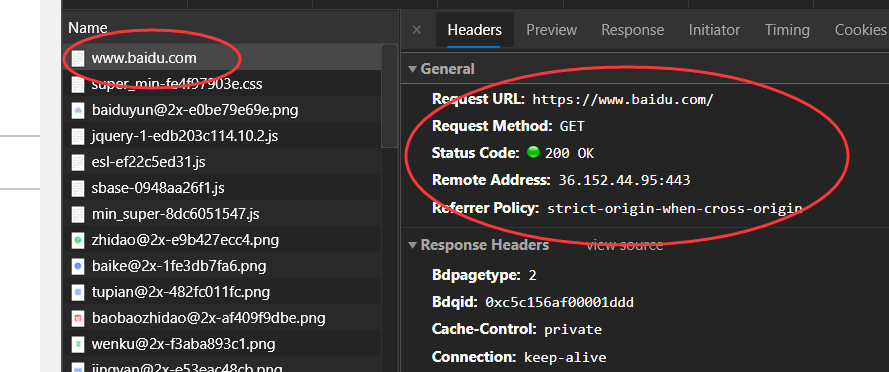

```bash
#Request Headers
Accept: text/html
Accept-Encoding: gzip, deflate, br
Accept-Language: zh-CN,zh;q=0.9,en;q=0.8,en-GB;q=0.7,en-US;q=0.6
Cache-Control: max-age=0
Connection: keep-alive
Cookie: BAIDUID=8EC988CCC74064E5FE6CB45F8B845D8C:FG=1; 
```

请求行:

* 请求行中的请求方式:GET
* 请求方式:Get,Post,HEAD,DELETE,PUT...
  * get:一次请求能够请求携带的参数比较少,大小有限制,会在浏览器的URL地址栏显示数据内容,不安全但高效
  * post:一次请求能够请求携带的参数没有限制,大小没有限制,不会在浏览器的URL地址栏显示数据内容,安全但不高效

请求体:

```bash
Accept: text/html #告诉浏览器所支持的数据类型
Accept-Encoding: gzip, deflate, br #支持的编码格式
Accept-Language: zh-CN,zh; #语言格式
Cache-Control: max-age=0  #缓存控制
Connection: keep-alive   #告诉浏览器请求完成断开还是保持连接
```


## Http响应

```bash
#Response Headers
Bdpagetype: 2
Bdqid: 0xc5c156af00001ddd
Cache-Control: private		#缓存控制
Connection: keep-alive		#连接		
Content-Encoding: gzip		#编码类型
Content-Type: text/html;charset=utf-8
```

响应体:

```bash
Accept: text/html #告诉浏览器所支持的数据类型
Accept-Encoding: gzip, deflate, br #支持的编码格式
Accept-Language: zh-CN,zh; #语言格式
Cache-Control: max-age=0  #缓存控制
Connection: keep-alive   #告诉浏览器请求完成断开还是保持连接
Refrush:		#告诉客户端,多久刷新一次
Location:		#让网页重新定位
```

响应状态码:

200:请求响应成功

3xx:请求重定向

404:找不到资源

500:服务器代码出错

502:网关错误

# Servlet

Servlet（Server Applet）是JavaServlet的简称，称为小服务程序或服务连接器，用Java编写的服务器端程序，具有独立于平台和协议的特性，主要功能在于交互式地浏览和生成数据，生成动态Web内容。

狭义的Servlet是指Java语言实现的一个接口，广义的Servlet是指任何实现了这个Servlet接口的类，一般情况下，人们将Servlet理解为后者。Servlet运行于支持Java的应用服务器中。从原理上讲，Servlet可以响应任何类型的请求，但绝大多数情况下Servlet只用来扩展基于HTTP协议的Web服务器。(百度百科)

## Maven构建

```xml
  <dependencies>
    <dependency>
      <groupId>junit</groupId>
      <artifactId>junit</artifactId>
      <version>4.11</version>
      <scope>test</scope>
    </dependency>

    <!--       加入servlet依赖 -->
    <dependency>
      <groupId>javax.servlet</groupId>
      <artifactId>servlet-api</artifactId>
      <version>2.5</version>
      <scope>provided</scope>
    </dependency>
<!--    加入jsp的依赖-->
    <dependency>
      <groupId>javax.servlet.jsp</groupId>
      <artifactId>jsp-api</artifactId>
      <version>2.1</version>
      <scope>provided</scope>
    </dependency>
  </dependencies>
```

## HttpServlet

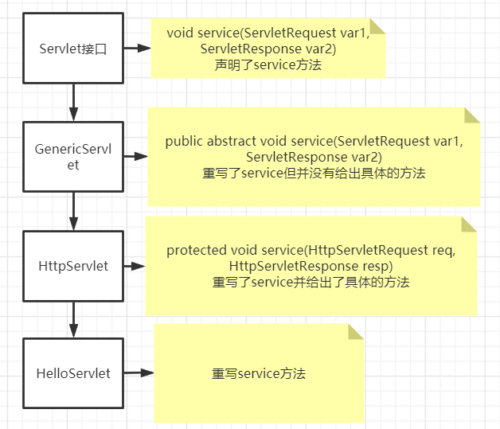

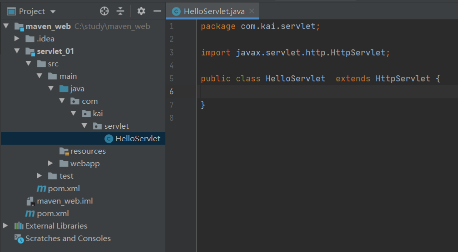

```java
public class HelloServlet  extends HttpServlet {
    //Get与Post只是请求方式不同,业务逻辑相同,可相互调用
    @Override
    protected void doGet(HttpServletRequest req, HttpServletResponse resp) throws ServletException, IOException {
        PrintWriter writer = resp.getWriter();//响应流
        writer.print("hello servlet");
    }
    @Override
    protected void doPost(HttpServletRequest req, HttpServletResponse resp) throws ServletException, IOException {
        doGet(req,resp);
    }
}
```

## Servlet映射

我们的是Java程序,而浏览器需要连接web服务器,我们需要在web服务器中注册我们写的Servlet,还需要给它一个浏览器能够访问的路径

```xml
<!--    注册servlet-->
<servlet>
   <servlet-name>hello</servlet-name>
   <servlet-class>com.kai.servlet.HelloServlet</servlet-class>
</servlet>
<!--    servlet的映射路径-->
<servlet-mapping>
    <servlet-name>hello</servlet-name>
    <url-pattern>/hello</url-pattern>
</servlet-mapping>
```

将war包放置tomcat下,用浏览器测试结果

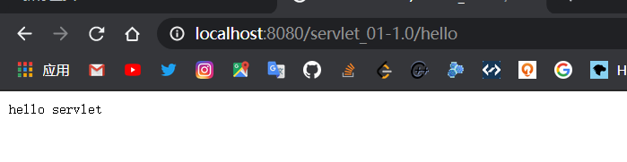

### Servlet原理

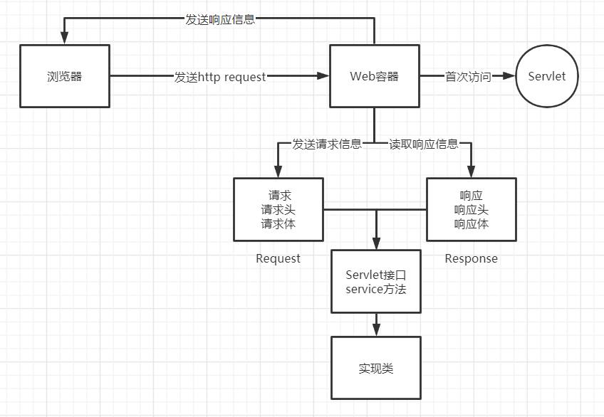

## Mapping

### 地址映射

```xml
<!--多个Servlet注册需要 4.0 web_xml声明-->
<?xml version="1.0" encoding="UTF-8"?>
<web-app xmlns="http://xmlns.jcp.org/xml/ns/javaee"
         xmlns:xsi="http://www.w3.org/2001/XMLSchema-instance"
         xsi:schemaLocation="http://xmlns.jcp.org/xml/ns/javaee
                      http://xmlns.jcp.org/xml/ns/javaee/web-app_4_0.xsd"
         version="4.0">

</web-app>
```

一个Servlet可以指定一个映射路径

```xml
<servlet-mapping>
    <servlet-name>hello</servlet-name>
    <url-pattern>/hello</url-pattern>
</servlet-mapping>
```

一个Servlet可以指定多个映射路径

```xml
<servlet-mapping>
    <servlet-name>hello</servlet-name>
    <url-pattern>/hello1</url-pattern>
</servlet-mapping>
<servlet-mapping>
    <servlet-name>hello</servlet-name>
    <url-pattern>/hello2</url-pattern>
</servlet-mapping>
```

一个Servlet可以指定通用映射路径

```xml
<servlet-mapping>
    <servlet-name>hello</servlet-name>
    <url-pattern>/hello/*</url-pattern>
</servlet-mapping>
```

默认请求路径

```xml
<servlet-mapping>
    <servlet-name>hello</servlet-name>
    <url-pattern>/*</url-pattern>
</servlet-mapping>
```

指定一些后缀或者前缀等等

```xml
<servlet-mapping>
    <servlet-name>hello</servlet-name>
    <url-pattern>*.kai</url-pattern>
</servlet-mapping>
<!--注意*前面不能有指定路径-->
```

### Error

自定义Error页面

```xml
<servlet>
   <servlet-name>error</servlet-name>
   <servlet-class>com.kai.servlet.ErrorServlet</servlet-class>
</servlet>
<servlet-mapping>
    <servlet-name>error</servlet-name>
    <url-pattern>/*</url-pattern>
</servlet-mapping>
```

```java
//ErrorServlet.java
public class ErrorServlet  extends HttpServlet {

    @Override
    protected void doGet(HttpServletRequest req, HttpServletResponse resp) throws ServletException, IOException {
        resp.setContentType("text/html");
        resp.setCharacterEncoding("utf-8");

        PrintWriter writer = resp.getWriter();
        writer.print("error");
    }

    @Override
    protected void doPost(HttpServletRequest req, HttpServletResponse resp) throws ServletException, IOException {
        doGet(req, resp);
    }
}
```

测试结果

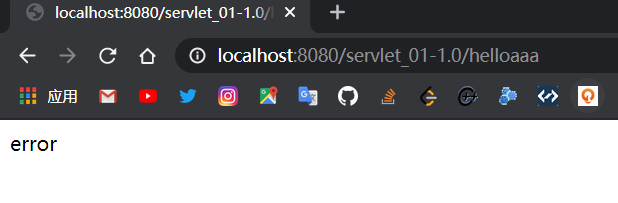

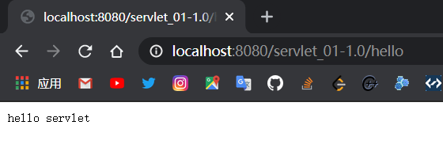

**固有的映射路径优先级最高**,如果找不到会找默认的处理请求

# ServletContex

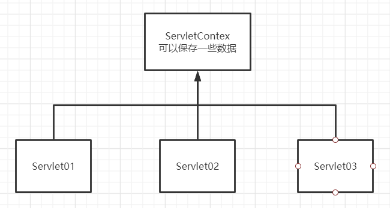

## Contex对象

Web容器启动时,为每个Web程序都创建一个对应的ServletContex对象,它代表了当前的Web对象

## 共享数据

两个Servlet中的数据共享

```java
public class HelloContex  extends HttpServlet {

    @Override
    protected void doGet(HttpServletRequest req, HttpServletResponse resp) throws ServletException, IOException {

        resp.setContentType("text/html");
        resp.setCharacterEncoding("utf-8");

        //this.getInitParameter();  //初始化参数
        //this.getServletConfig();  //Service配置
        //this.getServletContext(); //上下文

        ServletContext servletContext = this.getServletContext();

        String username="好好学习";
        //将一个数据保存到ServletContex
        servletContext.setAttribute("username",username);
    }

    @Override
    protected void doPost(HttpServletRequest req, HttpServletResponse resp) throws ServletException, IOException {
        doGet(req, resp);
    }
}
```

```java
public class ReadContex extends HttpServlet {
    @Override
    protected void doGet(HttpServletRequest req, HttpServletResponse resp) throws ServletException, IOException {
        resp.setContentType("text/html");
        resp.setCharacterEncoding("utf-8");

        ServletContext servletContext = this.getServletContext();
        
        //读取ServletContex中的数据
        Object username = (String)servletContext.getAttribute("username");

        resp.getWriter().print("username"+username);

    }

    @Override
    protected void doPost(HttpServletRequest req, HttpServletResponse resp) throws ServletException, IOException {
        doGet(req, resp);
    }
}
```

先执行ReadContex,显示null

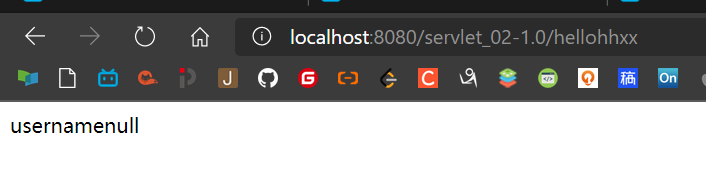

再执行HelloContex,将"好好学习"保存到Contex中

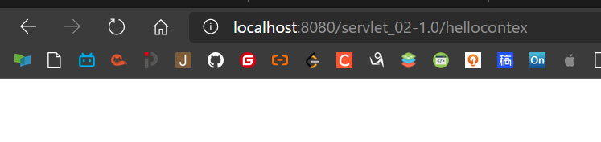

再次执行ReadContex,成功实现数据共享

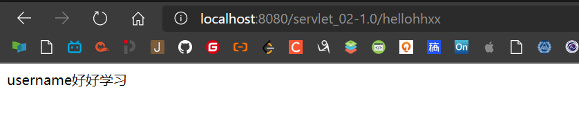

## 获取初始化参数

```java
protected void doGet(HttpServletRequest req, HttpServletResponse resp) throws ServletException, IOException {
    resp.setContentType("text/html");
    resp.setCharacterEncoding("utf-8");

    ServletContext servletContext = this.getServletContext();
    //获得初始化参数
    String url = servletContext.getInitParameter("url");
    resp.getWriter().print(url);

}
```

```xml
<!--    配置一些Web应用的初始化参数-->
<contex-param>
    <param-name>url</param-name>
    <param-value>jdbc:mysql://localhost:3306/mybatis</param-value>
</contex-param>

<servlet>
    <servlet-name>getparam</servlet-name>
    <servlet-class>com.kai.contex.contex03</servlet-class>
</servlet>
<servlet-mapping>
    <servlet-name>getparam</servlet-name>
    <url-pattern>/getparam</url-pattern>
</servlet-mapping>
```

## 请求转发

访问这个Servlet直接跳转到上例的Servlet,且URL不变

```java
ServletContext servletContext = this.getServletContext();
//转发请求路径,该路径为上例web.xml的映射地址
servletContext.getRequestDispatcher("/getparam").forward(req,resp);
```

## 读取资源文件

创建一个资源文件

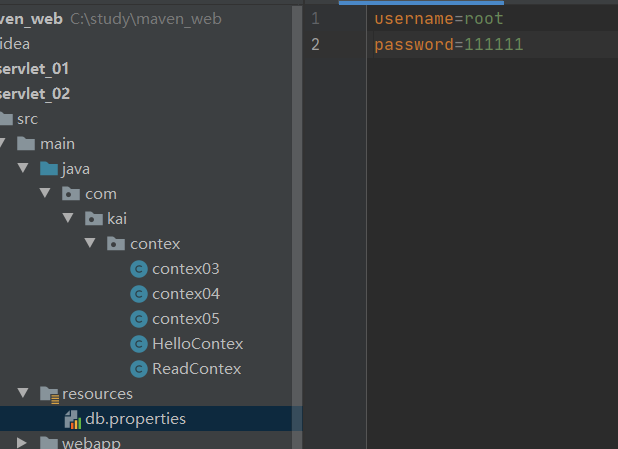

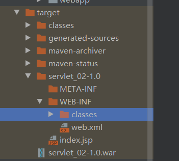

classes被称为classpath(类路径),资源文件都会生成在类路径中

```java
//Java代码
protected void doGet(HttpServletRequest req, HttpServletResponse resp) throws ServletException, IOException {
	//文件流
    InputStream resourceAsStream = this.getServletContext().getResourceAsStream("/WEB-INF/classes/db.properties");

    Properties prop=new Properties();
    prop.load(resourceAsStream);
    String username = prop.getProperty("username");
    String password = prop.getProperty("password");

    resp.getWriter().print(username+" "+password);

}
```

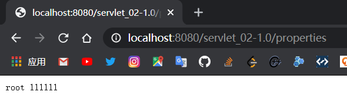

# Response

Web服务器接收到客户端的http请求,针对这个请求,分别创建一个代理请求HttpServletReqest对象,代表响应的一个HttpServletResponse对象