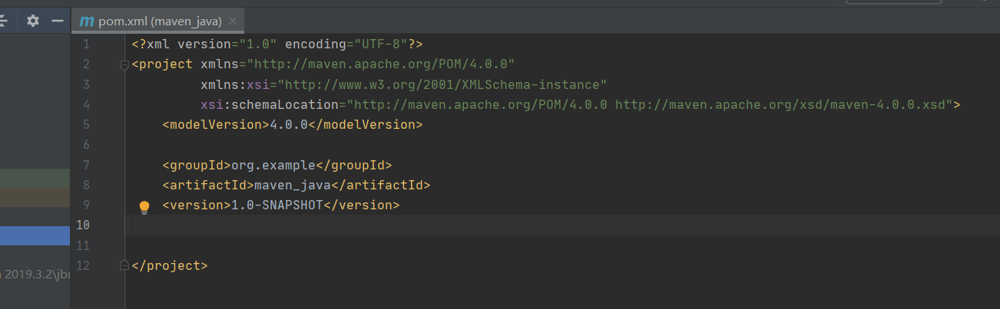
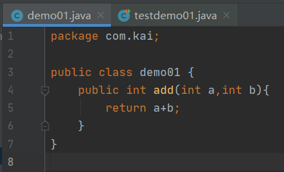

#  什么是Maven

[Maven 官网](https://maven.apache.org/)

Maven是一个项目管理工具,可以对Java项目进行构建依赖管理.

## 约定配置

| 目录                               | 目的                                                         |
| :--------------------------------- | :----------------------------------------------------------- |
| ${basedir}                         | 存放pom.xml和所有的子目录                                    |
| ${basedir}/src/main/java           | 项目的java源代码                                             |
| ${basedir}/src/main/resources      | 项目的资源，比如说property文件，springmvc.xml                |
| ${basedir}/src/test/java           | 项目的测试类，比如说Junit代码                                |
| ${basedir}/src/test/resources      | 测试用的资源                                                 |
| ${basedir}/src/main/webapp/WEB-INF | web应用文件目录，web项目的信息，比如存放web.xml、本地图片、jsp视图页面 |
| ${basedir}/target                  | 打包输出目录                                                 |
| ${basedir}/target/classes          | 编译输出目录                                                 |
| ${basedir}/target/test-classes     | 测试编译输出目录                                             |
| Test.java                          | Maven只会自动运行符合该命名规则的测试类                      |
| ~/.m2/repository                   | Maven默认的本地仓库目录位置                                  |

## Maven特点

* 项目设置遵循统一的规则
* 任意工程中共享
* 依赖管理包括自动更新
* 基于模型的构建
* 发布管理和发布单独的输出
* 项目继承
* 并行构建
* 更好的错误报告

## Maven仓库

Maven仓库是项目依赖的第三方库

**本地仓库**

运行Maven时,Maven所需要的任何构件都是直接从本地仓库获取的,如果本地仓库没有,会首先尝试从远程仓库下载构件至本地,然后再使用本地仓库的构件

默认位置`用户名/.m2/respository/`

**中央仓库**

Maven中央仓库由Maven社区提供,有社区管理,不需要配置,需要联网访问

[中央仓库](https://search.maven.org/#browse)

**远程仓库**

由开发人员自己定制仓库

**阿里云仓库**

`Maven/conf/setting.xml`mirriors中修改

(将`conf/setting.xml`拷贝到`.m2`文件下,`conf/setting.xml`用于备份)

```xml
<mirror>
      <id>alimaven</id>
      <name>aliyun maven</name>
      <url>http://maven.aliyun.com/nexus/content/groups/public/</url>
      <mirrorOf>central</mirrorOf>        
</mirror>
```

# 创建Maven工程

## IDEA创建


修改版本号与JDK一致(不然编译出错)


或在`pom.xml`中添加

```xml
<properties>
	<maven.compiler.source>11</maven.compiler.source>
	<maven.compiler.target>11</maven.compiler.target>
</properties>
```

**或修改`setting.xml`文件**

```xml
<!--profiles标签中-->
<profile>
     <id>jdk-11</id>
     <activation>
         <activeByDefault>true</activeByDefault>
         <jdk>11</jdk>
     </activation>
     <properties>
         <project.build.sourceEncoding>UTF-8</project.build.sourceEncoding>
         <maven.compiler.source>11</maven.compiler.source>
         <maven.compiler.target>11</maven.compiler.target> 
     </properties> 
</profile>
```

使用IDEA默认的Maven


创建与修改完成后


## POM

POM( Project Object Model,项目对象模型)是Maven工程的基本工作单元,包含了项目的基本信息,用于描述项目如何构建,声明项目依赖等  

```xml
<project xmlns = "http://maven.apache.org/POM/4.0.0"
    xmlns:xsi = "http://www.w3.org/2001/XMLSchema-instance"
    xsi:schemaLocation = "http://maven.apache.org/POM/4.0.0
    http://maven.apache.org/xsd/maven-4.0.0.xsd">
 
    <!-- 模型版本 -->
    <modelVersion>4.0.0</modelVersion>
    
    
    <!-- 公司或者组织的唯一标志，并且配置时生成的路径也是由此生成， 如com.companyname.project-group，maven会将该项目打成的jar包放本地路径：/com/companyname/project-group -->
    <groupId>com.companyname.project-group</groupId>
    
    <!-- 项目的唯一ID，一个groupId下面可能多个项目，就是靠artifactId来区分的 -->
    <artifactId>project</artifactId>
    
    <!-- 版本号   1.0-SNAPSHOT快照(最新版本) -->
    <version>1.0</version>
    
    <!--groupId artifactId verison 三个元素称为坐标,每个项目中必须有,唯一标识某项目-->   
</project>
```

* `packaging`:打包后压缩文件的扩展名,默认是`jar`,`web`应用是`war`
* `dependencies`和`dependency`:依赖
* `properties`:用来定义一些配置属性
* `build`:Maven在进行项目的构建时配置信息,例如编译时jdk版本
* `parent`:继承父工程的pom配置
* `modules`:聚合其它模块



## Super POM

Maven默认的POM,包含了一些可以被继承的默认设置

## 项目的构建

构建是面向过程的,完成项目代码的编译,测试,运行,打包,部署等等

| 阶段          | 处理     | 描述                                                     |
| :------------ | :------- | :------------------------------------------------------- |
| 验证 validate | 验证项目 | 验证项目是否正确且所有必须信息是可用的                   |
| 编译 compile  | 执行编译 | 源代码编译在此阶段完成                                   |
| 测试 Test     | 测试     | 使用适当的单元测试框架（例如Junit）运行测试。            |
| 包装 package  | 打包     | 创建JAR/WAR包如在 pom.xml 中定义提及的包                 |
| 检查 verify   | 检查     | 对集成测试的结果进行检查，以保证质量达标                 |
| 安装 install  | 安装     | 安装打包的项目到本地仓库，以供其他项目使用               |
| 部署 deploy   | 部署     | 拷贝最终的工程包到远程仓库中，以共享给其他开发人员和工程 |

生命周期:每执行靠后命令的总会把前面命令执行一遍

* `mav clean`:清理,删除原来编译和测试的目录,即target目录,但已经install到仓库的包不会删除
* `mav compile`:编译`main/java`主程序,会在当前目录生成一个target目录
* `mav test-compile`:编译测试程序
* `mav test`:编译所有代码
* `mav package`:打包程序
* `mav install`:按照本工程的坐标保存到本地仓库


单元测试: junit 是一个专门测试的框架,测试的是类中的方法,每一个方法都是独立测试的

```xml
<dependencies>
    <dependency>
        <groupId>junit</groupId>
        <artifactId>junit</artifactId>
        <version>4.13</version>
        <scope>test</scope>
    </dependency>
</dependencies>
```

在`src/main/java`目录下,创建程序,在`src/test/java`目录下创建测试程序




* 运行测试程序,正确情况与错误情况
  * 
  * 

* 打包,在项目`target`目录下生成`项目名-版本号.jar` 包,只包含`src/main`的所有东西
  * 

# Maven其它设置

## 配置插件

在`pom.xml`中配置插件

```xml
<!--控制配置maven构建项目的参数设置,设置jdk的版本-->
<build>
    <!--配置插件-->
<plugins>
    <!--配置具体的插件-->
   <plugin>
   		<groupId>org.apache.maven.plugins</groupId>
       <!--插件的名称-->
  		<artifactId>maven-antrun-plugin</artifactId>
       <!--插件的版本-->
   		<version>3.8.1</version>
       <!--配置插件的信息-->
       	<configuration>
            <!--告诉maven,代码在jdk1.8上编译-->
             <source>1.8</source>
            <!--程序应该在1.8的jdk上-->
             <target>1.8</target>
         </configuration>
   </plugin>
</plugins>
</build>
```

[Maven--Available Plugins](http://maven.apache.org/plugins/index.html)


