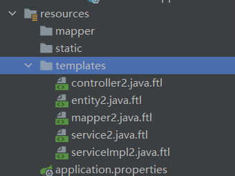
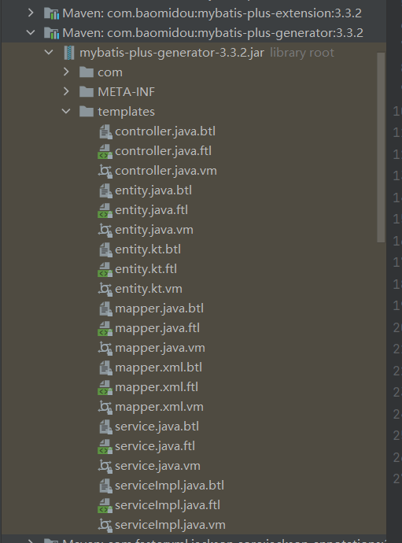

# 配置

## application

```properties
# application 配置文件
spring.datasource.driver-class-name=com.mysql.cj.jdbc.Driver
spring.datasource.username=root
spring.datasource.password=123456
spring.datasource.url=jdbc:mysql://localhost:3306/mybatis_plus?useUnicode=true&characterEncoding=UTF-8&serverTimezone=Asia/Shanghai
mybatis-plus.configuration.log-impl=org.apache.ibatis.logging.stdout.StdOutImpl

# 逻辑删除配置
# 全局逻辑删除的实体字段名(since 3.3.0,配置后可以忽略不配置注解)
mybatis-plus.global-config.db-config.logic-delete-field=flag
# 逻辑已删除值(默认为 1)
mybatis-plus.global-config.db-config.logic-delete-value=1
# 逻辑未删除值(默认为 0)
mybatis-plus.global-config.db-config.logic-not-delete-value=0
```

## config

```java
// MybatisPlusConfig配置类
@EnableTransactionManagement
@Configuration
@MapperScan("com.kai.mapper")
public class MybatisPlusConfig {
    // 乐观锁插件配置
    @Bean
    public OptimisticLockerInterceptor optimisticLockerInterceptor() {
        return new OptimisticLockerInterceptor();
    }
    // 分页插件配置
    @Bean
    public PaginationInterceptor paginationInterceptor() {
        return new PaginationInterceptor();
    }
}
```

## pojo

```java
@Data
@AllArgsConstructor
@NoArgsConstructor
public class User {
    // 主键自增,在数据库同样需要设置
    @TableId(type = IdType.AUTO)

    private Long id;
    private String name;
    private Integer age;
    private String email;

    // 字段在插入时自动填充
    @TableField(fill = FieldFill.INSERT)
    private Date createDate;
    // 字段在插入和更新时自动填充
    @TableField(fill = FieldFill.INSERT_UPDATE)
    private Date updateDate;

    // 乐观锁字段
    @Version
    private Integer version;

    // 逻辑删除
    @TableLogic
    private Integer deleted;
}
```

## mapper

```java
// mapper需要继承BaseMapper
public interface UserMapper extends BaseMapper<User> {
}
```

# 测试

```java
@SpringBootTest
class MybatisPlusApplicationTests {

    @Resource
    private UserMapper userMapper;

    @Test
    void contextLoads() {
    }

    @Test
    void test01(){

        List<User> userList = userMapper.selectList(null);
        userList.forEach(System.out::println);
    }

    @Test
    void testInsert(){
        User user = new User();
        user.setName("hahaha");
        user.setAge(10);
        userMapper.insert(user);
        test01();
    }

    @Test
    public void testUpdate(){
        User user = new User();
        user.setName("kai777");
        user.setAge(10);
        user.setId(6L);
        userMapper.updateById(user);
    }

    @Test
    public void testVersion(){

        // 乐观锁需要先查询得到此时的oldVersion
        // 更新时会判断version是否和oldVersion相等,只有相等才能更新成功
        // 更新成功version会加1

        // SELECT id,name,age,version FROM user WHERE id=?
        // UPDATE user SET name=?, age=? WHERE id=? AND version=?
        User user1 = userMapper.selectById(7); // version=1
        user1.setName("kai88888");
        user1.setEmail("1111@qq.com");

        User user2=userMapper.selectById(7); // version=1
        user2.setName("leo88888");
        // 执行成功,version+1
        userMapper.updateById(user2); // version=2

        // 执行失败
        userMapper.updateById(user1); // 2!=1 更新失败
    }

    @Test
    public void testSelect(){
        System.out.println("---------------");
        System.out.println("根据id查询一个用户");
        User user1 = userMapper.selectById(1);
        System.out.println(user1);
        System.out.println("---------------");
        System.out.println("根据ids批量查询用户");
        List<User> userList1 = userMapper.selectBatchIds(Arrays.asList(1, 2, 3));
        userList1.forEach(System.out::println);
        System.out.println("---------------");
        System.out.println("查询全部用户");
        List<User> userList2 = userMapper.selectList(null);
        userList2.forEach(System.out::println);
        System.out.println("---------------");
        System.out.println("根据map条件查询");
        Map<String,Object> map=new HashMap<>();
        map.put("name","hahaha");
        List<User> userList3 = userMapper.selectByMap(map);
        userList3.forEach(System.out::println);
        System.out.println("---------------");
    }

    @Test
    public void testPage(){
        // 参数:当前页,页面大小
        Page<User> userPage = new Page<>(2,3);
        // 查询
        userMapper.selectPage(userPage, null);
        // 从userPage中得到结果
        List<User> records = userPage.getRecords();
        records.forEach(System.out::println);
    }

    @Test
    public void testLogicDelete(){
        // 逻辑删除
        userMapper.deleteById(14);
        // 执行的sql: UPDATE user SET deleted=1 WHERE id=? AND deleted=0
        // 查询已经逻辑删除的用户
        userMapper.selectById(14); // 没有查到
        // SELECT id,deleted FROM user WHERE id=? AND deleted=0
    }
}
```

# Wrapper

```java
@SpringBootTest
public class MybatisPlusWrapper {

    @Resource
    private UserMapper userMapper;

    @Test
    public void test01(){
        QueryWrapper<User> wrapper = new QueryWrapper<>();
        // email 不为空且年龄大于等于20
        // SELECT id,name,age,email,create_date,update_date,version,deleted
        // FROM user WHERE deleted=0
        // AND (email IS NOT NULL AND age >= ?)
        wrapper
                .isNotNull("email")
                .ge("age",20);
        List<User> userList = userMapper.selectList(wrapper);
        userList.forEach(System.out::println);
    }

    @Test
    public void test02(){
        QueryWrapper<User> wrapper = new QueryWrapper<>();
        wrapper.eq("name","hahaha");
        List<User> userList = userMapper.selectList(wrapper);
        userList.forEach(System.out::println);
    }

    @Test
    public void test03(){
        QueryWrapper<User> wrapper = new QueryWrapper<>();
        wrapper.eq("name","Jack");
        System.out.println(userMapper.selectOne(wrapper));
    }

    @Test
    public void test04(){
        // 查询年龄在10到20岁之间的用户
        QueryWrapper<User> wrapper = new QueryWrapper<>();
        wrapper.between("age",10,20);
        // Integer count = userMapper.selectCount(wrapper);
        // System.out.println(count);
        List<User> userList = userMapper.selectList(wrapper);
        userList.forEach(System.out::println);
    }

    @Test
    public void test05(){
        QueryWrapper<User> wrapper = new QueryWrapper<>();
        // 查询名字中待用o的且按id降序排序
        wrapper.like("name","o").orderByDesc("id");
        List<User> userList = userMapper.selectList(wrapper);
        userList.forEach(System.out::println);
    }
}
```

# 代码生成器

```xml
<dependency>
    <groupId>com.baomidou</groupId>
    <artifactId>mybatis-plus-generator</artifactId>
    <version>3.4.2</version>
</dependency>
<dependency>
    <groupId>org.freemarker</groupId>
    <artifactId>freemarker</artifactId>
    <version>2.3.30</version>
</dependency>
```

因为使用了freemarker模板引擎,需要在templates中添加模板



这些模板可以在Mybatis-plus包中找到



```java
package com.kai.generator;

import com.baomidou.mybatisplus.core.exceptions.MybatisPlusException;
import com.baomidou.mybatisplus.core.toolkit.StringPool;
import com.baomidou.mybatisplus.core.toolkit.StringUtils;
import com.baomidou.mybatisplus.generator.AutoGenerator;
import com.baomidou.mybatisplus.generator.InjectionConfig;
import com.baomidou.mybatisplus.generator.config.*;
import com.baomidou.mybatisplus.generator.config.po.TableInfo;
import com.baomidou.mybatisplus.generator.config.rules.DateType;
import com.baomidou.mybatisplus.generator.config.rules.NamingStrategy;
import com.baomidou.mybatisplus.generator.engine.FreemarkerTemplateEngine;

import java.util.*;

public class CodeGenerator {

    public static String scanner(String tip) {
        Scanner scanner = new Scanner(System.in);
        StringBuilder help = new StringBuilder();
        help.append("请输入" + tip + ": ");
        System.out.println(help.toString());
        if (scanner.hasNext()) {
            String ipt = scanner.next();
            if (StringUtils.isNotBlank(ipt)) {
                return ipt;
            }
        }
        throw new MybatisPlusException("请输入正确的" + tip + "!");
    }

    public static void main(String[] args) {
        // 代码生成器
        AutoGenerator autoGenerator = new AutoGenerator();

        // 全局配置
        GlobalConfig globalConfig = new GlobalConfig();
        // 获取当前路径
        String property = System.getProperty("user.dir");
        // 设置输出目录
        globalConfig.setOutputDir(property + "/src/main/java");
        // 作者
        globalConfig.setAuthor("kai");
        //打开输出目录
        globalConfig.setOpen(false);
        // xml 开启 BaseResultMap
        globalConfig.setBaseResultMap(true);
        // xml 开启 BaseColumnList
        globalConfig.setBaseColumnList(true);
        // 日期格式,采用Date
        globalConfig.setDateType(DateType.ONLY_DATE);
        autoGenerator.setGlobalConfig(globalConfig);

        // 数据源配置
        // 注意修改url
        DataSourceConfig dataSourceConfig = new DataSourceConfig();
        dataSourceConfig.setUrl("jdbc:mysql://localhost:3306/seckill?useUnicode=true&characterEncoding=UTF-8&serverTimezone=Asia/Shanghai");
        dataSourceConfig.setDriverName("com.mysql.cj.jdbc.Driver");
        dataSourceConfig.setUsername("root");
        dataSourceConfig.setPassword("123456");
        autoGenerator.setDataSource(dataSourceConfig);

        //包配置
        //注意修改parent
        PackageConfig packageConfig = new PackageConfig();
        packageConfig.setParent("com.kai.seckill")
                .setEntity("pojo")
                .setMapper("mapper")
                .setService("service")
                .setServiceImpl("service.impl")
                .setController("controller");
        autoGenerator.setPackageInfo(packageConfig);

        // 自定义配置
        InjectionConfig injectionConfig = new InjectionConfig() {
            @Override
            public void initMap() {
                Map<String, Object> map = new HashMap<>();
                map.put("date1", "1.0.0");
                this.setMap(map);
            }
        };

        // 如果模板引擎是 freemarker
        String templatePath = "/templates/mapper.xml.ftl";
        // 如果模板引擎是 velocity
        // String templatePath="/templates/mapper.xml.vm";

        // 自定义输出配置
        List<FileOutConfig> fileOutConfigList = new ArrayList<>();
        // 自定义配置会被优先输出
        fileOutConfigList.add(new FileOutConfig(templatePath) {
            @Override
            public String outputFile(TableInfo tableInfo) {
                // 自定义输出文件名,如果 entity 设置了前后缀,此处注意 xml 的名称会跟着发生变化
                return property + "/src/main/resources/mapper/" + tableInfo.getEntityName() + "Mapper" + StringPool.DOT_XML;
            }
        });
        injectionConfig.setFileOutConfigList(fileOutConfigList);
        autoGenerator.setCfg(injectionConfig);

        // 配置模板
        TemplateConfig templateConfig = new TemplateConfig()
                .setEntity("templates/entity2.java")
                .setMapper("templates/mapper2.java")
                .setService("templates/service2.java")
                .setServiceImpl("templates/serviceImpl2.java")
                .setController("templates/controller2.java");
        templateConfig.setXml(null);
        autoGenerator.setTemplate(templateConfig);

        // 策略配置
        StrategyConfig strategyConfig = new StrategyConfig();
        // 数据库表映射到实体类的命名策略
        strategyConfig.setNaming(NamingStrategy.underline_to_camel);
        // 数据库字段映射到实体类的命名策略
        strategyConfig.setColumnNaming(NamingStrategy.underline_to_camel);
        // lombok模型
        strategyConfig.setEntityLombokModel(true);
        // 生成 @RestController 控制器
        // strategyConfig.setRestControllerStyle(true);
        strategyConfig.setInclude(scanner("表名,逗号分割").split(","));
        strategyConfig.setControllerMappingHyphenStyle(true);
        // 表前缀
        strategyConfig.setTablePrefix("t_");
        autoGenerator.setStrategy(strategyConfig);
        autoGenerator.setTemplateEngine(new FreemarkerTemplateEngine());
        autoGenerator.execute();
    }
}
```

