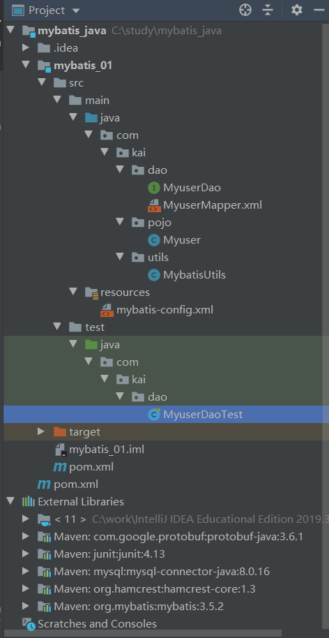
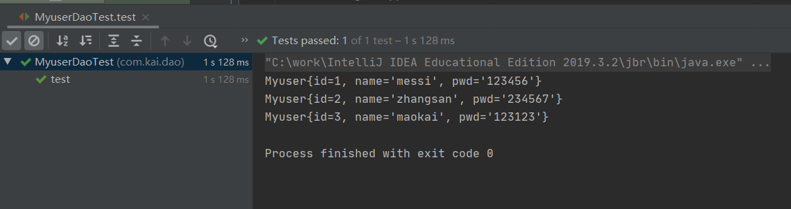
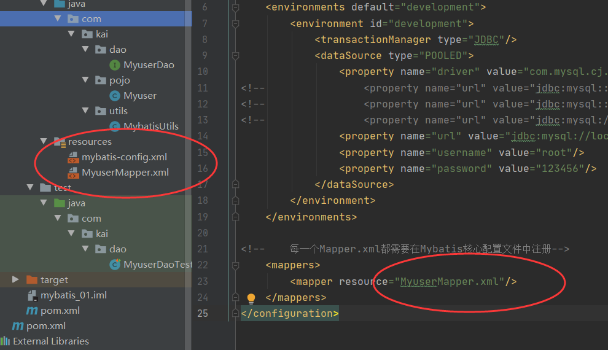
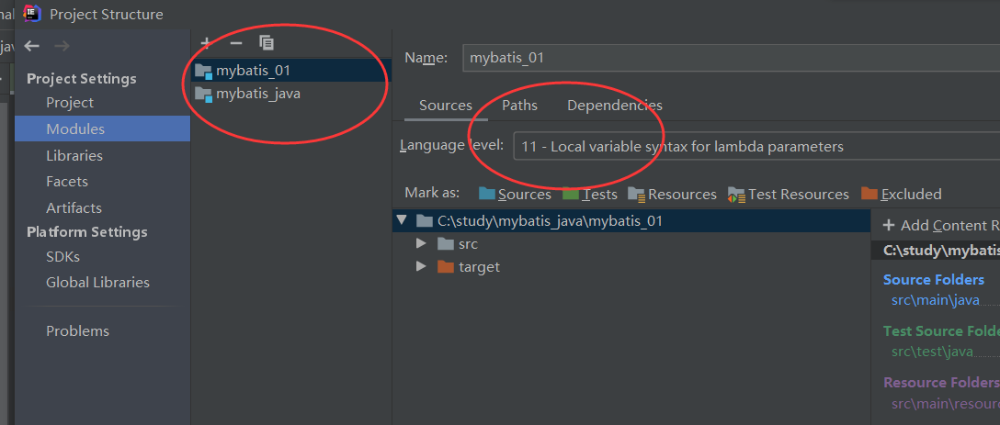
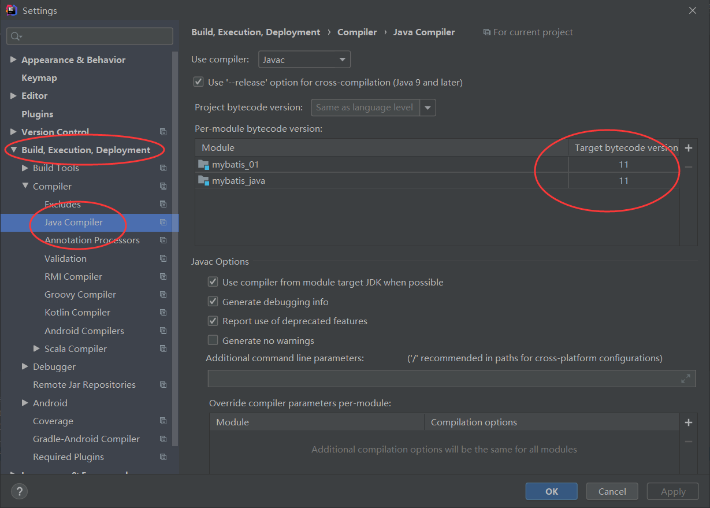

# 什么是MyBatis

MyBatis是一款优秀的持久层框架,支持自定义SQL,存储过程以及高级映射

几乎免除了所有的JDBC代码以及设置参数和获取结果集的工作

通过简单的XML或注解来配置和映射原始类型,接口和 Java POJO(Plain Old Java Object) 为数据库中的记录

[MyBatis中文文档](https://mybatis.org/mybatis-3/zh/index.html)

[Mybatis github源码地址](https://github.com/mybatis/mybatis-3/tree/master/src/site)

# 创建MyBatis

[Mysql基本命令](mysql.md)

## 创建数据库

```sql
--创建一个mybatis库

CREATE DATABASE mybatis;
use mybatis;

CREATE TABLE `myuser`(
`id` INT(20) NOT NULL PRIMARY KEY,
`name` VARCHAR(30) DEFAULT NULL,
`pwd` VARCHAR(30) DEFAULT NULL
)ENGINE=INNODB DEFAULT CHARSET=utf8;

INSERT INTO myuser(`id`,`name`,`pwd`) VALUES
(1,'messi','123456'),
(2,'zhangsan','234567'),
(3,'maokai','123123');
```


## 创建Maven项目



```xml
<?xml version="1.0" encoding="UTF-8"?>
<project xmlns="http://maven.apache.org/POM/4.0.0"
         xmlns:xsi="http://www.w3.org/2001/XMLSchema-instance"
         xsi:schemaLocation="http://maven.apache.org/POM/4.0.0 http://maven.apache.org/xsd/maven-4.0.0.xsd">
    <modelVersion>4.0.0</modelVersion>

    <groupId>org.example</groupId>
    <artifactId>mybatis_java</artifactId>
    <packaging>pom</packaging>
    <version>1.0-SNAPSHOT</version>
    <modules>
        <module>mybatis_01</module>
    </modules>
    
    
<!--父工程  pom.xml-->
<!--导入依赖-->
    <dependencies>
<!--        mysql-->
        <dependency>
            <groupId>mysql</groupId>
            <artifactId>mysql-connector-java</artifactId>
            <version>8.0.16</version>
        </dependency>
<!--        mybatis-->
        <dependency>
            <groupId>org.mybatis</groupId>
            <artifactId>mybatis</artifactId>
            <version>3.5.2</version>
        </dependency>
<!--        junit-->
        <dependency>
            <groupId>junit</groupId>
            <artifactId>junit</artifactId>
            <version>4.13</version>
            <scope>test</scope>
        </dependency>
    </dependencies>
</project>
```

```xml
<!--子工程 pom.xml-->
<?xml version="1.0" encoding="UTF-8"?>
<project xmlns="http://maven.apache.org/POM/4.0.0"
         xmlns:xsi="http://www.w3.org/2001/XMLSchema-instance"
         xsi:schemaLocation="http://maven.apache.org/POM/4.0.0 http://maven.apache.org/xsd/maven-4.0.0.xsd">
    <parent>
        <artifactId>mybatis_java</artifactId>
        <groupId>org.example</groupId>
        <version>1.0-SNAPSHOT</version>
    </parent>
    <modelVersion>4.0.0</modelVersion>

    <artifactId>mybatis_01</artifactId>
</project>
```

## Mybatis核心配置文件

```xml
<?xml version="1.0" encoding="UTF-8" ?>
<!DOCTYPE configuration
        PUBLIC "-//mybatis.org//DTD Config 3.0//EN"
        "http://mybatis.org/dtd/mybatis-3-config.dtd">
<configuration>
    <environments default="development">
        <environment id="development">
            <transactionManager type="JDBC"/>
            <dataSource type="POOLED">
                <property name="driver" value="com.mysql.cj.jdbc.Driver"/>
<!--<property name="url" value="jdbc:mysql:://localhost:3306/mybatis?serverTimezone=UTC;useSSL=false&amp;useUnicode=true&amp;characterEncoding=UTF-8"/>-->
<!--<property name="url" value="jdbc:mysql:://localhost:3306/mybatis?serverTimezone=Asia/Shanghai"/>-->
<!--<property name="url" value="jdbc:mysql://localhost:3306/mail_server?useSSL=false&amp;serverTimezone=UTC"/>-->
                <property name="url" value="jdbc:mysql://localhost:3306/mybatis?useUnicode=true&amp;characterEncoding=utf8&amp;serverTimezone=GMT"/>
                <property name="username" value="root"/>
                <property name="password" value="123456"/>
            </dataSource>
        </environment>
    </environments>
    
    
    <!--    每一个Mapper.xml都需要在Mybatis核心配置文件中注册-->
    <mappers>
        <mapper resource="com/kai/dao/MyuserMapper.xml"/>
    </mappers>
</configuration>
```

## 工具类

```java
package com.kai.utils;

import org.apache.ibatis.io.Resources;
import org.apache.ibatis.session.SqlSession;
import org.apache.ibatis.session.SqlSessionFactory;
import org.apache.ibatis.session.SqlSessionFactoryBuilder;

import java.io.IOException;
import java.io.InputStream;

//工具类
//SqlSessionFactory -->sqlSession
public class MybatisUtils {

    private static SqlSessionFactory sqlSessionFactory;
    static {
        try {
            //获取sqlSessionFactory对象
            String resource = "mybatis-config.xml";
            InputStream inputStream = Resources.getResourceAsStream(resource);
            sqlSessionFactory = new SqlSessionFactoryBuilder().build(inputStream);
        } catch (IOException e) {
            e.printStackTrace();
        }
    }

    public static SqlSession getSqlSession(){
        return sqlSessionFactory.openSession();
    }
}
```

## 实体类

```java
package com.kai.pojo;


//实体类
public class Myuser {
    private int id;
    private String name;
    private String pwd;

    public Myuser() {
    }

    public Myuser(int id, String name, String pwd) {
        this.id = id;
        this.name = name;
        this.pwd = pwd;
    }

    public int getId() {
        return id;
    }

    public String getName() {
        return name;
    }

    public String getPwd() {
        return pwd;
    }

    public void setId(int id) {
        this.id = id;
    }

    public void setName(String name) {
        this.name = name;
    }

    public void setPwd(String pwd) {
        this.pwd = pwd;
    }

    @Override
    public String toString() {
        return "Myuser{" +
                "id=" + id +
                ", name='" + name + '\'' +
                ", pwd='" + pwd + '\'' +
                '}';
    }
}
```
## Mapper接口

```java
package com.kai.dao;

import com.kai.pojo.Myuser;

import java.util.List;

public interface MyuserDao {
    //操作实体类
    List<Myuser> getUserList();

}
```

## Mapper配置文件

* 接口实现
* 每一个Mapper.xml都需要在Mybatis核心配置文件中注册

```xml
<?xml version="1.0" encoding="UTF-8" ?>
<!DOCTYPE mapper
        PUBLIC "-//mybatis.org//DTD Mapper 3.0//EN"
        "http://mybatis.org/dtd/mybatis-3-mapper.dtd">


<!--namespace绑定一个对应的Dao/Mapper接口-->
<mapper namespace="com.kai.dao.MyuserDao">

    <!--查询语句,id对应方法名字,resultType是返回一个结果(Myuser)-->
    <select id="getUserList" resultType="com.kai.pojo.Myuser">
        select * from mybatis.myuser;
    </select>

</mapper>
```
## 测试类

```java
package com.kai.dao;

import com.kai.pojo.Myuser;
import com.kai.utils.MybatisUtils;
import org.apache.ibatis.session.SqlSession;
import org.junit.Test;

import java.util.List;

public class MyuserDaoTest {

    @Test
    public void test(){
        //获得SqlSession对象
        SqlSession sqlSession = MybatisUtils.getSqlSession();
        //方式一:getMapper
        MyuserDao mapper = sqlSession.getMapper(MyuserDao.class);
        List<Myuser> userList = mapper.getUserList();
        //方式二:
        //List<Myuser>  userList= sqlSession.selectList("com.kai.dao.MyuserDao.getUserList");
        for (Myuser myuser : userList) {
            System.out.println(myuser);
        }
        //关闭SqlSession
        sqlSession.close();
    }
}
```

测试结果



## 遇到的问题

* MySQL8的核心配置文件注意`url`和`driver`

  * ```xml
    <property name="url" value="jdbc:mysql://localhost:3306/mybatis?useUnicode=true&amp;characterEncoding=utf8&amp;serverTimezone=GMT"/>
    ```

  * ```xml
    <property name="driver" value="com.mysql.cj.jdbc.Driver"/>
    ```

* 每一个`Mapper.xml`都需要在`Mybatis`核心配置文件中注册

  *     ```xml
        <mappers>
            <mapper resource="com/kai/dao/MyuserMapper.xml"/>
        </mappers>
        ```

* `java.lang.Exceptions`初始化失败(`Maven`资源过滤问题)

  * 第一种解决方法:将`Mapper.xml` 放到`resources`文件夹中,注意修改核心配置文件中`Mapper.xml`的路径

    * 

  * 第二种解决方法:在`Maven`配置文件中添加以下代码

    * ```xml
      <build>
          <resources>
      
              <resource>
                  <directory>src/main/resources</directory>
                  <includes>
                      <include>**/*.properties</include>
                      <include>**/*.xml</include>
                  </includes>
                  <filtering>true</filtering>
              </resource>
      
              <resource>
                  <directory>src/main/java</directory>
                  <includes>
                      <include>**/*.properties</include>
                      <include>**/*.xml</include>
                  </includes>
                  <filtering>true</filtering>
              </resource>
      
          </resources>
      </build>
      ```

* Error:java: 不再支持源选项 5。请使用 6 或更高版本
  * 修改模块`Language level`版本与本地`jdk`版本一致
    * 
  * 修改模块编译版本与`jdk`一致
    * ​	

# CRUD

## Mapper接口

```java
public interface MyuserMapper {
    //查询全部用户
    List<Myuser> getUserList();

    //根据ID查询用户
    Myuser getUserById(int id);

    //增加一个用户
    int addUser(Myuser tempuser);

    //修改用户
    int updateUser(Myuser tempuser);

    //删除一个用户
    int deleteUser(int id);
}
```

## Mapper配置文件

```xml
<!--namespace绑定一个对应的Dao/Mapper接口-->
<mapper namespace="com.kai.dao.MyuserMapper">

    <!--    查询语句,id对应方法名字,resultType是返回一个结果(Myuser)-->
    <select id="getUserList" resultType="com.kai.pojo.Myuser">
        select * from mybatis.myuser;
    </select>
    <select id="getUserById" parameterType="int" resultType="com.kai.pojo.Myuser">
        select * from mybatis.myuser where id=#{id};
    </select>

    <!--对象中的属性可以直接取出来-->
    <insert id="addUser" parameterType="com.kai.pojo.Myuser">
        insert into mybatis.myuser(id,name,pwd) values(#{id},#{name},#{pwd});
    </insert>

    <update id="updateUser" parameterType="com.kai.pojo.Myuser">
        update mybatis.myuser set name=#{name},pwd=#{pwd} where id=#{id};
    </update>

    <delete id="deleteUser" parameterType="int">
        delete from mybatis.myuser where id =#{id};
    </delete>
</mapper>
```

## 测试类

```java
@Test
public void test() {
    //获得SqlSession对象
    SqlSession sqlSession = MybatisUtils.getSqlSession();
    //方式一:getMapper
    MyuserMapper mapper = sqlSession.getMapper(MyuserMapper.class);
    List<Myuser> userList = mapper.getUserList();
    //方式二:
    //List<Myuser>  userList= sqlSession.selectList("com.kai.dao.MyuserDao.getUserList");
    for (Myuser myuser : userList) {
        System.out.println(myuser);
    }
    //关闭SqlSession
    sqlSession.close();
}
@Test
public void getuserbyid() {
    SqlSession sqlSession = MybatisUtils.getSqlSession();
    MyuserMapper mapper = sqlSession.getMapper(MyuserMapper.class);
    Myuser userById = mapper.getUserById(1);
    System.out.println(userById);
    sqlSession.close();
}
//增删改需要提交事务
@Test
public void adduser() {
    SqlSession sqlSession = MybatisUtils.getSqlSession();
    MyuserMapper mapper = sqlSession.getMapper(MyuserMapper.class);
    int leo = mapper.addUser(new Myuser(4, "leo", "111111"));
    if (leo > 0) {
        System.out.println("ok");
    }
    //提交事务
    sqlSession.commit();
    sqlSession.close();
}
@Test
public void updateuser(){
    SqlSession sqlSession = MybatisUtils.getSqlSession();
    MyuserMapper mapper = sqlSession.getMapper(MyuserMapper.class);
    int kklt = mapper.updateUser(new Myuser(4, "kklt", "666666"));
    if(kklt>0){
        System.out.println("ok");
    }
    sqlSession.commit();
    sqlSession.close();
}
@Test
public void deleteuser(){
    SqlSession sqlSession = MybatisUtils.getSqlSession();
    MyuserMapper mapper = sqlSession.getMapper(MyuserMapper.class);
    int i = mapper.deleteUser(4);
    if(i>0){
        System.out.println("ok");
    }
    sqlSession.commit();
    sqlSession.close();
}
```

# 配置解析

```xml
configuration（配置）
properties（属性）
settings（设置）
typeAliases（类型别名）
typeHandlers（类型处理器）
objectFactory（对象工厂）
plugins（插件）
environments（环境配置）
environment（环境变量）
transactionManager（事务管理器）
dataSource（数据源）
databaseIdProvider（数据库厂商标识）
mappers（映射器）
```

## properties

```properties
#db.properties
driver=com.mysql.cj.jdbc.Driver
url=jdbc:mysql://localhost:3306/mybatis?useUnicode=true&characterEncoding=utf8&serverTimezone=UTC
username=root
password=123456
```

```xml
<properties resource="db.properties"/>
<!--  优先使用properties配置文件
<properties resource="db.properties">
	<property name="username" value="root"/>
	<property name="pwd"	value="111111"/>
</properties>
-->
<environments default="development">
    <environment id="development">
        <transactionManager type="JDBC"/>
        <dataSource type="POOLED">
            <property name="driver" value="${driver}"/>
            <property name="url" value="${url}"/>
            <property name="username" value="${username}"/>
            <property name="password" value="${password}"/>
        </dataSource>
    </environment>
</environments>
```

* 可以直接引入外部资源文件
* 可以在其中增加一些属性配置
* 如果有两个文件同一字段,优先使用外部配置文件