# 什么是MyBatis

MyBatis是一款优秀的持久层框架,支持自定义SQL,存储过程以及高级映射

几乎免除了所有的JDBC代码以及设置参数和获取结果集的工作

通过简单的XML或注解来配置和映射原始类型,接口和 Java POJO(Plain Old Java Object) 为数据库中的记录

[MyBatis中文文档](https://mybatis.org/mybatis-3/zh/index.html)

[Mybatis github源码地址](https://github.com/mybatis/mybatis-3/tree/master/src/site)

# 创建MyBatis

[Mysql基本命令](mysql.md)

## 创建数据库

```sql
--创建一个mybatis库

CREATE DATABASE mybatis;
use mybatis;

CREATE TABLE `myuser`(
`id` INT(20) NOT NULL PRIMARY KEY,
`name` VARCHAR(30) DEFAULT NULL,
`pwd` VARCHAR(30) DEFAULT NULL
)ENGINE=INNODB DEFAULT CHARSET=utf8;

INSERT INTO myuser(`id`,`name`,`pwd`) VALUES
(1,'messi','123456'),
(2,'zhangsan','234567'),
(3,'maokai','123123');
```


## 创建Maven项目


```xml
<?xml version="1.0" encoding="UTF-8"?>
<project xmlns="http://maven.apache.org/POM/4.0.0"
         xmlns:xsi="http://www.w3.org/2001/XMLSchema-instance"
         xsi:schemaLocation="http://maven.apache.org/POM/4.0.0 http://maven.apache.org/xsd/maven-4.0.0.xsd">
    <modelVersion>4.0.0</modelVersion>

    <groupId>org.example</groupId>
    <artifactId>mybatis_java</artifactId>
    <packaging>pom</packaging>
    <version>1.0-SNAPSHOT</version>
    <modules>
        <module>mybatis_01</module>
    </modules>
    
    
<!--父工程  pom.xml-->
<!--导入依赖-->
    <dependencies>
<!--        mysql-->
        <dependency>
            <groupId>mysql</groupId>
            <artifactId>mysql-connector-java</artifactId>
            <version>8.0.16</version>
        </dependency>
<!--        mybatis-->
        <dependency>
            <groupId>org.mybatis</groupId>
            <artifactId>mybatis</artifactId>
            <version>3.5.2</version>
        </dependency>
<!--        junit-->
        <dependency>
            <groupId>junit</groupId>
            <artifactId>junit</artifactId>
            <version>4.13</version>
            <scope>test</scope>
        </dependency>
    </dependencies>
</project>
```

```xml
<!--子工程 pom.xml-->
<?xml version="1.0" encoding="UTF-8"?>
<project xmlns="http://maven.apache.org/POM/4.0.0"
         xmlns:xsi="http://www.w3.org/2001/XMLSchema-instance"
         xsi:schemaLocation="http://maven.apache.org/POM/4.0.0 http://maven.apache.org/xsd/maven-4.0.0.xsd">
    <parent>
        <artifactId>mybatis_java</artifactId>
        <groupId>org.example</groupId>
        <version>1.0-SNAPSHOT</version>
    </parent>
    <modelVersion>4.0.0</modelVersion>

    <artifactId>mybatis_01</artifactId>
</project>
```

## Mybatis核心配置文件

```xml
<?xml version="1.0" encoding="UTF-8" ?>
<!DOCTYPE configuration
        PUBLIC "-//mybatis.org//DTD Config 3.0//EN"
        "http://mybatis.org/dtd/mybatis-3-config.dtd">
<configuration>
    <environments default="development">
        <environment id="development">
            <transactionManager type="JDBC"/>
            <dataSource type="POOLED">
                <property name="driver" value="com.mysql.cj.jdbc.Driver"/>
<!--<property name="url" value="jdbc:mysql:://localhost:3306/mybatis?serverTimezone=UTC;useSSL=false&amp;useUnicode=true&amp;characterEncoding=UTF-8"/>-->
<!--<property name="url" value="jdbc:mysql:://localhost:3306/mybatis?serverTimezone=Asia/Shanghai"/>-->
<!--<property name="url" value="jdbc:mysql://localhost:3306/mail_server?useSSL=false&amp;serverTimezone=UTC"/>-->
                <property name="url" value="jdbc:mysql://localhost:3306/mybatis?useUnicode=true&amp;characterEncoding=utf8&amp;serverTimezone=GMT"/>
                <property name="username" value="root"/>
                <property name="password" value="123456"/>
            </dataSource>
        </environment>
    </environments>
    
    
    <!--    每一个Mapper.xml都需要在Mybatis核心配置文件中注册-->
    <mappers>
        <mapper resource="com/kai/dao/MyuserMapper.xml"/>
    </mappers>
</configuration>
```

## 工具类

```java
package com.kai.utils;

import org.apache.ibatis.io.Resources;
import org.apache.ibatis.session.SqlSession;
import org.apache.ibatis.session.SqlSessionFactory;
import org.apache.ibatis.session.SqlSessionFactoryBuilder;

import java.io.IOException;
import java.io.InputStream;

//工具类
//SqlSessionFactory -->sqlSession
public class MybatisUtils {

    private static SqlSessionFactory sqlSessionFactory;
    static {
        try {
            //获取sqlSessionFactory对象
            String resource = "mybatis-config.xml";
            InputStream inputStream = Resources.getResourceAsStream(resource);
            sqlSessionFactory = new SqlSessionFactoryBuilder().build(inputStream);
        } catch (IOException e) {
            e.printStackTrace();
        }
    }

    public static SqlSession getSqlSession(){
        return sqlSessionFactory.openSession();
    }
}
```

## 实体类

```java
package com.kai.pojo;


//实体类
public class Myuser {
    private int id;
    private String name;
    private String pwd;

    public Myuser() {
    }

    public Myuser(int id, String name, String pwd) {
        this.id = id;
        this.name = name;
        this.pwd = pwd;
    }

    public int getId() {
        return id;
    }

    public String getName() {
        return name;
    }

    public String getPwd() {
        return pwd;
    }

    public void setId(int id) {
        this.id = id;
    }

    public void setName(String name) {
        this.name = name;
    }

    public void setPwd(String pwd) {
        this.pwd = pwd;
    }

    @Override
    public String toString() {
        return "Myuser{" +
                "id=" + id +
                ", name='" + name + '\'' +
                ", pwd='" + pwd + '\'' +
                '}';
    }
}
```
## Mapper接口

```java
package com.kai.dao;

import com.kai.pojo.Myuser;

import java.util.List;

public interface MyuserDao {
    //操作实体类
    List<Myuser> getUserList();

}
```

## Mapper配置文件

* 接口实现
* 每一个Mapper.xml都需要在Mybatis核心配置文件中注册

```xml
<?xml version="1.0" encoding="UTF-8" ?>
<!DOCTYPE mapper
        PUBLIC "-//mybatis.org//DTD Mapper 3.0//EN"
        "http://mybatis.org/dtd/mybatis-3-mapper.dtd">


<!--namespace绑定一个对应的Dao/Mapper接口-->
<mapper namespace="com.kai.dao.MyuserDao">

    <!--查询语句,id对应方法名字,resultType是返回一个结果(Myuser)-->
    <select id="getUserList" resultType="com.kai.pojo.Myuser">
        select * from mybatis.myuser;
    </select>

</mapper>
```
## 测试类

```java
package com.kai.dao;

import com.kai.pojo.Myuser;
import com.kai.utils.MybatisUtils;
import org.apache.ibatis.session.SqlSession;
import org.junit.Test;

import java.util.List;

public class MyuserDaoTest {

    @Test
    public void test(){
        //获得SqlSession对象
        SqlSession sqlSession = MybatisUtils.getSqlSession();
        //方式一:getMapper
        MyuserDao mapper = sqlSession.getMapper(MyuserDao.class);
        List<Myuser> userList = mapper.getUserList();
        //方式二:
        //List<Myuser>  userList= sqlSession.selectList("com.kai.dao.MyuserDao.getUserList");
        for (Myuser myuser : userList) {
            System.out.println(myuser);
        }
        //关闭SqlSession
        sqlSession.close();
    }
}
```

测试结果


## 遇到的问题

* MySQL8的核心配置文件注意`url`和`driver`

  * ```xml
    <property name="url" value="jdbc:mysql://localhost:3306/mybatis?useUnicode=true&amp;characterEncoding=utf8&amp;serverTimezone=GMT"/>
    ```

  * ```xml
    <property name="driver" value="com.mysql.cj.jdbc.Driver"/>
    ```

* 每一个`Mapper.xml`都需要在`Mybatis`核心配置文件中注册

  *     ```xml
        <mappers>
            <mapper resource="com/kai/dao/MyuserMapper.xml"/>
        </mappers>
        ```

* `java.lang.Exceptions`初始化失败(`Maven`资源过滤问题)

  * 第一种解决方法:将`Mapper.xml` 放到`resources`文件夹中,注意修改核心配置文件中`Mapper.xml`的路径

    * 

  * 第二种解决方法:在`Maven`配置文件中添加以下代码

    * ```xml
      <build>
          <resources>
      
              <resource>
                  <directory>src/main/resources</directory>
                  <includes>
                      <include>**/*.properties</include>
                      <include>**/*.xml</include>
                  </includes>
                  <filtering>true</filtering>
              </resource>
      
              <resource>
                  <directory>src/main/java</directory>
                  <includes>
                      <include>**/*.properties</include>
                      <include>**/*.xml</include>
                  </includes>
                  <filtering>true</filtering>
              </resource>
      
          </resources>
      </build>
      ```

* Error:java: 不再支持源选项 5。请使用 6 或更高版本
  * 修改模块`Language level`版本与本地`jdk`版本一致
    * 
  * 修改模块编译版本与`jdk`一致
    * ​	

# CRUD

## Mapper接口

```java
public interface MyuserMapper {
    //查询全部用户
    List<Myuser> getUserList();

    //根据ID查询用户
    Myuser getUserById(int id);

    //增加一个用户
    int addUser(Myuser tempuser);

    //修改用户
    int updateUser(Myuser tempuser);

    //删除一个用户
    int deleteUser(int id);
}
```

## Mapper配置文件

```xml
<!--namespace绑定一个对应的Dao/Mapper接口-->
<mapper namespace="com.kai.dao.MyuserMapper">

    <!--    查询语句,id对应方法名字,resultType是返回一个结果(Myuser)-->
    <select id="getUserList" resultType="com.kai.pojo.Myuser">
        select * from mybatis.myuser;
    </select>
    <select id="getUserById" parameterType="int" resultType="com.kai.pojo.Myuser">
        select * from mybatis.myuser where id=#{id};
    </select>

    <!--对象中的属性可以直接取出来-->
    <insert id="addUser" parameterType="com.kai.pojo.Myuser">
        insert into mybatis.myuser(id,name,pwd) values(#{id},#{name},#{pwd});
    </insert>

    <update id="updateUser" parameterType="com.kai.pojo.Myuser">
        update mybatis.myuser set name=#{name},pwd=#{pwd} where id=#{id};
    </update>

    <delete id="deleteUser" parameterType="int">
        delete from mybatis.myuser where id =#{id};
    </delete>
</mapper>
```

## 测试类

```java
@Test
public void test() {
    //获得SqlSession对象
    SqlSession sqlSession = MybatisUtils.getSqlSession();
    //方式一:getMapper
    MyuserMapper mapper = sqlSession.getMapper(MyuserMapper.class);
    List<Myuser> userList = mapper.getUserList();
    //方式二:
    //List<Myuser>  userList= sqlSession.selectList("com.kai.dao.MyuserDao.getUserList");
    for (Myuser myuser : userList) {
        System.out.println(myuser);
    }
    //关闭SqlSession
    sqlSession.close();
}
@Test
public void getuserbyid() {
    SqlSession sqlSession = MybatisUtils.getSqlSession();
    MyuserMapper mapper = sqlSession.getMapper(MyuserMapper.class);
    Myuser userById = mapper.getUserById(1);
    System.out.println(userById);
    sqlSession.close();
}
//增删改需要提交事务
@Test
public void adduser() {
    SqlSession sqlSession = MybatisUtils.getSqlSession();
    MyuserMapper mapper = sqlSession.getMapper(MyuserMapper.class);
    int leo = mapper.addUser(new Myuser(4, "leo", "111111"));
    if (leo > 0) {
        System.out.println("ok");
    }
    //提交事务
    sqlSession.commit();
    sqlSession.close();
}
@Test
public void updateuser(){
    SqlSession sqlSession = MybatisUtils.getSqlSession();
    MyuserMapper mapper = sqlSession.getMapper(MyuserMapper.class);
    int kklt = mapper.updateUser(new Myuser(4, "kklt", "666666"));
    if(kklt>0){
        System.out.println("ok");
    }
    sqlSession.commit();
    sqlSession.close();
}
@Test
public void deleteuser(){
    SqlSession sqlSession = MybatisUtils.getSqlSession();
    MyuserMapper mapper = sqlSession.getMapper(MyuserMapper.class);
    int i = mapper.deleteUser(4);
    if(i>0){
        System.out.println("ok");
    }
    sqlSession.commit();
    sqlSession.close();
}
```

# 配置解析

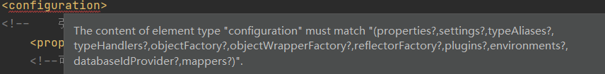

配置顺序

```xml
configuration（配置）
properties（属性）
settings（设置）
typeAliases（类型别名）
typeHandlers（类型处理器）
objectFactory（对象工厂）
plugins（插件）
environments（环境配置）
environment（环境变量）
transactionManager（事务管理器）
dataSource（数据源）
databaseIdProvider（数据库厂商标识）
mappers（映射器）
```

## properties

```properties
#db.properties
driver=com.mysql.cj.jdbc.Driver
url=jdbc:mysql://localhost:3306/mybatis?useUnicode=true&characterEncoding=utf8&serverTimezone=UTC
username=root
password=123456
```

```xml
<properties resource="db.properties"/>
<!--  优先使用properties配置文件
<properties resource="db.properties">
	<property name="username" value="root"/>
	<property name="pwd"	value="111111"/>
</properties>
-->
<environments default="development">
    <environment id="development">
        <transactionManager type="JDBC"/>
        <dataSource type="POOLED">
            <property name="driver" value="${driver}"/>
            <property name="url" value="${url}"/>
            <property name="username" value="${username}"/>
            <property name="password" value="${password}"/>
        </dataSource>
    </environment>
</environments>
```

* 可以直接引入外部资源文件
* 可以在其中增加一些属性配置
* 如果有两个文件同一字段,优先使用外部配置文件

## typeAliases

* 类型别名可为 Java 类型设置一个缩写名字
* 它仅用于 XML 配置，意在降低冗余的全限定类名书写
* 第一种使用typeAlias,第二种使用package

```xml
<!--mybatis-config.xml-->
<!--可以给实体类起别名-->
<typeAliases>
    <typeAlias alias="User" type="com.kai.pojo.Myuser"/>
    <!--<package name="com.kai.pojo.Myuser"/>-->
</typeAliases>
```

```xml
<!--MyuserMapper.xml-->
<select id="getUserList" resultType="User">
    select * from mybatis.myuser;
</select>
```

* 在实体类比较少的时候,使用第一种方法
* 如果实体类多,建议使用扫描包方法,在没有注解的情况下,会使用包的首字母小写的非限定类名来作为它的别名

```java
@Alias("author")
public class Author {
    ...
}
```

## settings

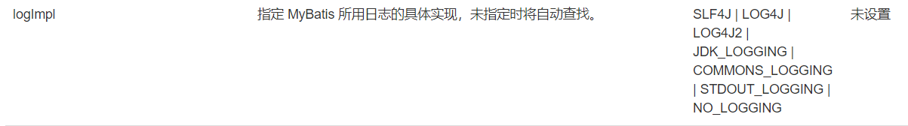

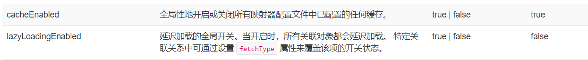

## mappers

方式一:

```xml
<!-- 使用相对于类路径的资源引用 -->
<mappers>
  <mapper resource="org/mybatis/builder/AuthorMapper.xml"/>
  <mapper resource="org/mybatis/builder/BlogMapper.xml"/>
  <mapper resource="org/mybatis/builder/PostMapper.xml"/>
</mappers>
```

方式二:

```xml
<!-- 使用映射器接口实现类的完全限定类名 -->
<mappers>
  <mapper class="org.mybatis.builder.AuthorMapper"/>
  <mapper class="org.mybatis.builder.BlogMapper"/>
  <mapper class="org.mybatis.builder.PostMapper"/>
</mappers>
```

* 接口和他的Mapper配置文件必须同名
* 接口和他的Mapper配置文件必须在同一包下

方式三:

```xml
<!-- 将包内的映射器接口实现全部注册为映射器 -->
<mappers>
  <package name="org.mybatis.builder"/>
</mappers>
```

* 接口和他的Mapper配置文件必须同名
* 接口和他的Mapper配置文件必须在同一包下

## 生命周期

作用域和生命周期类别是至关重要的，因为错误的使用会导致非常严重的**并发问题**。

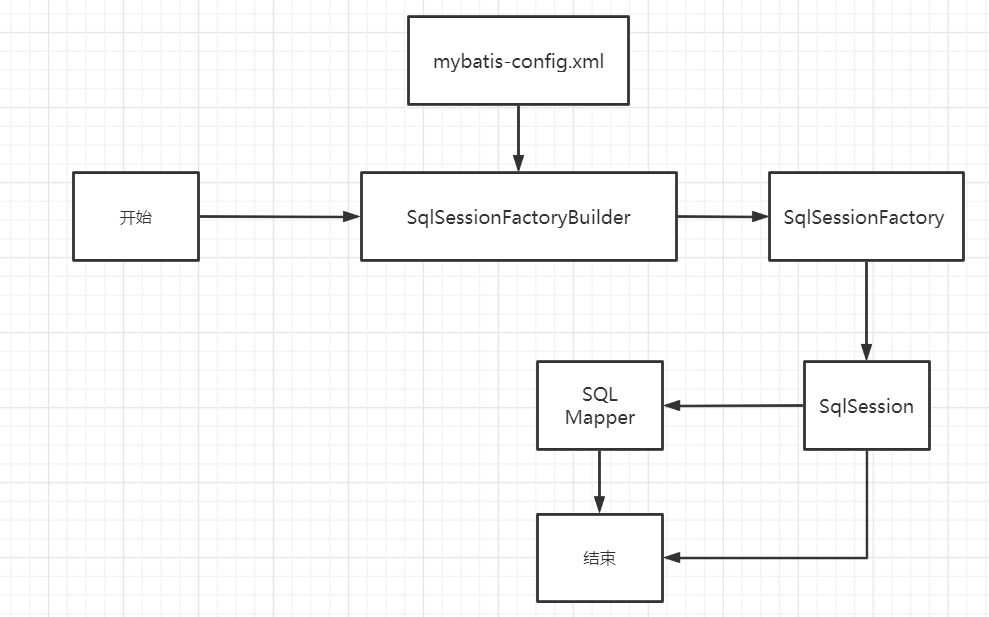

* SqlSessionFactoryBuilder
  * 一旦创建了 SqlSessionFactory，就不再需要它了。
  * 局部变量
* **SqlSessionFactory**
  * 类似数据库连接池,一旦被创建就应该在应用的运行期间一直存在,没有任何理由丢弃它或重新创建另一个实例
  * 最佳作用域是应用作用域,最简单的就是使用单例模式或者静态单例模式
* **SqlSession**
  * 每个线程都应该有它自己的 SqlSession 实例,连接到连接池的请求
  * SqlSession 的实例不是线程安全的,因此是不能被共享的,所以它的最佳的作用域是请求或方法作用域,用完之后需要关闭,否则资源被占用

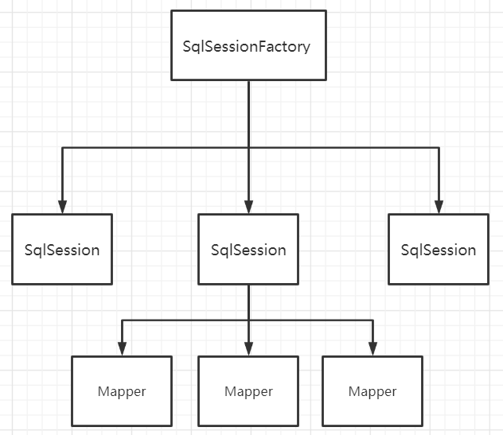

每一个Mapper代表一个业务

# ResultMap

解决属性名和字段名不一致的问题

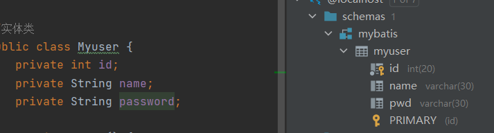

起别名可以解决:

```xml
<select id="getUserById" parameterType="int" resultType="com.kai.pojo.Myuser">
    select id,`name`,pwd as password from mybatis.myuser where id=#{id};
</select>
```

## ResultMap

结果集映射

```
id	name	pwd
id	name	password
```

```xml
<resultMap id="UserMap" type="User">
    <!--column是数据库中的字段,property是实体类中的属性-->
    <result column="id" property="id"/>
    <result column="name" property="name"/>
    <result column="pwd" property="password"/>
</resultMap>
<select id="getUserById" parameterType="int" resultMap="UserMap">
    select * from mybatis.myuser where id=#{id};
</select>
```

* `resultMap` 元素是 MyBatis 中最重要最强大的元素
* ResultMap 的设计思想是，对简单的语句做到零配置，对于复杂一点的语句，只需要描述语句之间的关系就行了。

# 日志

## 日志工厂

如果一个数据库操作出现了异常,我们需要排错,通过日志工厂可以实现

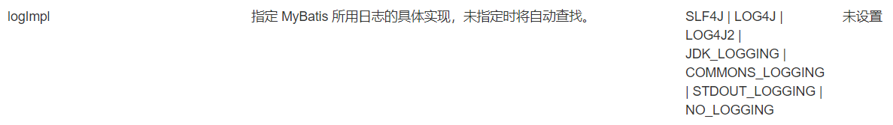

* SLF4J 
* **LOG4J**
* LOG4J2
* JDK_LOGGING 
* COMMONS_LOGGING 
* **STDOUT_LOGGING** 
* NO_LOGGING

在Mybatis中,具体使用哪个日志,在设置中设定

```xml
<settings>
    <setting name="logImpl" value="STDOUT_LOGGING"/>
</settings>
```

STDOUT_LOGGING标准日志输出

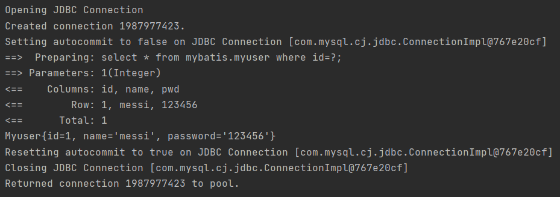

## LOG4J

通过使用Log4j，我们可以控制日志信息输送的目的地是控制台、文件、GUI组件

我们也可以控制每一条日志的输出格式

通过定义每一条日志信息的级别，我们能够更加细致地控制日志的生成过程

最令人感兴趣的就是，这些可以通过一个配置文件来灵活地进行配置，而不需要修改应用的代码。

* 先导入LOG4J的包

```xml
<dependency>
    <groupId>log4j</groupId>
    <artifactId>log4j</artifactId>
    <version>1.2.17</version>
</dependency>
```

* 配置文件`log4j.properties`

```properties
#将等级为DEBUG的日志信息输出到console和file这两个目的地，console和file的定义在下面的代码
log4j.rootLogger=DEBUG,console,file

#控制台输出的相关设置
log4j.appender.console = org.apache.log4j.ConsoleAppender
log4j.appender.console.Target = System.out
log4j.appender.console.Threshold=DEBUG
log4j.appender.console.layout = org.apache.log4j.PatternLayout
log4j.appender.console.layout.ConversionPattern=[%c]-%m%n

#文件输出的相关设置
log4j.appender.file = org.apache.log4j.RollingFileAppender
log4j.appender.file.File=./log/kai.log
log4j.appender.file.MaxFileSize=10mb
log4j.appender.file.Threshold=DEBUG
log4j.appender.file.layout=org.apache.log4j.PatternLayout
log4j.appender.file.layout.ConversionPattern=[%p][%d{yy-MM-dd}][%c]%m%n

#日志输出级别
log4j.logger.org.mybatis=DEBUG
log4j.logger.java.sql=DEBUG
log4j.logger.java.sql.Statement=DEBUG
log4j.logger.java.sql.ResultSet=DEBUG
log4j.logger.java.sql.PreparedStatement=DEBUG
```

* 配置log4j为日志的实现

```xml
<settings>
    <setting name="logImpl" value="LOG4J"/>
</settings>
```

直接测试

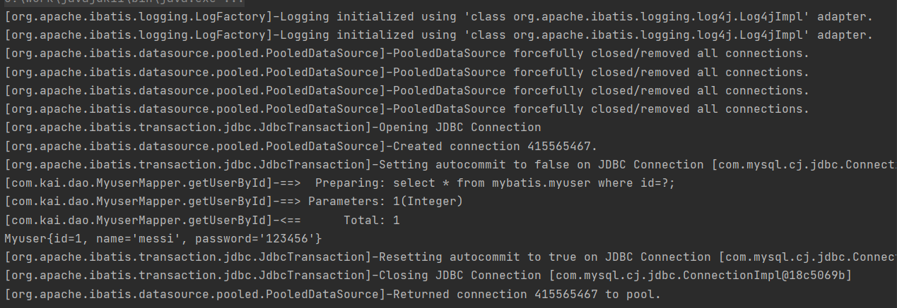

简单使用

```java
static Logger logger = Logger.getLogger(MyuserMapperTest.class);
@Test
public void testlog4j(){
    logger.info("info:进入了log4j方法");
    logger.debug("debug:进入了log4j方法");
    logger.error("error:进入了log4j方法");
}
```

运行会在项目目录下生成log文件

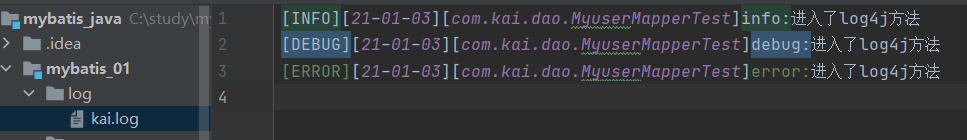

# 分页

## limit

```sql
select * from myuser limit 0,5;
--第一个数据开始,显示5个数据(mysql)表从0开始
```

使用Mybatis实现分页

```java
//MyuserMapper接口
//分页
List<Myuser> getUserListbyLimit(Map<String,Integer> map);
```

```xml
<!--MyuserMapper.xml-->
<select id="getUserListbyLimit" parameterType="map" resultType="User">
    select * from mybatis.myuser limit #{startIndex},#{pageSize};
</select>
```

```java
//MyuserMapperTest.java
@Test
public void testlimt(){
    SqlSession sqlSession = MybatisUtils.getSqlSession();
    MyuserMapper mapper = sqlSession.getMapper(MyuserMapper.class);
    HashMap<String, Integer> hashMap = new HashMap<>();
    hashMap.put("startIndex",0);
    hashMap.put("pageSize",10);
    List<Myuser> userListbyLimit = mapper.getUserListbyLimit(hashMap);
    for (Myuser myuser : userListbyLimit) {
        System.out.println(myuser);
    }
    sqlSession.close();;
}
```

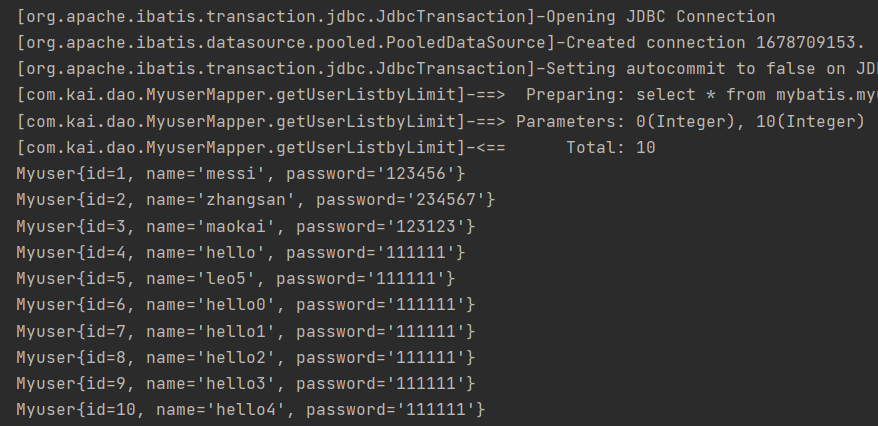

## RowBounds

```java
List<Myuser> getUserByRowBounds();
```

```java
public void testRowBounds(){
    SqlSession sqlSession = MybatisUtils.getSqlSession();

    RowBounds rowBounds = new RowBounds(0, 5);
    List<Myuser> userlist = sqlSession.selectList("com.kai.dao.MyuserMapper.getUserByRowBounds",null,rowBounds);
    for (Myuser myuser : userlist) {
        System.out.println(myuser);
    }
    sqlSession.close();
}
```

```xml
<select id="getUserByRowBounds" resultType="User">
    select * from mybatis.myuser;
</select>
```

## PageHelper

https://pagehelper.github.io/

# 注解开发

## 使用注解开发

对于像 BlogMapper 这样的映射器类来说，还有另一种方法来完成语句映射。 它们映射的语句可以不用 XML 来配置，而可以使用 Java 注解来配置。比如，上面的 XML 示例可以被替换成如下的配置

```java
package org.mybatis.example;
public interface BlogMapper {
  @Select("SELECT * FROM blog WHERE id = #{id}")
  Blog selectBlog(int id);
}
```

使用注解来映射简单语句会使代码显得更加简洁，但对于稍微复杂一点的语句，Java 注解不仅力不从心，还会让你本就复杂的 SQL 语句更加混乱不堪。 因此，如果你需要做一些很复杂的操作，最好用 XML 来映射语句。

```java
public interface mapper02 {
    @Select("select * from myuser")
    List<Myuser> getUserList();
}
```

```xml
<mappers>
    <mapper class="com.kai.mapper.mapper02"/>
</mappers>
```

本质:反射机制实现

底层:动态代理模式

## CRUD

注意事务

在Mapper工具类中关闭事务,打开自动提交

```java
public static SqlSession getSqlSession() {
    return sqlSessionFactory.openSession(true);
}
```

```java
//多个参数查询时,参数前面必须加上@Param注解
@Select("select * from myuser where id=#{id} and name=#{name} ")
Myuser getUserByIDNAME(@Param("id")int id,@Param("name") String name);
```

```java
@Insert("insert into myuser(id,name,pwd) values (#{id},#{name},#{pwd})")
int addUser(Myuser user);

@Update("update myuser set name=#{name},pwd=#{pwd} where id=#{id}")
int updateUser(Myuser user);

@Delete("delete from myuser where id=#{id}")
int deleteUser(@Param("id") int id);
```

特别注意

```xml
<!--绑定接口-->
<mappers>
    <mapper class="com.kai.mapper.mapper02"/>
</mappers>
```

# 多对一处理

## 环境搭建

```sql
CREATE TABLE `teacher` (
  `id` INT(10) NOT NULL,
  `name` VARCHAR(30) DEFAULT NULL,
  PRIMARY KEY (`id`)
) ENGINE=INNODB DEFAULT CHARSET=utf8

INSERT INTO teacher(`id`, `name`) VALUES (1, '秦老师'); 

CREATE TABLE `student` (
  `id` INT(10) NOT NULL,
  `name` VARCHAR(30) DEFAULT NULL,
  `tid` INT(10) DEFAULT NULL,
  PRIMARY KEY (`id`),
  KEY `fktid` (`tid`),
  CONSTRAINT `fktid` FOREIGN KEY (`tid`) REFERENCES `teacher` (`id`)
) ENGINE=INNODB DEFAULT CHARSET=utf8
INSERT INTO `student` (`id`, `name`, `tid`) VALUES ('1', '小明', '1'); 
INSERT INTO `student` (`id`, `name`, `tid`) VALUES ('2', '小红', '1'); 
INSERT INTO `student` (`id`, `name`, `tid`) VALUES ('3', '小张', '1'); 
INSERT INTO `student` (`id`, `name`, `tid`) VALUES ('4', '小李', '1'); 
INSERT INTO `student` (`id`, `name`, `tid`) VALUES ('5', '小王', '1');
```


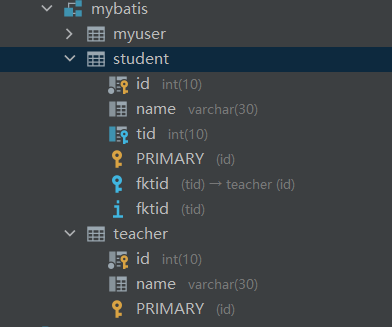

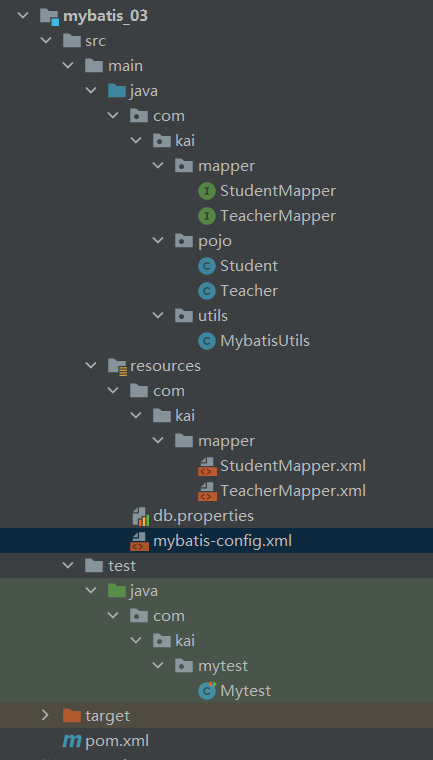

```java
//pojo/Student.java
import lombok.Data;
@Data
public class Student {
    private int id;
    private String name;
    //学生需要关联一个老师
    private Teacher teacher;
}
```

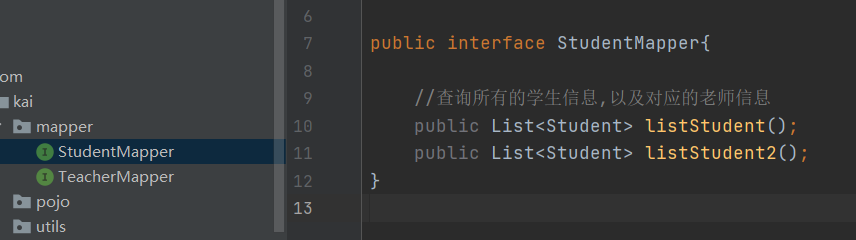

## 按照查询嵌套处理

```xml
<!-- 查询所有学生信息 根据查询出来的学生tid,寻找对应的老师-->
<select id="listStudent" resultMap="StudentTeacher">
    select * from student s;
</select>
<resultMap id="StudentTeacher" type="Student">
    <result property="id" column="id"/>
    <result property="name" column="name"/>
    <!--复杂的语句需要单独处理
        对象使用 association
        集合使用 collection-->
    <association property="teacher" 
                 column="tid" 
                 javaType="Teacher" 
                 select="getTeacher"/>
</resultMap>
<select id="getTeacher" resultType="Teacher">
    select * from teacher where id=#{id};
</select>
```

## 按照结果嵌套处理

```xml
<!-- 按照结果嵌套处理-->
<select id="listStudent2" resultMap="StudentTeacher2">
    select s.id sid,s.name sname,t.name tname,t.id tid
    from student s,teacher t
    where s.tid=t.id;
</select>
<resultMap id="StudentTeacher2" type="Student">
    <result property="id" column="sid"/>
    <result property="name" column="sname"/>
    <association property="teacher" javaType="Teacher">
        <result property="name" column="tname"/>
        <result property="id" column="tid"/>
    </association>
</resultMap>
```

MySQL多对一查询方式

* 子查询
* 联表查询

# 一对多处理

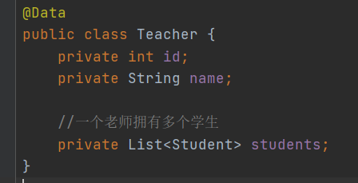

## 按照结果嵌套处理

```xml
<!--按照结果嵌套查询-->
<select id="getTeachers" resultMap="TeacherStudent">
    select s.id sid,s.name sname,t.id tid,t.name tname
    from teacher t,student s
    where s.tid=t.id and t.id=#{tid};
</select>
<resultMap id="TeacherStudent" type="Teacher">
    <result property="id" column="tid"/>
    <result property="name" column="tname"/>
    <!--复杂的语句需要单独处理 对象:association 集合:collection-->
    <!--javaType=""指定属性的类型 集合中的泛型信息使用ofType-->
    <collection property="students" ofType="Student">
        <result property="id" column="sid"/>
        <result property="name" column="sname"/>
        <result property="tid" column="tid"/>
    </collection>
</resultMap>
```

## 按照查询嵌套处理

```xml
<!--按照查询嵌套查询-->
<select id="getTeachers2" resultMap="TeacherStudent2">
    select * from teacher where id=#{tid};
</select>
<resultMap id="TeacherStudent2" type="Teacher">
    <result property="id" column="id"/>
    <collection property="students"
                javaType="ArrayList"
                ofType="Student"
                select="getStudent"
                column="id"/>
</resultMap>
<select id="getStudent" resultType="Student">
    select * from student where tid=#{tid}
</select>
```

## 小结

* 关联多对一: association 
* 集合一对多: collection
* javaType: 用来指定实体类中属性的类型
* ofType: 用来指定集合映射到集合中实体类,泛型的约束类型

注意:

* 保证SQL的可读性,尽量保证通俗易懂
* 注意一对多和多对一,属性名和字段的问题
* 可以使用日志查错

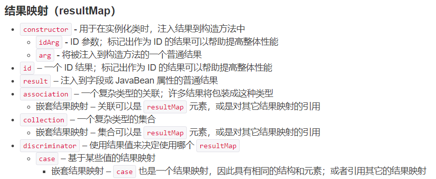

# 动态SQL

## 环境搭建

什么是动态SQL:动态SQL就是指根据不同的条件生成不同的SQL语句

```
动态 SQL 是 MyBatis 的强大特性之一。如果你使用过 JDBC 或其它类似的框架，你应该能理解根据不同条件拼接 SQL 语句有多痛苦，例如拼接时要确保不能忘记添加必要的空格，还要注意去掉列表最后一个列名的逗号。利用动态 SQL，可以彻底摆脱这种痛苦。

使用动态 SQL 并非一件易事，但借助可用于任何 SQL 映射语句中的强大的动态 SQL 语言，MyBatis 显著地提升了这一特性的易用性。

如果你之前用过 JSTL 或任何基于类 XML 语言的文本处理器，你对动态 SQL 元素可能会感觉似曾相识。在 MyBatis 之前的版本中，需要花时间了解大量的元素。借助功能强大的基于 OGNL 的表达式，MyBatis 3 替换了之前的大部分元素，大大精简了元素种类，现在要学习的元素种类比原来的一半还要少。

if
choose (when, otherwise)
trim (where, set)
foreach
```

```sql
CREATE TABLE `blog`(
`id` VARCHAR(50) NOT NULL COMMENT '博客id',
`title` VARCHAR(100) NOT NULL COMMENT '博客标题',
`author` VARCHAR(30) NOT NULL COMMENT '博客作者',
`create_time` DATETIME NOT NULL COMMENT '创建时间',
`views` INT(30) NOT NULL COMMENT '浏览量'
)ENGINE=INNODB DEFAULT CHARSET=utf8
```

```java
@Data
public class Blog {
    private String id;  // 通过IDUtils生成随机ID
    private String title;
    private String author;
    private Date createTime;//开启驼峰命名映射
    private int views;
}
```

```java
public class IDUtils {
    public static String getID(){
        return UUID.randomUUID().toString().replaceAll("-","");
    }
}
```