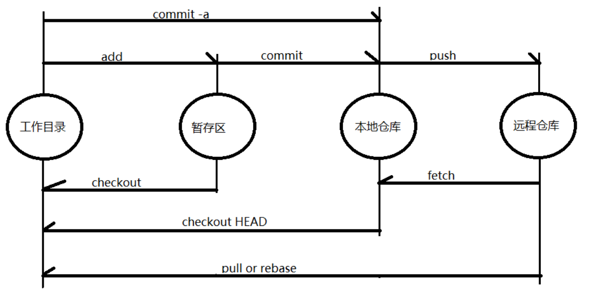

# 配置账户
```bash
git config --global user.name “your_username”  #设置用户名
git config --global user.email “Email” #设置邮箱地址
git config --system --list	#查看系统配置/Git/etc/gitconfig
git config --global --list	#查看用户配置/用户/用户名/gitconfig
git init	#创建新的git仓库
git clone username@host:/path/to/repository	#检出服务器上的仓库
git remote add origin <server>	#将本地仓库连接某个远程仓库
master: 默认开发分支
origin: 默认远程版本库
```

# 修改和提交

```bash
git status #查看状态
git diff #查看变更内容
git add . #跟踪所有改动过的文件
git add <file> #跟踪指定文件
git commit -m "commit message" #提交所有更新过的文件
git commit --amend	#修改最后一次提交
git log	#查看提交历史
```

# 撤销

```bash
git reset --hard HEAD	#撤销工作目录中所有未提交文件的修改内容
git revert <commit>		#撤销指定的提交
```

# 远程操作

```bash
git remote -v 				#查看远程版本库信息
#SSH转HTTP
git remote set-url origin https://github.com/leomaokai/KLIB.git
#HTTP转SSH
git remote set-url origin git@github.com:leomaokai/KLIB.git
#删除http代理
git config --global --unset http.proxy
git config --global --unset https.proxy
#git设置全局http代理和https代理(错误)
git config --global http.proxy 127.0.0.1:1080
git config --global https.proxy 127.0.0.1:1080
git remote show <remote>	#查看指定远程版本库信息
git remote add <remote> <url> 	#添加远程版本库
git fetch <remote> 				#从远程库获取代码
git pull <remote> <branch>		#下载代码及快速合并
git push <remote> <branch>		#上传代码及快速合并
git push <remote> :<branch/tagname>	#删除远程分支或标签
git push --tags					#上传所有标签
```

# 分支与标签

```bash
git branch						#显示所有本地分支
git checkout <branch/tag>		#切换到指定分支或标签
git branch <new-branch> 		#创建新分支
git branch -d <branch>			#删除本地分支
git tag							#显示所有本地标签
git branch <tagname>	 		#创建新标签
git branch -d <tagname>			#删除本地标签
git merge <branch>				#合并指定分支到当前分支
git rebase <branch> 			#衍合指定分支到当前分支
```

# 概念

git和svn的区别:

* svn是集中版本控制系统,版本库是集中放在中央服务器的,工作时,用自己的电脑从中央服务器得到最新的版本,工作完成,再将其推送到中央服务,必须联网才能工作
* git是分布式版本控制系统,没有中央服务器,每个人的电脑就是一个完整的版本库,工作时不需要联网

git工作区域:

* 本地:	工作区    暂存区	本地仓库
* 远程:    git远程仓库remote directory
* 工作区- git add ->暂存区- git commit ->本地仓库- git push ->远程仓库
* 远程仓库- git pull ->本地仓库- git reset ->暂存区- git checkout ->工作区



# 代码回滚

1、在工作区的代码

```bash
git checkout -- a.txt  # 丢弃某个文件，或者
git checkout -- .    # 丢弃全部
```

> 注意：git checkout – . 丢弃全部，也包括：新增的文件会被删除、删除的文件会恢复回来、修改的文件会回去。这几个前提都说的是，回到暂存区之前的样子。对之前保存在暂存区里的代码不会有任何影响。对commit提交到本地分支的代码就更没影响了。当然，如果你之前压根都没有暂存或commit，那就是回到你上次pull下来的样子了。

2、代码git add到缓存区，并未commit提交

```bash
git reset HEAD . 或者
git reset HEAD a.txt
```

> 这个命令仅改变暂存区，并不改变工作区，这意味着在无任何其他操作的情况下，工作区中的实际文件同该命令运行之前无任何变化

3、git commit到本地分支、但没有git push到远程

```bash
git log # 得到你需要回退一次提交的commit id
git reset --hard <commit_id> # 回到其中你想要的某个版
或者
git reset --hard HEAD^ # 回到最新的一次提交,^表示前一次提交
或者
git reset HEAD^ # 此时代码保留，回到 git add 之前
```

4、git push把修改提交到远程仓库

1）通过git reset是直接删除指定的commit

```bash
git log # 得到你需要回退一次提交的commit id
git reset --hard <commit_id>
git push origin HEAD --force # 强制提交一次，之前错误的提交就从远程仓库删除
```

2）通过git revert是用一次新的commit来回滚之前的commit

```bash
git log # 得到你需要回退一次提交的commit id
git revert <commit_id> # 撤销指定的版本，撤销也会作为一次提交进行保存
```

3） git revert 和 git reset的区别

* git revert是用一次新的commit来回滚之前的commit，此次提交之前的commit都会被保留
* git reset是回到某次提交，提交及之前的commit都会被保留，但是此commit id之后的修改都会被删除