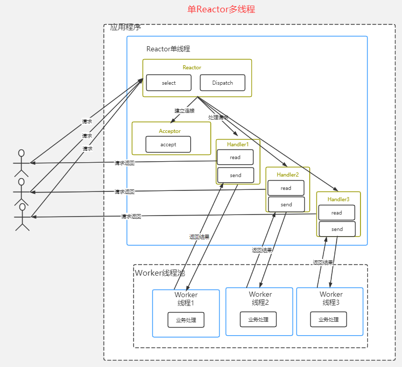

# 零拷贝

Java程序中，常用的零拷贝有 mmap（内存映射）和 sendFile

mmap：通过内存映射，将文件映射到内核缓冲区，同时，用户空间可以共享内核空间的数据，这样，在网络传输时，就可以减少内核空间到用户控件的拷贝次数（用户态和内核态共享数据，减少了一次CPU拷贝）


sendFile函数：Linux2.1提高了sendFile函数，数据根本不经过用户态，直接从内核缓冲区进入到 Socket Buffer ，同时，由于和用户态完全无关，减少了一次上下文切换。Linux2.4中，避免了从内核缓冲区拷贝到Socket buffer 的操作，直接拷贝到协议栈，从而再一次减少了数据拷贝（0次CPU拷贝，2次DMA拷贝，其实还有一次CPU拷贝，kernel buffer --> socket buffer 但是信息量很少，可以忽略）

零拷贝不仅仅带来了更少的数据复制，还能带来其他性能优势，例如更少的上下文切换，更少的CPU缓存为共享以及无CPU校验和计算

# Netty

原生NIO 学习成本高，开发效率慢

Netty是由 JBOSS 提供的一个 Java 开源框架，Netty 提供异步的、基于事件驱动的网络应用程序框架，用以快速开发高性能、高可靠性的网络 IO 程序

Netty 可以帮助你快速、简单地开发一个网络应用，相当于简化和流程化了 NIO 的开发过程

Netty 是目前最流行的 NIO 框架，Netty 在互联网领域、大数据分布式计算领域、游戏行业、通信行业等获得了广泛的应用，知名的 Elasticsearch、Dubbo 框架内部都采用了 Netty

# Reactor

Netty 线程模型基于**主从 Reactor** 多线程模型

```markdown
# 传统IO
- 传统阻塞IO模式，每个连接都需要独立的线程完成数据的输入、业务处理等
- 当并发量很大时，就会创建大量的线程，占用很大系统资源
- 连接创建后，如果当前线程暂时没有数据可读，该线程会阻塞在read操作，造成线程资源浪费
# Reactot 模式
- 基于IO复用模型，多个连接公用一个阻塞对象，应用程序只需要在一个阻塞对象等待，无需阻塞等待所有连接，当某个连接有新的数据可以处理时，操作系统通知应用程序，线程从阻塞状态返回，开始进行业务处理
- 基于线程池复用线程资源，不必再为每个连接创建线程，将连接完成后的业务处理任务分配给线程进行处理，一个线程可以处理多个连接业务
# Reactor 模式中核心组成
- Reactor 在一个单独线程中运行，负责监听和分发事件
- Handlers，处理程序执行IO事件要完成的实际事件，Reactor通过调度适当的处理程序来响应IO事件，处理程序执行非阻塞操作
```

## 单Reactor单线程


* Reactor 对象通过 Select 监控客户端请求事件，收到事件后通过 Dispatch 进行分发

* 如果建立连接请求事件，则由 Acceptor 通过 accept 处理连接请求，然后创建一个Handler 对象处理连接完成后的的业务处理

* 如果不是建立连接事件，则 Reactor 会分发调用连接对应的 Handler 来响应

模型简单，但只有一个线程，无法发挥多核性能

## 单Reactor多线程



* Reactor 对象通过 Select 监控客户端请求事件，收到事件后通过 Dispatch 进行分发

* 如果建立连接请求事件，则由 Acceptor 通过 accept 处理连接请求，然后创建一个Handler 对象处理连接完成后的的业务处理

* 如果不是建立连接事件，则 Reactor 会分发调用连接对应的 Handler 来响应
* Handler 只负责响应事件，不做具体的业务处理，分发给后面的 worker 线程池的某个线程处理业务
* worker 线程池会分配独立线程完成真正的业务，并将结果返回给 Handler

可以充分利用多核CPU的处理能力，但多线程共享和访问比较复杂，reactor 处理所有的事件监听和响应，单线程在高并发场景容易出现性能瓶颈

## 主从Reactor 多线程


* Reactor 主线程 MainReactor 对象通过select 监听连接事件，收到事件后，通过Acceptor 处理连接事件
* 当Acceptor 处理连接事件后，MainReactor 将连接分配给 SubReactor
* SubReactor 将连接加入到连接队列进行监听，并创建Handler 进行各种事件处理
* 当有新事件发生时， SubReactor 就会调用对应的Handler 处理
* Handler 将事件分发给worker线程池处理
* worker 线程池分配独立的worker线程进行业务处理，并返回结果

MainReactor可以关联多个SubReactor

# Netty模型


* Netty 抽象出两组线程池 BossGroup 专门负责接收客户端连接，WorkerGroup 专门负责网络的读写
* BossGroup 和 WorkerGroup 类型都是 NioEventLoopGroup
* NioEventLoopGroup 相当于一个事件循环组，这个组中含有多个事件循环，每个事件循环都是 NioEventLoop
* NioEventLoop 表示一个不断循环的执行处理任务的线程，每个 NioEventLoop 都有一个 selector，用于监听绑定在其上的socket的网络通讯
* NioEventLoopGroup 可以有多个线程，即可以含有多个 NioEventLoop 
* 每个 Boss下的 NioEventLoop 执行步骤：
  * 轮询 Accept 事件
  * 处理 Accept 事件，与 client 建立连接，生成 NioSocketChannel，并将其注册到某个 Worker NioEventLoop 上的 selector
  * 处理任务队列的任务，即 runAllTasks
* 每个 Worker NioEventLoop 循环执行的步骤：
  * 轮询 read，write 事件
  * 处理 IO 事件，在对应的 NioSocketChannel 上处理
  * 处理任务队列的任务，即 runAllTasks
* 每个 Work NioEventLoop 在处理业务时，会使用pipeline（管道），pipeline中包含了 channel，即通过 pipeline 可以获取对应通道，管道中维护了很多的处理器

# Netty入门


