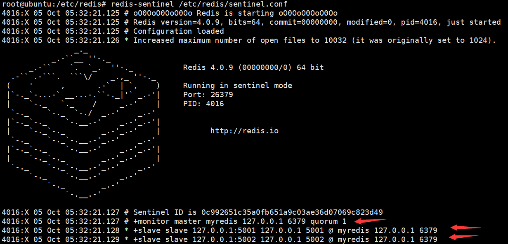

# NoSQL

什么是NoSQL?

* NoSQL为非关系型数据库,数据之间是无联系,无关系,数据的结构是松散的,可变的

传统关系数据库的瓶颈:

* 无法处理大量集中的高并发操作
* 表中存储数量有限
* 无法简单地通过硬件,服务节点来提高系统性能
* 软件和硬件的成本较大

NoSQL的优势:

* 大数据量,高性能
* 灵活的数据模型
* 高可用
* 低成本

NoSQL的劣势:

* 无关系,数据之间无联系
* 没有公认的标准
* 没有关系型数据库的约束,没有索引的概念
* 没有事务
* 没有丰富的数据类型

# 基本操作

Redis是基于KV结构的作为缓存使用的NoSQL数据库,可以减轻对数据库的查询压力

[基本命令](../../基础工具/redis.md)

# 对象

## 对象的类型与编码

每个对象由一个`redisObject`结构表示

```c
typedef struct redisObject{
    unsigned type:4;//类型
    unsigned encoding:4;//编码
    void *ptr;//指向底层实现数据结构的指针
    ...
}
```

键总是一个字符串对象,而值可以是五种类型对象

五大类型:通过`type`命令返回键对应的值对象的类型

* string,字符串对象
* list,列表对象
* hash,哈希对象
* set,集合对象
* zset,有序集合对象

  每种类型至少使用了两种不同的编码(底层实现),通过`OBJECT ENCODING`命令输出对象得编码

```
* string
  * int(整数值),embstr(embstr编码实现的简单动态字符串),raw(简单动态字符串)
* list
  * ziplist(压缩列表),linkedlist(双端列表)
* hash
  * ziplist(压缩列表),hashtable(字典)
* set
  * intset(整数集合),hashtable(字典)
* zset
  * ziplist(压缩列表),skiplist(跳表)
```

通过`encoding`属性来设定对象所使用的编码,而不是为特定类型的对象关联一种固定的编码,根据不同的使用场景来为一个对象设置不同的编码,从而优化对象在某一场景下的效率,极大的提升了redis的灵活性和效率

## string

字符串对象的编码可以是int,embstr,raw

* 如果一个字符串对象保存的是整数值,并且这个整数值可以用long类型来表示,那么字符串对象的编码为int
* 如果字符串对象保存一个字符串值,并且字符串值得长度小于等于39字节,那么字符串对象使用embstr编码得方式来保存这个字符串值,否则,使用raw编码


在执行append命令后,对象得编号从embstr转换成raw


## list

列表的编码有ziplist和linkedlist

* ziplist编码的对象使用压缩列表作为底层,每个压缩列表结点有一个列表元素
* linkedlist编码的列表对象使用双端列表作为底层实现,每个双端链表结点都保存了一个字符串对象,而每个字符串对象都保存了一个列表元素

当列表同时满足以下两个条件时,使用ziplist编码,否则使用linkedlist

* 列表对象保存得所有字符串元素得长度都小于64字节
* 列表保存得元素数量小于512

## hash

哈希的编码可以是ziplist和hashtable 

* ziplist编码的哈希对象使用压缩列表作为底层实现,每当有新的键值对要加入到哈希对象时,先将键推入到列表表尾,再将值推入到列表表尾
* hashtable编码的哈希对象使用字典作为底层实现,哈希对象对象中的每个键值对都使用一个字典键值对来保存

当哈希对象可以同时满足以下两个条件时,哈希对象使用ziplist,否则hashtable

* 哈希对象保存的所有键值对的键和值的字符串长度都小于64字节
* 哈希对象保存的键值对数量小于512个


## set

集合对象编码可以是intsett和hashtable

* intset编码t的集合对象使用整数集合作为底层实现,集合对象包含的所有元素都被保存再整数集合里面
* hashtable编码的哈希对象使用字典作为底层实现,字典的每个键都是一个字符串对象,每个字符串对象包含了一个集合元素,而字典的值全部设置为NULL

当集合对象同时满足以下两个条件时,对象使用intset编码,否则hashtable

* 集合对象保存的所有元素都是整数值
* 集合对象保存的元素对象数量不超过512个

## zset

有序集合的编码可以是ziplist和skiplist

* ziplist编码的有序集合对象使用压缩列表作为底层实现,每个集合元素使用两个紧挨在一个压缩列表结点来保存,第一个结点保存元素的成员,而第二个元素则保存元素的分值
* skiplist编码的有序集合对象使用zset结构作为底层实现,一个zset结构同时包含一个字典和一个跳跃表

当有序集合对象同时满足以下两个条件时,使用ziplist否则使用skiplist

* 有序集合保存的元素数量小于128个
* 有序集合保存的所有元素成员的长度都小于64字节


# 事务

## 事务操作

事务:一组命令的集合,按照顺序执行

特点:一次性,顺序性,排他性

没有隔离级别的概念

redis 单条命令是保证原子性的,但是redis的事务不保证原子性

事务操作:

* 开启事务`multi`
* 命令入队
* 执行事务`exec`


* 取消事务`discard`

编译时异常:事务中命令有错,则所有的命令都不会被执行

运行时异常:如果事务中存在运行时错误,那么执行命令时,其它命令可以正常执行

## 监控

悲观锁: 认为什么时候都会出问题,无论做什么都会加锁

悲观锁: 认为什么适合都不会有问题,不会上锁

监控命令`watch key`,可以当作redis的乐观锁操作,解锁`unwatch`

若开启事务前监控了此key,而在事务执行前,另一个进程修改了key值,就会导致事务执行失败

# 配置文件

默认单位


* 配置文件单位对大小写不敏感

## 配置文件包含 INCLUDES 


## 网络配置 NETWORK 

```bash
bind 127.0.0.1 ::1  #绑定的ip
protected-mode yes  #保护模式
port 6379	#端口设置
```

## 通用 GENERAL 

```bash
daemonize yes	#以守护进程的方式运行
pidfile /var/run/redis/redis-server.pid	#后台运行进程文件

#日志
# Specify the server verbosity level.
# This can be one of:
# debug (a lot of information, useful for development/testing)
# verbose (many rarely useful info, but not a mess like the debug level)
# notice (moderately verbose, what you want in production probably)
# warning (only very important / critical messages are logged)
loglevel notice
logfile /var/log/redis/redis-server.log  #日志的文件位置
databases 16	#默认数据库数量
```


## 快照 SNAPSHOTTING

* 在规定的时间内执行了多少次操作,会持久化到文件  

```bash
save 900 1		#900秒内如果至少有一个key修改,就进行持久哈
save 300 10		#300秒至少10次修改,进行持久化
save 60 10000
stop-writes-on-bgsave-error yes	#持久化如果出错,继续工作
rdbcompression yes	#压缩rdb文件,需要消耗资源
rdbchecksum yes		#保存rdb文件时,进行错误校验
dir /var/lib/redis	#rdb文件保存的目录
```


##  主从复制配置 REPLICATION 


## 安全 SECURITY 

* 设置密码,默认没有密码


## 客户端 CLIENTS

* ,设置最大连接客户端的数量 


## 内存处理策略 MEMORY MANAGEMENT


## AOF配置 APPEND ONLY MODE 

* 默认不开启,大部分情况下,RDB完成够用了
* 持久化后文件的名字


* 每次修改sync,消耗性能
* 每一秒执行一次sync,可能丢失1s的数据
* 不执行sync,操作系统自己同步数据,性能最高

## 其它工具

在`/usr/bin`目录下


# 持久化

Redis是内存数据库,如果不将内存中的数据库状态保存到磁盘中,那么一旦服务器进程退出,服务器中的数据状态就会消失,所以Redis提供了持久化功能,默认情况下为RDB

## RDB ( Redis DataBase )

在指定时间间隔内将内存中的数据集快照写入磁盘,恢复时将快照文件直接读到内存里

```bash
save # 等待直到RDB文件创建完成,会阻塞服务器
bgsave # 派出子进程,并由子进程创建RDB文件,服务器默认
```


配置文件 SNAPSHOTTING  模块负责RDB配置

默认rdb文件名`dump.rdb`


默认 BGSAVE 执行条件


* 900秒内,至少修改1次  300秒内,至少修改10次  60秒内,至少修改10000次
* 执行`flushall`命令,产生RDB文件
* 退出redis,也会产生RDB文件

如何恢复RDB文件

* 将RDB文件放入redis启动目录,redis启动时会自动检查`dump.rdb`文件


RDB的优点:

* 适合大规模的数据恢复
* 对数据的完整性要求不高

RDB缺点:

* 需要一定时间间隔进行操作,如果redis意外宕机了,则最后一次修改数据就没有了
* 子进程需要一定的内存空间

一般情况下,在主从复制中,RDB就是备用的

## AOF (Append Only File)

将所有命令都记录下来,恢复时把文件中的命令全部执行一次


以日志的形行记录每个写操作,将redis执行过的所有指令记录下来(读操作不记录),只许追加文件但不可以改写文件,redis启动之初会读取该文件重新构建数据

配置文件 APPEND ONLY MODE 模块负责AOF配置

默认是不开启的,默认文件名`appendonly.aof`,在redis启动目录


* 如果服务器开启了AOF持久化功能,那么服务器会优先使用AOF文件来还原数据库状态
* 如果aof文件出错,redis是不能启动的,需要修复aof文件,redis提供了一个工具`redis-check-aof --fix appendonly.aof`

AOF优点:


* 每次修改sync,消耗性能
* 每一秒执行一次sync,可能丢失1s的数据
* 不执行sync,操作系统自己同步数据,性能最高

AOF缺点:

* 相对于数据文件来说,AOF远远大于RDB,修复的速度比较慢
* AOF运行效率比RDB慢

AOF重写:


* 如果aof文件大于64mb,redis会fork一个子进程进行aof文件重写操作
* 同时,redis设置了一个AOF重写缓冲区,这个缓冲区在创建子进程重写时开始使用,当redis服务器执行完一个写命令后,它会同时将这个命令发送到AOF缓冲区和AOF重写缓冲区
* 当子进程完成AOF重写工作后,服务器会将AOF重写缓冲区中的所有内容写到新的AOF文件中
* 重写原理:从数据库中读取键现在的值,然后用一条命令取记录键值对,代替之前记录这个键值对的多条命令

## 总结

* RDB持久化方式能够在指定的时间间隔内对你的数据进行快照存储
* AOF持久化方式记录每次对服务器写的操作,当服务器重启时会重新执行这些命令来恢复原来的数据,Redis还能对AOF文件进行后台重写,使得AOF文件的体积不至于过大
* 如果只做缓存,只希望数据在服务器运行时存在,可以不使用任何持久化

# 主从复制

## 概念

主从复制,是指将一台redis服务器的数据,复制到其它的redis服务器,前者称为主节点,后者称为从节点,数据的复制是单向的,只能由主节点到从节点,master以写为主,slave以读为主

在默认情况下,每台redis服务器都是主节点,每个主节点可以有多个从节点,但一个从节点只能有一个主节点

主从复制的作用:

* 数据冗余:实现数据的热备份,是持久化之外的一种数据冗余方式
* 故障恢复:当主节点出现问题后,可以由从节点提供服务,实现快速的故障恢复
* 负载均衡:在主从复制的基础上,配合读写分离,由主节点提供写服务,由从节点提供读服务,分担服务器负载
* 高可用:主从复制是哨兵和集群的基础,是高可用的基础


## 环境配置

只配置从库,不用配置主库

查看当前库的信息


复制多个配置文件并修改对应的信息


* 
* 

- 

- 

启动这三个服务


此时共有4台服务器,都是主服务器,我们把5001,5002,5003配为从服务器


`slaveof ip port`命令配置为从机


在主机6379查看信息


通过命令进行的配置是暂时的,通过配置文件配置会永久生效

主机中的所有信息和数据,都会自动被从机保存


主机断开连接后,从机依旧连接到主机

如果是使用命令配置的从机,那么从机重启后,就会变回主机,一旦将它配置成为从机,就会立即从主机中获取数据(全量复制)

## 复制原理

* slave启动连接到master后会发送一个sync同步命令

* master接到命令后,启动后台的存盘进程,同时收集所有接收到用于修改数据的集命令,在后台进程执行完毕后,master将传送整个数据文件到slave,并完成一次完全同步

全量复制:slave服务在接收到数据库文件数据后,将其存盘并加载到内存中

增量复制:master继续将新的所有收集到的修改命令依次传给slave,完成同步

## 另一种主从方法


* 6379宕机后,5001依旧是从机

手动配置

* 在某一个从机中执行`slaveof no one`命令后,此从机将成为主机,其它从机需要手动配置`slaveof ip port`
* 如果这时6379重新连接,那只能重新配置

#  哨兵模式

## 概念

自动选举主机的模式

* 后台监控主机是否故障,如果故障了工具投票数自动将从机转换为主机
* 哨兵是一个独立的进程,哨兵通过发送命令,等待redis服务器响应,从而监控运行的多个redis实例


哨兵模式的两个作用:

* 通过发送命令,让redis服务器返回监控其运行状态,包括主机和从机
* 当哨兵监测到主机宕机后,会自动将slave切换到master,然后通过发布订阅模式通知其它的从服务器,修改配置文件

一个哨兵进程对redis服务器进行监控可能会出现问题,为此,可以使用多个哨兵进行监控,各个哨兵之间监控,这就形成了多哨兵模式

## 配置哨兵

下载哨兵模式`apt install redis-sentinel`,`/usr/bin/`目录下出现哨兵工具


在配置文件目录`/etc/redis`下创建文件`sentinel.conf`

在文件中输入

```bash
#sentinel monitor 被监控的名称 ip port 1
sentinel monitor myredis 127.0.0.1 6379 1
# 1 代表主机宕机后的投票机制,一个哨兵认为主机断开则认为主机断开
```

## 启动哨兵

```bash
root@ubuntu:/usr/bin# redis-sentinel /etc/redis/sentinel.conf
```



将6379服务退出,这时哨兵会从从机中随机选择主机


* 5001成为新的主机

若重新连接6379服务器,6379将成为5001的从机


在配置文件目录`/etc/redis`下打开`sentinel.conf`文件,即可查看具体配置

## 特点

优点

* 哨兵模式基于主从复制模式,具有主从复制模式的特点,是主从模式的升级,手动变自动,更加健壮
* 主从可以切换,故障可以转移,高可用

缺点

* redis不好在线扩容,如果集群容量一旦到达上限,在线扩容十分麻烦
* 实现哨兵模式的配置比较麻烦

## 配置文件

```bash
#Example sentinel.conf

#哨兵sentinel实例运行的端口 默认26379
port 26379		
#如果有哨兵集群,需要配置多个哨兵配置文件和端口

#哨兵sentinel的工作目录
dir /tmp

#哨兵sentinel监控的redis主节点的 ip port
#master-name可以自己命名的主节点名字，只能由字母A-z、数字0-9、这三个字符".-_"组成。
#quorum 配置多少个sentinel哨兵统一认为master主节点失联 那么这时客观上认为主节点失联了
#sentinel monitor <master-name> <ip> <redis-port> <quorum>
sentinel monitor mymaster 127.0.0.1 6379 2
 
#当在Redis实例中开启了requirepass foobared授权密码，这样所有连接Redis实例的客户端都要提供密码 
#设置哨兵sentinel连接主从的密码，注意必须为主从设置一样的验证密码
# sentinel auth-pass <master-name> <password>
sentinel auth-pass mymaster XXX
#指定多少毫秒之后主节点没有应答哨兵，此时哨兵主观上认为主节点下线，默认30秒
# sentinel down-after-milliseconds <master-name> <milliseconds>
sentinel down-after-milliseconds mymaster 30000

# 这个配置项指定了在发生failover主备切换（选举）时多可以有多少个slave同时对新的master进行同步，数字越小，完成failover所需的时间就越长，但是如果这个数字越大，就意味着越多的slave因为replication而不可用。可以通过将这个值设为1来保证每次只有一个slave处于不能处理命令请求的状态。
# sentinel parallel-syncs <master-name> <numslaves>
sentinel parallel-syncs mymaster 1

#故障转移的超时时间failover-timeout可以用在以下这些方面：
#1. 同一个sentinel对同一个master两次failover之间的间隔时间。
#2. 当一个slave从一个错误的master那里同步数据开始计算时间。直到slave被纠正为向正确的master那里同步数据时。
#3.当想要取消一个正在进行的failover所需要的时间。
#4.当进行failover时，配置所有slaves指向新的master所需的大时间。不过，即使过了这个超时，slaves依然会被正确配置为指向master，但是就不按parallel-syncs所配置的规则来了#默认三分钟
# sentinel failover-timeout <master-name> <milliseconds>
sentinel failover-timeout mymaster 180000

#SCRIPTS EXECUTION

#配置当某一事件发生时所需要执行的脚本，可以通过脚本来通知管理员，例如当系统运行不正常时发邮件通知相关人员。
#对于脚本的运行结果有以下规则：
#若脚本执行后返回1，那么该脚本稍后将会被再次执行，重复次数目前默认为10
#若脚本执行后返回2，或者比2更高的一个返回值，脚本将不会重复执行。
#如果脚本在执行过程中由于收到系统中断信号被终止了，则同返回值为1时的行为相同。#一个脚本的大执行时间为60s，如果超过这个时间，脚本将会被一个SIGKILL信号终止，之后重新执行。

#通知型脚本:当sentinel有任何警告级别的事件发生时（比如说redis实例的主观失效和客观失效等等），将会去调用这个脚本，这时这个脚本应该通过邮件，SMS等方式去通知系统管理员关于系统不正常运行的信息。调用该脚本时，将传给脚本两个参数，一个是事件的类型，一个是事件的描述。如果sentinel.conf配 置文件中配置了这个脚本路径，那么必须保证这个脚本存在于这个路径，并且是可执行的，否则sentinel无 法正常启动成功。
#通知脚本
# sentinel notification-script <master-name> <script-path>
sentinel notification-script mymaster /var/redis/notify.sh

#客户端重新配置主节点参数脚本
# 当一个master由于failover而发生改变时，这个脚本将会被调用，通知相关的客户端关于master地址已经发生改变的信息。
#以下参数将会在调用脚本时传给脚本:
# <master-name> <role> <state> <from-ip> <from-port> <to-ip> <to-port>
# 目前<state>总是“failover”, # <role>是“leader”或者“observer”中的一个。
#参数 from-ip, from-port, to-ip, to-port是用来和旧的master和新的master(即旧的slave)通信的
# 这个脚本应该是通用的，能被多次调用，不是针对性的。
# sentinel client-reconfig-script <master-name> <script-path>
sentinel client-reconfig-script mymaster /var/redis/reconfig.sh
```

# 发布订阅

Redis发布订阅(pub/sub)是一种消息通信模式:发送者(pub)发送消息,订阅者(sub)接收消息

```bash
subscribe "news.it" #客户端执行此命令将成为"news.it"频道的订阅者
publish "news.it" "hello" #客户端执行此命令向频道发送消息
unsubscribe "news.it" #退订频道
psubscribe pattern #订阅一个或多个符合给定模式的频道
pubsub pattern #查看订阅与发布系统状态
punsubscribe pattern #退订所有给定模式的频道
```

# 缓存穿透和雪崩

## 缓存穿透


用户查询一个数据,发现缓存中没有,就向数据库中查询,数据库中也没有,则查询失败,当查询数量很多时,缓存都没有命中,于是去请求数据库,数据库会有很大的压力,这时候就相当于出现了缓存穿透

解决方案

* 布隆过滤器
  * 布隆过滤器是一种数据结构,对所有可能查询的参数以hash形式存储,在控制层先进行校验,不符合则丢弃,从而避免了对底层存储系统的查询压力

* 缓存空对象
  * 当存储层不命中后,即返回的空对象也将其缓存起来,同时设置一个过期时间,之和再访问这个数据会从缓存中获取,保护了底层存储系统
  * 问题:缓存需要更多的空间缓存空值的键

## 缓存击穿

缓存击穿是指一个key非常热点,在不停的扛着大并发,当这个key在失效的瞬间,持续的大并发就会穿破缓存,直接请求数据库,会导致数据库瞬间压力过大

解决方案

* 设置热点数据永不过期
* 加互斥锁

## 缓存雪崩

在某一个时间段内,缓存集中过期失效

解决方案

* redis高可用
* 限流降级
  * 在缓存失效后,通过加锁或者队列来控制数据库写缓存的线程数量
* 数据预热
  * 在正式部署之前,把可能的数据预先访问一遍,这样部分可能大量访问的数据就会加载到缓存中,在即将发生大并发访问前手动触发加载缓存不同的key,设置不同的过期时间,让缓存失效的时间点尽量均匀